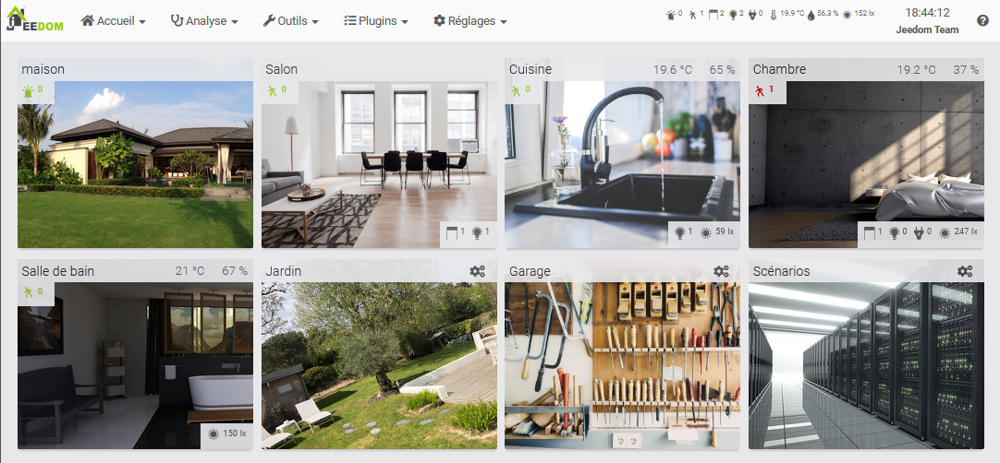
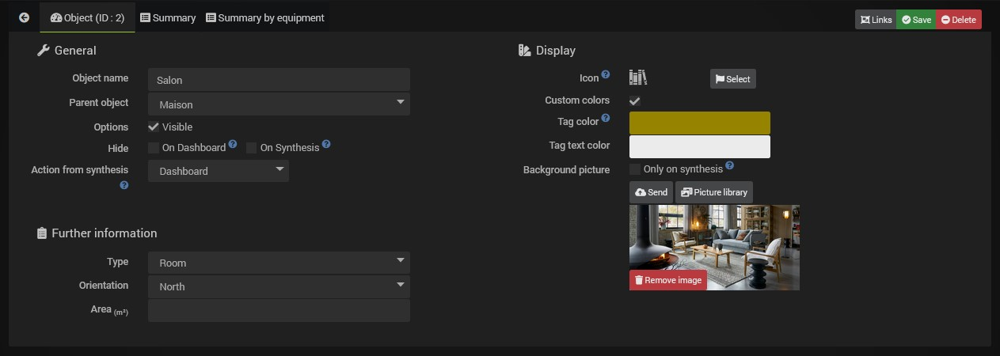
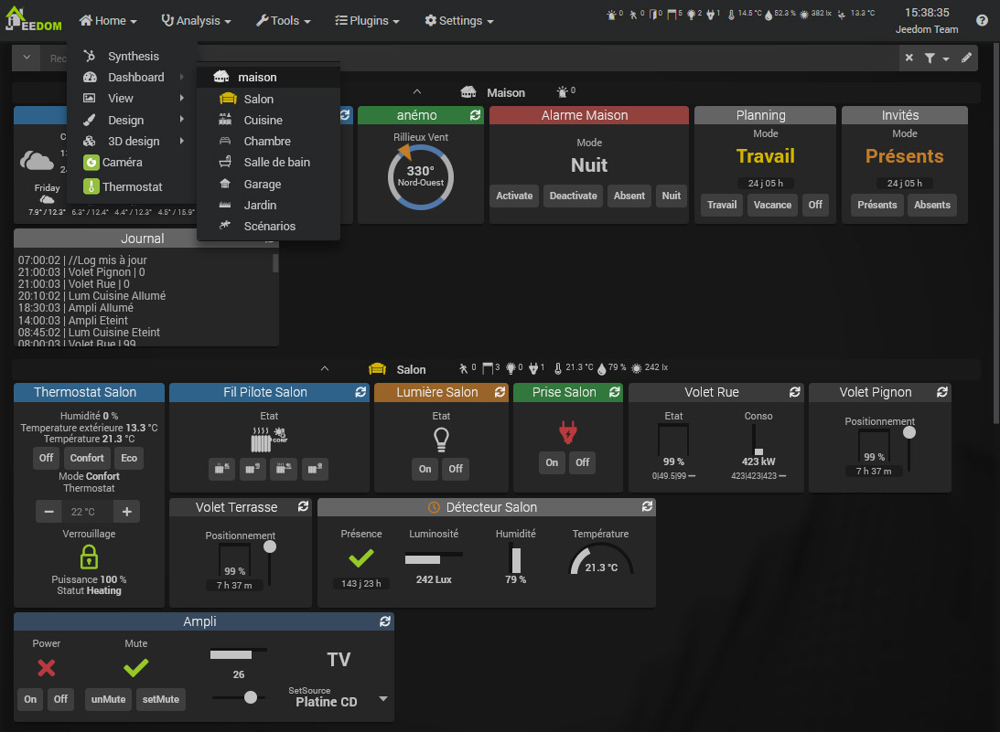
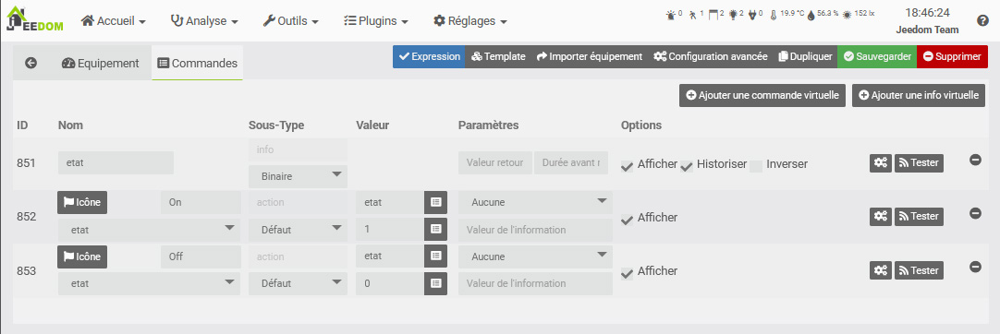
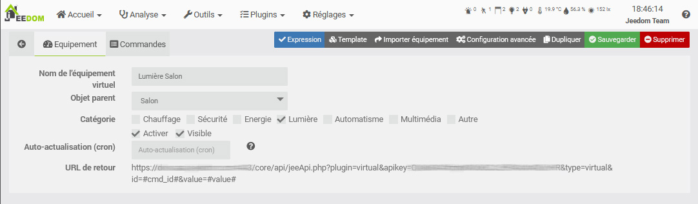
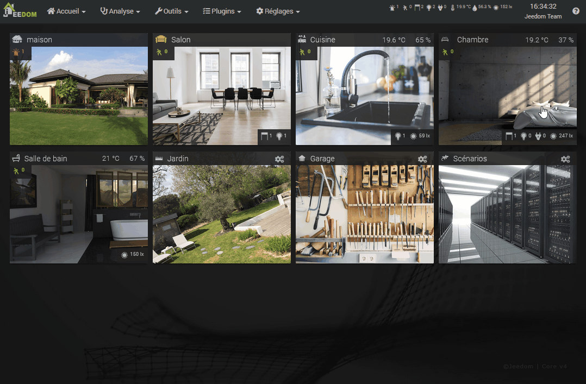

# Concepto

A continuación se presentan los principales conceptos básicos de Jeedom. Esta documentación se ha redactado de forma deliberadamente sencilla para ayudarte a familiarizarte con tu sistema de domótica.

Las posibilidades de Jeedom son prácticamente infinitas, ya que se pueden crear muchísimas cosas con unos pocos scripts en PHP, Python u otros lenguajes, pero ese no es el tema que nos ocupa aquí.

## Pantalla

Jeedom permite conectar entre sí una gran variedad de dispositivos, ya sean basados en los protocolos Z-Wave, Enocean, Zigbee, etc., a través de API mediante complementos o directamente mediante scripts. Puedes consultar la [Mercado](https://market.jeedom.com/) para ver una lista de los dispositivos compatibles.

Puedes visualizar estos dispositivos de varias formas:

- En el [Panel de control](/core/dashboard)
- En la [Resumen](/core/overview)
- En una [Vista](/core/view)
- En un [Diseño](/core/design)
- En un [Diseño en 3D](/core/design3d)

Se puede acceder a ellos desde un navegador en un ordenador de sobremesa, en un smartphone con la WebApp o con la aplicación móvil: [Versión móvil](/mobile)

## Los objetos

Para organizar tus dispositivos, puedes crear [Objetos](/core/object).

Estos objetos pueden representar estancias de la vivienda (salón, dormitorio, taller). Cada objeto puede tener un objeto padre. Esta jerarquía se utilizará para la visualización en el panel de control. Por ejemplo, puedes tener un objeto **Casa**, y luego los objetos **Salón** y **Dormitorio** como hijos del objeto **Casa**. Una vez en el panel de control, el objeto **Casa** mostrará también, debajo, sus objetos hijos.

> **Consejo**
>
> En **Ajustes → Preferencias**, puedes configurar a qué objeto quieres acceder desde el panel de control. [Preferencias](/core/profils)

## Los equipos y sus controles

### Controles

Para interactuar con nuestro sistema de domótica, ¡necesitamos comandos! Estos pueden ser de dos tipos:

> Nota
>
> ¡No te preocupes, los pedidos suelen crearse automáticamente! Estas explicaciones sirven para que lo entiendas mejor.

- Los comandos *info*:
Estos comandos almacenan información procedente de sensores. Por ejemplo, la temperatura de una sonda, el movimiento detectado por un sensor de presencia, etc.
Estos comandos se pueden registrar para conservar esta información a lo largo del tiempo en forma de curva: [Historia](/core/history)

Estos comandos también pueden utilizarse para activar [escenarios](/core/scenario) para automatizar acciones en función de la información que recopilan tus sensores. Por ejemplo, un sensor de movimiento detecta una presencia, lo que activará un escenario que encenderá la luz.

- Los comandos *acción*:
Estos comandos te permiten controlar tus actuadores. Por ejemplo, los comandos ``on`` y ``off`` de un enchufe programable te permitirán encenderlo y apagarlo.

Los comandos de acción suelen estar vinculados a comandos de información. En este caso, nuestro enchufe tiene dos acciones ``on`` y ``off``, normalmente relacionadas con una información de **estado**.

Estos dos tipos de comandos se agrupan en forma de un equipo. Por lo tanto, el equipo cuenta con comandos de información y/o acción, y es este equipo el que tendrá como elemento principal un Objeto, lo que te permitirá mostrarlo donde desees.

Cada comando también puede tener lo que se denomina un «tipo genérico», lo que permite a Jeedom y a algunos complementos identificar el tipo de comando (estado de una toma de corriente, interruptor de una luz, etc.). [**Herramientas → Tipos de equipos**](/core/types).

### Equipamiento

- Físicamente: tengo una toma de corriente con un botón de encendido/apagado y un LED de estado en el salón.
- En Jeedom: tengo un dispositivo con dos acciones (encendido y apagado) y una información de estado, en el objeto «Salón».

Estos dispositivos se crean mediante complementos. Por ejemplo, el complemento Z-Wave te permitirá añadir tu enchufe Z-Wave, lo que creará un dispositivo con sus controles, al que podrás asignarle un nombre y vincularlo a un Objeto.

En cuanto a la visualización, cada comando se muestra mediante un widget. El Core ofrece los widgets principales, así como una herramienta para crearlos (V4): [Widgets](/core/widgets).

Estos controles se agrupan en un mosaico correspondiente a tu equipo. Por lo tanto, este mosaico aparecerá en el panel de control dentro del objeto que le hayas asignado.

Sea cual sea tu dispositivo, se creará como un equipo a partir de un [Complemento](/core/plugin).

Este dispositivo contará con sus propios comandos *info* o *action*. Estos comandos se mostrarán en forma de widgets que conforman el mosaico del dispositivo, dentro de su objeto principal.

A continuación, verás que cada objeto, equipo o comando cuenta con numerosas opciones, tanto en cuanto a funcionalidades como a visualización. Pero cada cosa a su tiempo: ahora ya deberías haber comprendido los conceptos básicos de Jeedom y, por lo tanto, poder empezar a organizar tu sistema de domótica sabiendo dónde buscar.

## Mi primer escenario

El interés de la domótica, más allá del control centralizado y a distancia de nuestros dispositivos, reside sobre todo en la automatización. El objetivo no es pasar horas delante del panel de control o de la interfaz de diseño, sino, por el contrario, que tu vivienda se adapte a tus hábitos y pase desapercibida. Se acabó tener que abrir y cerrar las persianas todos los días, encender y apagar las luces, recibir avisos de cuándo sacar la basura a la calle o de cuándo hay correo en el buzón; la calefacción se adapta en función de las estaciones y las condiciones climáticas. Las posibilidades son infinitas y dependen del estilo de vida de cada uno. ¡Para eso están los escenarios!

Un escenario es una secuencia de acciones definidas que se ejecutarán en determinados momentos del día. La ejecución puede programarse (todos los lunes a una hora determinada) o activarse por un evento. Como se ha visto anteriormente, este evento puede ser, por ejemplo, nuestro comando «*Presencia*» de un detector de movimiento, tras una detección.

El objetivo aquí no es ser exhaustivo, sino descubrir los escenarios a través de ejemplos sencillos. La [documentación del manual de usuario](/core/scenario) es mucho más completa.

### Encendido de la luz al detectar movimiento.

Supongamos que tenemos una luz programable y un detector de movimiento en el dormitorio.

- Ve a **Herramientas → Escenarios**
- Haz clic en *Añadir* y, a continuación, asigna un nombre al nuevo escenario.
- A la derecha, en la sección *Activación*, comprueba que el modo esté en *Provocado* y, a continuación, haz clic en *+ Activador*.
- Con el botón *Seleccionar un comando* situado a la derecha del campo *Evento*, selecciona el objeto, a continuación el dispositivo y su comando.

El *Desencadenante* es lo que activará la ejecución de este escenario. En este caso, queremos que se active cuando nuestro detector detecte una presencia, por lo que utilizaremos el comando `#[Chambre][Détecteur Chambre][Présence]# == 1`.

Los `#` indican un comando, a continuación encontramos `[le nom de son objet parent]` y luego `[le nom de l'équipement]` y, por último, `[le nom de la commande]`. Aquí se añade ` == 1` porque queremos que el escenario se active únicamente cuando se detecte una presencia. Sin embargo, en un detector de presencia, esta detección vuelve a 0 unos segundos después. Por lo tanto, este retorno a 0 no activará de nuevo nuestro escenario.

- Haz clic en la pestaña *Escenario* y, a continuación, en el botón de la parte superior *Añadir bloque*. Elige un bloque *Acción* y, en él, *Añade* una *Acción*. Esta acción será nuestro comando para encender la luz. Siguiendo el mismo principio: `#[Chambre][Lumière Chambre][On]#`.

- ¡Guarda los cambios y tu escenario estará listo!

Aquí solo hemos esbozado brevemente las posibilidades que ofrecen los escenarios. Puedes añadir condiciones (bloque *Si/Entonces/Si no*), retrasar acciones (bloque *En*), programarlas (bloque *A*) e incluso utilizar directamente código PHP (bloque *Código*).

Aquí hemos utilizado el modo de activación *manual* mediante un comando. Pero también puedes utilizar (y combinar) el modo *programado* para ejecutar un escenario cada mañana o cada hora, etc.

### Programación del día.

Un tema recurrente para los principiantes en Jeedom es la programación de eventos diarios como:

- Encender la cafetera a las 7:00 h los días laborables.
- Abrir las persianas al amanecer.
- Cerrar las contraventanas al atardecer, si no estoy en casa.

Para este tipo de situación, aquí tienes una introducción muy buena: [Programación del día](https://kiboost.github.io/jeedom_docs/jeedomV4Tips/Tutos/ProgDuJour/fr_FR/)
