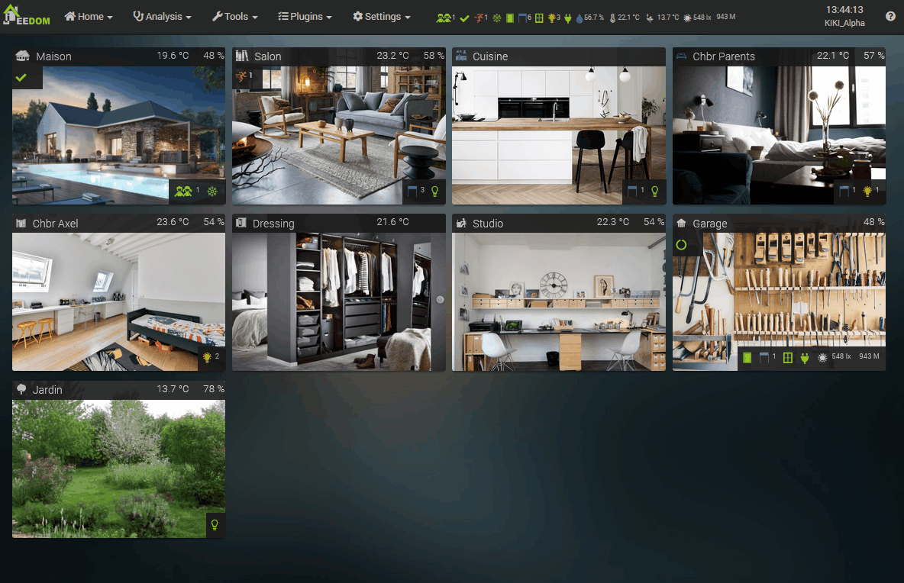

# Resúmenes

## Descubre los resúmenes

Jeedom ofrece una forma muy sencilla y clara de visualizar el estado de los distintos componentes de tu hogar, para que puedas ver de un vistazo cuántas luces están encendidas, qué persianas están abiertas, el estado de la alarma, la temperatura, etc.

Los resúmenes se muestran en forma de pequeños iconos en la barra de Jeedom, en la parte superior, y en cada objeto (Panel de control y Resumen). Al hacer clic en ellos, se pueden ver directamente los dispositivos incluidos en el resumen en el que has hecho clic para actuar sobre ellos si es necesario.

Hay que distinguir entre dos tipos de resumen:

- Resumen general: Es el conjunto de iconos de resumen que se muestran en la barra de Jeedom.
- Resúmenes de objetos: Cada objeto tiene su propio resumen, que se muestra en la vista general del objeto y en el panel de control, a la derecha del nombre del objeto.

El resumen general no se configura directamente. Es un resumen de los resúmenes de los demás objetos. Por ejemplo, si hay una luz encendida en la cocina y dos en el salón, el resumen general mostrará tres luces encendidas. Por supuesto, todo esto se puede configurar, como veremos más adelante.

Los resúmenes se configuran, por tanto, en cada objeto, en la pestaña... ¡Resumen!

> Nota
>
> Esta documentación se ha redactado e ilustrado utilizando una Core v4.2. Por lo tanto, algunas opciones pueden variar en función de tu versión.

## Configuración general de los resúmenes

Antes de ver la configuración de un objeto, para poder configurar un resumen es necesario que este exista.

Ve a **Ajustes → Sistema → Configuración** y, a continuación, a la pestaña **Resumen**.



Aquí tienes la lista de todos los resúmenes que podrás configurar en cada objeto. Aquí podremos configurar los resúmenes *Presencia* (si te fijas bien, verás en el resumen general que hay una persona en casa), *Alerta*, *Movimiento*, *Calefacción*, etc. Y, por supuesto, aquí puedes eliminar y añadir tipos de resumen para poder disponer de ellos posteriormente en los objetos.

No te preocupes, se han configurado varias cosas en esta vista previa, pero, por defecto, Jeedom cuenta con una lista de resúmenes con parámetros estándar.

Repasemos lo que vamos a definir aquí:

- **Clave**: Es un valor que debe ser único en esta lista y que sirve de referencia para el Core.
- **Nombre**: El nombre (tipo) del resumen, que encontrarás en los parámetros de los objetos.
- **Cálculo**: El tipo de cálculo utilizado para el valor mostrado. La suma para los estados, la media para, por ejemplo, temperaturas o humedad, o el valor de texto.
- **Icono**: El icono del resumen, que aparece en el objeto y, en su caso, en el resumen general.
- **Icono nulo**: Icono del resumen si su valor es 0. Permite especificar un icono diferente, como una persiana cerrada, una luz apagada o de otro color, etc.
- **Unidad**: Unidad del resumen, que aparecerá a la derecha del valor.
- **Ocultar el número**: Nunca muestra el valor del resumen (el número que aparece a la derecha del icono).
- **Ocultar el número si es cero**: Permite ocultar el valor del resumen, solo si este es 0. De este modo, se puede optar por mostrar el icono de persiana abierta con el número de persianas abiertas y el icono de persiana cerrada sin el número cuando todas las persianas estén cerradas.
- **Método de recuento**: Si estás contando un dato binario, debes configurar este valor como binario. Ejemplo: si estás contando el número de lámparas encendidas, pero solo dispones del valor del regulador (de 0 a 100), debes configurarlo como binario; de este modo, Jeedom considerará que, si el valor es superior a 1, la lámpara está encendida.
- **Si es nulo**: Mostrar el resumen incluso cuando su valor sea 0.
- **Ignorar si**: Ignorar un comando para este resumen si no se ha actualizado en los últimos x minutos.
- **Vincular a un dispositivo virtual**: Inicia la creación de un dispositivo virtual con comandos que se corresponden con los valores del resumen.
- **Eliminar el resumen**: El último botón, el de la extrema derecha, permite eliminar el resumen.

>**NOTA**
>
>Para eliminar un icono, basta con hacer doble clic en él

Por ejemplo, aquí:

- Si observamos la animación al principio de la página, el tercer resumen, correspondiente a **Movimiento**, indica en rojo que hay *1* movimiento. En la vista previa de arriba, vemos que se trata del icono del círculo verde, sin número. De hecho, si observas su línea, el icono verde está configurado como **Icono si es nulo** y el valor no se muestra porque la opción **Ocultar el número si es nulo** está marcada. Del mismo modo, el resumen *Puerta* aparece en verde, sin número, mientras que el resumen *Luz* aparece en amarillo, con el número de luces encendidas.

> Consejos
>
> También puedes cambiar el orden en el que se muestran los resúmenes desplazando una línea hacia arriba o hacia abajo con el ratón.

## Configuración de los resúmenes de objetos

Una vez que la lista de resúmenes esté disponible en la configuración de Jeedom, podremos utilizarlos en cada objeto.

En **Herramientas → Objetos**, aquí en el objeto «Salón»:



Aquí tenemos dos partes:

### Configuración de los resúmenes

Las columnas de la tabla muestran cada tipo de resumen disponible en la configuración, tal y como se ha visto anteriormente. Para cada resumen, hay tres opciones:

- **Incluir en el resumen general**: Aquí es donde se elige, para cada resumen, si el de este objeto debe tenerse en cuenta en el resumen general. Por ejemplo, aquí, el resumen *Persiana* del salón está marcado, por lo que se incluye en el resumen general. Si miramos en el resumen general, entre las seis persianas abiertas que se muestran, ¡están las del salón! Por el contrario, si miramos el resumen *TempExt* (16,1 °C en el resumen general), está desmarcado, ya que solo quiero que se incluya la temperatura del objeto «Jardín» en el resumen general.
- **Ocultar en el escritorio**: Para que este resumen no aparezca junto al nombre del objeto en el panel de control.
- **Ocultar en dispositivos móviles**: Para que este resumen no aparezca junto al nombre del objeto en dispositivos móviles.

### Comandos de los resúmenes

Cada pestaña representa un tipo de resumen definido en la configuración de Jeedom. Haz clic en **Añadir un comando** para que se incluya en el resumen. Puedes seleccionar el comando de cualquier dispositivo de Jeedom, aunque no tenga ese objeto como padre.

Aquí vemos los tres componentes que aparecen en el resumen de este objeto. Y, dado que la opción *Componente* está activada en el resumen general, también se incluirán en este.

### Pestaña «Resumen por equipo»

Esta página permite seleccionar los comandos de los resúmenes de otra forma: muestra todos los equipos que tienen el objeto como padre. Al hacer clic en cada equipo, se muestra la lista de comandos de información del equipo, con la opción, a la derecha, de asignar ese comando a uno o varios resúmenes del objeto.

Si ya hay al menos un resumen definido, el selector aparece en naranja, con los tipos de resúmenes marcados a la derecha.

## Resúmenes y virtuales

Los resúmenes tratan sobre el [complemento virtual](https://market.jeedom.com/index.php?v=d&p=market_display&id=21) una relación ambigua, que no siempre es fácil de entender, pero que, sin embargo, resulta muy potente, sobre todo desde la versión Core v4.2 y las acciones en el resumen. ¿Sigues ahí? Sigamos...

Normalmente, a estas alturas ya deberías haber creado algunos resúmenes sobre tus objetos y, por lo tanto, disponer de diversa información sobre ellos y en el resumen general, como si las persianas están abiertas, las luces encendidas, etc.

Estos resúmenes resultan muy prácticos para obtener rápidamente una visión general y visual del estado de la vivienda y, con un solo clic, poder actuar sobre ella mostrando los dispositivos de un resumen. Pero si seguimos con este razonamiento, eso significa que esa información existe... ¡Y que nos vendría muy bien poder utilizarla en un escenario!

De hecho, dado que mi resumen sabe que tengo tres luces encendidas, ¿por qué no poder comprobar en un escenario SI hay una luz encendida? ¿O incluso activar el escenario cuando se enciende una luz? ¿O incluso apagar todas las luces del salón con una sola acción? ¡Pues bien, todo eso es posible vinculando un «Virtual» a un resumen!

Ve a **Ajustes → Sistema → Configuración** y, a continuación, a la pestaña **Resumen**.

En la línea *Luz*, en el extremo derecho, haz clic en el botón **Crear virtual**.

Ahora ve a **Plugins → Programación → Virtual**

Para cada objeto que tenga controles en el resumen *Iluminación*, ahora dispones de un nuevo objeto virtual llamado *Resumen* con ese objeto como padre. También dispones de un nuevo objeto virtual *Resumen global* sin objeto padre, que corresponde al resumen global de Jeedom.

Al abrir la visita virtual de la feria y acceder a la pestaña **Pedidos**, esto es lo que encontramos:



- Un comando **Info** *Luz*: este comando contiene información sobre el número de luces encendidas en el salón, ya que nos encontramos en la vista virtual del resumen del salón.
- Un comando **Acción** *Luz Light Button On*: al activar esta acción, encenderemos todos los controles del resumen **Luz**, en este caso del objeto Salón.
- Un comando **Acción** *Luz Light Button Off*: al activar esta acción, apagaremos todos los comandos del resumen **Luz**, en este caso del objeto Salón.
etc.

¡Ya deberías haber entendido el principio! Ahora disponemos de la información y las acciones correspondientes para cada objeto, así como del resumen general, ¡para cada resumen al que hayamos vinculado un «Virtual»!

¡Así que ahora podemos utilizarlo como cualquier otra información o acción de un dispositivo real en un escenario!

Por ejemplo:

- Un activador `#[None][Global Summary][Mouvement]# > 0` que activará un escenario en cuanto se detecte movimiento en la vivienda.
- Una expresión IF `#[Salon][Summary][Lumière]# > 0 ` que comprobará si hay alguna luz encendida en el salón.
- Una acción `#[Salon][Summary][Volet Shutter Button Slider]#` con el valor 0, que cerrará todas las persianas del salón.

### Acciones en resúmenes

Como se ha visto anteriormente, los «Virtuales de resumen» no solo contienen la *información* de los resúmenes, sino también las *acciones* disponibles en los distintos dispositivos configurados en el resumen. Por supuesto, se puede acceder a estas acciones desde los escenarios, pero también a través de la interfaz, ¡mediante los iconos de resumen que aparecen aquí y allá!

Por ejemplo, si has creado los «Virtuales» del grupo *Luz*, puedes hacer Ctrl+clic en el icono de ese grupo. Aparecerá entonces una ventana emergente con las diferentes acciones que te permitirán, por ejemplo, apagar todas las luces de la casa de una sola vez.



Como hemos visto, los resúmenes constituyen un tema muy amplio, que no siempre es fácil de entender al principio de la andadura de un usuario de Jeedom, ¡pero que conviene conocer!
