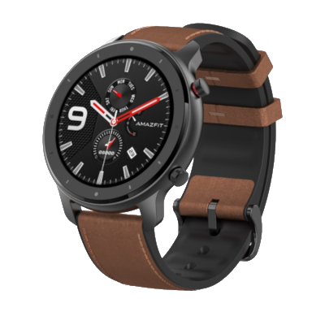
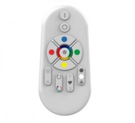
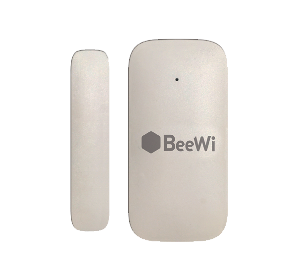
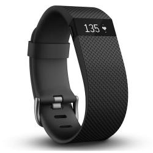
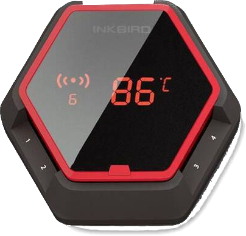
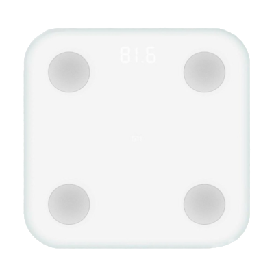
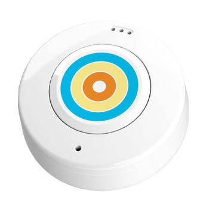

# Kompatibilität mit Bluetooth-Geräten

# Amazfit

|Image|Marque|Nom|Type|Remarque|Lien|
|---|---|---|---|---|---|
||Huami|Amazfit GTR|Santé|Nur Präsenz für den Moment||

# Aqualin

|Image|Marque|Nom|Type|Remarque|Lien|
|---|---|---|---|---|---|
||Aqualin|Bluetooth-Ventiltropfen|Plante|||

# Awoxmesh

|Image|Marque|Nom|Type|Remarque|Lien|
|---|---|---|---|---|---|
||Awox Eglo|SmartLight Mesh|Beleuchtung|Kompatibel mit der Awox Mesh-Technologie.||
||Awox Eglo|Eglo Fueva|Beleuchtung|Kompatibel mit der Awox Mesh-Technologie.||
||Awox Eglo|Fernbedienung|Beleuchtung|Kompatibel mit der Awox Mesh-Technologie. Sie müssen den Bluetooth-Modus aktivieren, um die Befehle verwenden zu können.||

# Beagle

|Image|Marque|Nom|Type|Remarque|Lien|
|---|---|---|---|---|---|

# Beewismartdoor

|Image|Marque|Nom|Type|Remarque|Lien|
|---|---|---|---|---|---|
||BeeWi|Sensor öffnen|Capteurs|Türöffnungssensoren||

# Beewismartlite

|Image|Marque|Nom|Type|Remarque|Lien|
|---|---|---|---|---|---|
||BeeWi|SmartLite BBL227|Beleuchtung|Die Paarung muss in der ersten Minute nach dem Einschalten der Glühlampe überprüft werden||

# Blpnr

|Image|Marque|Nom|Type|Remarque|Lien|
|---|---|---|---|---|---|
||Jardibric|BLP NR|Plante|||

# Default

|Image|Marque|Nom|Type|Remarque|Lien|
|---|---|---|---|---|---|
||Inconnu|Inconnu|Defaut|Nur für Geräte, die noch nicht im Plugin hinzugefügt wurden, um mindestens das Vorhandensein und RSSI sowie die Rohdaten zu haben||

# Divoompixoo

|Image|Marque|Nom|Type|Remarque|Lien|
|---|---|---|---|---|---|
||Divoom|Pixoo|Afficheur|Behalten Sie die empfohlene Verbindungsfunktion bei||

# Divoomtimeboxmini

|Image|Marque|Nom|Type|Remarque|Lien|
|---|---|---|---|---|---|
||Divoom|TimeBox Mini|Afficheur|Behalten Sie die obligatorische Verbindungsfunktion bei, damit das Bluetooth-Logo nicht angezeigt wird||

# Dotti

|Image|Marque|Nom|Type|Remarque|Lien|
|---|---|---|---|---|---|
||Dotti|Dotti|Afficheur|Funktioniert viel besser mit der Option zum Verbinden der Verbindung||

# Dreamscreen

|Image|Marque|Nom|Type|Remarque|Lien|
|---|---|---|---|---|---|
||DreamScreen|DreamScreen|Beleuchtung|||

# Fitbit

|Image|Marque|Nom|Type|Remarque|Lien|
|---|---|---|---|---|---|
||Fitbit|Badge|Bracelet|Nur zur Anwesenheit||

# Flowerpower

|Image|Marque|Nom|Type|Remarque|Lien|
|---|---|---|---|---|---|
||Parrot|Kraft Blume|Capteurs|Pflanzensensoren||

# Gigaset

|Image|Marque|Nom|Type|Remarque|Lien|
|---|---|---|---|---|---|
||Gigaset|G-Tag|Präsenz|Nur zur Anwesenheit||

# Hector

|Image|Marque|Nom|Type|Remarque|Lien|
|---|---|---|---|---|---|
||Hector|Hector|Capteurs|Darf auf Ihrem Telefon nicht dauerhaft in Verbindung bleiben, wenn Sie in Jeedom interagieren möchten||

# Ibbq4

|Image|Marque|Nom|Type|Remarque|Lien|
|---|---|---|---|---|---|
||Inkbird|Inkbird IBT-4XS|Capteurs|Grilltemperatursensoren||

# Ibbq6

|Image|Marque|Nom|Type|Remarque|Lien|
|---|---|---|---|---|---|
||Inkbird|Inkbird IBT-6XS|Capteurs|Grilltemperatursensoren||

# Itag

|Image|Marque|Nom|Type|Remarque|Lien|
|---|---|---|---|---|---|
||Itag|Itag Black|Boutons|Damit die Taste funktioniert, müssen Sie überprüfen, ob die Verbindung bestehen bleibt. Ab diesem Moment bleibt die Verbindung erhalten und die Taste ist von anderen Antennen aus nicht mehr sichtbar. Die Verbindung wird hergestellt, sobald die Taste innerhalb von 20 Sekunden sichtbar ist (dies wird durch Stoppen des Blinkens bestätigt) und dies nur an der bei der Übertragung ausgewählten Antenne (in diesem Fall ist es offensichtlich erforderlich, dieselbe in auszuwählen) Empfang und Übertragung)||
||Itag|Itag Weiß|Boutons|Damit die Taste funktioniert, müssen Sie überprüfen, ob die Verbindung bestehen bleibt. Ab diesem Moment bleibt die Verbindung erhalten und die Taste ist von anderen Antennen aus nicht mehr sichtbar. Die Verbindung wird hergestellt, sobald die Taste innerhalb von 20 Sekunden sichtbar ist (dies wird durch Stoppen des Blinkens bestätigt) und dies nur an der bei der Übertragung ausgewählten Antenne (in diesem Fall ist es offensichtlich erforderlich, dieselbe in auszuwählen) Empfang und Übertragung)||
||Itag|Itag Rose|Boutons|Damit die Taste funktioniert, müssen Sie überprüfen, ob die Verbindung bestehen bleibt. Ab diesem Moment bleibt die Verbindung erhalten und die Taste ist von anderen Antennen aus nicht mehr sichtbar. Die Verbindung wird hergestellt, sobald die Taste innerhalb von 20 Sekunden sichtbar ist (dies wird durch Stoppen des Blinkens bestätigt) und dies nur an der bei der Übertragung ausgewählten Antenne (in diesem Fall ist es offensichtlich erforderlich, dieselbe in auszuwählen) Empfang und Übertragung)||
||Itag|Itag Grün|Boutons|Damit die Taste funktioniert, müssen Sie überprüfen, ob die Verbindung bestehen bleibt. Ab diesem Moment bleibt die Verbindung erhalten und die Taste ist von anderen Antennen aus nicht mehr sichtbar. Die Verbindung wird hergestellt, sobald die Taste innerhalb von 20 Sekunden sichtbar ist (dies wird durch Stoppen des Blinkens bestätigt) und dies nur an der bei der Übertragung ausgewählten Antenne (in diesem Fall ist es offensichtlich erforderlich, dieselbe in auszuwählen) Empfang und Übertragung)||
||Itag|Itag Blau|Boutons|Damit die Taste funktioniert, müssen Sie überprüfen, ob die Verbindung bestehen bleibt. Ab diesem Moment bleibt die Verbindung erhalten und die Taste ist von anderen Antennen aus nicht mehr sichtbar. Die Verbindung wird hergestellt, sobald die Taste innerhalb von 20 Sekunden sichtbar ist (dies wird durch Stoppen des Blinkens bestätigt) und dies nur an der bei der Übertragung ausgewählten Antenne (in diesem Fall ist es offensichtlich erforderlich, dieselbe in auszuwählen) Empfang und Übertragung)||

# Jinlin

|Image|Marque|Nom|Type|Remarque|Lien|
|---|---|---|---|---|---|
||Lyl klug|Jinlin|Licht|Nur für die Anwesenheit (der Rest wird kommen)||

# Kst1

|Image|Marque|Nom|Type|Remarque|Lien|
|---|---|---|---|---|---|
||Koogeek|Kst1|Santé|||

# Logiswitch

|Image|Marque|Nom|Type|Remarque|Lien|
|---|---|---|---|---|---|
||Logitech|Logitech Pop rot|Boutons|Auf keinen Fall an ein anderes Gerät anschließen||
||Logitech|Logitech Pop weiß|Boutons|Auf keinen Fall an ein anderes Gerät anschließen||
||Logitech|Logitech Pop grün|Boutons|Auf keinen Fall an ein anderes Gerät anschließen||
||Logitech|Logitech Pop grau|Boutons|Auf keinen Fall an ein anderes Gerät anschließen||

# Lywsd02

|Image|Marque|Nom|Type|Remarque|Lien|
|---|---|---|---|---|---|
||Xiaomi|Temperatur Feuchtigkeit|Capteurs|Temperatur-Feuchtigkeitssensoren mit Display (Lywsd02)||

# Lywsd03

|Image|Marque|Nom|Type|Remarque|Lien|
|---|---|---|---|---|---|
||Xiaomi|Temperatur Feuchtigkeit|Capteurs|Temperatur-Feuchtigkeitssensoren mit Display (Lywsd03)||

# Meyerdom

|Image|Marque|Nom|Type|Remarque|Lien|
|---|---|---|---|---|---|
||MeyerDom|2 analog|Contacteurs|2 analog||
||MeyerDom|4 Schütze|Contacteurs|4 Schütze||
||MeyerDom|Sprachkontakt|Contacteurs|Sprachschalter||

# Meyerdom4kontakte

|Image|Marque|Nom|Type|Remarque|Lien|
|---|---|---|---|---|---|
||MeyerDom|4 Schütze|Contacteurs|4 Schütze und 2 analoge||

# Miband

|Image|Marque|Nom|Type|Remarque|Lien|
|---|---|---|---|---|---|
||Xiaomi|Miband|Santé|Je nach Firmware funktioniert das möglicherweise nicht mehr. Achtung, wenn das Armband mit Ihrem Smartphone verbunden ist, ist es in Bluetooth besser sichtbar||
||Xiaomi|Miband1s|Santé|Je nach Firmware funktioniert das möglicherweise nicht mehr. Achtung, wenn das Armband mit Ihrem Smartphone verbunden ist, ist es in Bluetooth besser sichtbar||
||Xiaomi|Miband2|Santé|Je nach Firmware funktioniert das möglicherweise nicht mehr. Achtung, wenn das Armband mit Ihrem Smartphone verbunden ist, ist es in Bluetooth besser sichtbar||
||Xiaomi|Miband 3|Santé|Nur Präsenz für den Moment||
||Xiaomi|Miband 4|Santé|Nur Präsenz für den Moment||
||Xiaomi|Miband (mit farbiger LED)|Santé|Je nach Firmware funktioniert das möglicherweise nicht mehr. Achtung, wenn das Armband mit Ihrem Smartphone verbunden ist, ist es in Bluetooth besser sichtbar||

# Miflora

|Image|Marque|Nom|Type|Remarque|Lien|
|---|---|---|---|---|---|
||Xiaomi|Miflora|Capteurs|Pflanzensensoren||

# Miscale

|Image|Marque|Nom|Type|Remarque|Lien|
|---|---|---|---|---|---|
||Xiaomi|MiScale|Scale|Komplette Profilverwaltung||
||Xiaomi|MiScale 2019|Scale|Komplette Profilverwaltung||

# Miscale2

|Image|Marque|Nom|Type|Remarque|Lien|
|---|---|---|---|---|---|
||Xiaomi|MiScale V2|Scale|Komplette Profilverwaltung||

# Myfox

|Image|Marque|Nom|Type|Remarque|Lien|
|---|---|---|---|---|---|
||Myfox|Badge|Präsenz|Nur zur Anwesenheit||

# Niu

|Image|Marque|Nom|Type|Remarque|Lien|
|---|---|---|---|---|---|
||Nodon|Niu Wazabi|Boutons|In verschiedenen Farben erhältlich||
||Nodon|Niu Gray|Boutons|In verschiedenen Farben erhältlich||
||Nodon|Niu Lagune|Boutons|In verschiedenen Farben erhältlich||
||Nodon|Niu Softberry|Boutons|In verschiedenen Farben erhältlich||
||Nodon|Niu Techblue|Boutons|In verschiedenen Farben erhältlich||
||Nodon|Niu White|Boutons|In verschiedenen Farben erhältlich||

# Noke

|Image|Marque|Nom|Type|Remarque|Lien|
|---|---|---|---|---|---|
||Noke|Noke|Cadenas|Nur durch Drücken der Taste sichtbar (kann über einen Hack von Frames zum Wiederherstellen des Schlüssels verwendet werden), wird jedoch nicht ausgeführt, da dies illegal ist||

# Nut

|Image|Marque|Nom|Type|Remarque|Lien|
|---|---|---|---|---|---|
||Nut|Nut|Präsenz|Nur zur Anwesenheit||
||Nut|Nuss Mini Blau|Präsenz|||

# Parrotpot

|Image|Marque|Nom|Type|Remarque|Lien|
|---|---|---|---|---|---|
||Parrot|Papageientopf|Capteurs|Pflanzensensoren||

# Playbulb

|Image|Marque|Nom|Type|Remarque|Lien|
|---|---|---|---|---|---|
||Playbulb|Kugel|Beleuchtung|Launisch im Umfang, was eine sehr lange Behandlung von Handlungen rechtfertigen kann. Kann anstelle einer anderen Glühbirne erkannt werden, wenn dies aus dem Dropdown-Menü geändert wird||

# Ropot

|Image|Marque|Nom|Type|Remarque|Lien|
|---|---|---|---|---|---|
||Xiaomi|Miflora|Capteurs|Pflanzensensoren||

# Ruuvi

|Image|Marque|Nom|Type|Remarque|Lien|
|---|---|---|---|---|---|
||Ruuvi|Ruuvi|Beacon|Leuchtfeuersensoren||

# Smartplug

|Image|Marque|Nom|Type|Remarque|Lien|
|---|---|---|---|---|---|
||Awox|Smartplug|Prises|||

# Tb05

|Image|Marque|Nom|Type|Remarque|Lien|
|---|---|---|---|---|---|
||E-Diffuser|Tb05|Diffuseur|Es wird empfohlen, die Option Verbindung beibehalten zu verwenden. Obligatorisch für den experimentellen Versuch, auf direkte Farben zuzugreifen||

# Ticatag

|Image|Marque|Nom|Type|Remarque|Lien|
|---|---|---|---|---|---|
||Tibe|Ticatag|Boutons|Die Freigabe wird auch nach einmaligem oder doppeltem Drücken gesendet||

# Tile

|Image|Marque|Nom|Type|Remarque|Lien|
|---|---|---|---|---|---|
||Tile|Tile|Präsenz|Nur zur Anwesenheit||

# Wistiki

|Image|Marque|Nom|Type|Remarque|Lien|
|---|---|---|---|---|---|
||Wistiki|Wistiki|Präsenz|Nur zur Anwesenheit||

# Xiaomiht

|Image|Marque|Nom|Type|Remarque|Lien|
|---|---|---|---|---|---|
||Xiaomi|Temperatur Feuchtigkeit|Capteurs|Temperatur Feuchtigkeitssensoren mit Display||
||Xiaomi|Temperatur Luftfeuchtigkeit Cleargrass|Micromodule|Temperatur-Feuchtigkeitssensoren mit E-Ink-Anzeige||

# Yeelight

|Image|Marque|Nom|Type|Remarque|Lien|
|---|---|---|---|---|---|
||Yeelight|Bed|Beleuchtung|Die Kopplung muss durch Drücken der Taste bestätigt werden. Wenn ausgeschaltet, müssen Sie einschalten, bevor Sie eine Farbe auswählen||

Diese Liste basiert auf Benutzer-Feedback. Das Jeedom-Team kann daher nicht garantieren, dass alle Module in dieser Liste zu 100% funktionsfähig sind

20.09.2023 02:21:04
