# Kamerakompatibilität

# Alcatel

|Image|Marque|Nom|Type|Remarque|Lien|
|---|---|---|---|---|---|
|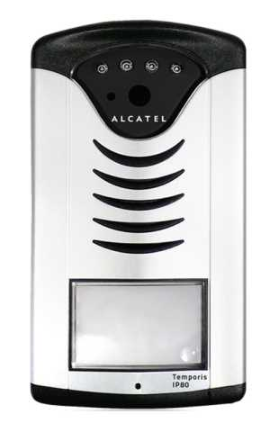|Alcatel|IP_Linkcom / Video-Türöffner||||

# Android

|Image|Marque|Nom|Type|Remarque|Lien|
|---|---|---|---|---|---|
||Android|IP Webcam||||

# Axis

|Image|Marque|Nom|Type|Remarque|Lien|
|---|---|---|---|---|---|
||Axis|207w||||

# Bluestork

|Image|Marque|Nom|Type|Remarque|Lien|
|---|---|---|---|---|---|
||Bluestork|Kamera||||

# D-link

|Image|Marque|Nom|Type|Remarque|Lien|
|---|---|---|---|---|---|
||D-Link|DCS-5300G||||
||D-Link|DCS 932l||||
||D-Link|DCS||||
|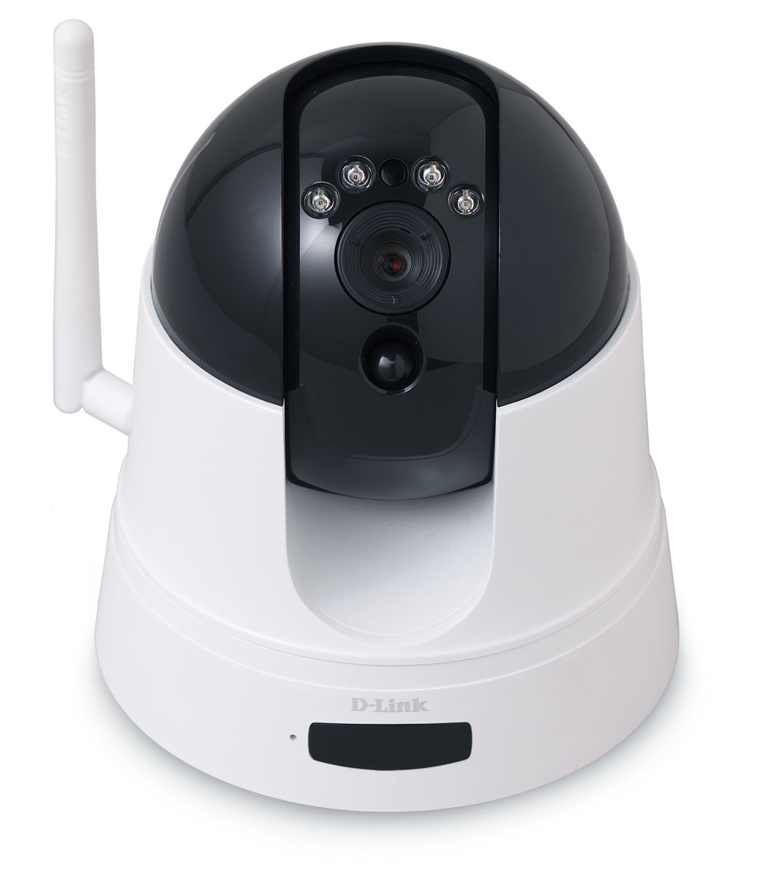|D-Link|DCS PTZ||||
||D-Link|DSC-5020L & DCS-935L||||
|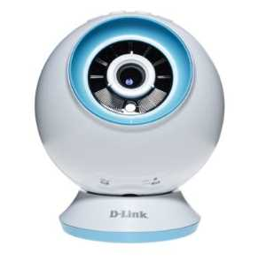|D-Link|EyeOn Babyphone||||

# Dahua

|Image|Marque|Nom|Type|Remarque|Lien|
|---|---|---|---|---|---|
||Dahua|IPC-B1B40||||
||Dahua|IPC-D2B40||||
||Dahua|IPC-HDBW1431E-S||||
|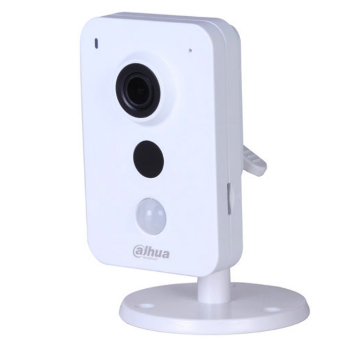|Dahua|IPC-K35A||||
|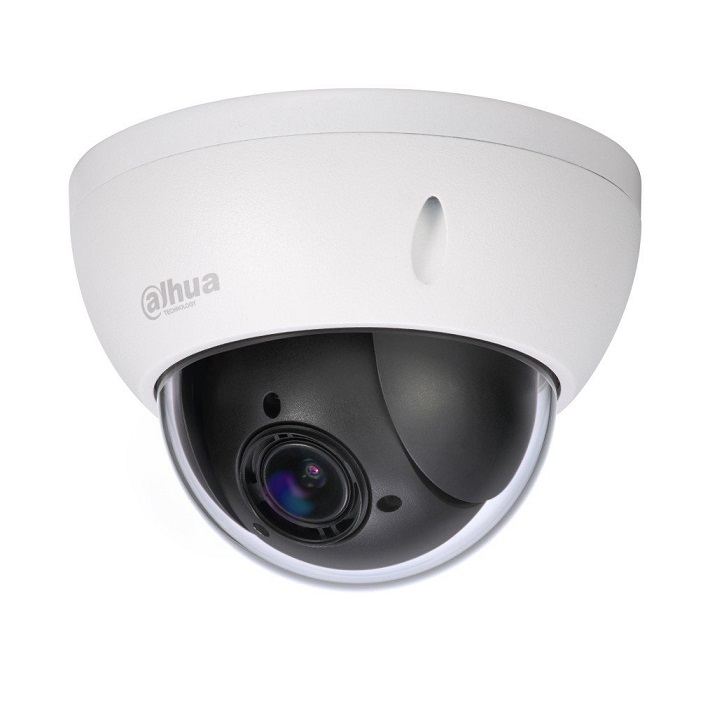|Dahua|SD22204T-GN-W||||

# Dericam

|Image|Marque|Nom|Type|Remarque|Lien|
|---|---|---|---|---|---|
||Dericam|H502W||||

# Doorbird

|Image|Marque|Nom|Type|Remarque|Lien|
|---|---|---|---|---|---|
|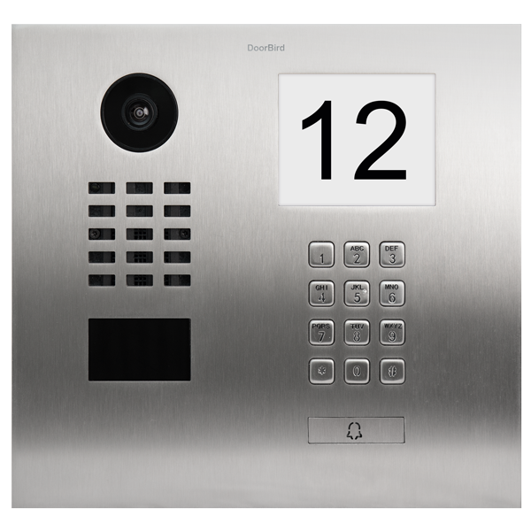|Doorbird|Kamera||||

# Ebode

|Image|Marque|Nom|Type|Remarque|Lien|
|---|---|---|---|---|---|
||Ebode|Im Freien||||
||Ebode|Motorisierte HD||||
|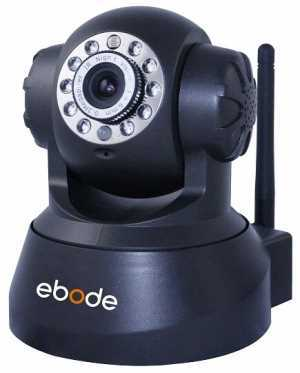|Ebode|Motorisiert||||

# Foscam

|Image|Marque|Nom|Type|Remarque|Lien|
|---|---|---|---|---|---|
||Foscam|C1 / C2||||
|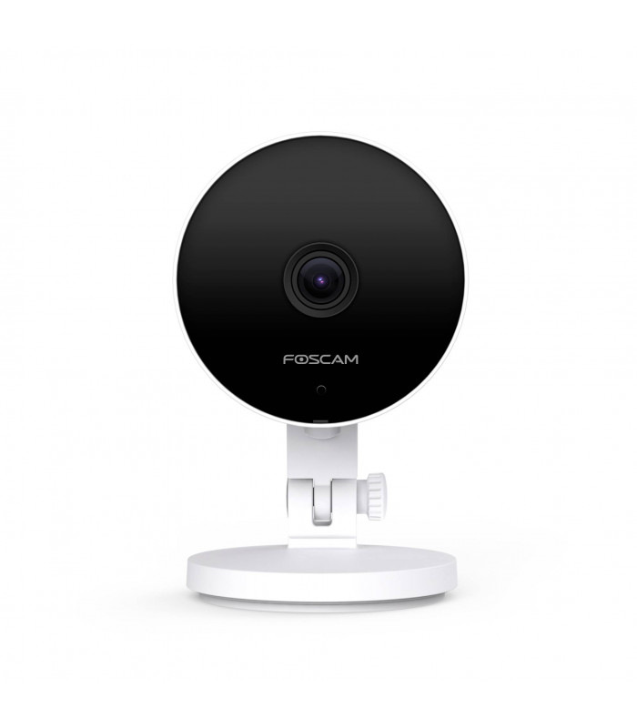|Foscam|C2M|||[Kaufen](https://www.domadoo.fr/fr/cameras/4975-foscam-camera-ip-wifi-interieure-2mp-6954836069547.html)|
||Foscam|D2P / D2EP||||
||Foscam|FI980xP / FI980xEP||||
||Foscam|FI9828W / FI9828P / FI9828P V2 / FI9805E||||
||Foscam|FI9853P / FI9853EP||||
||Foscam|FI9900EP / FI9900P / FI9901EP / FI9901P||||
||Foscam|FI9902P / FI9902EP|||[Kaufen](https://www.domadoo.fr/fr/cameras/4977-foscam-camera-ip-wifi-exterieur-2mp-6954836013533.html)|
||Foscam|FI9928P|||[Kaufen](https://www.domadoo.fr/fr/cameras/4978-foscam-camera-ip-wifi-exterieur-motorisee-2mp-6954836003299.html)|
||Foscam|G4P / G4EP||||
||Foscam|R2P / R2EP||||
||Foscam|R2MP / R2MEP|||[Kaufen](https://www.domadoo.fr/fr/cameras/4976-foscam-camera-ip-wifi-interieure-motorisee-2mp-6954836001486.html)|

# Freebox

|Image|Marque|Nom|Type|Remarque|Lien|
|---|---|---|---|---|---|
|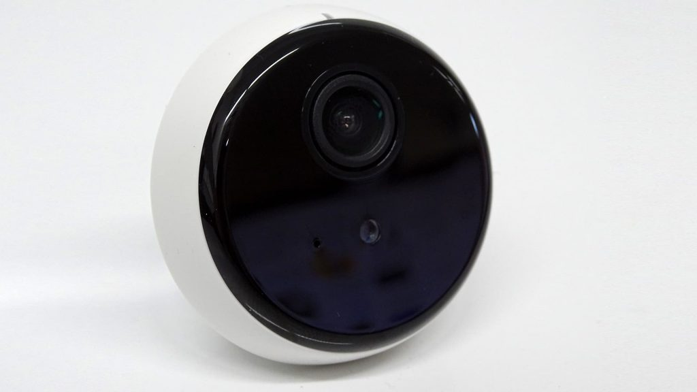|Freebox|RocketCam||||

# Hedden

|Image|Marque|Nom|Type|Remarque|Lien|
|---|---|---|---|---|---|
||Heden|CAMHED05IPWN (V5.5), VISIONCAM22||||
||Heden|VisionCam HD CAMHD08MD0||||
|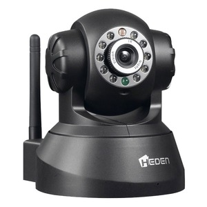|Heden|VisionCam CAMHED04IPWN||||

# Hikivision

|Image|Marque|Nom|Type|Remarque|Lien|
|---|---|---|---|---|---|
|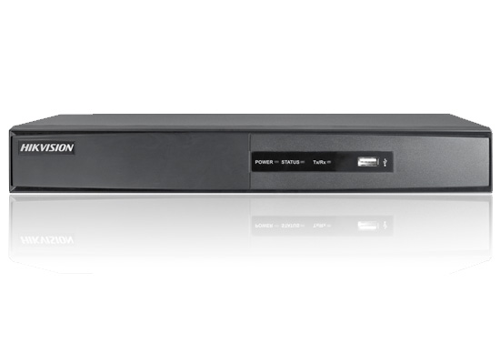|Hikvision|DS-7216HWI-SH / A||(XXX = 101 für Kanal 1 / XXX = 202 für Kanal 2)||
||Hikvision|DS-2CD2132-I, DS-2CD3332-I, DS-2CD2232-I5, DS-2CD2732F-IS||||

# Ios

|Image|Marque|Nom|Type|Remarque|Lien|
|---|---|---|---|---|---|
||ios|IP Kamera||||
||ios|Karakuri Kamera - Auto Shutter & WEB Monitoring||||
||ios|Live Reporter||||
||ios|HD-Periskop||||

# Karotz

|Image|Marque|Nom|Type|Remarque|Lien|
|---|---|---|---|---|---|
||Karotz|Karotz||||
||Karotz|Openkarotz||||

# Konx

|Image|Marque|Nom|Type|Remarque|Lien|
|---|---|---|---|---|---|
||Konx|Video Portier||||

# Mustcam

|Image|Marque|Nom|Type|Remarque|Lien|
|---|---|---|---|---|---|
||Mustcam|Motorisierte HD||||

# Netatmo

|Image|Marque|Nom|Type|Remarque|Lien|
|---|---|---|---|---|---|
||Netatmo|Presence||Erfordert unbedingt das Netatmo Security Plugin (kostenpflichtig))|[Kaufen](https://www.domadoo.fr/fr/objets-communicants/3855-netatmo-camera-exterieure-de-securite-presence-3700730501866.html)|
||Netatmo|Welcome||Erfordert unbedingt das Netatmo Security Plugin (kostenpflichtig))|[Kaufen](https://www.domadoo.fr/fr/objets-communicants/3064-netatmo-camera-a-reconnaissance-faciale-welcome-3700730500623.html)|

# Onvif

|Image|Marque|Nom|Type|Remarque|Lien|
|---|---|---|---|---|---|
||Onvif|Onvif||Entdeckung von Onvif-Kameras (Aufmerksamkeit funktioniert nicht immer, keine Garantie möglich)||

# Panasonic

|Image|Marque|Nom|Type|Remarque|Lien|
|---|---|---|---|---|---|
||Panasonic|BL-C121||||
||Panasonic|Panasonic WV-NP502||||

# Reolink

|Image|Marque|Nom|Type|Remarque|Lien|
|---|---|---|---|---|---|
||Reolink|RLC-410-5MP||||

# Rpi

|Image|Marque|Nom|Type|Remarque|Lien|
|---|---|---|---|---|---|
||RPI|Kamera||||

# Tenvis

|Image|Marque|Nom|Type|Remarque|Lien|
|---|---|---|---|---|---|
||Tenvis|Kamera||||

# Trendnet

|Image|Marque|Nom|Type|Remarque|Lien|
|---|---|---|---|---|---|
||TrendNet|TV-IP310PI||||
||TrendNet|TV-IP325PI||||
||TrendNet|TV-IP672WI||||

# Vistacam

|Image|Marque|Nom|Type|Remarque|Lien|
|---|---|---|---|---|---|
||Vistacam|Vera 700 / Secomm / Homelive||||
||Vistacam|Vera SD||||

# Vivotek

|Image|Marque|Nom|Type|Remarque|Lien|
|---|---|---|---|---|---|
||Vivotek|8xxx und 7xxx||||

# Wanscam

|Image|Marque|Nom|Type|Remarque|Lien|
|---|---|---|---|---|---|
||Wanscam|HW0021||||
||Wanscam|HW0026||||
|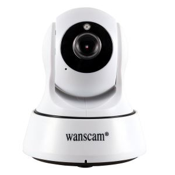|Wanscam|HW0036||||
||Wanscam|HW0038||||
||Wanscam|HW0043||||
|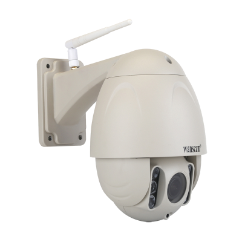|Wanscam|HW0045||||
||Wanscam|HW0049||||
||Wanscam|HW00XX||||
||Wanscam|Motorisiert||||
||Wanscam|q3 (s)||||

# Ycam

|Image|Marque|Nom|Type|Remarque|Lien|
|---|---|---|---|---|---|
||Y-Cam|Kamera||||

# Zavio

|Image|Marque|Nom|Type|Remarque|Lien|
|---|---|---|---|---|---|
|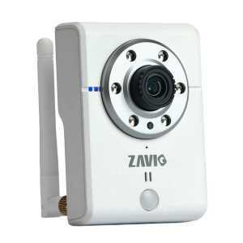|Zavio|F3115||||

Diese Liste basiert auf Benutzer-Feedback. Das Jeedom-Team kann daher nicht garantieren, dass alle Module in dieser Liste zu 100% funktionsfähig sind

2020-10-01 00:20:53
