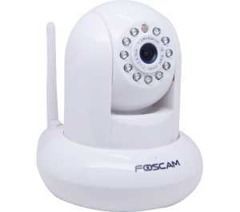
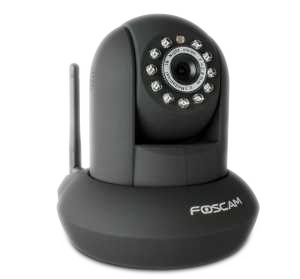

# Kamerakompatibilität

|Image|Nom|Remarque|Lien|
|---|---|---|---|---|---|
||IP_Linkcom / Alcatel Videotür-Eingangseinheit|||
||Android IP Webcam|||
||Axis|||
||Bluestork|||
||D-Link DCS-5300G|||
||D-Link DCS|||
||D-Link DCS|||
||D-Link DCS PTZ|||
||D-Link DSC-5020L && DCS-935L|||
||D-Link EyeOn Babyphone|||
||Dericam H502W|||
||Outdoor-Ebode|||
||Motorisierte HD Ebode|||
|||||
||Foscam FI9803EP|||
||Foscam FI9803P|||
||Foscam R2|||
||Foscam HD|||
||Motorisierte Foscam HD|||
||Motorisierte Foscam|||
||Heden CAMHED05IPWN (V5.5), VISIONCAM22|||
||Heden VisionCam HD CAMHD08MD0|||
||Heden VisionCam CAMHED04IPWN|||
||Hikvision DS-7216HWI-SH / A (XXX = 101 für Kanal 1 / XXX = 202 für Kanal 2)|||
||Hikvision DS-2CD2132-I, DS-2CD3332-I, DS-2CD2232-I5, DS-2CD2732F-IS|||
||Karotz|||
||Konx Videotür-Eingangseinheit|||
||Motorisierte Mustcam HD|||
||Onvif|||
||Openkarotz Kamera|||
||Panasonic BL-C121|||
||Netatmo Präsenz|||
||RPI Cam|||
||Tenvis|||
||TrendNet TV-IP310PI|||
||TrendNet TV-IP672WI|||
||Vera Vista Cam 700 / Secomm / Homelive|||
||Vera Vista Cam SD|||
||Vivotek 8xxx und 7xxx|||
||Wanscam HW0021|||
||Wanscam HW0026|||
||Wanscam HW0036|||
|||||
||Wanscam HW0043|||
||Wanscam HW0045|||
||Wanscam HW0049|||
||Wanscam HW00XX|||
||Motorisierte Wanscam|||
||Wanscam q3 (s)|||
||Netatmo Willkommen|||
||Y-Cam|||
||Zavio F3115|||

Diese Liste basiert auf Benutzer-Feedback. Das Jeedom-Team kann daher nicht garantieren, dass alle Module in dieser Liste zu 100% funktionsfähig sind
