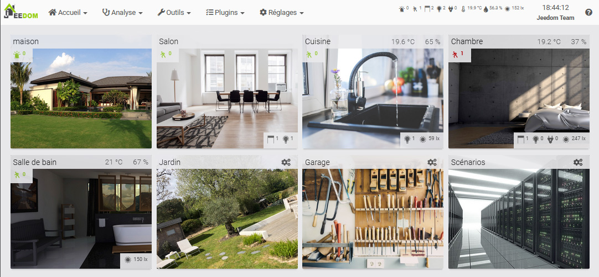
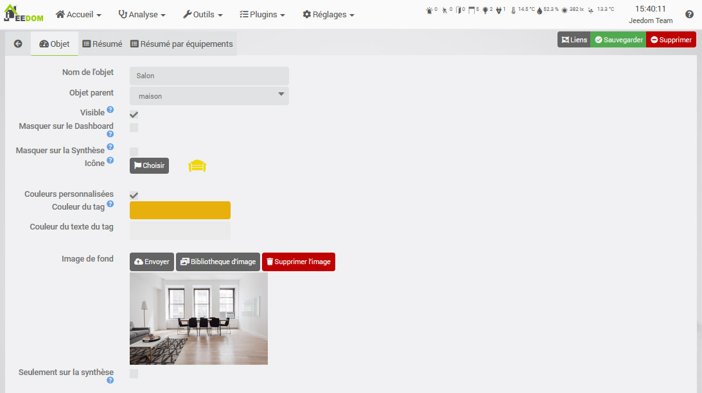
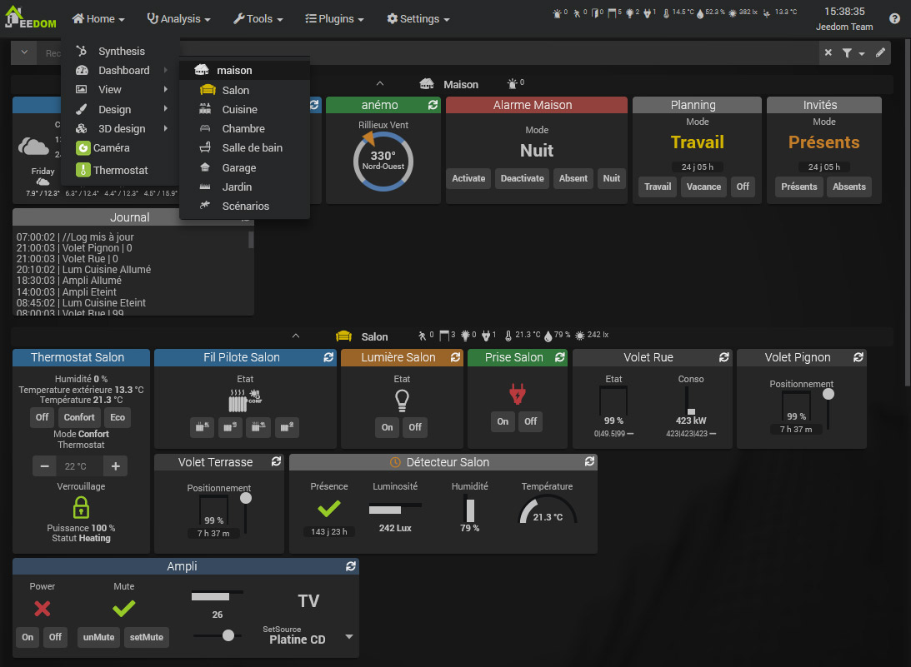

# Concept

. .

.

> Tip
>
> . .

## Affichage

.   .

 :

-  
-   ()
-  
-  
-  

 : 

## 

 .

). . .  ****,  ****  ****  ****.  **** .

> ****
>
>  ****, . 

## 

### Commandes

 !  :

> Note
>
>  ! .

-  ** :
. .
 : 

  . .

-  ** :
.  on  off .

.  on  off,  ****.

. .

). [****](/de_DE/core/4.5/types).

### Équipement

- Physiquement: .
- : .

. .

. ) : .

. .

 .

 **  **. .

. .

## 

. . . .  !

. .  ** .

  .

### .

.

-  ****
-  ** .
-  **,  **  **.
-  **  **, .

 ** . #[][Détecteur ][]# == .

. . . .

-  **  **.  ** , **  **. .  : #[][Lumière ][On]#.

-  !

.  **),  **),  **)  **).

 ** .  ** .

### .

 :

- .
- .
- .

 : 

