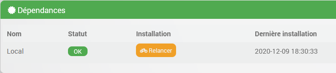

# Dämonen & Abhängigkeiten

## Introduction

In dem [Lernprogramm](/de_DE/dev/tutorial_plugin) und der [Dokumentation](/de_DE/dev/plugin_template) Sie haben gelernt, wie Sie Ihr erstes Plugin mit relativ einfachen Aktionen codieren, die vom Benutzer über einen Aktionsbefehl oder durch eine vom Kern geplante Aufgabe (die Crons).
Das Plugin ist dann in der Lage, gelegentlich Informationen abzurufen (z. B. per http-Anfrage) oder alle Arten von Operationen durchzuführen, sofern diese in PHP kodiert werden können.

Es wird passieren, dass Sie mehr brauchen, ein paar Beispiele ohne Anspruch auf Vollständigkeit:

- Verwenden Sie Systemressourcen, zum Beispiel USB-Schlüssel oder andere Hardware (Bluetooth...)
- eine Verbindung zu einem entfernten System aufrechterhalten (in einem lokalen Netzwerk oder im Internet, aber nicht jeedom .))
- Prozesse im Hintergrund aktiv halten, was bei PHP-Code nicht der Fall ist, der nur während der Ausführung des http-Requests "lebt"
- Echtzeit-Verarbeitung durchführen

Dafür verwenden wir meistens einen "Daemon".
Keine Panik, im Jeedom-Kern ist bereits alles geplant, um uns zu helfen, diesen Dämon an Ort und Stelle zu bringen, und wir werden das hier detailliert beschreiben.

## Dateistruktur eines Daemons

Der Code und/oder die ausführbare Datei Ihres Daemons muss sich offensichtlich in der Baumstruktur Ihres Plugins befinden und muss daher bei der Installation eines Plugins mit dem Archiv mitgeliefert und mitgeliefert werden.
Es gibt keine strengen Regeln für den genauen Standort Ihres Daemons, aber die Konvention besteht darin, ihn im Unterverzeichnis ` abzulegen./ Ressourcen / `des Plugins.

In der Plugin-Vorlage finden Sie die Grundlagen, um einen Daemon in Python zu implementieren. Dies ist das Beispiel, das wir in dieser Dokumentation verwenden werden. Es steht Ihnen jedoch frei, Ihren Daemon in der Sprache Ihrer Wahl zu entwickeln, sofern er auf ausgeführt werden kann [Plattformen unterstützt von Jeedom](/de_DE/compatibility/).
Die meisten Jeedom-Plugin-Daemons befinden sich in Python oder NodeJs, aber es gibt auch einige in .netCore und sicherlich andere Technologien.

Sie werden auch einige nützliche Methoden für einen nodeJs-Daemon finden, die in einer zukünftigen Version dieser Dokumentation beschrieben werden. Vorerst lade ich Sie ein, den Community-Entwickler zu konsultieren, um sich mit den anderen Entwicklern über alles im Zusammenhang mit NodeJs abzustimmen, hauptsächlich über die zu verwendende Version.

Vorlagenverzeichnisstruktur directory:

### der Python-Dämon

Im Template-Plugin heißt das Daemon-Verzeichnis `demond` und der Daemon selbst heißt `demond.py`.
Diese Namen sind willkürlich, es steht Ihnen frei, sie zu ändern.
Die Konvention besteht darin, die Plugin-ID gefolgt von dem Buchstaben ´d´ . zu verwenden. Dies gibt zum Beispiel für das Plugin `blea` das Verzeichnis`./ resources / blead / `enthält unter anderem die Datei` blead.py`, diese Datei ist der Startpunkt des Daemons.

> **TRINKGELD**
>
> Zögern Sie nicht, sich von offiziellen Plugins mit Daemon inspirieren zu lassen, um die Details zu verstehen, wie blea, openzwave oder sms.

### das Jeedom-Paket für einen Python-Daemon

Jeedom stellt mit der Plugin-Vorlage ein Python-Paket bereit, das die grundlegenden Klassen und Methoden bietet, die für die Verwaltung des Daemons und die Kommunikation zwischen dem Daemon und dem PHP-Code Ihres Plugins nützlich sind.
Diese Klassen finden Sie im `./resources/demond/jeedom/jeedom/directory.py` (im Screenshot oben sichtbar).
Um zu beginnen, müssen Sie die Implementierungsdetails dieser Klassen und Methoden nicht kennen, daher erhalten Sie hier nur eine Zusammenfassung dessen, was sie zulassen.

#### Klasse jeedom_utils()

Diese Klasse ist ein Satz nützlicher statischer Methoden wie `convert_log_level` um den von jeedom empfangenen Loglevel in einen Loglevel der Python-Klasse`logging` umzuwandeln oder `find_tty_usb` um eine Liste der Geräte auf dem System zurückzugeben.
Wir werden sie hier nicht alle detailliert beschreiben, der Name jeder der Methoden ist ziemlich eindeutig, Sie werden sie entdecken, indem Sie in den Code eintauchen.

#### Klasse jeedom_serial()

Diese Klasse kapselt das Lesen und Schreiben auf einem Gerät.
Auch hier werden wir die Klasse nicht detailliert beschreiben, die Methoden sprechen für sich, wissen Sie nur, dass sie existiert, wenn Sie sie brauchen.

> **Warnung**
>
> Wenn Ihr Daemon diese Art von Aktion nicht ausführen muss, müssen Sie daran denken, diese Klasse nicht zu verwenden oder zu importieren, da das Python-Paket `serial' nicht standardmäßig installiert ist und in diesem Fall Ihr Daemon nicht startet (Problem wurde mehrfach beobachtet mal auf gemeinschaft). Wir werden darauf bei der Verwaltung von Abhängigkeiten zurückkommen.

#### Klasse jeedom_socket () & jeedom_socket_handler()

Sie werden die Klasse `jeedom_socket_handler ()` nicht direkt verwenden, sondern nur für `jeedom_socket ()`.
Der Zweck von `jeedom_socket ()` besteht darin, die Kommunikation nach unten (von Ihrem PHP-Code zum Daemon) sicherzustellen).
Wenn Ihr Plugin eine Anweisung an Ihren Daemon senden muss, kann es dies über diesen Socket tun. Ein Beispiel finden Sie später in dieser Dokumentation.

Also öffnet die Klasse einen TCP-Socket und hört zu. Wenn eine Nachricht empfangen wird, wird sie in eine Warteschlange gestellt, die später von Ihrem Daemon gelesen wird. Wir werden darauf zurückkommen.

Auch hier müssen Sie diesen Mechanismus nicht verwenden, es steht Ihnen frei, etwas anderes zu erstellen (z. B. http-Server), aber dies wird von Jeedom als Basis bereitgestellt, es ist leicht und funktioniert sehr gut.

#### Klasse jeedom_com()

Dies stellt die Upstream-Kommunikation vom Daemon zu Ihrem PHP-Code sicher.
Sie werden am Anfang hauptsächlich `send_change_immediate ()` verwenden, was es daher ermöglicht, eine Json-Nutzlast über eine http-Anfrage an jeedom zu senden. Es ist sehr einfach und effektiv, wir werden später ein Beispiel sehen.

### Python-Dämonenskelett

Jetzt, da wir die Umgebung kennen, können wir uns den Teil ansehen, der uns am meisten interessiert: der Dämon und was wir codieren müssen.

Wir werden uns daher das von Jeedom vorgeschlagene Skelett eines Dämons im Detail ansehen, öffnen Sie die Datei `demond.py` und wir beginnen mit den letzten Zeilen, die eigentlich der Start des Programms sind:

`` ``python
_log_level = "Fehler""
_socket_port = 55009 # zu ändern
_socket_host = 'localhost'
_device = 'auto'
_pidfile = '/tmp/demond.pid'
_API-Schlüssel = ''
_zurückrufen = ''

für arg in sys.argv:
    if arg.startswith ("-loglevel="):
        temp, _log_level = arg.split("=")
    elif arg.startswith ("- socketport="):
        temp, _socket_port = arg.split("=")
    elif arg.startswith ("- sockethost="):
        temp, _socket_host = arg.split("=")
    elif arg.startswith ("- pidfile="):
        temp, _pidfile = arg.split("=")
    elif arg.startswith ("- apikey="):
        temp, _apikey = arg.split("=")
    elif arg.startswith ("- Gerät="):
        temp, _device = arg.split("=")

_socket_port = int (_socket_port)

jeedom_utils.set_log_level (_log_level)

Logging.info ('Starte Dämon')
Logging.info ('Log-Level : '+ str (_log_level))
login.info ('Socket-Port : '+ str (_socket_port))
Logging.info ('Socket-Host : '+ str (_socket_host))
Logging.info ('PID-Datei : '+ str (_pidfile))
login.info ('Apikey : '+ str (_apikey))
Logging.info ('Gerät : '+ str (_device))

signal.signal (signal.SIGINT, handler)
signal.signal (signal.SIGTERM, handler)

try:
    jeedom_utils.write_pid (str (_pidfile))
    jeedom_com = jeedom_com (apikey = _apikey, url = _callback, cycle = _cycle)
    wenn nicht jeedom_com.test():
        Logging.error ('Probleme mit der Netzwerkkommunikation. Bitte korrigieren Sie Ihre Jeedom-Netzwerkkonfiguration.')
        shutdown()
    jeedom_socket = jeedom_socket (Port = _socket_port, Adresse = _socket_host)
    listen()
außer Ausnahme als e:
    Logging.error ('Schwerwiegender Fehler : '+ str (e))
    shutdown()
`` ``

Einige Variableninitialisierungen:

`` ``python
_log_level = "error" # der Standard-Log-Level, im Textformat wie von Jeedom gesendet
_socket_port = 55009 # der Port, den Ihr Daemon standardmäßig zum Öffnen des Jeedom-Listening-Sockets verwendet, um modifiziert zu werden.
_socket_host = 'localhost' # die Schnittstelle, auf der der Socket geöffnet werden soll, a priori nicht ändern.
_device = 'auto' # ist nutzlos, wenn Sie kein Hardwaregerät verwenden
_pidfile = '/tmp/demond.pid' # emplacement par défaut du pidfile, ce fichier est utiliser par Jeedom pour savoir si votre démon est démarrer ou pas; nom du démon à modifier comme expliqué ci-dessus;
_apikey = '' # apikey um die Kommunikation zwischen Jeedom und deinem Dämon zu authentifizieren
_zurückrufen = '' ## die Callback-URL, um Benachrichtigungen an Jeedom zu senden (und Ihren PHP-Code)
`` ``

> **Warnung**
>
> Sie müssen bei der Auswahl des Ports, den Sie für Ihre Steckdose verwenden möchten, vorsichtig sein. Dies ist ein möglicher Verbesserungspunkt unter Jeedom, da kein Mechanismus vorhanden ist, um Kollisionen zu vermeiden: Wenn also ein anderes Plugin denselben Port verwendet wie Sie, wird dies offensichtlich ein Problem sein. Im Moment besteht die einzige Möglichkeit, Ihre Wahl zu treffen, darin, in den vorhandenen Plugins nach den bereits verwendeten Ports zu suchen und zwischen den Entwicklern und der Community abzustimmen (es gibt bereits offene Themen zu diesem Thema)). Darüber hinaus ist es wichtig, dies vom Benutzer in der Konfiguration Ihres Plugins konfigurierbar zu lassen, damit die Portnummer geändert werden kann, falls ein solcher Konflikt auftreten sollte.

Dann erhalten wir die von der Befehlszeile erhaltenen Argumente, diese Befehlszeile wird von Ihrem PHP-Code generiert, wir kommen darauf zurück.
Es liegt an Ihnen, das zu entfernen, was nicht nützlich ist (z. B. das Geräteargument) oder andere hinzuzufügen, z. B. einen Benutzer / pswd, wenn Ihr Daemon eine Verbindung zu einem Remote-System herstellen muss.

`` ``python
für arg in sys.argv:
    if arg.startswith ("-loglevel="):
        temp, _log_level = arg.split("=")
    elif arg.startswith ("- socketport="):
        temp, _socket_port = arg.split("=")
    elif arg.startswith ("- sockethost="):
        temp, _socket_host = arg.split("=")
    elif arg.startswith ("- pidfile="):
        temp, _pidfile = arg.split("=")
    elif arg.startswith ("- apikey="):
        temp, _apikey = arg.split("=")
    elif arg.startswith ("- Gerät="):
        temp, _device = arg.split("=")
`` ``

Dann gibt es ein paar Protokollzeilen und diese beiden Zeilen, klassisch in Python, die einfach die Methode aufzeichnen, die aufgerufen werden soll, falls diese beiden Interrupt-Signale empfangen werden, wodurch der Daemon gestoppt wird:

`` ``python
signal.signal (signal.SIGINT, handler)
signal.signal (signal.SIGTERM, handler)
`` ``

und die `handler`-Methode, die im Daemon etwas höher definiert ist:

`` ``python
def-Handler (signum = None, frame = None):
    Logging.debug ("Signal% habe ich gefangen, wird beendet ..."% int (signumsign))
    shutdown()
`` ``

was nur ein Protokoll hinzufügt und die unten definierte Methode `shutdown()` aufruft:

`` ``python
def herunterfahren():
    Logging.debug ("Herunterfahren")
    Logging.debug ("PID-Datei entfernen" + str (_pidfile))
    try:
        os.entfernen (_pidfile)
    except:
        pass
    try:
        jeedom_socket.close()
    except:
        pass
    try:
        jeedom_serial.close()
    except:
        pass
    Logging.debug ("Exit 0")
    sys.stdout.flush()
    os._exit (0)
`` ``

In dieser Methode müssen Sie den Code schreiben, der im Falle des Herunterfahrens des Daemons ausgeführt werden soll, zum Beispiel das Abmelden des Remote-Systems und das saubere Schließen offener Verbindungen.

> **Warnung**
>
> Sie müssen diese Methode anpassen und den Code entfernen, der in Ihrem Fall nicht erforderlich ist, insbesondere den Versuch / außer bei `jeedom_serial.close () `wenn Sie diese Klasse nicht verwenden.

Wenn wir zum Starten des Daemons zurückkehren, ist hier die kommentierte Fortsetzung:

`` ``python
try:
    jeedom_utils.write_pid (str (_pidfile)) # schreibe die PID-Datei, die der Jeedom-Kern überwacht, um festzustellen, ob der Daemon gestartet ist
    jeedom_com = jeedom_com (apikey = _apikey, url = _callback, cycle = _cycle) # Erstellung des jeedom_com-Objekts
    wenn nicht jeedom_com.test(): #erster Test, um zu überprüfen, ob die Rückruf-URL korrekt ist
        Logging.error ('Probleme mit der Netzwerkkommunikation. Bitte korrigieren Sie Ihre Jeedom-Netzwerkkonfiguration.')
        shutdown()
    jeedom_socket = jeedom_socket (port = _socket_port, address = _socket_host) # wir erklären den Socket, um Bestellungen von jeedom zu erhalten
    zuhören () # und wir hören zu
außer Ausnahme als e:
    Logging.error ('Schwerwiegender Fehler : '+ str (e))
    shutdown()
`` ``

Die am Anfang der Datei definierte Methode `listen()`:

`` ``python
auf jeden Fall zuhören():
    jeedom_socket.open()
    try:
        während 1:
            time.sleep (0.5)
            read_socket()
    außer KeyboardInterrupt:
        shutdown()
`` ``

Hier gibt es nichts zu ändern, wir können sehen, dass die Steckdose offen ist und dann eine Endlosschleife, um die Steckdose jede halbe Sekunde zu lesen

Die Methode `read_socket()`

`` ``python
def read_socket():
    global JEEDOM_SOCKET_MESSAGE
    wenn nicht JEEDOM_SOCKET_MESSAGE.empty():
        Logging.debug ("Nachricht empfangen in Socket JEEDOM_SOCKET_MESSAGE")
        Nachricht = json.loads (jeedom_utils.stripped (JEEDOM_SOCKET_MESSAGE.get()))
        if Nachricht ['apikey'] != _apikey:
            Logging.error ("Ungültiger APIkey von Socket : " + str (Nachricht))
            return
        try:
            'lesen' drucken'
        außer Ausnahme, e:
            Logging.error ('Befehl an Dämonenfehler senden : '+ str (e))
`` ``

Die Variable `JEEDOM_SOCKET_MESSAGE` ist eine Python-Warteschlange () `gefüttert von der` jeedom_socket ()`-Klasse, wie zuvor gesehen.

Wenn die Warteschlange nicht leer ist, laden wir den Json und überprüfen, ob der mit der Nachricht erhaltene API-Schlüssel dem beim Starten des Daemons (`_apikey`) entspricht, dann können wir die Nachricht lesen und unsere Aktionen in try / ausführen außer:

`` ``python
        try:
            'lesen' drucken'
        außer Ausnahme, e:
            Logging.error ('Befehl an Dämonenfehler senden : '+ str (e))
`` ``

Anstelle des `` print 'read' ' liegt es also an Ihnen, die relevanten Elemente der Nachricht zu lesen, die Ihr Plugin gesendet hat, und die Aktionen auszulösen oder Ihre für Ihr Plugin spezifischen Klassen oder Methoden aufzurufen.

Von nun an hast du einen Dämon, der hingerichtet werden kann, auch wenn er noch nichts tut (das ist dein Job).

## Anpassung des PHP-Codes des Plugins

Einen Daemon zu haben und seine Struktur zu verstehen ist sehr gut, aber es fehlen ein paar Schlüsselelemente, damit Ihr Plugin (php-Code) diesen Daemon steuern kann und damit auch der Kern darüber informiert wird, dass er existiert.

### plugin_info / info.json

In der Infodatei.json Ihres Plugins müssen Sie die Eigenschaft `hasOwnDeamon` hinzufügen und den Wert `true` zuweisen, Beispiel:

`` ``json
{
    "id" : "pluginID",
    "name" : "pluginName",
    ...
    "hasDependency" : true,
    "hasOwnDeamon" : true,
    "maxDependancyInstallTime" : 10,
    ...
}
`` ``

Wir werden später die Verwendung von `hasDependency` und` maxDependancyInstallTime` sehen.

### Verwalten des Daemons in Ihrer eqLogic-Klasse

In der eqLogic-Klasse Ihres Plugins gibt es einige Methoden, die für die ordnungsgemäße Verwaltung des Daemons implementiert werden müssen.

#### Deamon_info-Funktion()

Die Funktion `deamon_info()` wird vom Core aufgerufen, wenn der folgende Frame in der Konfigurationsseite Ihres Plugins angezeigt wird, sie muss unbedingt vorhanden sein:

Normalerweise sieht es so aus, das zurückgegebene Array und die in diesem Array verwendeten Schlüssel sind offensichtlich wichtig.
Sie können den unten stehenden Code kopieren / einfügen und den Code am Ende der Funktion anpassen, um die erforderliche Konfiguration für Ihr Plugin zu überprüfen.

`` ``php
    öffentliche statische Funktion deamon_info() {
        $Rückkehr = array();
        $return['log'] = __CLASS__;
        $return['state'] = 'nok';
        $pid_file = jeedom::getTmpFolder (__ KLASSE__) . '/deamon.pid';
        if (file_exists ($ pid_file)) {
            if (@posix_getsid (trim (file_get_contents ($ pid_file)))) {
                $return['state'] = 'ok';
            } sonst {
                shell_exec (system::getCmdSudo() . 'rm -rf ' . $pid_file . ' 2> & 1> / dev / null ');
            }
        }
        $return['launchable'] = 'ok';
        $user = config::byKey('user', __CLASS__); // exemple si votre démon à besoin de la config user,
        $pswd = config::byKey('password', __CLASS__); // password,
        $clientId = config::byKey('clientId', __CLASS__); // et clientId
        if ($ Benutzer == '') {
            $return['launchable'] = 'nok';
            $return['launchable_message'] = __('Le nom d\'utilisateur n\'est pas configuré', __FILE__);
        } sonstif ($ pswd == '') {
            $return['launchable'] = 'nok';
            $return['launchable_message'] = __('Le mot de passe n\'est pas configuré', __FILE__);
        } elseif ($ clientId == '') {
            $return['launchable'] = 'nok';
            $return['launchable_message'] = __('La clé d\'application n\'est pas configurée', __FILE__);
        }
        zurück $ zurück;
    }
`` ``

> **Warnung**
>
> Im Beispiel gibt es keinen Tippfehler, die Methode heißt `deamon_info()` und nicht `daemon_info`, der Fehler liegt im Kern.

Der `state`-Schlüssel entspricht offensichtlich dem auf dem Bildschirm angezeigten Status, wir können oben lesen, dass wir die Präsenz unserer "pid_file" testen, um zu wissen, ob der Daemon läuft oder nicht.

Der `startbare` Schlüssel entspricht der Spalte "Konfiguration" im Rahmen und wir können daher überprüfen, ob die Konfiguration vollständig und korrekt ist, um den Daemon starten zu können. `launchable_message` ermöglicht dem Benutzer eine Nachricht im Fall von " NOK . anzuzeigen"

#### Dämon_start-Funktion()

Die Funktion `deamon_start()` ist, wie der Name schon sagt, die Methode, die vom Kern aufgerufen wird, um Ihren Daemon zu starten.
Sie können den unten stehenden Code kopieren / einfügen und die angezeigten Zeilen ändern.

`` ``php
    öffentliche statische Funktion deamon_start() {
        self::Dämon_stop ();
        $deamon_info = self::deamon_info();
        if ($ deamon_info ['startfähig'] != 'ok') {
            Werfen Sie eine neue Ausnahme (__ ('Bitte überprüfen Sie die Konfiguration', __FILE__));
        }

        $path = realpath(dirname(__FILE__) . '/../../resources/demond'); // répertoire du démon à modifier
        $cmd = 'python3 ' . $path . '/demond.py'; // nom du démon à modifier
        $cmd .= ' --loglevel ' . log::convertLogLevel(log::getLogLevel(__CLASS__));
        $cmd .= ' --socketport ' . config::byKey('socketport', __CLASS__, '55009'); // port par défaut à modifier
        $cmd .= ' --callback ' . network::getNetworkAccess('internal', 'proto:127.0.0.1:port:comp') . '/plugins/template/core/php/jeeTemplate.php'; // chemin de la callback url à modifier (voir ci-dessous)
        $cmd .= ' --user "' . trim(str_replace('"', '\"', config::byKey('user', __CLASS__))) . '"'; // on rajoute les paramètres utiles à votre démon, ici user
        $cmd .= ' --pswd "' . trim(str_replace('"', '\"', config::byKey('password', __CLASS__))) . '"'; // et password
        $cmd .= ' --apikey ' . jeedom::getApiKey(__CLASS__); // l'apikey pour authentifier les échanges suivants
        $cmd .= ' --pIch würde ' . jeedom::getTmpFolder (__ KLASSE__) . '/deamon.pid'; // et on précise le chemin vers le pIch würde file (ne pas modifier)
        log::hinzufügen (__ KLASSE__, 'info', 'Daemon starten');
        $result = exec($cmd . ' >> ' . log::getPathToLog('template_daemon') . ' 2>&1 &'); // 'template_daemon' est le nom du Log pour votre démon, vous devez nommer votre Log en commençant par le pluginIch würde pour que le fichier apparaisse dans la page de config
        $i = 0;
        während ($ i <20) {
            $deamon_info = self::deamon_info();
            if ($ deamon_info ['state'] == 'ok') {
                break;
            }
            sleep(1);
            $i++;
        }
        wenn ($ i> = 30) {
            log::add (__ CLASS__, 'error', __ ('Daemon kann nicht gestartet werden, Protokoll überprüfen', __FILE__), 'unableStartDeamon');
            falsch zurückgeben;
        }
        message::removeAll (__ CLASS__, 'unableStartDeamon');
        true zurückgeben;
    }
`` ``

Ändern Sie nur die Zeilen mit einem Kommentar, der Rest muss unverändert bleiben.

Beachten Sie, dass wir damit beginnen, den Daemon zu stoppen, um den Neustart zu verwalten.
Dann prüfen wir, ob der Daemon tatsächlich mit der Methode `deamon_info()` gestartet werden kann und generieren die Kommandozeile in der Variablen `$ cmd` um unseren Daemon zu starten, hier mit python3

#### Deamon_stop-Funktion()

Diese Methode wird verwendet, um den Daemon zu stoppen: wir bekommen die pid des daemons, die in die "pid_file" geschrieben wurde und senden den systemkill an den prozess.

`` ``php
    öffentliche statische Funktion deamon_stop() {
        $pid_file = jeedom::getTmpFolder (__ KLASSE__) . '/deamon.pid'; // ne pas modifier
        if (file_exists ($ pid_file)) {
            $pIch würde = intval(trim(file_get_contents($pid_file)));
            system::töten ($ pid);
        }
        system::kill ('template.py'); // Name des zu ändernden Daemons
        sleep(1);
    }
`` ``

Hier angekommen hast du den Dämon in der Info deklariert.json und implementierte die 3 Methoden, die für den Jeedom-Kern erforderlich sind, um Ihren Daemon zu starten und zu stoppen sowie seinen Status anzuzeigen. Die Voraussetzungen sind gegeben.

### Kommunikation zwischen dem Daemon und dem PHP-Code

Es bleibt die Kommunikation vom und zum Daemon zu verwalten. Im Python-Code haben wir schon gesehen, wie es gehandhabt wurde: Zur Erinnerung die Methoden `listen ()` und `read_socket ()`, die auf einem Socket lauschen und die Methode `send_change_immediate ()`, um eine Json-Nutzlast an den PHP-Code zu senden.

Wir müssen also das Äquivalent auf der PHP-Seite verwalten.

#### Senden Sie eine Nachricht an den Daemon

Diese Funktion existiert nicht im Core und ist nicht für alle Jeedom Plugins Standard, sie ist auch nicht zwingend erforderlich.
Dies ist die Funktion, die ich (@Mips) in jedem meiner Plugins verwende, die einen Daemon haben. Ich stelle sie hier für Sie ein und Sie machen damit, was Sie wollen;-)

Es erhält daher ein Array von Werten als Parameter und ist dafür verantwortlich, es an den Socket des Daemons zu senden, der daher dieses Array in der zuvor gesehenen Methode `read_socket ()` lesen kann.

`` ``php
    öffentliche statische Funktion sendToDaemon ($ params) {
        $deamon_info = self::deamon_info();
        if ($ deamon_info ['state'] != 'ok') {
            throw new Exception ("Der Daemon wird nicht gestartet");
        }
        $params['apikey'] = jeedom::getApiKey(__CLASS__);
        $payLoad = json_encode($params);
        $socket = socket_create(AF_INET, SOCK_STREAM, 0);
        socket_connect ($socket, '127.0.0.1 ', konfigurieren::byKey ('Socketport', __CLASS__, '55009')); // Standardport Ihres zu ändernden Plugins
        socket_write ($ Socket, $ payLoad, strlen ($ payLoad));
        socket_close ($-Socket);
    }
`` ``

Was sich im Array `$ params` befindet und wie Sie diese Daten in Ihrem Daemon verwenden, liegt bei Ihnen, es hängt davon ab, was Ihr Plugin tut.

Zur Erinnerung, dieses Array wird daher in der Methode `read_socket()` abgerufen; Python-Codeschnipsel:

`` ``python
        if Nachricht ['apikey'] != _apikey:
            Logging.error ("Ungültiger APIkey von Socket : " + str (Nachricht))
            return
        try:
            'lesen' drucken'
        außer Ausnahme, e:
            Logging.error ('Befehl an Dämonenfehler senden : '+ str (e))
`` ``

Wir können den "apikey" -Schlüssel sehen, der vom PHP-Code hinzugefügt wird, der vom Python-Code im "message" -Array gelesen wird"

#### Erhalten Sie eine Nachricht vom Daemon

Dazu müssen wir unserem Plugin eine Datei im Ordner `./Core/php/` hinzufügen. Konventionsgemäß nennen wir diese Datei `jee [pluginId] .php`. `/plugins/[pluginId]/core/php/jee[pluginId].php` wird daher der Pfad sein, der als Callback-URL in der Methode `deamon_start()` verwendet wird

Hier ist der grundlegende Inhalt, den Sie in diese Datei kopieren / einfügen können:

`` ``php
<?php

Versuchen {
    require_once Verzeichnisname (__ DATEI__). "/../../../../core/php/core.inc.php";

    Eibe (!jeedom::apiAccess (init ('apikey'), 'template')) {// Template durch deine Plugin-ID ersetzen
        echo __ ('Sie sind nicht berechtigt, diese Aktion auszuführen', __FILE__);
        die();
    }
    if (init ('test') != '') {
        echo 'OK';
        die();
    }
    $result = json_decode(file_get_contents("php://input"), true);
    Eibe (!is_array ($ Ergebnis)) {
        die();
    }

    if (isset ($ result ['key1'])) {
        // etwas tun
    } elseif (isset ($ result ['key2'])) {
        // mach etwas anderes
    } sonst {
        log::add ('template', 'error', 'unbekannte Nachricht vom Daemon empfangen'); // Template durch die ID deines Plugins ersetzen
    }
} catch (Ausnahme $ e) {
    log::add ('template', 'error', displayException ($ e)); // Template durch die ID deines Plugins ersetzen
}
`` ``

Der Code beginnt mit der Bestätigung, dass der apikey korrekt ist:

`` ``php
    Eibe (!jeedom::apiAccess (init ('apikey'), 'template')) {// Template durch deine Plugin-ID ersetzen
        echo __ ('Sie sind nicht berechtigt, diese Aktion auszuführen', __FILE__);
        die();
    }
`` ``

Der erste Test wird als Testmethode beim Starten des Daemons verwendet (siehe Aufruf `jeedom_com.test() `im Daemon-Code):

`` ``php
    if (init ('test') != '') {
        echo 'OK';
        die();
    }
`` ``

und schließlich laden wir die Payload, die wir dekodieren, in das Array `$ result`:

`` ``php
    $result = json_decode(file_get_contents("php://input"), true);
    Eibe (!is_array ($ Ergebnis)) {
        die();
    }
`` ``

Dann liegt es an dir, die Tabelle zu lesen und die Aktionen in deinem Plugin entsprechend auszuführen, Beispiel:

`` ``php
    if (isset ($ result ['key1'])) {
        // etwas tun
    } elseif (isset ($ result ['key2'])) {
        // mach etwas anderes
    } sonst {
        log::add ('template', 'error', 'unbekannte Nachricht vom Daemon empfangen'); // Template durch die ID deines Plugins ersetzen
    }
`` ``

Der Python-Code zum Senden der Nachricht sieht so aus:

`` ``python
jeedom_com.send_change_immediate ({'key1' : 'Wert1 ',' Taste2' : 'value2' })
`` ``

Voila, Sie haben einen voll funktionsfähigen Daemon und können zwischen Ihrem Daemon und Ihrem PHP-Code hin und her kommunizieren. Der schwierige Teil bleibt noch zu erledigen: Code-Dämonenlogik.

## Abhängigkeiten

Wenn wir einen Daemon schreiben, benötigen wir neben unseren eigenen Klassen sehr oft externe Bibliotheken.

Unter Debian verwenden wir normalerweise das apt-Tool, um die erforderlichen Pakete zu installieren, und für Python verwenden wir pip.

Und um dies zu bewältigen, ist alles im Kern von Jeedom geplant, um uns über zwei verschiedene Methoden zu helfen:

1. Die Verfahrensmethode.  
   Diese Methode war die einzig mögliche Methode mit Versionen von jeedom vor 4.2
1. Die JSON-Dateikonfigurationsmethode.  
   Diese Methode erschien mit Version 4.2 des Kerns von Jeedom.
  
Beide Methoden können in einem einzigen Plugin implementiert werden.
* Wenn beide Methoden in einem Plugin implementiert sind:
  * Kerne vor 4.2 wendet die Verfahrensmethode an.
  * Kern 4.2 und höher wird die per json-Konfigurationsdateimethode verwenden.
* Wenn nur die prozedurale Methode in einem Plugin implementiert ist:
  * Alle Kerne verwenden diese Methode.
* Wenn nur die json-Konfigurationsdateimethode in einem Plugin implementiert ist.
  * Das Plugin ist nicht mit Kernversionen vor 4.2 kompatibel

Die Methode der Konfigurationsdatei bietet gegenüber der prozeduralen Variante mehrere Vorteile. Diese Methode
sollte in allen Plugins implementiert sein.

Die prozedurale Methode sollte nur in Plugins implementiert werden, die mit früheren Kernen kompatibel sein müssen
auf Version 4.2. Die json-Konfigurationsdateimethode sollte auch in diesen Plugins implementiert werden.

### Die json-Konfigurationsdateimethode
Es gibt 2 Voraussetzungen, die wir gleich erläutern werden.

#### Deklaration in plugin_info / info.json

Gleiches Beispiel wie bei der Deklaration des Daemons, Sie müssen die Eigenschaft `hasDependency` hinzufügen und den Wert `true` zuweisen:

`` ``json
{
    "id" : "pluginID",
    "name" : "pluginName",
    ...
    "hasDependency" : true,
    "hasOwnDeamon" : true,
    ...
}
`` ``

#### Erstellung der Datei plugin_info/packages.json

Die Syntax dieser Datei wird hier beschrieben. In der Zwischenzeit finden Sie hier Informationen
[Blogeintrag](https://blog.jeedom.com/6170-introduction-jeedom-4-2-installation-de-dependance/).

### Die prozedurale Methode
Es gibt 3 Voraussetzungen, die wir gleich erläutern werden.

#### Deklaration in plugin_info / info.json

Gleiches Beispiel wie bei der Deklaration des Daemons, Sie müssen die Eigenschaft `hasDependency` hinzufügen und den Wert `true` zuweisen:

`` ``json
{
    "id" : "pluginID",
    "name" : "pluginName",
    ...
    "hasDependency" : true,
    "hasOwnDeamon" : true,
    "maxDependancyInstallTime" : 10,
    ...
}
`` ``

Die Eigenschaft `maxDependancyInstallTime` ist die Verzögerung in Minuten, nach der der Kern die Installation als fehlgeschlagen betrachtet. In diesem Fall wird der Auto-Modus des Daemons deaktiviert und eine Nachricht in der Benachrichtigungszentrale veröffentlicht. Wenn diese Eigenschaft nicht definiert ist, beträgt die Standardzeit 30 Minuten.

> **TRINKGELD**
>
> Das Installationsskript wird nicht unterbrochen, sodass es möglicherweise erfolgreich abgeschlossen wird. Dies ist nur die Zeit, nach der der Core nicht mehr wartet und keinen Fortschritt mehr anzeigt.

#### Abhängigkeiten installieren

In Ihrer eqLogic-Klasse müssen Sie diese Funktion hinzufügen, wenn sie nicht vorhanden ist. Sie können es kopieren / einfügen, ohne etwas zu ändern

`` ``php
    öffentliche statische Funktion Dependancy_install() {
        log::entfernen (__ KLASSE__. '_update');
        return array ('script' => dirname (__ FILE__). '/../../resources/install_#stype#.Sch ' . jeedom::getTmpFolder (__ KLASSE__) . '/ Abhängigkeit ',' log '=> log::getPathToLog (__ KLASSE__. '_update'));
    }
`` ``

Diese Funktion beginnt mit dem Löschen des Protokolls der vorherigen Installation, falls vorhanden, und gibt dann den auszuführenden Skriptbefehl und den Speicherort des Protokolls an den Kern zurück.

Beachten Sie, dass die zurückgegebene Skriptdatei den Namen `install_#stype#.sch`. Tatsächlich, `#stype#`wird dynamisch durch den Kern mit dem zu verwendenden Paketverwaltungstool ersetzt, abhängig vom System, auf dem Jeedom installiert ist. Also `#stype#`wird auf einem Debian-System durch` apt` ersetzt.
Dies ermöglicht es, Dependency-Installationsskripte für mehrere Systeme anzubieten und daher etwas anderes als Debian / apt zu unterstützen, das das absolute Minimum ist und das einzige, das wir hier verwalten werden.

Das erste Argument: `jeedom::getTmpFolder (__ KLASSE__) . '/ Dependency'` ist die Datei, die verwendet wird, um den Fortschritt der Installation zu überwachen (der Prozentsatz, der während der Installation auf dem Bildschirm angezeigt wird)).

Das ist alles für den PHP-Teil, jetzt müssen Sie das Skript in `./resources/install_apt . erstellen.sh` und natürlich hängt der Inhalt des Skripts von Ihrem Plugin und den Paketen ab, die Sie installieren möchten.

Hier ist ein Beispiel für ein ziemlich einfaches Skript aus einem meiner Plugins, aber Sie können es viel vollständiger und fortgeschrittener machen:

`` ``bash
PROGRESS_FILE = /tmp/jeedom/template/dependency #template durch deine Plugin-ID ersetzen

wenn [ ! -z$ 1]; dann
    PROGRESS_FILE = $ 1
fi
Berühren Sie $ {PROGRESS_FILE}
echo 0> $ {PROGRESS_FILE}
Echo "*************************************"
Echo "*   Starten Sie die Installation von Abhängigkeiten  *"
Echo "*************************************"
echo $ (Datum)
echo 5> $ {PROGRESS_FILE}
apt-get clean
echo 10> $ {PROGRESS_FILE}
apt-get-Update
echo 20> $ {PROGRESS_FILE}

Echo "*****************************"
echo "Module mit apt-get installieren"
Echo "*****************************"
apt-get install -y python3 python3-requests python3-pip python3-voluptuous python3-bs4
echo 60> $ {PROGRESS_FILE}

Echo "*************************************"
echo "Installieren Sie die erforderlichen Python-Bibliotheken"
Echo "*************************************"
python3 -m pip install "aiohttp"
echo 80> $ {PROGRESS_FILE}

echo 100> $ {PROGRESS_FILE}
echo $ (Datum)
Echo "***************************"
Echo "*      Installation beendet      *"
Echo "***************************"
rm $ {PROGRESS_FILE}
`` ``

Wir werden ein paar Zeilen beschreiben:

Wir beginnen damit, den Standardspeicherort der Fortschrittsdatei zu definieren, falls wir den vorherigen Schritt nicht korrekt ausgeführt haben...
Und wir verwenden das erste erhaltene Argument als Speicherort, weil wir den vorherigen Schritt korrekt ausgeführt haben;-).

`` ``bash
PROGRESS_FILE = /tmp/jeedom/template/dependency #template durch deine Plugin-ID ersetzen

wenn [ ! -z$ 1]; dann
    PROGRESS_FILE = $ 1
fi
`` ``

Die Zeilen vom Typ `echo 60> $ {PROGRESS_FILE}` werden offensichtlich verwendet, um den Fortschritt zurückzugeben: Um den Benutzer zu beruhigen, setzen wir es regelmäßig bis zum Erreichen von 100 (normalerweise betonen sie, wenn es 100 überschreitet, also vermeiden wir es).

Einige Tipps:

- Führen Sie kein `apt-get-Upgrade` durch! Sie wissen nicht, was sich auf der Maschine befindet und es ist nicht Ihre Aufgabe, alles zu aktualisieren.
- Verwenden Sie nicht `apt` sondern `apt-get`. `apt` ist für den interaktiven Gebrauch gedacht und erzeugt eine Warnung generate.
- Fügen Sie bei Bedarf das Flag "-y" hinzu, um die Eingabeaufforderungen zu bestätigen. Andernfalls wird das Skript mit einer Anfrage wie "Möchten Sie fortfahren [j / n]" angehalten und der Benutzer wird blockiert.
- Bevorzugen Sie die Syntax `python3 -m pip install ...` anstelle von `pip3 install ...` um Python-Pakete zu installieren, da die zweite Probleme verursacht, wenn `pip3` (oder `pip`, wenn Sie Python v2 verwenden) n ' bezieht sich nicht auf die gleiche Version wie python3: wenn zum Beispiel Python3 auf Version 3 zeigt.7 und pip3 Punkte auf 3.9 oder schlimmer die 2.7; Sie wissen nicht, was auf dem System getan wurde und Sie sind vor einem solchen Problem auf dem Computer des Benutzers nicht sicher. In der Community sind Dutzende von Fällen aufgeführt.

> **Warnung**
>
> Es ist sehr wichtig, alle notwendigen Pakete zu installieren und besonders auf diejenigen zu achten, die sehr oft bereits installiert sind ... aber nicht immer. Es gibt häufig Probleme mit den `python3-requests`,` python3-pip` und/oder `serial` Paketen. Diese sind auf einem Basis-Debian nicht vorinstalliert, sondern sehr oft bereits von einem anderen Plugin installiert ... es sei denn, Ihr Plugin ist das erste und in diesem Fall startet Ihr Daemon nicht. Es kommt öfter vor als man denkt.

#### Kenne den Status

Es ist daher unsere PHP-Funktion `dependancy_install()`, die vom Kern aufgerufen wird und es ermöglicht, unser Skript `./resources/install_apt . zu starten.sh`, wenn der Benutzer auf die Schaltfläche "Relaunch" klickt oder automatisch vom Core, wenn er erkennt, dass die Abhängigkeiten entweder nicht installiert oder nicht auf dem neuesten Stand sind.

Aber woher kennt der Kern den Status und wie zeigt er ihn im obigen Rahmen an?? Dank der Funktion `dependancy_info()`, die wir in unserer eqLogic-Klasse hinzufügen müssen.

Hier ist ein Beispiel, von dem Sie die Mehrheit verwenden können:

`` ``php
    öffentliche statische Funktion Dependancy_info() {
        $Rückkehr = array();
        $return['log'] = log::getPathToLog(__CLASS__ . '_update');
        $return['progress_file'] = jeedom::getTmpFolder (__ KLASSE__) . '/dependency';
        if (file_exists (jeedom::getTmpFolder (__ KLASSE__) . '/dependency')) {
            $return['state'] = 'in_progress';
        } sonst {
            if (exec (system::getCmdSudo() . system::erhalten ('cmd_check') . '-Ec "python3 \ -anfragen|python3 \ -wollüstig|python3 \ -bs4 "') <3) {// Passen Sie die Liste der Pakete und die Gesamtmenge an
                $return['state'] = 'nok';
            } elseif (exec (system::getCmdSudo() . 'pip3-Liste | grep -Ewc "aiohttp" ') <1) {// Passen Sie die Liste der Pakete und die Gesamtmenge an
                $return['state'] = 'nok';
            } sonst {
                $return['state'] = 'ok';
            }
        }
        zurück $ zurück;
    }
`` ``

In diesem Beispiel testen wir das Vorhandensein von apt-Paketen: `system::getCmdSudo() . system::erhalten ('cmd_check') . '-Ec "python3 \ -anfragen|python3 \ -wollüstig|python3 \ -bs4 "'`. Hier wollen wir `python3-requests`,` python3-voluptuous` und `python3-bs4` und deshalb muss der Befehl 3 zurückgeben, daher der Vergleich: `<3`.

Gleiches gilt für Python-Pakete: `pip3-Liste | grep -Ewc "aiohttp" '`. Das Vorhandensein von `aiohttp` ist validiert, nur ein Paket, also vergleichen wir: `<1`;

Also ganz einfach: die Liste der Pakete und die Gesamtzahl sind die einzigen Elemente, die Sie ändern müssen, wenn Sie nur über diese Art der Überprüfung verfügen. Andernfalls können die anderen relevanten Tests in Ihrem Fall einfach hinzugefügt werden.
