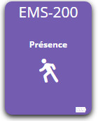

-   **Das Modul**

-   **Das Jeedom Visual**

Zusammenfassung 
======

In einem Korridor platziert, zum Beispiel im Wohnzimmer, in der Garage Ihres Hauses,
Der Bewegungssensor erkennt eine Anwesenheit, die Zustandsänderung ist
Schnappschuss.

Dank seines weiten Betrachtungswinkels und seiner Reichweite ist eine Sicherung möglich
ein großer Umfang. Die integrierte LED-Anzeige signalisiert Änderungen
Zustand.

Funktionen 
=========

-   Erkennt Bewegungen auch bei völliger Dunkelheit

-   Ultrakompakt

-   Signal wird sofort nach Erkennung übertragen

-   Selbstschutz gegen Anheben

-   Benutzerfreundlichkeit und Installation

-   Wandmontage durch Schrauben oder doppelseitig

-   Informationen zum Batteriestand

Technische Daten 
===========================

-   Modultyp : Edisio Sender

-   Versorgung : 3VDC (Lithiumbatterie ER14250)

-   Frequenz : 868,3 MHz

-   Betriebstemperatur : 0 ° C + 45 ° C.

-   Reichweite im freien Feld : 100M

-   Erfassungsbereich : 6M

-   Abmessungen : 25x79x19mm

-   Schutzart : IP20

-   Verwendung : Drinnen

Moduldaten 
=================

-   Machen Sie : Edisio Smart Home

-   Name : EMS-200

Allgemeine Konfiguration 
======================

So konfigurieren Sie das Edisio-Plugin und ordnen Jeedom ein Modul zu,
beziehen sich darauf
[Dokumentation](https://www.jeedom.fr/doc/Dokumentation/plugins/edisio/de_DE/edisio.html).

> **Wichtig**
>
> Denken Sie daran, dass Jeedom Ihre Sendermodule automatisch erstellt
> Aktivieren Sie die Option in der Plugin-Konfiguration nicht.

> **Spitze**
>
> Die Platzierung wird in einer Höhe von 150 cm und in der Nähe empfohlen
> die gewünschte Temperatur.

"E" -Taste" 
----------

Sie finden die Schaltfläche "E", die die Zuordnungstaste des Sensors ist
der Temperatur.

Erkennung 
---------

Der Sensor erkennt die geringste Bewegung innerhalb eines Radius von ca. 6 m

Timer-Einstellung 
-----------------------

Standardmäßig ist der Timer deaktiviert. Dieser Parameter wird zur Konfiguration verwendet
die Frist :

Assoziation des Sensors mit Jeedom 
===============================

Die Zuordnung des Bewegungssensors ist kinderleicht. Er
Drücken Sie einfach die Taste "E" unter dem Sensor. Dieser wird
automatisch von Jeedom erkannt. Geh einfach zum
Edisio Plugin. Sie können es dann in ein Objekt einfügen und ihm ein geben
benennen und speichern.

Sobald Ihre Ausrüstung gekoppelt ist, sollten Sie diese erhalten :

> **Spitze**
>
> Denken Sie daran, das Widget zu platzieren, damit es im Dashboard angezeigt wird
> Ihre Ausrüstung in einem Objekt.

Befehle 
---------

Sobald Ihre Ausrüstung erstellt ist, sollten Sie die Bestellungen erhalten
mit dem Modul verbunden :

Hier ist die Liste der Befehle :

-   Präsenz : Es ist der Befehl, der angibt, ob eine Präsenz vorliegt
    erkannt

-   Batterie : Zeigt den Batteriestatus an

Information 
------------

Sobald Ihre Ausrüstung mit Jeedom verbunden ist, werden verschiedene Informationen angezeigt
verfügbar :

-   Schaffung : Gibt das Datum an, an dem das Gerät erstellt wurde

-   Kommunikation : Zeigt die letzte zwischen aufgezeichnete Kommunikation an
    Jeedom und das Modul

-   Batterie : Zeigt den Batteriestatus der Batteriemodule an

-   STATUS : Gibt den STATUS des Moduls zurück

Alternative visuelle 
=================

Faq. 
======

So steuern Sie einen Z-Wave-Empfänger?

:   Mit dem Jeedom Scenario Plugin.

Wie kann ich das gleiche Bild haben ?

:   Mit dem Jeedom Widgets Plugin.

**@Jamsta**
