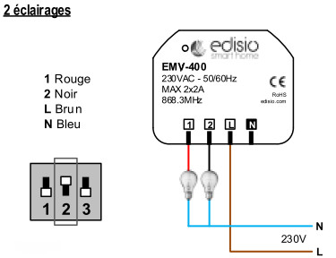

# Edision EMV 400 Beleuchtung

**Das Modul**

**Das Jeedom Visual**

## Zusammenfassung

Mit dem Mikromodul EMV-400 können Sie einen bidirektionalen Motor oder eine elektrische Ausrüstung verwalten. Es ermöglicht die Steuerung von 2 Start / Stopp-Ausgängen oder eines Open / Stop / Close-Verschlusses.

Darüber hinaus ist die Interaktion mit anderen Protokollen möglich. Sie kann über Schalter und / oder Fernbedienungen der Marke Edisio direkt von Jeedom, aber auch über jeden Z-Wave-Sender in Ihrem Netzwerk gesteuert werden.

Jedes Edisio-Modul im elektrischen Netzwerk mit der Möglichkeit, mit den anderen Modulen als drahtloser Repeater zu arbeiten, um eine vollständige Abdeckung Ihres Hauses zu gewährleisten.

Schließlich kann jedes Modul im Remote-Modus verwendet werden. Dies ist sehr praktisch, da ein Sender zugeordnet werden kann, ohne auf den Empfänger zugreifen zu müssen.

> **Wichtig**
>
> Neutral ist nur für den "Shutter" -Modus erforderlich"

## Fonctions

-   2 Relaisausgänge geliefert
-   Wird in einer 55-mm-Unterputzdose oder direkt in den Flügelkästen installiert
-   Art der Verwendung: Ein / Aus, Öffnen / Stoppen / Schließen
-   Kompatibel mit elektronischen und mechanischen Endschaltern
-   Remote-Modus
-   Timer-Funktion: Ein / Aus-Modus: 30min oder 60min
-   Signalreplik (Repeater))
-   Bidirektionales Mikromodul
-   Niedriger Batteriestand des Senders
-   Klein, diskret und ästhetisch
-   Benutzerfreundlichkeit und Installation

## Technische Daten

-   Modultyp: Edisio Empfänger
-   Alimentation: 230 VAC, 50 Hz
-   Verkabelung: 4 Drähte, 2 für die Steuerung und 2 für die Stromversorgung
-   Frequenz: 868,3 MHz
-   Angetriebene Ausgänge: 2 Relais
-   Maximale Leistung: 2A pro Ausgang
-   Widerstandslast: 460W
-   Sonstige Gebühren: 100W
-   Betriebstemperatur: -10 ° C + 45 ° C
-   Dimensions: 48 x 46 x 26 mm
-   Schutzart: IP20

## Moduldaten

-   Machen Sie : Edisio Smart Home
-   Name : EMV-400

## Allgemeine Konfiguration

Informationen zum Konfigurieren des Edisio-Plugins und zum Zuordnen eines Moduls zu Jeedom finden Sie hier [Dokumentation](https://doc.jeedom.com/de_DE/plugins/automation%20protocol/edisio/).

> **Wichtig**
>
> Vergessen Sie nicht, die Option in der Plugin-Konfiguration zu aktivieren, damit Jeedom Ihre Sendermodule automatisch erstellt.

> **Wichtig**
>
> Umgekehrt müssen Edisio-Empfänger in Jeedom manuell erstellt werden.

### DIP-Schalter und Taste "R"

-   Mit dem DIP-Schalter können Sie die Parameter (Repeater / Verschlussmodus / Beleuchtung / Timer) des Moduls einstellen:

> **Notiz**
>
> Um unnötige Redundanzen zu vermeiden, aktivieren Sie niemals den "Repeater" -Modus auf allen Empfängern, maximal 5 Empfänger pro Installation.

-   Mit der Taste "R" können Sie dem Empfänger einen Sender zuordnen, die Timerfunktion aktivieren oder deaktivieren und den Fernbedienungsmodus aktivieren :

> **Notiz**
>
> Durch Drücken von R 3x wird der Fernbedienungsmodus aktiviert.

### Funktionsplan

 Je nachdem, ob Ihr Sender im Modus "1 Taste" oder "2 Tasten" konfiguriert ist, funktioniert das Modul folgendermaßen:

> **Notiz**
>
> Informationen zur Konfiguration Ihres Senders finden Sie in der Dokumentation des Herstellers.

### Timer-Funktion

Die Timer-Funktion schaltet die Relais nach 30 oder 60 Minuten automatisch aus.

-   Aktivieren : Drücken Sie 4x "R" am Empfänger, um dies durch einen einzelnen Dauerton zu bestätigen
-   Deactivate: Drücken Sie 5x "R" am Empfänger, Bestätigung durch 3 einfache Pieptöne.
-   30 Minuten Timer: DIP-Schalter 3 oben
-   60-Minuten-Timer: DIP-Schalter 3 nach unten

## "Beleuchtungs" -Modus"

Im "Beleuchtungs" -Modus können Sie 2 elektrische Geräte fernsteuern.

> **Wichtig**
>
> Neutral ist nicht erforderlich

### Elektrische Konfiguration und Anschlüsse

> **Wichtig**
>
> Damit sich das Modul im "Beleuchtungs" -Modus befindet, muss sich der DIP-Schalter 2 oben befinden

> **Wichtig**
>
> NIEMALS UNTER SPANNUNG ANSCHLIESSEN

### Erstellung des Moduls in Jeedom

Um ein Edisio-Empfängermodul mit Jeedom zu verknüpfen, müssen Sie manuell ein Gerät erstellen.

Sobald Ihre Ausrüstung erstellt ist, sollten Sie diese erhalten :

> **Notiz**
>
> Denken Sie daran, Ihre neue Ausrüstung zu aktivieren.

Wählen Sie in der Ausrüstungsliste rechts "Leichtes Mikromodul"" :

### Commandes

Sobald Ihre Ausrüstung gespeichert ist, sollten Sie die mit dem Modul verknüpften Befehle erhalten :

Hier ist die Liste der Befehle :

-   Ein : Es ist der Befehl, der Relais 1 aktiviert
-   Aus : Es ist der Befehl, der es ermöglicht, Relais 1 zu deaktivieren
-   Wir 2 : Es ist der Befehl, der Relais 2 aktiviert
-   Aus 2: Es ist der Befehl, der Relais 2 deaktiviert
-   E. : Dies ist der Befehl, mit dem Sie den Remote-Modus verwenden können

> **Wichtig**
>
> Die Statusrückmeldung wird von Jeedom simuliert. Wenn Sie einen anderen Sender verwenden, kann Jeedom den Empfängerstatus daher nicht aktualisieren.

### Informations

Sobald Ihre Ausrüstung mit Jeedom verknüpft ist, stehen verschiedene Informationen zur Verfügung :

-   Schaffung : Gibt das Datum an, an dem das Gerät erstellt wurde
-   Kommunikation : Zeigt die letzte zwischen Jeedom und dem Mikromodul aufgezeichnete Kommunikation an
-   Batterie : Zeigt den Batteriestatus für Batteriemodule an
-   STATUS : Gibt den Status des Moduls zurück

## Assoziation des Mikromoduls mit Jeedom

Damit Sie mit Jeedom interagieren können, als wäre es ein Edisio-Sender.

> **Notiz**
>
> Einer der großen Vorteile von Edisio besteht darin, dass einem Empfänger mehrere Sender zugeordnet sein können

### Standardmethode

Jeder Ausgang muss einem Jeedom-Befehl zugeordnet sein:

-   Ausgabe 1 zuordnen :
    -   Drücken Sie 1x auf dem "R" des Empfängers, ein einzelner Piepton (kurz in der Wiederholung) signalisiert die Programmierung von Ausgang 1 aktiviert.
    -   Drücken Sie innerhalb von 10 Sekunden im Befehl "Öffnen" in Jeedom "Test". Ein kontinuierlicher Piepton signalisiert die Zuordnung von Ausgang 1 zu Jeedom.
    -   Drücken Sie innerhalb von 10 Sekunden erneut "R" am Empfänger, um die Zuordnung zu bestätigen. Der Piepton stoppt.
-   Ausgabe 2 zuordnen :
    -   Drücken Sie 2x auf das "R" des Empfängers. Ein doppelter Piepton (kurz in Wiederholung) signalisiert die Programmierung von Ausgang 2 aktiviert.
    -   Drücken Sie innerhalb von 10 Sekunden "Test" auf den Befehl "Schließen" in Jeedom. Ein kontinuierlicher Piepton signalisiert die Zuordnung von Ausgang 2 zu Jeedom.
    -   Drücken Sie innerhalb von 10 Sekunden erneut "R" am Empfänger, um die Zuordnung zu bestätigen. Der Piepton stoppt.

### Remote-Methode

Wir haben zu Beginn dieser Dokumentation darüber gesprochen. Bei bereits eingebauten Modulen, in Zwischendecken oder sogar Dachböden. Diese Methode ermöglicht das Hinzufügen eines neuen Senders, ohne auf das "R" des Empfängers zuzugreifen.

-   Verknüpfen Sie die Schaltfläche "R" :
    -   Drücken Sie 3x auf "R" am Empfänger. Ein dreifacher Piepton (kurze Wiederholung) signalisiert den aktiven Programmiermodus.
    -   Drücken Sie innerhalb von 10 Sekunden "Test" auf den Befehl "E" in Jeedom. Ein kontinuierlicher Piepton signalisiert die Zuordnung zu Jeedom.
    -   Drücken Sie innerhalb von 10 Sekunden erneut "E" am Empfänger, um die Zuordnung zu bestätigen. Der Piepton stoppt.

Es ist geschafft, Ihr Jeedom ist jetzt zugeordnet und sein "E" -Befehl ersetzt jetzt die "R" -Taste am Empfänger.

-   Verknüpfen Sie einen neuen Sender mit einem Empfänger, dem Jeedom bereits zugeordnet ist :
    -   Ausfahrt 1 :
        -   Drücken Sie 1x auf "Test" Befehl "E" in Jeedom, ein einzelner Piepton (kurz in Wiederholung) signalisiert die Programmierung von Ausgang 1 aktiviert.
        -   Drücken Sie innerhalb von 10 Sekunden eine der Tasten "C" am neuen zugeordneten Sender. Ein kontinuierlicher Piepton signalisiert die Zuordnung von Ausgang 1.
        -   Drücken Sie innerhalb von 10 Sekunden erneut "Test" auf dem Befehl "E" in Jeedom, um die Zuordnung zu bestätigen. Der Piepton stoppt.
    -   Ausfahrt 2 :
        -   Drücken Sie 2x auf "Test" des Befehls "E" in Jeedom. Ein doppelter Piepton (kurze Wiederholung) signalisiert die Programmierung von Ausgang 2 aktiviert.
        -   Drücken Sie innerhalb von 10 Sekunden eine der Tasten "C" am neuen zugeordneten Sender. Ein kontinuierlicher Piepton signalisiert die Zuordnung von Ausgang 2.
        -   Drücken Sie innerhalb von 10 Sekunden erneut "Test" auf dem Befehl "E" in Jeedom, um die Zuordnung zu bestätigen. Der Piepton stoppt.

> **Notiz**
>
> Sie können so oft wiederholen, wie Sie dem Empfänger Sender zuordnen möchten

## Alternative visuelle

## Faq.

**So löschen Sie den Empfängerspeicher ?**

Halten Sie das "R" 10 Sekunden lang gedrückt, bis ein kontinuierlicher Piepton ertönt.
