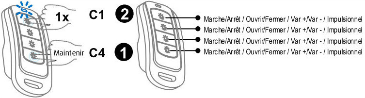

# 

****

****

## 

. . .

.

##  

-    : 
-   
-   
-   

## 

-    : 
-    : )
-    : 4
-    : 
-    : -
-    : 
-    : IP40

## 

-    : 
-    : ETC4

## 

,

.

> ****
>
> 
> .

### 

.  :

-    :  : 
-    :  :
    -   : 
    -   : 

## 

 :

## 

-    :
    -   "
    -   

-    :
    -   "
    -   

## 

. .

 :

### Commandes

 :

 :

-    : 
-    : 
-    : 
-    : 
-    : 

### Informations

 :

-    : 
-    : 
-    : 
-    : 

### Utilisation

.

> ****
>
> .

## .

** ?**

. . .
