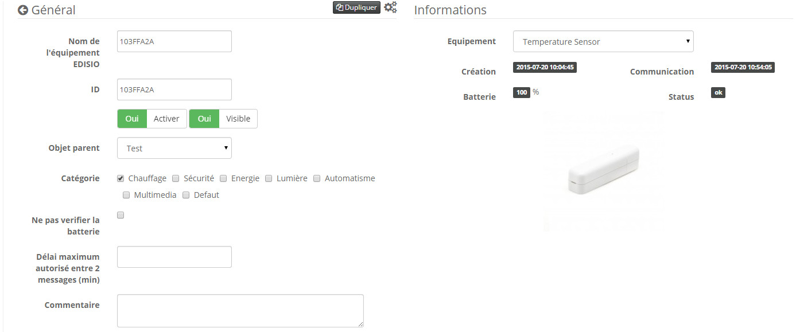

# Edisio ETS 200

**Das Modul**

**Das Jeedom Visual**

## Zusammenfassung

In einem Raum platziert, steigt die gewünschte Raumtemperatur automatisch an. In Verbindung mit einem Empfänger vom Typ EMR-2000 oder EDR-B4 (4 Ausgänge) ist außerdem ein Thermostat von überall auf der Welt über das Internet angeschlossen und steuerbar.

Das Signal wird erst gesendet, nachdem eine Temperaturdifferenz von 0,5 ° C oder 1 ° C oder alle 5 Minuten festgestellt wurde. Darüber hinaus ist der Sensor kompakt und diskret.

Die integrierte LED-Anzeige signalisiert jede Zustandsänderung.

## Fonctions

-   Drahtloser batteriebetriebener Temperatursensor
-   Ultrakompakt
-   Signal wird sofort übertragen, wenn die Temperatur steigt oder fällt
-   Benutzerfreundlichkeit und Installation
-   Wandmontage durch Schrauben oder doppelseitig
-   Informationen zum Batteriestand

## Technische Daten

-   Modultyp : Edisio Sender
-   Verwendung : Drinnen
-   Versorgung : 3VDC (Lithiumbatterie ER14250)
-   Autonomie : Bis zu 3 Jahre
-   Frequenz : 868,3 MHz
-   Betriebstemperatur : 0 ° C + 45 ° C
-   Reichweite im freien Feld : 100M
-   Abmessungen : 25x79x19mm
-   Schutzart : IP20

## Moduldaten

-   Machen Sie : Edisio Smart Home
-   Name : ETS-200

## Allgemeine Konfiguration

Informationen zum Konfigurieren des Edisio-Plugins und zum Zuordnen eines Moduls zu Jeedom finden Sie hier [Dokumentation](https://doc.jeedom.com/de_DE/plugins/automation%20protocol/edisio/).

> **Wichtig**
>
> Vergessen Sie nicht, die Option in der Plugin-Konfiguration zu aktivieren, damit Jeedom Ihre Sendermodule automatisch erstellt.

> **Spitze**
>
> Die Platzierung wird in einer Höhe von 150 cm und nahe der gewünschten Filztemperatur empfohlen.

### "E" -Taste"

Unter der Schaltfläche "E" befindet sich die Zuordnungstaste des Temperatursensors.

### Temperaturdelta einstellen

Standardmäßig ist das Temperaturdelta auf 1 ° C (+/- 10%) programmiert, um die Batterielebensdauer zu optimieren. Sie können diesen Parameter anpassen:

## Assoziation des Sensors mit Jeedom

Die Kombination des Temperatursensors ist ein Kinderspiel. Drücken Sie einfach die Taste "E" unter dem Sensor. Dies wird automatisch erkannt. Platzieren Sie es in einem Objekt, geben Sie ihm einen Namen und speichern Sie es.

Sobald Sie Ihre zugehörige Ausrüstung haben, sollten Sie diese erhalten :

### Commandes

Sobald Ihre Ausrüstung erstellt ist, sollten Sie die mit dem Modul verknüpften Befehle erhalten :

Hier ist die Liste der Befehle :

-   Temperatur : Es ist der Befehl, der die gelesene Temperatur anzeigt
-   Batterie : Zeigt den Batteriestatus an

### Informations

Sobald Ihre Ausrüstung mit Jeedom verknüpft ist, stehen verschiedene Informationen zur Verfügung :

-   Schaffung : Gibt das Datum an, an dem das Gerät erstellt wurde
-   Kommunikation : Zeigt die letzte zwischen Jeedom und dem Mikromodul aufgezeichnete Kommunikation an
-   Batterie : Zeigt den Batteriestatus der Batteriemodule an
-   STATUS : Gibt den Status des Moduls zurück
