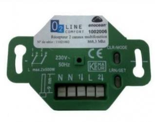

# Kompatibilität von EnOcean-Geräten

# A5-02

|Image|Marque|Nom|Type|Remarque|Lien|
|---|---|---|---|---|---|
||Nodon|Weißer Temperatursensor|Temperatur|Erhältlich in mehreren Farben|[Kaufen](http://www.domadoo.fr/fr/peripheriques/2627-nodon-capteur-de-temperature-sans-fils-et-sans-piles-blanc-3700313920183.html)|
||Nodon|Schwarzer Temperatursensor|Temperatur|Erhältlich in mehreren Farben|[Kaufen](http://www.domadoo.fr/fr/peripheriques/2637-nodon-capteur-de-temperature-enocean-black-3700313920169.html)|
||Nodon|Temperatursensor aus Aluminium|Temperatur|Erhältlich in mehreren Farben|[Kaufen](http://www.domadoo.fr/fr/peripheriques/2634-nodon-capteur-de-temperature-enocean-alu-3700313920176.html)|
||Nodon|Holztemperatursensor|Temperatur|Erhältlich in mehreren Farben|[Kaufen](http://www.domadoo.fr/fr/peripheriques/2635-nodon-capteur-de-temperature-enocean-wood-3700313920145.html)|
||Nodon|Temperatursensor lackieren|Temperatur|Erhältlich in mehreren Farben|[Kaufen](http://www.domadoo.fr/fr/peripheriques/2636-nodon-capteur-de-temperature-enocean-varnish-3700313920152.html)|
||Thermokon|Rohrtemperatursensor|Temperatur|||

# A5-04

|Image|Marque|Nom|Type|Remarque|Lien|
|---|---|---|---|---|---|
||A5-04|||||
||Nodon|Temperatur- und Feuchtigkeitssensor Enocean White|Temperatur Feuchtigkeit|||
||Trio2sys|Funk-Feuchte- und Temperaturfühler für die Innenmontage|Temperatur Feuchtigkeit|||
||Nexelec|Insafe+ Pilot-Feuchtigkeits- und Temperatursonde|Temperatur Feuchtigkeit|||
||Eltako|Funk-Feuchte- und Temperaturfühler für die Außenmontage - FAFT60|Temperatur||[Kaufen](http://www.domadoo.fr/fr/peripheriques/1931-eltako-sonde-radio-humidite-et-temperature-montage-exterieur-faft60-4010312310120.html)|

# A5-05

|Image|Marque|Nom|Type|Remarque|Lien|
|---|---|---|---|---|---|
||A5-05|||||

# A5-06

|Image|Marque|Nom|Type|Remarque|Lien|
|---|---|---|---|---|---|
||Eltako|Außenlichtsensor FAH60|Luminosité||[Kaufen](http://www.domadoo.fr/fr/peripheriques/3084-eltako-sonde-de-luminosite-exterieure-4010312305218.html)|

# A5-07

|Image|Marque|Nom|Type|Remarque|Lien|
|---|---|---|---|---|---|
||Eosca|EnOcean-Bewegungsmelder (Deckenposition)|Mouvement|||
||Pressac|Bewegungsmelder Unterschreibtisch (Underdesk)|Mouvement|||
||Easyfit|Deckenbewegungsmelder|Mouvement|||
||Easyfit|Bewegungssensor unter dem Schreibtisch|Mouvement|||
||Nodon|EnOcean Bewegungs- und Lichtmelder|Mouvement|||
||Avidsen|Bewegungsmelder|Mouvement|||

# A5-09

|Image|Marque|Nom|Type|Remarque|Lien|
|---|---|---|---|---|---|
||A5-09|||||
||Nanosense|E4000 Luftqualitäts-CO2-Sensor|CO2, Luftqualität|||
||PressacSensing|Co2 Temperatur Feuchtigkeitssensor|CO2, Temperatur, Luftfeuchtigkeit|||
||Thermokon|Co2 Temperatur Feuchtigkeitssensor|CO2, Temperatur, Luftfeuchtigkeit|||
||Nexelec|Insafe+ Carbon Co2 Sensor Temperatur Luftfeuchtigkeit|CO2, Temperatur, Luftfeuchtigkeit|||
||Nanosense|E4000 Luftqualitätssensor|Luftqualität|||
||Nanosense|Feinstaubsonde P4000|Feinpartikel|||
||Nanosense|Luftqualitätssensor E4000NG|Luftqualität|||

# A5-10

|Image|Marque|Nom|Type|Remarque|Lien|
|---|---|---|---|---|---|
||Eltako|Temperaturregler mit Tag/Nacht/AUS-Funktion|Regler||[Kaufen](http://www.domadoo.fr/fr/peripheriques/3128-eltako-regulateur-de-temperature-avec-fonctions-journuitoff-4010312315859.html)|
||Avidsen|Temperatur- und Feuchtigkeitssonde mit Digitalanzeige|Regler|||

# A5-11

|Image|Marque|Nom|Type|Remarque|Lien|
|---|---|---|---|---|---|
||Altecon|Klima-/Heizungsregler|Regler|||

# A5-12

|Image|Marque|Nom|Type|Remarque|Lien|
|---|---|---|---|---|---|
||Avidsen|Stromzangenmodul|Compteur|||
||Thermokon|Energiezähler|Compteur|||
||Eltako|65A Energiezählermodul|Compteur||[Kaufen](http://www.domadoo.fr/fr/peripheriques/2837-eltako-module-de-comptage-d-energie-65a-4010312311059.html)|
||Eltako|16A Energiezählermodul|Compteur||[Kaufen](http://www.domadoo.fr/fr/peripheriques/2836-eltako-module-de-comptage-d-energie-16a-4010312303184.html)|
||Avidsen|Teleinfo-Modul|Compteur|||
||Ewattch|Elektrischer Unterzähler SQUID EnOcean - 12 Eingänge|Compteur||[Kaufen](http://www.domadoo.fr/fr/peripheriques/2859-ewattch-squid-sous-compteur-electrique-enocean-12-entrees-3770002148045.html)|

# A5-13

|Image|Marque|Nom|Type|Remarque|Lien|
|---|---|---|---|---|---|
||A5-13|||||

# A5-14

|Image|Marque|Nom|Type|Remarque|Lien|
|---|---|---|---|---|---|
||Avidsen|Regensensor|Detektor|||
||Avidsen|Geräuschdetektor|Detektor|||

# A5-20

|Image|Marque|Nom|Type|Remarque|Lien|
|---|---|---|---|---|---|
||Micropelt|EnOcean Thermostatventil ohne Batterie|Vanne|Stellen Sie sicher, dass das Ventil als Reaktion auf die Aufnahme einmal blinkt|[Kaufen](http://www.domadoo.fr/fr/peripheriques/3259-micropelt-vanne-thermostatique-enocean-4260413370022.html)|
||Thermokon|SAB+ airconfig|Vanne|Stellen Sie sicher, dass das Ventil als Reaktion auf die Aufnahme einmal blinkt||

# A5-3f

|Image|Marque|Nom|Type|Remarque|Lien|
|---|---|---|---|---|---|
||Thermokon|SR65 3AI|Eingangsmodule|||

# D1079-00

|Image|Marque|Nom|Type|Remarque|Lien|
|---|---|---|---|---|---|
||Ventilairsec|Assistant|Fernbedienung|||

# D1079-01

|Image|Marque|Nom|Type|Remarque|Lien|
|---|---|---|---|---|---|
||Ventilairsec|VMI|Ventilation|||

# D2-01

|Image|Marque|Nom|Type|Remarque|Lien|
|---|---|---|---|---|---|
||Trio2sys|Modulare Verbrauchsanzeige|Consommation|Stellen Sie sicher, dass der Take nach der Aufnahme aus dem Learn herauskommt. Andernfalls gehen Sie zu einem Ausschluss vor||
||Avidsen|Kesselmodul|Contacteur|Stellen Sie sicher, dass der Take nach der Aufnahme aus dem Learn herauskommt. Andernfalls gehen Sie zu einem Ausschluss vor||
||Flextron|ALADIN Zwischengriff Pro|Prise|Stellen Sie sicher, dass der Take nach der Aufnahme aus dem Learn herauskommt. Andernfalls gehen Sie zu einem Ausschluss vor||
||UbiWizz|Smart Plug EnOcean|Prise|Stellen Sie sicher, dass der Take nach der Aufnahme aus dem Learn herauskommt. Andernfalls gehen Sie zu einem Ausschluss vor|[Kaufen](http://www.domadoo.fr/fr/peripheriques/2667-ubiwizz-smart-plug-enocean-schuko.html)|
||Nodon|Intelligente EnOcean-Steckdose|Prise|Stellen Sie sicher, dass der Take nach der Aufnahme aus dem Learn herauskommt. Andernfalls gehen Sie zu einem Ausschluss vor|[Kaufen](http://www.domadoo.fr/fr/peripheriques/2631-nodon-prise-intelligente-enocean-type-eu-3700313920008.html)|
||Nodon|Intelligenter Stecker + Messung|Prise|Stellen Sie sicher, dass der Take nach der Aufnahme aus dem Learn herauskommt. Andernfalls gehen Sie zu einem Ausschluss vor|[Kaufen](http://www.domadoo.fr/fr/peripheriques/2633-nodon-prise-intelligente-metering-enocean-type-eu-3700313920022.html)|
||Avidsen|Steuerleitungsmodul|Pilotdraht|Stellen Sie sicher, dass der Take nach der Aufnahme aus dem Learn herauskommt. Andernfalls gehen Sie zu einem Ausschluss vor||
||Nodon|Steuerleitungsmodul|Pilotdraht|Stellen Sie sicher, dass der Take nach der Aufnahme aus dem Learn herauskommt. Andernfalls gehen Sie zu einem Ausschluss vor|[Kaufen](http://www.domadoo.fr/fr/peripheriques/5134-nodon-module-chauffage-fil-pilote-enocean-3700313924693.html)|
||Nodon|Micro-Smart-Plug|Prise|Stellen Sie sicher, dass der Take nach der Aufnahme aus dem Learn herauskommt. Andernfalls gehen Sie zu einem Ausschluss vor|[Kaufen](http://www.domadoo.fr/fr/peripheriques/4309-nodon-micro-smart-plug-enocean-prise-fr-3700313921401.html)|
||Nodon|Einzelschalter-Mikromodul EnOcean|Micromodule|Stellen Sie sicher, dass das Mikromodul nach der Aufnahme den Learn verlässt. Andernfalls gehen Sie zu einem Ausschluss vor||
||Avidsen|Einzelschalter-Mikromodul EnOcean|Micromodule|Stellen Sie sicher, dass das Mikromodul nach der Aufnahme den Learn verlässt. Andernfalls gehen Sie zu einem Ausschluss vor||
||Nodon|EnOcean-Doppelschalter-Mikromodul|Micromodule|Stellen Sie sicher, dass das Mikromodul nach der Aufnahme den Learn verlässt. Andernfalls gehen Sie zu einem Ausschluss vor|[Kaufen](http://www.domadoo.fr/fr/peripheriques/3341-nodon-micromodule-commutateur-double-enocean-3700313920374.html)|
||Avidsen|EnOcean-Doppelschalter-Mikromodul|Micromodule|Stellen Sie sicher, dass das Mikromodul nach der Aufnahme den Learn verlässt. Andernfalls gehen Sie zu einem Ausschluss vor||

# D2-03

|Image|Marque|Nom|Type|Remarque|Lien|
|---|---|---|---|---|---|
||Nodon|Soft-Taste|Bouton|5 schnelles Drücken im Inklusionsmodus||

# D2-04

|Image|Marque|Nom|Type|Remarque|Lien|
|---|---|---|---|---|---|
||Nanosense|E4000-NG|Sensor,CO2|||

# D2-05

|Image|Marque|Nom|Type|Remarque|Lien|
|---|---|---|---|---|---|
||Nodon|EnOcean Rollladen-Mikromodul|Micromodule|Stellen Sie sicher, dass das Mikromodul nach der Aufnahme den Learn verlässt. Andernfalls gehen Sie zu einem Ausschluss vor||
||Avidsen|EnOcean Rollladen-Mikromodul|Micromodule|Stellen Sie sicher, dass das Mikromodul nach der Aufnahme den Learn verlässt. Andernfalls gehen Sie zu einem Ausschluss vor||

# D2-06

|Image|Marque|Nom|Type|Remarque|Lien|
|---|---|---|---|---|---|
||Soda|Smarter Griff von EnOcean|Handhaben|Stellen Sie sicher, dass der Griff nach der Aufnahme piept. Andernfalls gehen Sie zu einem Ausschluss vor|[Kaufen](http://www.domadoo.fr/fr/peripheriques/2.html)|

# D2-14

|Image|Marque|Nom|Type|Remarque|Lien|
|---|---|---|---|---|---|
||Nexelec|Insafe|Rauch|||
||Enocean|STM550|Temperatur, Feuchtigkeit, Helligkeit, Beschleunigung|||

# D2-15

|Image|Marque|Nom|Type|Remarque|Lien|
|---|---|---|---|---|---|
||EasyFit|EPAC|Gegenwart|||

# D2-32

|Image|Marque|Nom|Type|Remarque|Lien|
|---|---|---|---|---|---|
||PressacSensing|Enocean Stromzange|Courant|||
||PressacSensing|3-Wege Enocean Stromzange|Courant|||

# D5-00

|Image|Marque|Nom|Type|Remarque|Lien|
|---|---|---|---|---|---|
||Nodon|Öffnungssensor weiß|Ouverture|Erhältlich in mehreren Farben|[Kaufen](http://www.domadoo.fr/fr/peripheriques/2626-nodon-detecteur-d-ouverture-sans-fils-et-sans-piles-blanc-3700313920138.html)|
||Nodon|Öffnungssensor schwarz|Ouverture|Erhältlich in mehreren Farben|[Kaufen](http://www.domadoo.fr/fr/peripheriques/2640-nodon-detecteur-d-ouverture-enocean-black-3700313920114.html)|
||Nodon|Öffnungssensor aus Aluminium|Ouverture|Erhältlich in mehreren Farben|[Kaufen](http://www.domadoo.fr/fr/peripheriques/2641-nodon-detecteur-d-ouverture-enocean-alu-3700313920121.html)|
||Nodon|Holzöffnungssensor|Ouverture|Erhältlich in mehreren Farben|[Kaufen](http://www.domadoo.fr/fr/peripheriques/2638-nodon-detecteur-d-ouverture-enocean-wood-3700313920091.html)|
||Nodon|Lacköffnungssensor|Ouverture|Erhältlich in mehreren Farben|[Kaufen](http://www.domadoo.fr/fr/peripheriques/2639-nodon-detecteur-d-ouverture-enocean-varnish-3700313920107.html)|
||Eltako|Tür-/Fensterkontakt - weiß - FTK-RW|Ouverture|Erhältlich in mehreren Farben|[Kaufen](http://www.domadoo.fr/fr/peripheriques/3122-eltako-contact-de-portefenetre-blanc-4010312305010.html)|
||Eltako|Tür-/Fensterkontakt - Silber - FTK-SI|Ouverture|Erhältlich in mehreren Farben|[Kaufen](http://www.domadoo.fr/fr/peripheriques/3123-eltako-contat-de-portefenetre-argente-4010312305171.html)|
||Eltako|Tür-/Fensterkontakt - Anthrazit - FTK-AN|Ouverture|Erhältlich in mehreren Farben|[Kaufen](http://www.domadoo.fr/fr/peripheriques/3121-eltako-contact-de-portefenetre-anthracite-4010312305164.html)|
||Avidsen|Tür-/Fensterkontakt|Ouverture|||

# F6-02

|Image|Marque|Nom|Type|Remarque|Lien|
|---|---|---|---|---|---|
||F6-02|||||
||F6-02|||||
||Nodon|Soft Remote blau tech|Fernbedienung|Erhältlich in mehreren Farben. Zwei Betriebsmodi in Jeedom möglich (Ein / Aus auf zwei Tasten oder Toggle auf 4 Tasten). Es werden mehrere Pressen verwaltet.|[Kaufen](http://www.domadoo.fr/fr/peripheriques/2624-nodon-soft-remote-enocean-tech-blue-3700313920053.html)|
||Nodon|Soft Remote kuscheliges Grau|Fernbedienung|Erhältlich in mehreren Farben. Zwei Betriebsmodi in Jeedom möglich (Ein / Aus auf zwei Tasten oder Toggle auf 4 Tasten). Es werden mehrere Pressen verwaltet.|[Kaufen](http://www.domadoo.fr/fr/peripheriques/2625-nodon-soft-remote-enocean-cozy-grey-3700313920060.html)|
||Nodon|Weiche entfernte blaue Lagune|Fernbedienung|Erhältlich in mehreren Farben. Zwei Betriebsmodi in Jeedom möglich (Ein / Aus auf zwei Tasten oder Toggle auf 4 Tasten). Es werden mehrere Pressen verwaltet.|[Kaufen](http://www.domadoo.fr/fr/peripheriques/2898-nodon-soft-remote-enocean-lagoon-3700313920312.html)|
||Nodon|Soft-Remote-Softberry|Fernbedienung|Erhältlich in mehreren Farben. Zwei Betriebsmodi in Jeedom möglich (Ein / Aus auf zwei Tasten oder Toggle auf 4 Tasten). Es werden mehrere Pressen verwaltet.|[Kaufen](http://www.domadoo.fr/fr/peripheriques/2900-nodon-soft-remote-enocean-softberry-3700313920305.html)|
||Nodon|Soft-Remote-Wasabi|Fernbedienung|Erhältlich in mehreren Farben. Zwei Betriebsmodi in Jeedom möglich (Ein / Aus auf zwei Tasten oder Toggle auf 4 Tasten). Es werden mehrere Pressen verwaltet.|[Kaufen](http://www.domadoo.fr/fr/peripheriques/2899-nodon-soft-remote-enocean-wasabi-3700313920299.html)|
||Nodon|Weiche Fernbedienung weiß|Fernbedienung|Erhältlich in mehreren Farben. Zwei Betriebsmodi in Jeedom möglich (Ein / Aus auf zwei Tasten oder Toggle auf 4 Tasten). Es werden mehrere Pressen verwaltet.|[Kaufen](http://www.domadoo.fr/fr/peripheriques/2648-ubiwizz-telecommande-ubi-remote-blanc-3553740015966.html)|
||Nodon|Z-Wave Plus Wandschalter - Cozi White|Interrupteur|Erhältlich in mehreren Farben. Zwei Betriebsmodi in Jeedom möglich (Ein / Aus auf zwei Tasten oder Toggle auf 4 Tasten). Es werden mehrere Pressen verwaltet.|[Kaufen](http://www.domadoo.fr/fr/peripheriques/2995-nodon-interrupteur-mural-z-wave-plus-cozi-white-3700313920268.html)|
||Nodon|EnOcean Wandschalter - Cozi Grey|Interrupteur|Erhältlich in mehreren Farben. Zwei Betriebsmodi in Jeedom möglich (Ein / Aus auf zwei Tasten oder Toggle auf 4 Tasten). Es werden mehrere Pressen verwaltet.|[Kaufen](http://www.domadoo.fr/fr/peripheriques/2628-nodon-interrupteur-mural-enocean-cozi-grey-3700313920084.html)|
||Eltako|Infrarot-/EnOcean-Konverter mit USB-Anschluss für Harmony Logitech-Fernbedienung - FIW-USB|Infrarouge|Erstellt so viele Geräte wie in der Moduldokumentation verfügbare Tastenfamilien (für jede Familie ist eine Aufnahme erforderlich)|[Kaufen](http://www.domadoo.fr/fr/peripheriques/3263-eltako-convertisseur-infrarougeenocean-avec-port-usb-4010312311158.html)|
||F6-02|||||
||Eltako|Tür-/Fensterkontakt mit Hebel - weiß - FTKE-RW|Ouverture|Auswahl des richtigen Profils nach der Aufnahme|[Kaufen](http://www.domadoo.fr/fr/peripheriques/3125-eltako-contact-de-portefenetre-blanc-4010312315231.html)|
||Nodon|Soft Remote blau tech|Fernbedienung|Erhältlich in mehreren Farben. Zwei Betriebsmodi in Jeedom möglich (Ein / Aus auf zwei Tasten oder Toggle auf 4 Tasten). Es werden mehrere Pressen verwaltet.|[Kaufen](http://www.domadoo.fr/fr/peripheriques/2624-nodon-soft-remote-enocean-tech-blue-3700313920053.html)|
||Nodon|Soft Remote kuscheliges Grau|Fernbedienung|Erhältlich in mehreren Farben. Zwei Betriebsmodi in Jeedom möglich (Ein / Aus auf zwei Tasten oder Toggle auf 4 Tasten). Es werden mehrere Pressen verwaltet.|[Kaufen](http://www.domadoo.fr/fr/peripheriques/2625-nodon-soft-remote-enocean-cozy-grey-3700313920060.html)|
||Nodon|Weiche entfernte blaue Lagune|Fernbedienung|Erhältlich in mehreren Farben. Zwei Betriebsmodi in Jeedom möglich (Ein / Aus auf zwei Tasten oder Toggle auf 4 Tasten). Es werden mehrere Pressen verwaltet.|[Kaufen](http://www.domadoo.fr/fr/peripheriques/2898-nodon-soft-remote-enocean-lagoon-3700313920312.html)|
||Nodon|Soft-Remote-Softberry|Fernbedienung|Erhältlich in mehreren Farben. Zwei Betriebsmodi in Jeedom möglich (Ein / Aus auf zwei Tasten oder Toggle auf 4 Tasten). Es werden mehrere Pressen verwaltet.|[Kaufen](http://www.domadoo.fr/fr/peripheriques/2900-nodon-soft-remote-enocean-softberry-3700313920305.html)|
||Nodon|Soft-Remote-Wasabi|Fernbedienung|Erhältlich in mehreren Farben. Zwei Betriebsmodi in Jeedom möglich (Ein / Aus auf zwei Tasten oder Toggle auf 4 Tasten). Es werden mehrere Pressen verwaltet.|[Kaufen](http://www.domadoo.fr/fr/peripheriques/2899-nodon-soft-remote-enocean-wasabi-3700313920299.html)|
||Nodon|Weiche Fernbedienung weiß|Fernbedienung|Erhältlich in mehreren Farben. Zwei Betriebsmodi in Jeedom möglich (Ein / Aus auf zwei Tasten oder Toggle auf 4 Tasten). Es werden mehrere Pressen verwaltet.|[Kaufen](http://www.domadoo.fr/fr/peripheriques/2648-ubiwizz-telecommande-ubi-remote-blanc-3553740015966.html)|
||Nodon|Z-Wave Plus Wandschalter - Cozi White|Interrupteur|Erhältlich in mehreren Farben. Zwei Betriebsmodi in Jeedom möglich (Ein / Aus auf zwei Tasten oder Toggle auf 4 Tasten). Es werden mehrere Pressen verwaltet.|[Kaufen](http://www.domadoo.fr/fr/peripheriques/2995-nodon-interrupteur-mural-z-wave-plus-cozi-white-3700313920268.html)|
||Nodon|EnOcean Wandschalter - Cozi Grey|Interrupteur|Erhältlich in mehreren Farben. Zwei Betriebsmodi in Jeedom möglich (Ein / Aus auf zwei Tasten oder Toggle auf 4 Tasten). Es werden mehrere Pressen verwaltet.|[Kaufen](http://www.domadoo.fr/fr/peripheriques/2628-nodon-interrupteur-mural-enocean-cozi-grey-3700313920084.html)|
||Eltako|Infrarot-/EnOcean-Konverter mit USB-Anschluss für Harmony Logitech-Fernbedienung - FIW-USB|Infrarouge|Erstellt so viele Geräte wie in der Moduldokumentation verfügbare Tastenfamilien (für jede Familie ist eine Aufnahme erforderlich)|[Kaufen](http://www.domadoo.fr/fr/peripheriques/3263-eltako-convertisseur-infrarougeenocean-avec-port-usb-4010312311158.html)|
||Eltako|EnOcean Optischer Rauchmelder - FRW-WS|Rauch|Auswahl des richtigen Profils nach der Aufnahme|[Kaufen](http://www.domadoo.fr/fr/peripheriques/2835-eltako-detecteur-de-fumee-optique-enocean-4010312312308.html)|

# F6-03

|Image|Marque|Nom|Type|Remarque|Lien|
|---|---|---|---|---|---|
||Eltako|F8S12-12VDC-Modul|Impulsion|Wählen Sie nach der Aufnahme das passende Profil und erstellen Sie Equipment pro Kanal||
||F6-03|||||

# F6-04

|Image|Marque|Nom|Type|Remarque|Lien|
|---|---|---|---|---|---|
||Nodon|EnOcean-Kartenschalter|Interrupteur|Auswahl des richtigen Profils nach der Aufnahme|[Kaufen](http://www.domadoo.fr/fr/peripheriques/3066-nodon-interrupteur-a-carte-enocean-3700313920329.html)|

# F6-05

|Image|Marque|Nom|Type|Remarque|Lien|
|---|---|---|---|---|---|
||Eltako|Enocean FWS81 Hochwassermelder|Fuite|Auswahl des richtigen Profils nach der Aufnahme|[Kaufen](http://www.domadoo.fr/fr/peripheriques/3132-eltako-detecteur-d-inondation-enocean-4010312316061.html)|

# F6-10

|Image|Marque|Nom|Type|Remarque|Lien|
|---|---|---|---|---|---|
||Der Kreuz-DS|D-Sign Fenstergriff|Handhaben|Auswahl des richtigen Profils nach der Aufnahme||
||Der Kreuz-DS|Helium-Fenstergriff|Handhaben|Auswahl des richtigen Profils nach der Aufnahme||
||Hoppe|Sécusignal Atlanta Fenstergriff aus Aluminium|Handhaben|Auswahl des richtigen Profils nach der Aufnahme|[Kaufen](http://www.domadoo.fr/fr/peripheriques/1062-hoppe-poignee-fenetre-secusignal-atlanta-alu-4012789023428.html)|
||Hoppe|Fenstergriff Sécusignal Atlanta Weiß|Handhaben|Auswahl des richtigen Profils nach der Aufnahme|[Kaufen](http://www.domadoo.fr/fr/peripheriques/1063-hoppe-poignee-fenetre-secusignal-atlanta-blanc-4012789104158.html)|

# Recepteur

|Image|Marque|Nom|Type|Remarque|Lien|
|---|---|---|---|---|---|
||Trio2sys|O2line 1-Kanal-Empfänger|Micromodule|Empfängermodul nur nicht enthalten, sondern koppeln||
||Vitec|Vitec 1-Kanal-Empfänger|Micromodule|Empfängermodul nur nicht enthalten, sondern koppeln||
||Trio2sys|O2line 2-Kanal-Empfänger|Micromodule|Empfängermodul nur nicht enthalten, sondern koppeln||
||Eltako|Universal-Dimmer-Funkaktor ohne Nulleiter - FUD61NP-230V|Micromodule|Achten Sie darauf, die Statusrückmeldung am Modul zu aktivieren, indem Sie die Herstellerdokumentation befolgen. Das Modul sendet seinen Zustand 1 Sekunde nach dem Ende der Änderung|[Kaufen](http://www.domadoo.fr/fr/peripheriques/2424-eltako-actionneur-radio-variateur-rlc-encastrable-sans-neutre-4010312300183.html)|
||Eltako|Dimmer für elektronische Vorschaltgeräte 1-10 V|Ballast|Achten Sie darauf, die Statusrückmeldung am Modul zu aktivieren, indem Sie die Herstellerdokumentation befolgen. Das Modul sendet seinen Zustand 1 Sekunde nach dem Ende der Änderung|[Kaufen](http://www.domadoo.fr/fr/peripheriques/3208-eltako-variateur-pour-ballasts-electroniques-1-10v-4010312316283.html)|
||Eltako|Funkaktor, Universaldimmer, Einbau - FUD61NPN-230V|Micromodule|Achten Sie darauf, die Statusrückmeldung am Modul zu aktivieren, indem Sie die Herstellerdokumentation befolgen. Das Modul sendet seinen Zustand 1 Sekunde nach dem Ende der Änderung|[Kaufen](http://www.domadoo.fr/fr/peripheriques/1936-eltako-actionneur-radio-variateur-rlcesl-et-led-encastrable-4010312300299.html)|
||Eltako|Dimmersteckdose - FSUD-230V|Prise|Achten Sie darauf, die Statusrückmeldung am Modul zu aktivieren, indem Sie die Herstellerdokumentation befolgen. Das Modul sendet seinen Zustand 1 Sekunde nach dem Ende der Änderung||
||Eltako|Vorschaltgerät Dimmer - FUD71-230V|Ballast|Achten Sie darauf, die Statusrückmeldung am Modul zu aktivieren, indem Sie die Herstellerdokumentation befolgen. Das Modul sendet seinen Zustand 1 Sekunde nach dem Ende der Änderung||
||Eltako|Enocean Fernbedienungsaktor - FSR61NP-230V|Micromodule|Achten Sie darauf, die Statusrückmeldung am Modul zu aktivieren, indem Sie die Herstellerdokumentation befolgen|[Kaufen](http://www.domadoo.fr/fr/peripheriques/3112-eltako-actionneur-enocean-telerupteur-4010312300190.html)|
||Eltako|EnOcean-Fernbedienungsaktor - FSR61-230V|Micromodule|Achten Sie darauf, die Statusrückmeldung am Modul zu aktivieren, indem Sie die Herstellerdokumentation befolgen|[Kaufen](http://www.domadoo.fr/fr/peripheriques/3109-eltako-actionneur-telerupteur-enocean-4010312301531.html)|
||Eltako|EnOcean Funkaktor mit 8 bis 24V UC Spannungsversorgung - FSR61/8-24V|Micromodule|Achten Sie darauf, die Statusrückmeldung am Modul zu aktivieren, indem Sie die Herstellerdokumentation befolgen|[Kaufen](http://www.domadoo.fr/fr/peripheriques/3110-eltako-actionneur-enocean-telerupteur-a-alimentation-en-8-a-24v-uc-4010312301357.html)|
||Eltako|Enocean Fernbedienungsaktor - FSR61LN-230V|Micromodule|Achten Sie darauf, die Statusrückmeldung am Modul zu aktivieren, indem Sie die Herstellerdokumentation befolgen||
||Eltako|EnOcean Treppenlicht-Zeitaktor - FTN61NP-230V|Micromodule|Achten Sie darauf, die Statusrückmeldung am Modul zu aktivieren, indem Sie die Herstellerdokumentation befolgen|[Kaufen](http://www.domadoo.fr/fr/peripheriques/3126-eltako-actionneur-enocean-minuterie-d-escalier-4010312300206.html)|
||Eltako|EnOcean Lichtsteuerungsaktor - FLC61NP-230V|Micromodule|Achten Sie darauf, die Statusrückmeldung am Modul zu aktivieren, indem Sie die Herstellerdokumentation befolgen|[Kaufen](http://www.domadoo.fr/fr/peripheriques/3099-eltako-actionneur-enocean-commande-de-lumiere-4010312312032.html)|
||Eltako|Aktuatorsteckdose - FSSA-230V|Prise|Achten Sie darauf, die Statusrückmeldung am Modul zu aktivieren, indem Sie die Herstellerdokumentation befolgen||
||Eltako|Funkaktor, Steuerung von Jalousien und Rollläden, Einbau FSB61NP-230V|Micromodule|Modul, das nicht im Lieferumfang enthalten, aber gekoppelt ist. Wenn sich das Modul bewegt, wird es durch Drücken der Richtung gestoppt. Achten Sie darauf, die Statusrückmeldung gemäß der Herstellerdokumentation zu aktivieren|[Kaufen](http://www.domadoo.fr/fr/peripheriques/1935-eltako-actionneur-radio-commande-de-stores-et-rideaux-a-rouleaux-4010312300213.html)|

Diese Liste basiert auf Benutzerfeedback, daher kann das Jeedom-Team nicht garantieren, dass alle Module in dieser Liste zu 100 % funktionsfähig sind

2022-07-05 02:17:08
