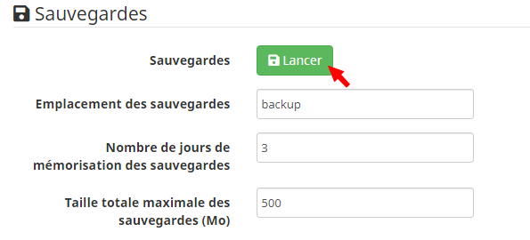
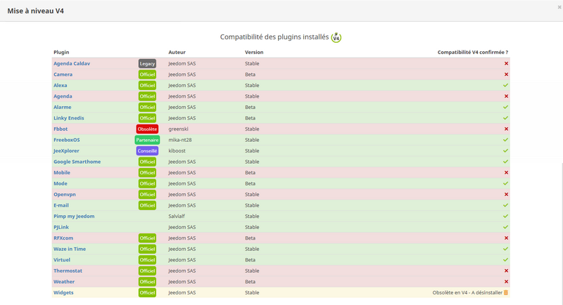
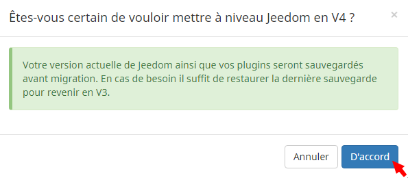

# )

. .

## 

.

### 

.

 ****,  ****  :    

 ****  **** :    

 **** :    

.  **** :    

 :      
``***************Fin de la sauvegarde de Jeedom*************** [END BACKUP SUCCESS]``

.

### 

. . .

 ****,  **** .  **** :    

.

## 

.

. ****.  ****,  ****.

 ****  :    

### 

 :

-  :    

>****
>
> ``Debian Stretch 9.X`` *(``Debian 8.X Jessie`` )*. .

-  :    

> ****    
>
>. .

### 

 **** .

> ****   
>
> **** . .

.
 **** :    

.

> ****    
>
>. .

 ***. *** :    

 *()* .
