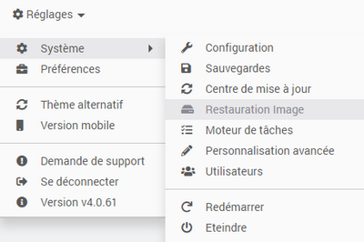
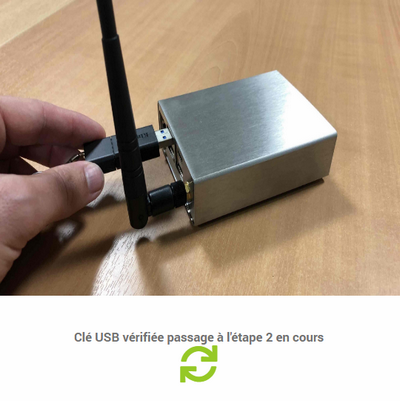
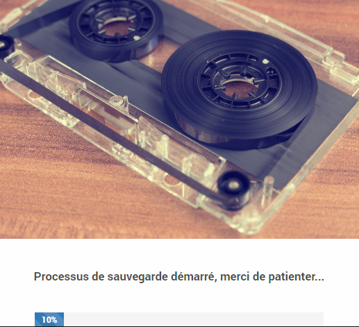
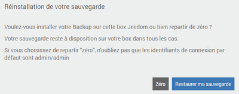

# Aktualisieren Sie die Debian-Umgebung eines Smart

Wir werden das Verfahren von detailliert beschreiben **Migration der Debian-Umgebung der Smart Box** Damit Sie sich vor dem Üben einen Überblick über die verschiedenen Schritte verschaffen können. Beachten Sie, dass alle Schritte im Verlauf der Migration auch auf dem Bildschirm erläutert werden.

## Voraussetzungen

Die Migration der Debian-Umgebung und des Smart-Kernels ist ein langer und komplexer Prozess. Daher müssen vor dem Start des Vorgangs einige wesentliche Voraussetzungen berücksichtigt werden.

Es ist insbesondere notwendig :

- Leistung **Bleiben Sie auf der Migrationsseite** während des gesamten Prozesses *(es dauert ungefähr 1h30)*,
- vorbereiten [ein USB-Stick formatiert **FAT32**](https://fr.wikihow.com/formater-en-FAT32){:target = "\_ blank"} und haben **mehr als 8 GB freier Speicherplatz**,
- auf der sein **gleiches lokales Netzwerk** als die Smart-Box und greifen Sie von seiner **interne Adresse**.

>**Wichtig**
>
>Wie üblich wird dringend empfohlen, a **Letzte Sicherung** deines Jeedom vorher.

## Migration

### Migration einleiten

Sie haben die Möglichkeit, den Migrationsvorgang auf zwei Arten zu starten :

- Zum Menü gehen **Einstellungen → System → Image-Wiederherstellung** :     

- Durch die Einladung zum **Update Center** wenn nötig :     

### Stufe 1

Der erste Schritt bei der Migration besteht darin, die Hardware vorzubereiten und zu überprüfen. Die zuvor genannten Voraussetzungen werden in einem Popup-Fenster abgerufen und Sie werden aufgefordert, einen USB-Stick einzustecken *(in FAT32 formatiert)* mit mehr als 8 GB freiem Speicherplatz in der Smart Box.

Sobald der USB-Stick eingesteckt ist, können Sie auf den Pfeil klicken, um den Vorgang zu starten :

Wenn die Voraussetzungen überprüft sind, können wir mit Schritt 2 fortfahren :

>**Informationen**
>
>Sie müssen während des gesamten Vorgangs nicht vor dem Bildschirm bleiben. Dies erfolgt automatisch, bis Sie anbieten, ein Backup wiederherzustellen.

### Stufe 2

Im zweiten Schritt wird ein Backup Ihres Jeedom erstellt, von dem eine Kopie auf dem USB-Stick gespeichert wird. Diese Sicherung wird am Ende des Migrationsprozesses wiederhergestellt, wenn Sie dies wünschen. Bei Bedarf befindet sich die Sicherung in einem Verzeichnis mit dem Namen ``Backup`` auf dem USB-Stick.

Wir empfehlen weiterhin, dass Sie sicherstellen, dass ein aktuelles Jeedom-Backup an anderer Stelle verfügbar ist.

Die Dauer der Sicherungsphase hängt von der Größe Ihrer Installation und den implementierten Remote-Sicherungsoptionen ab. Sie haben die Möglichkeit, den Prozess zu beschleunigen, indem Sie das Senden von Market- und / oder Samba-Backups im Voraus deaktivieren.

### Stufe 3

Im dritten Schritt können Sie das Image mit der neuen Version der Debian-Umgebung herunterladen und nach dem Herunterladen die Gültigkeit überprüfen :

Dieser Schritt kann eine Weile dauern und hängt von der Geschwindigkeit Ihrer Internetverbindung sowie der Lese- / Schreibleistung des USB-Sticks ab :

### Schritt 4

Bei weitem der wichtigste Schritt, da es sich um die eigentliche Migration der Hardware handelt. Ziehen Sie in dieser Phase vor allem nicht den USB-Stick ab und unterbrechen Sie nicht die Stromversorgung des Smart !

Dieser Schritt dauert ungefähr 30 Minuten. Danach wird die Smart Box neu gestartet. Dieser erste Neustart wird wahrscheinlich einige Zeit dauern :

### Abschluss der Migration

Am Ende des Migrationsprozesses befindet sich die Smart Box nun in einer aktuellen Umgebung, jedoch mit einer jungfräulichen Jeedom. Der Abschluss des Verfahrens besteht daher entweder darin, von einer Neuinstallation auszugehen oder die im ersten Schritt generierte Sicherung wiederherzustellen :

>**Wichtig**
>
>**Stellen Sie sicher, dass Sie den USB-Stick am Ende des Vorgangs aus der Smart Box entfernen.**

Herzliche Glückwünsche, **Ihre Smart Box ist jetzt auf dem neuesten Stand und betriebsbereit** !

## Häufig gestellte Fragen

>**Der Migrationsprozess findet korrekt statt, jedoch scheint nach dem Neustart der Box keine Änderung stattgefunden zu haben ?**    
>Dies bedeutet, dass der verwendete USB-Stick vom Migrationstool nicht korrekt erkannt wird. Bitte wiederholen Sie den Vorgang mit einem anderen USB-Stick oder [Partitionieren Sie Ihren USB-Stick neu](https://fr.wikihow.com/partitionner-une-cl%C3%A9-USB){:target = "\_ blank"} kümmert sich darum **Erstellen Sie nur eine Partition** *(Einzelne Partition)*.

>**Ich kann mich nach der Migration der Umgebung nicht mehr bei Jeedom authentifizieren.**    
>Jeedom wurde nach dem Debian-Umgebungsupdate neu installiert. Solange Sie kein Backup wiederhergestellt oder keinen neuen Benutzer erstellt haben, sind die Standardanmeldeinformationen ***admin / admin***.

>**Meine Box ist nach der Migration der Umgebung nicht mehr erreichbar.**    
>Überprüfen Sie das Vorhandensein und die IP-Adresse der Jeedom-Box über die Schnittstelle Ihres Routers, falls die IP-Adresse geändert wurde.

>**Einige Plugins funktionieren nach der Migration nicht mehr.**    
>Stellen Sie sicher, dass Sie Abhängigkeiten für Plugins neu installiert haben, für die sie erforderlich sind *(Konsultieren Sie die Plugin-Konfigurationsseite)*.
