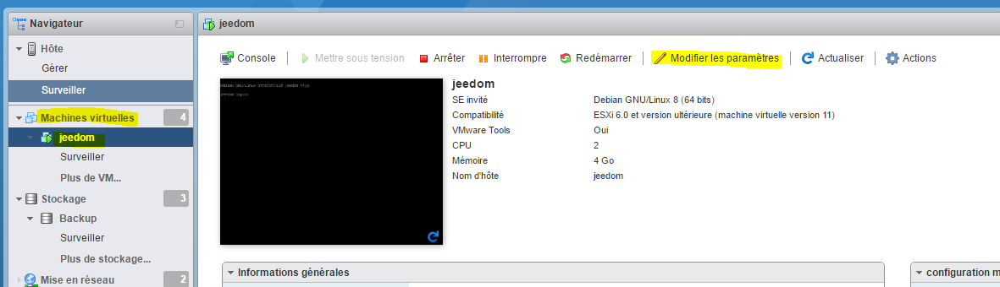
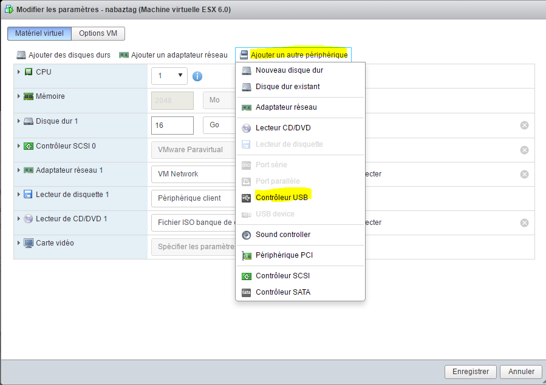

# Erstellen Sie eine VM unter VMware

Wir werden hier sehen, wie Sie eine VM unter VMware erstellen.

Es gibt etwas Wichtiges über VMware zu wissen: Es gibt zwei Möglichkeiten, es zu verwalten :

-   die Weboberfläche (standardmäßig in 6 vorhanden.0 Update 2 oder über ein Vib für die anderen Versionen) wird über IP\_ESXI / ui darauf zugegriffen
-   der schwere und historische Client von VMware (vSphere-Client)

Hier werde ich hauptsächlich die Weboberfläche verwenden, weil ich denke, dass es die Zukunft von VMware ist, die zunehmend auf den Heavy-Client verzichtet (eigentlich alle neuen Funktionen seit 5.1 kann nicht mit dem Thick Client verwendet werden).

Beachten Sie auch, dass die Weboberfläche bei VMware noch implementiert wird. Tatsächlich werden Sie sicherlich auf einige Fehler oder Verlangsamungen stoßen, aber nach einer kleinen Aktualisierung der Seite wird sie ohne Probleme wieder gestartet.

# Verbindung zum Webinterface

Gehen Sie mit Ihrem Internetbrowser zu IP\_ESXI / ui :

> **Notiz**
>
> Wenn Sie nichts haben, rate ich Ihnen, die Weboberfläche zu installieren, alle Informationen [hier](https://doc.jeedom.com/de_DE/howtoadvance/vmware.trucs_et_astuces)

Geben Sie Ihre Anmeldeinformationen bei ESXI ein :

Wie Sie sehen können, ist die Benutzeroberfläche sehr schön und ermöglicht es Ihnen, viele Dinge zu tun. Ich werde nicht auf Details eingehen, aber Sie können bereits von diesem Bildschirm aus :

-   Stoppen Sie den ESXi / starten Sie ihn neu
-   Ressourcennutzung anzeigen (CPU, Speicher und Festplatte))
-   Informationen zu Ihrem System haben (Betriebszeit, Version von VMware, Version des BIOS, Anzeige von Datenspeichern)
-   Schaltfläche zum Erstellen einer VM (wir werden sie direkt danach verwenden)
-   Mit einer Aktionsschaltfläche, mit der Sie in den Wartungsmodus wechseln können (praktisch, wenn Sie einen ESXi-Cluster haben, den Sie sonst nie verwenden werden), aktivieren / deaktivieren Sie den SSH-Dienst (wird im Tutorial zur Sicherungskonfiguration verwendet)

# Installations-ISO senden

Nach dem Herunterladen Ihrer Installation ISO ([hier](https://cdimage.debian.org/cdimage/archive/11.8.0/amd64/iso-cd/debian-11.8.0-amd64-netinst.iso) zum Beispiel für Debian 11.8 in netinstall) müssen Sie es in Ihrem Datenspeicher ablegen.

Klicken Sie dazu auf Datenspeicher :

Wählen Sie Ihren Datenspeicher aus (normalerweise heißt er Datenspeicher1) :

Klicken Sie auf "Datenbankbrowser" :

Klicken Sie auf "Download" (der erste) :

Wählen Sie die zuvor heruntergeladene ISO aus und validieren Sie sie :

Sie können dann den Fortschritt der Sendung verfolgen :

Sobald Sie fertig sind, können Sie sehen, dass Ihre ISO im Datenspeicher angekommen ist :

# Erstellung Ihrer ersten VM

Klicken Sie auf die Schaltfläche "VM erstellen / speichern"" :

Klicken Sie auf Weiter :

Geben Sie dann Ihrem Computer einen Namen und geben Sie dessen Betriebssystem an (hier installieren wir einen Debian) :

Geben Sie den Zieldatenspeicher an :

Hier können Sie die Parameter Ihrer Maschine konfigurieren (Festplatte, CPU, Speicher usw.)) :

> **Notiz**
>
> Alle diese Parameter können nachträglich problemlos geändert werden. Beachten Sie jedoch, dass es nicht wirklich möglich ist, die Größe einer Festplatte zu verringern. Sie können sie vergrößern (Sie müssen jedoch wissen, wie Sie dies auf der Ebene der Festplatte verwalten). . 'OS next), aber nicht reduzieren.

Wählen Sie im CD / DVD-Laufwerk "ISO-Dateidatenbank" aus" :

Wählen Sie dann den Speicherort Ihrer ISO aus (siehe vorheriges Kapitel) und validieren Sie :

Dann mach weiter :

Sie haben dann eine Zusammenfassung Ihrer Konfiguration, klicken Sie auf "Fertig stellen"" :

Eine Meldung oben zeigt an, dass es gut ist, und klicken Sie dann auf "Virtuelle Maschinen"" :

Sie sollten sehen, dass Ihre virtuelle Maschine (falls dies nicht der Fall ist, klicken Sie auf "Aktualisieren") darauf klickt :

Sie müssen eine Seite dieses Typs haben, klicken Sie auf die Wiedergabetaste :

Ihr Computer wird gestartet und Sie können Ihr Betriebssystem installieren :

> **Wichtig**
>
> Sobald Ihr Computer installiert ist, ist es ABSOLUT erforderlich, VMware-Tools zu installieren (VMware kann Informationen über Ihre VM haben und diese ordnungsgemäß herunterfahren). Unter debian einfach "sudo apt-get -y installiere open-vm-tools".

Für den Rest der Installation lade ich Sie ein, dies zu lesen [Tutorial](https://doc.jeedom.com/de_DE/howtoadvance/debian.installation)

# Mounten Sie USB-Geräte in der VM

> **Notiz**
>
> Wenn Sie nicht über die folgenden Optionen verfügen, müssen Sie den ESXi Embedded Host Client mit allen Informationen aktualisieren [hier](https://doc.jeedom.com/de_DE/howto/doc-howto-vmware.trucs_et_astuces.html)

Es ist eine eher seltene Notwendigkeit, aber ich musste es für Jeedom verwenden, tatsächlich habe ich auf meinem ESXi die Schlüssel Zwave, RFXcom, edisio, enOcean und GSM von verbunden und ich musste sie mit meiner VM verbinden Jeedom, um es benutzen zu können.

> **Notiz**
>
> Für Zwave, RFXcom, edisio und enOcean gibt es kein Problem, für GSM-Schlüssel müssen Sie dies befolgen [Tutorial](https://doc.jeedom.com/de_DE/howtoadvance/gsm.huawei_mode_modem) vorher, um den Schlüssel nur im Modem-Modus zu erzwingen, sonst wird er auf dem ESXi nicht richtig angezeigt.

Gehen Sie zu Ihrer VM und führen Sie "Einstellungen ändern" aus" :

Klicken Sie auf "Anderes Gerät hinzufügen" und dann auf USB-Controller :

> **Notiz**
>
> Der nächste Schritt muss für jedes USB-Gerät wiederholt werden, das Sie anschließen möchten

Speichern, wiederholen Sie "Einstellungen ändern", dann "Anderes Gerät hinzufügen" und "USB-Gerät"" :

Wählen Sie Ihr USB-Gerät aus der Dropdown-Liste :

Und jetzt ist Ihr Gerät an Ihre VM angeschlossen. Bei jedem Neustart wird es automatisch wieder mit der VM verbunden. Wenn Sie es physisch trennen / verbinden, wird es wieder mit Ihrer VM verbunden. Mit anderen Worten ist die Verwendung jetzt vollständig transparent.
