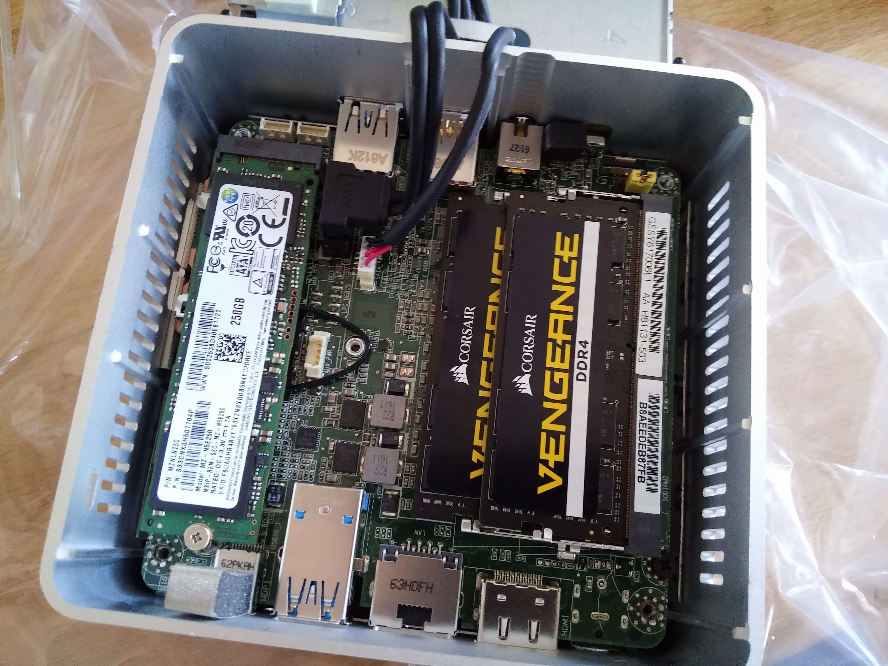
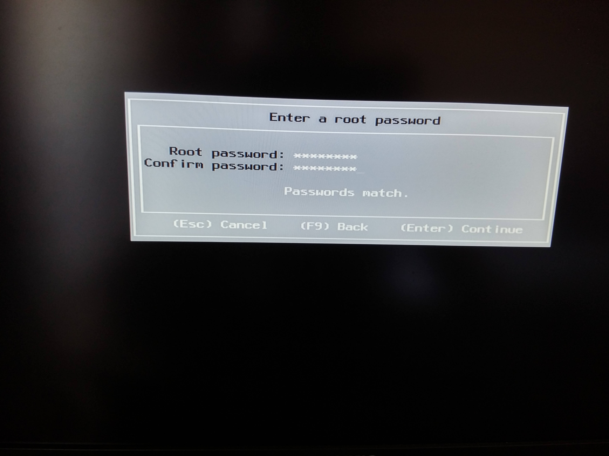

# Installierte VMware auf Nuc

Hier ist ein Tutorial zum Installieren von VMware auf einem Intel NUC (Gen6)). Wir werden später sehen, wie man Jeedom hinzufügt

# Das Material 

## Intel NUC

Der Intel NUC ist ein kleiner PC, nicht der leistungsstärkste, aber sehr energieeffizient und klein. Dies macht es zu einem perfekten kleinen Virtualisierungsserver, der auf VMware basiert.

Derzeit gibt es 2 NUCs der 6. Generation (die anderen funktionieren auch für VMware, erfordern jedoch zusätzliche Treiber im VMware-Kernel):

-   Intel Core i3-6100U (Dual-Core 2.3 GHz - - 4 Threads - Cache 3 MB - TDP 15W)
-   Intel Core i5-6260U (Dual-Core 1.8 GHz - Turbo 2.9 GHz - 4 Threads - Cache 4 MB)

Der i5 ist deutlich leistungsstärker, weil er etwas mehr Cache-Speicher und vor allem einen Turbomodus hat, der es ihm ermöglicht, die Frequenz viel höher zu legen.

Darüber hinaus gibt es zwei Arten von Fällen :

-   Ein dünnes Gehäuse, das nur eine M2-Disc enthalten kann
-   Ein dickeres Gehäuse, das eine Scheibe vom Typ M2 und eine Scheibe vom Typ 2 enthalten kann.5 Zoll

Das sind 4 Referenzen :

-   i3 M2 : [Intel NUC NUC6I3SYK](http://www.ldlc.com/fiche/PB00203086.html) 320 €
-   i3 M2 + 2.5 Zoll : [Intel NUC NUC6I3SYH](http://www.ldlc.com/fiche/PB00203148.html) 320 €
-   i5 M2 : [Intel NUC NUC6I5SYK](http://www.ldlc.com/fiche/PB00203084.html) 460 €
-   i5 M2 + 2.5 Zoll : [Intel NUC NUC6I5SYH](http://www.ldlc.com/fiche/PB00202760.html) 430 €

## SSD

Sie müssen eine SSD und einen Speicher hinzufügen. SSD-Level Ich empfehle 240 GB oder mehr, es sei denn, Sie nehmen das Modell mit einem Steckplatz 2.5 Zoll (mit denen Sie eine zusätzliche Festplatte installieren können) oder ein Synology NAS, um die iSCSI-LUN zu erstellen. Vergessen Sie nicht, dass eine Basis-VM (kein Speicher) zwischen 20 und 40 GB groß ist. Fügen Sie diese 40 GB für die VMware selbst hinzu, die schnell voll ist.

> **Wichtig**
>
> VMware unterstützt das Hinzufügen von USB-Datenträgern nicht, daher ist es schwierig, den verfügbaren Speicherplatz zu erweitern

-   [LDLC SSD M.2 2280 F6 PLUS 120 GB](http://www.ldlc.com/fiche/PB00203635.html) 55 €
-   [Samsung SSD 850 EVO 120 GB M.2](http://www.ldlc.com/fiche/PB00185923.html) 100 €
-   [LDLC SSD M.2 2280 F6 PLUS 240 GB](http://www.ldlc.com/fiche/PB00203636.html) 105 €
-   [Samsung SSD 850 EVO 250 Go M.2](http://www.ldlc.com/fiche/PB00185924.html) 120 €
-   [LDLC SSD M.2 2280 F6 PLUS 480 GB](http://www.ldlc.com/fiche/PB00207301.html) 190 €

## Speicher

Achtung für den Speicher, den Sie unbedingt für DDR4 in So-DIMM 260-Pins benötigen, benötigen Sie mindestens 4 GB für VMware, aber aus Erfahrung empfehle ich Ihnen mindestens 8 GB (persönlich bin ich sogar bis zu 16 GB, der NUC unterstützt maximal 32 GB). Dort wird kein Speicher empfohlen, der billigste geht sehr gut (Vorsicht, ich nehme immer Packungen mit 2 Riegeln, dies verbessert die Leistung) :

-   [Entscheidender SO-DIMM DDR4 8 GB (2 x 4 GB) 2133 MHz CL15 SR X8](http://www.ldlc.com/fiche/PB00204134.html) 35 €
-   [Entscheidender SO-DIMM DDR4 16 GB (2 x 8 GB) 2133 MHz CL15 DR X8](http://www.ldlc.com/fiche/PB00204135.html) 65 €
-   [Entscheidender SO-DIMM DDR4 32 GB (2 x 16 GB) 2133 MHz CL15 DR X8](http://www.ldlc.com/fiche/PB00204136.html) 120 €

# Installationsvorbereitung

Bevor wir die Installation selbst starten, müssen wir zuerst VMware wiederherstellen und auf einen USB-Stick stecken.

## VMware-Download

> **Wichtig**
>
> Wenn Sie VMware 6 setzen.5 gibt es ein Problem mit der neuen USB-Verwaltung und den Zwave-Tasten, damit dies funktioniert, ist es notwendig, dies anzuwenden [KB](https://kb.vmware.com/selfservice/microsites/search.do?language=en_US&cmd=displayKC&externalId=2147650). Achtung, diese Manipulation ist in VMware 6.7 nicht mehr durchzuführen

Ich denke, es ist das Schwierigste, dein Leben zu vereinfachen :

-   mach weiter [hier](https://my.vmware.com/en/web/vmware/evalcenter?p=free-esxi6) und registrieren
-   Warten Sie, bis die E-Mail die Registrierung bestätigt hat
-   zurück [hier](https://my.vmware.com/en/web/vmware/evalcenter?p=free-esxi6) und melden Sie sich an (möglicherweise werden Sie aufgefordert, die Bedingungen zu akzeptieren, die Sie validieren müssen)
-   dann geh [die](https://my.vmware.com/fr/web/vmware/details?productId=491&downloadGroup=ESXI60U2) und fügen Sie Ihrem Konto "ESXi ISO-Image" hinzu (einschließlich VMware Tools)"
-   endlich zurück [hier](https://my.vmware.com/en/web/vmware/evalcenter?p=free-esxi6) und dort müssen Sie in "Downlaod Packages" ein Paket "ESXi ISO-Image (einschließlich VMware Tools)" haben, das Sie herunterladen müssen

Direkt darüber haben Sie auch Ihren Lizenzschlüssel. Sie können ihn nutzen, um ihn wiederherzustellen.

## Rufus herunterladen

Dort ist es viel einfacher, nur zu klicken [die](http://rufus.akeo.ie/downloads/rufus-2.9.exe). Dann müssen Sie die .exe starten

## Erstellung des bootfähigen USB-Sticks

Auch hier ist es einfach, rufus so zu konfigurieren :

Alles was Sie tun müssen, ist auf Start zu klicken und zu warten.

# Auspacken und Zusammenbauen des NUC

Dies sind die 3 Komponenten für meinen NUC :

-   Intel NUC NUC6I5SYH
-   Samsung SSD 850 EVO 250 Go M.2
-   CORSAIR VENGEANCE SO-DIMM DDR4 16 GB (2 x 8 GB) 2400 MHz CL16

Die NUC-Box :

Eröffnung davon :

Komponenten aus der Box :

Öffnen Sie den NUC, dort ist es sehr einfach, stellen Sie ihn auf den Kopf, lösen Sie die 4 Schrauben unter den Füßen (sie kommen nicht ganz heraus, es ist normal, dass Sie sie nur lösen müssen) und ziehen Sie dann leicht an den Schrauben den NUC zu öffnen:

Die installierte SSD (links), die Endschraube zum Blockieren ist etwas schmerzhaft zurückzusetzen, zum Glück machen wir das nur einmal

Speicherinstallation (rechts) :

Und jetzt können Sie schließen (es sei denn, Sie haben natürlich eine SSD 2 genommen.5 Zoll, die in diesem Fall in die Abdeckung eingesetzt werden müssen).

# VMware-Installation

Dort ist es sehr einfach, stecken Sie einfach den USB-Stick in einen der USB-Anschlüsse des NUC, schließen Sie einen Bildschirm an den HDMI-Anschluss, eine Tastatur und das Netzteil an. Wenn Sie den NUC einschalten, wird die Installation von selbst gestartet :

> **Notiz**
>
> Ich habe vergessen, die Validierung der Lizenz zu erfassen. Sie müssen nur zustimmen, indem Sie den Anweisungen folgen

Wählen Sie hier die der SSD entsprechende Festplatte aus (Sie können sie entweder nach Name oder nach Größe suchen)

Wählen Sie "Französisch" :

Geben Sie ein Passwort ein. Am Anfang rate ich Ihnen, eine einfache Sache wie "oooo" einzugeben (wir werden es später ändern) :

Bestätigen Sie mit F11 :

Die Installation dauert 10 bis 20 Minuten. Anschließend müssen Sie den USB-Stick entfernen und auf den Neustart des Systems warten

Sobald der Neustart abgeschlossen ist, sollten Sie haben :

Hier ist VMware installiert (außerdem ist es schön, dass es Ihnen seine IP gibt), mehr als zum Spielen !!!

Für den Rest ist hier ein [Tutorial](https://doc.jeedom.com/de_DE/howto/doc-howto-vmware.creer_une_vm.html) für die Erstellung Ihrer ersten VM. Und du wirst finden [hier](https://doc.jeedom.com/de_DE/howto/doc-howto-vmware.trucs_et_astuces.html) Ein Tutorial mit Tipps und Tricks (zum Beispiel zum Aktualisieren Ihrer VMware-Lizenz)
