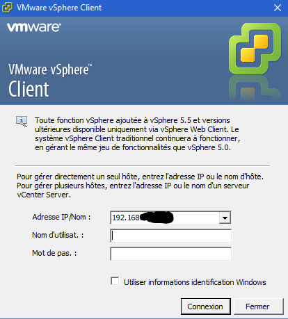
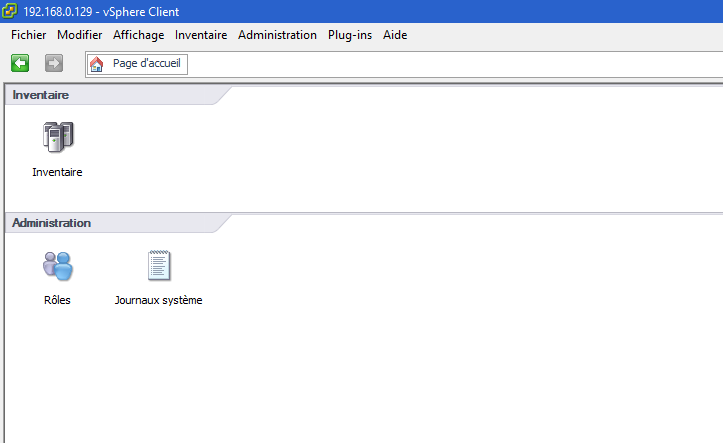

# VMware-Tipps und Trick

Nicht wirklich eine Anleitung hier, sondern eher eine Sammlung von Tipps und Tricks zu VMware

# Fügen Sie Ihre Lizenz hinzu

Einmal über die Weboberfläche verbunden ``IP_ESXI/ui`` Gehen Sie zu "Verwalten"" :

Klicken Sie dann auf "Lizenzierung" und klicken Sie auf "Lizenz zuweisen""

Und geben Sie Ihren Lizenzschlüssel ein

> **Notiz**
>
> Wenn Sie dies nicht tun, funktioniert Ihr ESXi nach 60 Tagen möglicherweise nicht mehr

# Mounten Sie einen NFS-Datenspeicher mit Synology

Hier erfahren Sie, wie Sie eine NFS-Freigabe von einer Synology auf VMware bereitstellen. Dies ermöglicht beispielsweise das Platzieren der virtuellen Maschinen in der Synology (die mehr Speicherplatz als das ESXi haben kann) oder das Senden der Sicherungen der Maschinen in der Synology

## Synologiekonfiguration

Sie müssen zur Systemsteuerung und dann zu "Dateidienste" gehen und das Kontrollkästchen "NFS aktivieren" aktivieren" :

Klicken Sie dann auf "Freigegebener Ordner", wählen Sie den freizugebenden Ordner aus (hier Backup), klicken Sie auf Ändern, dann auf "NFS-Autorisierung" und schließlich auf Erstellen (hier habe ich bereits einen, Ihre Liste sollte leer sein) :

Dann geben Sie die IP Ihres ESXi ein und in "Squash" setzen Sie "Mapping aller Benutzer auf admin", dann validieren Sie :

Wir müssen dann den Freigabepfad wiederherstellen (hier ``/volume2/Backup``) :

Hier ist es auf der Synology-Seite fertig, wir werden jetzt auf die ESXi-Seite wechseln

## ESXi-Konfiguration

Gehen Sie zu "Speicher" :

Klicken Sie dann auf "Neue Datenbank" :

Dort wählen Sie "NFS-Datenbank bereitstellen" und gehen dann wie folgt vor :

Geben Sie den Namen des zu erstellenden Datenspeichers ein (achten Sie darauf, Leerzeichen und Sonderzeichen zu vermeiden), geben Sie die IP unserer Synology ein und geben Sie den Freigabepfad ein (siehe oben) und validieren Sie schließlich :

Klicken Sie auf Fertig stellen :

Und jetzt sollte Ihr neuer Datenspeicher angezeigt werden (andernfalls klicken Sie auf "Aktualisieren"").

# VAAI Synology Plugin für die NFS-Montage hinzugefügt

Durch Hinzufügen dieses Plugins wird die Hardwarebeschleunigung auf NFS-Mounts aktiviert (eine Erläuterung finden Sie unter [hier](http://www.virtual-sddc.ovh/exploiter-les-vaai-nfs-avec-un-nas-synology/))

Um zu sehen, ob Sie es haben, müssen Sie sich mit dem Thick Client verbinden (ich habe die Informationen auf dem Web Client nicht gefunden) und zu Konfiguration → Speicher gehen :

Die Implementierung ist recht einfach: Zuerst müssen Sie den SSH-Dienst des ESXi aktivieren (auf der Weboberfläche müssen Sie zu Aktion ⇒ Dienste ⇒ Secure Shell aktivieren) und dann in SSH oben eine Verbindung herstellen (die Bezeichner sind das gleiche wie für den Zugriff auf die Schnittstelle). Dann musst du nur noch tun :

``esxcli software vib install -v https://global.download.synology.com/download/Tools/NFSVAAIPlugin/1.0-0001/VMware_ESXi/esx-nfsplugin.vib -f``

Sie müssen haben :

Sie müssen dann ESXi neu starten, um zu überprüfen, ob es in Ordnung ist. Anschließend müssen Sie mit dem Thick Client zu Konfiguration → Speicher zurückkehren :

# Installieren / Aktualisieren Sie den ESXi Embedded Host Client

ESXi Embedded Host Client ist eine Webschnittstelle (in HTML5) von ESXi, mit der in 95% der Fälle auf den Heavy Client verzichtet werden kann. Es ist standardmäßig in Version 6 vorhanden.0 Update 2, aber in Version 1.0, es wird dringend empfohlen, es zu aktualisieren.

Hier finden Sie alle Informationen
[hier](https://labs.vmware.com/flings/esxi-embedded-host-client)

Um zu sehen, ob Sie über die Weboberfläche verfügen, rufen Sie einfach Ihren Browser mit auf ``IP_ESXI/ui`` Wenn Sie nichts haben, müssen Sie es installieren, müssen Sie zuerst eine Verbindung in SSH auf dem ESXI herstellen und dann tun :

``esxcli software vib install -v http://download3.vmware.com/software/vmw-tools/esxui/esxui-signed-latest.vib``

Wenn Sie es bereits haben, müssen Sie es tun, um es zu aktualisieren :

``esxcli software vib update -v http://download3.vmware.com/software/vmw-tools/esxui/esxui-signed-latest.vib``

# Installation des Thick Clients

Dieser Teil ist optional, wenn Sie den USB nicht verwalten müssen.

Sie müssen mit Ihrem Internetbrowser zur IP des ESXi gehen und dann auf den Link klicken ``Download vSphere Client for Windows`` :

Nach dem Herunterladen müssen Sie nur noch die Installation starten (ich gebe diesen Teil freiwillig weiter, da er ausreicht, um alles zu validieren).

Starten Sie dann VMware vSphere Client, den Sie haben sollten :

Sie müssen nur die IP Ihres ESXi, den Benutzernamen und das Passwort eingeben und sind damit verbunden :

# ESXi-Update

Das Verfahren ist recht einfach. Sie müssen den Patch zuerst wiederherstellen, indem Sie fortfahren [hier](https://my.vmware.com/group/vmware/patch#search) (Sie müssen sich wahrscheinlich mit Ihrem VMware-Konto anmelden). Auf der Liste ``Select a Product`` stellen ``ESXi (Embedded and Installable)``, Im Gegenteil, lassen Sie die neueste Version von VMware und tun Sie dies ``Search``. Laden Sie dann den gewünschten Patch herunter (normalerweise den letzten). Die Build-Nummer (die erste Nummer, die nicht mit KB beginnt) gibt Ihnen die Version des Patches, die Sie mit Ihrer Build-Nummer vergleichen können.

Übertragen Sie dann die Zip in einen Ihrer Datenspeicher und machen Sie :

``esxcli software vib update -d /vmfs/volumes/576c8ab3-fdf64d2f-091b-b8aeedeb87fb/ESXi600-201605001.zip``

> **Notiz**
>
> Ersetzen Sie den Pfad und den Namen der Postleitzahl gemäß Ihrer Konfiguration

> **Wichtig**
>
> Achten Sie darauf, den vollständigen Pfad zum Reißverschluss anzugeben, da dies sonst nicht funktioniert

Der obige Befehl aktualisiert nur die Vibes, die ihn benötigen. Sie können jedoch die Installation aller Vibes im Paket erzwingen (achten Sie also darauf, dass dies herabgestuft werden kann) :

``esxcli software vib install -d /vmfs/volumes/576c8ab3-fdf64d2f-091b-b8aeedeb87fb/ESXi600-201605001.zip``

# NTP-Konfiguration

Standardmäßig verwendet das ESXi kein NTP, was bedeutet, dass es nicht pünktlich ist und dass VMs nicht pünktlich sind. Die Korrektur ist sehr einfach. Sie müssen von der Webversion zu Verwalten → System → Datum und Uhrzeit wechseln und dort auf "Einstellungen ändern" klicken" :

Und in das Feld "NTP-Server" müssen Sie setzen : ``0.debian.pool.n, 1.debian.pool.n, 2.debian.pool.n, 3.debian.pool.n, time.nist.gov``

Klicken Sie dann unter Aktionen → NTP-Dienst → Strategie auf "Mit dem Host starten und stoppen"" :

Klicken Sie weiterhin unter Aktionen → NTP-Dienst auf "Start""

Dies ist Ihr ESXi sollte sich jetzt die Zeit alleine nehmen.

# Externer Zugriff auf das ESXi

Um von außen auf das ESXi zugreifen zu können, benötigen Sie :

-   Öffnen Sie den Port 443 für ESXi 443
-   Öffnen Sie den Port 902 zum ESXi 902

Und das war's. Kleiner Tipp, wenn Sie ein Synology NAS haben, das Sie tun können (seien Sie vorsichtig, um zu folgen) :

-   Öffnen Sie 443 bis 5001 auf Synology NAS
-   Öffnen Sie die 80 in Richtung der 80 des NAS (nützlich, nur um die Zertifikate zu generieren, die wir verschlüsseln möchten)
-   Öffnen Sie den Port 902 zum ESXi 902

Dann auf dem NAS im Control Panel dann Anwendungsportal und Reverse Proxy (Achtung DSM 6 unbedingt erforderlich) :

Klicken Sie auf Erstellen und setzen :

In "Hostname" (auf Quellenebene) müssen Sie das gewünschte DNS eingeben (z. B. monesxi.mondsn.synology.Ich) und in "Hostname" (am Ziel) müssen Sie die IP des ESXi eingeben

> **Notiz**
>
> Sie können auch das Gleiche tun, um auf jeedom zuzugreifen, diesmal jedoch die jeedom-IP (der VM, wenn Sie virtualisiert sind) und Port 80 eingeben

> **Notiz**
>
> Sobald Sie dies getan haben und Ihr DNS korrekt auf den NAS verweist, können Sie mit Let's encrypt kostenlos ein gültiges SSL-Zertifikat erstellen, indem Sie zu Secrity ⇒ certificate gehen und hinzugefügt haben. Vergessen Sie dann nicht, auf Konfigurieren zu klicken, um es Ihrem Reverse-Proxy zuzuweisen

Um dann auf Ihr ESXi zuzugreifen, müssen Sie nur mit Ihrem Browser zu Ihrem externen DNS oder Ihrer IP-Adresse wechseln, indem Sie am Ende / ui hinzufügen, und es ist gut.

> **Wichtig**
>
> Wenn Sie den NAS-Reverse-Proxy verwenden, funktioniert die Konsole im VM-Webmodus nicht (da sie über den Websocket ausgeführt wird). Wenn Sie jedoch die VMware Remote Console verwenden, sollte alles in Ordnung sein (über Port 902))

> **Notiz**
>
> Es gibt auch eine Vmware Watchlist-Anwendung auf Android, mit der Sie auf ESXi sowie auf die Konsolen der VMs zugreifen können

# SSL-Zertifikat

Es ist möglich, die VMware-Zertifikate direkt in Ihren PC zu importieren, um die Warnung nicht mehr zu erhalten.

Damit ist es notwendig :

-   Haben Sie eine URL (DNS), um auf Ihre Esxi zuzugreifen, hier nehmen wir ``esxi1.lan``
-   Konfigurieren Sie den Namen Ihres ESXI in ssh oben : ``esxcli system hostname set --host=esxi1``
-   Konfigurieren Sie die fqdn : ``esxcli system hostname set --fqdn=esxi1.lan``
-   Rufen Sie das Stammzertifikat von esxi ab, in dem es sich befindet ``/etc/vmware/ssl/castore.pem``

Klicken Sie mit der rechten Maustaste auf den Computer, installieren Sie das Zertifikat und legen Sie es in "Trusted Root Certification Authority" ab"
