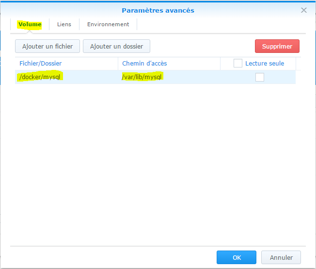

Hardware
========

Jeedom kann auf verschiedenen Hardwarekomponenten installiert werden :

-   ein Himbeer-Pi 2 oder 3
-   Synologie NAS
-   jedes Linux-System basierend auf Debian 9 (Stretch)
-   Freebox Delta

Sie können auch eine vorgefertigte Box mit vorinstalliertem Jeedom kaufen, die auch ein Service Pack (mehr Support und Services) und angebotene Plugins enthält :

-   [Jeedom Smart Z-Wave +](https://www.domadoo.fr/fr/box-domotique/3959-jeedom-controleur-domotique-jeedom-smart-z-wave.html)

-   [Jeedom Smart Z-Wave + und RFXCOM](https://www.domadoo.fr/fr/box-domotique/4043-jeedom-controleur-domotique-jeedom-smart-z-wave-et-interface-rfxcom.html)

-   [Jeedom Smart EnOcean](https://www.domadoo.fr/fr/box-domotique/4041-jeedom-controleur-domotique-jeedom-smart-enocean.html)

-   [Jeedom Smart EnOcean und RFXCOM](https://www.domadoo.fr/fr/box-domotique/4044-jeedom-controleur-domotique-jeedom-smart-enocean-et-interface-rfxcom.html)

Hier ist eine "typische" Konfiguration für den Einstieg in Jeedom in Z-Wave :

1. Himbeer pi 3 :

    -   Eine Himbeere + Box 50 €
    -   Ein Aeon Gen Schlüssel 5 € 60
    -   Eine Micro-SD-Karte 7 €
    -   Ein USB-Tu es nichttzteil 8 €

Insgesamt 125 € für eine Open Source-Hausautomationsbox mit vollständiger Kontrolle über deren Installation.

> **Spitze**
>
> Es ist möglich, eine Rfxcom-Antenne oder einen enOcean-Schlüssel hinzuzufügen oder zu ändern.

> **Spitze**
>
> Jeedom ist eine Software, die Open Source ist und bleiben wird. Ihre Verwendung ist völlig kostenlos und hängt nicht von einer Cloud oder einem Abonnement ab. Einige Plugins, die die Kapazität von Jeedom oder dessen Verwendung erhöhen, können jedoch kostenpflichtig sein **und benötigen möglicherweise eine Internetverbindung**. Sie finden die Liste der Plugins [hier](http://market.jeedom.fr/index.php?v=d&p=market&type=plugin).

> **Spitze**
>
> Service Pack ? Quézako ? Sie können sehen [hier](https://blog.jeedom.fr/?p=1215) die Vorteile von Service Packs.


Jeedom Smart
===========

Hier finden Sie eine schrittweise Dokumentation zum Installieren oder Wiederherstellen von Jeedom

[hier](https://doc.jeedom.com/de_DE/howto/recovery_mode_jeedom_smart)

Jeedom mini +
===========

> **Spitze**
>
> Der Name des Jeedom-Bildes kann sich von dem der in dieser Dokumentation vorgenommenen Aufnahmen unterscheiden

Stufe 1 : Etcher Installation
---

Sie müssen die Etcher-Software herunterladen [hier](https://etcher.io/) Installieren Sie es dann auf Ihrem PC

Stufe 2 : Jeedom Bildwiederherstellung
---

Du musst gehen [hier](https://images.jeedom.com/jeeboard/),Stellen Sie dann im Ordner "Images" das Bild "jeedom-jeeboard - \*. rar" wieder her


Stufe 3 : Das Jeedom-Bild dekomprimieren
---

Entpacken Sie das Jeedom-Image (wenn Sie nichts zum Entpacken haben, können Sie es installieren [Winrar](http://www.clubic.com/telecharger-fiche9632-Winrar.html)) müssen Sie erhalten :


Schritt 4 : Brennen Sie das Bild auf die SD-Karte
---

Legen Sie Ihre SD-Karte in Ihren Computer ein, starten Sie die Etcher-Software, geben Sie den Pfad des Bildes und den Pfad der SD-Karte ein und klicken Sie auf "Flash"!". Die Software brennt die SD-Karte und überprüft das Brennen.

Sie müssen nur die SD-Karte in das Jeedomboard (oder Hummingboard) einlegen, das Tu es nichttzwerk und die Stromversorgung verbinden, Ihr Jeedom startet (5 Minuten) und Sie sollten es im Tu es nichttzwerk sehen.

> **Spitze**
>
> SSH-IDs sind jeedom / Mjeedom96

Im Übrigen können Sie der Dokumentation folgen [Erster Schritt mit Jeedom](https://doc.jeedom.com/de_DE/premiers-nicht/index.html)


Himbeerpi
===========

Hier finden Sie die Dokumentation zur Installation von Jeedom auf einem Himbeer-PI **mit einer SD-Karte.**

> **Wichtig**
>
> Debian 9 (Stretch) ist die offiziell unterstützte Distribution für Version 3.1.5 der Freiheit.

**1 / Laden Sie das letzte "Lite" -Bild herunter, dh ohne grafische Oberfläche** [hier](https://downloads.raspberrypi.org/raspbian_lite/images/raspbian_lite-2018-04-19/2018-04-18-raspbian-stretch-lite.zip)

**2 / Dekomprimieren Sie das Bild mit Winrar** [hier](http://www.win-rar.com)

**3 / Brennen Sie dieses Bild beispielsweise mit einem Radierer auf eine SD** [hier](https://etcher.io/)

> **Notiz**
>
> Wenn Sie Ihr Bild mit Etcher brennen, ist der Dekomprimierungsschritt nutzlos (Zip-Format wird direkt bei der Auswahl der Bilddatei erkannt)..

**4 / Aktivieren Sie den SSH-Zugriff**

> **Warnung**
>
> Aus Sicherheitsgründen ist der SSH-Zugriff für diese Distribution standardmäßig nicht mehr aktiviert. Also musst du es aktivieren.

Auf der Boot-Partition muss eine leere SSH-Datei erstellt werden (die einzige, auf die unter Windows zugegriffen werden kann)..

Klicken Sie einfach mit der rechten Maustaste : neues / Textdokument und benenne es in "ssh" um" **ohne Verlängerung**

> **Wichtig**
>
> Unter Windows müssen Sie daher im Explorer Ihre Konfiguration in Anzeige / Optionen / Ordner ändern und Suchoptionen ändern /


**5 / Starten Sie den PI**

Legen Sie Ihre SD-Karte ein, schließen Sie das Tu es nichttzwerkkabel an und schließen Sie die Stromversorgung an.

**6 / Mit SSH verbinden**

Identifizieren Sie Ihren Pi im Tu es nichttzwerk

Sie müssen die IP-Adresse Ihres PI kennen. Mehrere Lösungen :

-   Konsultieren Sie die DHCP-Konfiguration in Ihrem Router
-   Verwenden Sie einen Port-Scanner vom Typ Angyipscanner" [hier](http://angryip.org/download/#windows)

Verbindung herstellen

Verwenden Sie dann beispielsweise Kitt, um Ihre Verbindung herzustellen [Hier](http://www.putty.org/)

Geben Sie die IP-Adresse Ihres PI ein (hier 192.168.0.10) und klicken Sie auf Öffnen. Akzeptieren Sie die Standardsicherheitsmeldung, wenn Sie sich zum ersten Mal anmelden.

Melden Sie sich mit Anmeldeinformationen an **Pi / Himbeere**

> **Wichtig**
>
> Aus Sicherheitsgründen muss das Standardkennwort unbedingt geändert werden. Besonders häufig sind Fälle von Hacking, die auf der Verwendung des Standard-Login / Passwort-Paares der Himbeere basieren. (Befehl nichtswd und sudo nichtswd)

**7 / Starten Sie das Jeedom-Installationsskript**

    wget -O- https://raw.githubusercontent.com/jeedom/core/master/install/install.sh | Sudo Bash

**Das Sudo-Passwort lautet ebenfalls Himbeere**

> **Notiz**
>
> Abhängig von Ihrer Internetgeschwindigkeit kann die Installation 45 bis 90 Minuten dauern. Sie dürfen den Vorgang nicht vor dem Ende unterbrechen. Andernfalls müssen Sie den gesamten Vorgang wiederholen.

Dann gehen Sie einfach zu IP \ _MACHINE \ _JEEDOM

> **Notiz**
>
> Die Standardanmeldeinformationen sind admin / admin

> **Notiz**
>
> Die folgenden Argumente können verwendet werden : -w = Webserver-Ordner -z = Installationsabhängigkeiten z-Wave -m = gewünschtes MySQL-Root-Passwort

````
./install.sh -w /var/www/html -z -m Jeedom
````

**8 / Systemoptimierung**

Wenn Sie Ihre Raspberry for Jeedom ohne angeschlossenen Bildschirm verwenden, wird empfohlen, den minimalen Arbeitsspeicher im Videoteil mitzuführen.

Einfach einloggen **SSH** und ändern Sie die Konfigurationsdatei : `sudo nano /boot/config.txt`

Hinzufügen **und / oder** Kommentar entfernen (durch Entfernen des #) **und / oder** Bearbeiten Sie die Zeilen :

````
gpu_mem=16
disable_l2cache=0
gpu_freq=250
````

Beenden Sie durch Speichern : `CTRL+X` puis `O` puis `ENTREE`

Starten Sie Ihr RPI neu

Dann können Sie der Dokumentation folgen [Erster Schritt mit Jeedom](https://doc.jeedom.com/de_DE/premiers-nicht/index)

Freebox Delta
=============

Die Installation auf Freebox Delta Jeedom ist über das VM-System möglich.

Stufe 1 : Verbindung zum Delta
---

Sie müssen zur Konfigurationsoberfläche Ihrer Freebox Delta gehen. Klicken Sie dann auf VMs.


Stufe 2 : Stellen Sie die verschiedenen Optionen ein
---

Klicken Sie auf "VM hinzufügen""


Funktionen konfigurieren. Wir empfehlen, dass Sie 2 CPUs und das Maximum in RAM stecken.


Konfigurieren Sie Benutzer und Passwort, **Sie müssen im Speicher bleiben, nach dem sie während einer SSH-Verbindung gefragt werden**:


Stufe 3 : Installation läuft
---

Warten Sie, während das Bild heruntergeladen wird


Schritt 4 : Verbinde dich mit deinem Jeedom
---

Sie können eine Verbindung über die auf der Seite angegebene Adresse herstellen:


Denken Sie daran, der VM den USB-Anschluss des Delta zuzuweisen, wenn Sie eine Antenne verwenden möchten.

Tu es nicht **nicht** Aktivieren Sie "Bildschirm", dies ist auf dem Jeedom-Bild unbrauchbar (abgesehen von Überkonsum)..

Die IP-Adresse Ihres Jeedom im Freebox Delta steht oben unter seinem Namen.

Das Standard-Login und Passwort sind admin / admin, wenn Sie über Ihren Browser auf jeedom zugreifen.

Im Übrigen können Sie der Dokumentation folgen [Erster Schritt mit Jeedom](https://doc.jeedom.com/de_DE/premiers-nicht/index.html)

VM
==

Wenn Sie Jeedom ohne Risiko entdecken möchten, können Sie es auch auf Ihrem PC virtualisieren. Gehen Sie wie folgt vor. Sie gehen in einer VM kein Risiko ein, die Integrität Ihres PCs ist geschützt :

Stufe 1 : Laden Sie den VMware Player herunter und installieren Sie ihn
---

Sie müssen die Virtual Box-Software herunterladen [Hier](http://download.virtualbox.org/virtualbox/5.1.28/VirtualBox-5.1.28-117968-Win.exe)

Stufe 2 : Herunterladen eines Debian-Strecht-Images - netinstall
---

Laden Sie ein minimalistisches Debian 9 Stretch-Bild herunter [Hier](https://cdimage.debian.org/debian-cd/current/amd64/iso-cd/debian-9.3.0-amd64-netinst.iso)

Laden Sie das Erweiterungspaket herunter und installieren Sie es. [Hier](http://download.virtualbox.org/virtualbox/5.1.28/Oracle_VM_VirtualBox_Extension_Pack-5.1.28.vbox-extpack)

Stufe 3 : Konfigurieren der VM-Umgebung
---

Klicken Sie auf Tu es nichtu und füllen Sie die Felder wie folgt aus :


-   Klicken Sie auf Weiter und nichtsen Sie die Speichergröße an Ihr System an (1024 sind ausreichend).
-   Klicken Sie auf Weiter und erstellen Sie jetzt eine virtuelle Festplatte
-   Klicken Sie auf Erstellen und wählen Sie VDI
-   Klicken Sie auf Weiter, dynamisch zugeordnet
-   Klicken Sie auf Weiter. Wählen Sie eine Größe für den Speicherplatz (4 GB sind ausreichend).
-   Klicken Sie auf Erstellen

Schritt 4 : VM-Start
---

-   Klicken Sie auf Konfiguration
-   Speicher auswählen
-   Fügen Sie ein optisches Laufwerk hinzu
-   Wählen Sie eine Disc


-   Geben Sie das zuvor heruntergeladene Bild an
-   Wählen Sie dann Tu es nichttzwerk und im Tu es nichttzwerkzugriffsmodus "Bridge-Zugriff".


-   Klicken Sie auf OK \* Klicken Sie auf Start

Schritt 5 : Debian 9 Installation
---

Es ist klassisch ...


-   Wählen Sie Grafische Installation
-   Installieren Sie den Debian vorzugsweise ohne grafische Oberfläche, da er unbrauchbar ist. Benutzername spielt keine Rolle. In den meisten Bildschirmen müssen Sie nur die Standardauswahl überprüfen. Sie können leere Felder lassen, es wird nicht blockiert.
-   Zur Softwareauswahl :


-   Machen Sie sich für Grub keine Sorgen, der Bootsektor ist der der VM, nicht der Ihres PCs. Keine Gefahr, etwas zu zerbrechen.

Schritt 6 : Jeedom Installation
---

-   Starten Sie Ihre VM
-   Identifizieren Sie sich mit dem Benutzer und dem Kennwort, die Sie während der Installation ausgewählt haben
-   Gehen Sie root

``su``

-   Geben Sie das während der Installation festgelegte Root-Passwort ein
-   Holen Sie sich das Jeedom-Skript, machen Sie es ausführbar und starten Sie es


````
wget https://raw.githubusercontent.com/jeedom/core/master/install/install.sh
chmod +x install.sh
./install.sh
````

-   und lass es gehen ...

Schritt 7 : Jeedom starten
---

-   Um die IP-Lan-Adresse der VM zu kennen

````
ip -s -c -h a
````

Geben Sie Ihre IP-Adresse 192.168.0 ein.XX erscheint in rot. Geben Sie es einfach in Ihren Browser ein.

> **Warnung**
>
> Wenn dies nicht funktioniert, haben Sie Ihre Tu es nichttzwerkkarte nicht wie zu Beginn angegeben als Tu es nichttzwerkbrücke konfiguriert.

Dann können Sie der Dokumentation folgen [Erster Schritt mit Jeedom](https://doc.jeedom.com/de_DE/premiers-nicht/index)

Docker
======

> **Wichtig**
>
> Bitte beachten Sie, dass wir hier davon ausgehen, dass Sie mit Docker bereits vertraut sind

Um Jeedom zu entdecken, können Sie es auch in einem Docker-Container drehen :

Stufe 1 : Docker-Installation
---

Docker ist jetzt für alle aktuellen Distributionen verfügbar.
So installieren Sie es auf einer Distribution

-   Drehzahl basiert

````
yum install docker
````

-   deb basiert

````
apt-get update
apt-get install docker
apt-get install docker.io
````

Stufe 2 : Installieren eines MySQL-Images
---

> **Notiz**
>
> Sie können MySQL auch direkt auf dem Host-Computer installieren. In diesem Fall überspringen Sie diesen Schritt.

Ich benutze [dieses hier](https://hub.docker.com/_/mysql/). Um es zu installieren :

``docker pull mysql:latest``

Dann starten Sie es :

``sudo docker run --name jeedom-mysql -v / opt / jeedom / mysql:/var/lib/mysql -e MYSQL_ROOT_PASSWORD=Ihr-MySQL-Passwort -d mysql:latest``

Mit :

-   jeedom-mysql : der Name des MySQL-Containers
-   / opt / jeedom / mysql : Die Datei des Hosts, auf dem MySQL-Daten gespeichert werden müssen
-   Ihr-MySQL-Passwort : das root-Passwort der MySql-Instanz

Stufe 3 : Installieren eines Jeedom-Images
---

Image-Installation :

``docker pull jeedom/jeedom``

Starten Sie dann die :

``sudo docker run --name Jeedom-Server --link jeedom-mysql:mysql --privileged -v / dein / jeedom / Pfad:/var/www/html -e ROOT_PASSWORD=Ihr-root-Passwort -p 9080:80 -p 9022:22 jeedom/jeedom``

Mit :

-   Jeedom-Server : Jeedom Docker Name gesucht
-   / dein / jeedom / Pfad : Verzeichnis, in dem Jeedom-Daten auf dem Host abgelegt werden
-   Ihr-root-Passwort : Root-Passwort für den Zugriff auf Jeedom in SSH

Dann müssen Sie Jeedom installieren, indem Sie zu gehen : IP \ _DOCKER:9080 und geben Sie die Verbindungsinformationen zu MySQL ein :


Im Übrigen können Sie der Dokumentation folgen [Erster Schritt mit Jeedom](https://doc.jeedom.com/de_DE/premiers-nicht/index)

> **Wichtig**
>
> Für den Namen des Hosts MySql müssen Sie jeedom-mysql eingeben

Synologie
========

Hier finden Sie Schritt für Schritt die Dokumentation zur Installation von Jeedom auf einer Synologie (DSM 5).2 Minimum).

Stufe 1 : Docker-Installation
================================

Gehen Sie zum Paketcenter :


Klicken Sie auf alle und installieren Sie das Docker-Paket


Warten Sie, bis die Installation abgeschlossen ist :


> **Wichtig**
>
> Um auf das Docker-Paket zugreifen zu können, benötigen Sie DSM 5.2 und ein kompatibles NAS

Stufe 2 : Wiederherstellung und Installation von Jeedom-Images
========================================================

Sie benötigen Docker, um Jeedom auszuführen, das erste Docker Mysql, das die Datenbank enthält, und ein zweites, das Jeedom enthält

Starten Sie die Docker-Anwendung :


MYSQL
-----

Klicken Sie auf "Registrieren"" :


Wählen Sie im Suchfeld "mysql" mysql aus und klicken Sie auf Download :


Überprüfen Sie anschließend die Versionsanforderung. Tu es nichthmen Sie am besten die neueste Version :


Klicken Sie dann auf das Bild. Hier können Sie den Fortschritt des Downloads verfolgen (kann einige zehn Minuten dauern). :


Wenn Sie fertig sind, klicken Sie auf das Bild und starten Sie es :


Geben Sie Ihrer MySQL einen Namen sowie einen lokalen Port, der an Port 3306 des Containers umgeleitet wird, und führen Sie dann die folgenden Schritte aus :


Mach es als nächstes :


Klicken Sie auf "Erweiterte Einstellungen"" :



Legen Sie dann unter "Ordner hinzufügen" den gewünschten Ordner auf der Synologieseite ab (in diesem Ordner befinden sich alle Dateien der Datenbank) und / var / lib / mysql auf der Containerseite (seien Sie vorsichtig mit Deaktivieren Sie "Schreibgeschützt".


Klicken Sie auf "Umgebung", dann auf "Variable hinzufügen" und geben Sie "Variable" ein" : "MYSQL \ _ROOT \ _PASSWORD "und geben Sie als Wert das gewünschte BDD-Passwort ein (es wird später verwendet). Dann validieren :


Aktivieren Sie "Diesen Container ausführen, wenn der Assistent fertig ist" und klicken Sie auf "Übernehmen"".

Jeedom
------

Klicken Sie auf "Registrieren"" :


Geben Sie im Suchfeld "jeedom" ein, wählen Sie jeedom / jeedom und klicken Sie auf Download :


Überprüfen Sie dann die Versionsanforderung. Am besten nehmen Sie die letzte.

Klicken Sie dann auf das Bild. Hier können Sie den Fortschritt des Downloads verfolgen (kann einige zehn Minuten dauern). :


Wenn Sie fertig sind, klicken Sie auf das Bild und starten Sie es :


Geben Sie Ihrem Jeedom einen Namen sowie einen lokalen Port, der auf Port 80 (hier 9080) und einen auf 22 (hier 9022) des Containers umgeleitet wird, und führen Sie dann die folgenden Schritte aus :


Mach es als nächstes :


Klicken Sie auf "Erweiterte Einstellungen""


Dann auf "Ordner hinzufügen"


Wählen Sie einen Ordner in Ihrer Synologie (in diesem Ordner befinden sich alle Jeedom-Dateien). Deaktivieren Sie das Kontrollkästchen "Schreibgeschützt""


Geben Sie im Pfad / var / www / html ein und klicken Sie auf "Umgebung"" :


Aktivieren Sie "Container mit erhöhten Berechtigungen ausführen" und überprüfen Sie alles :


Aktivieren Sie "Diesen Container ausführen, wenn der Assistent fertig ist" und klicken Sie auf "Übernehmen"".

> **Erweiterte Konfigurationseinstellung**
>
> Es gibt 3 optionale Konfigurationsparameter. Diese Parameter müssen als Umgebungsvariable übergeben werden
> - APACHE_PORT : Ermöglicht das Ändern des Standardports (80) zum Abhören des Webservers
> - SSH_PORT : ermöglicht das Ändern des Standardports (22) für das Abhören von ssh
> - MODE_HOST : zeigt an, dass sich das Tu es nichttzwerk im Host-Modus befindet

> **Wichtig**
>
> Für bestimmte Plugins muss das Tu es nichttzwerk gesendet werden (Xioami-Plugin-Typ). Dazu müssen Sie ABSOLUT im Host-Modus zum Tu es nichttzwerk wechseln (nur während der Erstellung möglich), den Standard-Listening-Port des Webservers ändern und ssh über nicht verwendete Ports (geben Sie 9080 für den Webserver und 9022 für den ssh ein) und setzen Sie die Variable MODE_HOST auf 1

Stufe 3 : Jeedom Konfiguration
---

Jetzt müssen Sie Jeedom installieren, es ist sehr einfach, gehen Sie zu IP \ _NAS:9080


Füllen Sie die Felder entsprechend Ihrer Konfiguration aus (Konfiguration der zuvor installierten Docker-MySQL) und validieren Sie sie.

> **Wichtig**
>
> Die IP-Adresse des BDD ist die IP-Adresse des NAS, der Port ist der vom Docker Mysql umgeleitete, das Kennwort ist das im Docker Mysql eingegebene. Benutzername ist root und Basisname ist was immer Sie wollen (Jeedom empfohlen)


> **Spitze**
>
> Wenn Sie SSH-Zugriff wünschen, müssen Sie in Ports einen lokalen Port zu Port 22 des Containers umleiten. Die SSH-Kennungen sind root / jeedom. Sie können das Kennwort ändern, indem Sie die Umgebungsvariable ROOT \ _PASSWORD auf den Wert des gewünschten Kennworts setzen.

Dann können Sie der Dokumentation folgen [Erster Schritt mit Jeedom](https://doc.jeedom.com/de_DE/premiers-nicht/index)

Andere
======

Hier finden Sie die Dokumentation zur Installation von Jeedom auf den meisten Linux-Systemen (getestet und genehmigt in der Debian-Distribution).

> **Wichtig**
>
> Debian 9 (Stretch) ist die offiziell unterstützte Distribution für Version 3.1.7 von Jeedom (aber Jessie bleibt perfekt funktionsfähig). Wenn Sie Linux-Umgebungen nicht mindestens beherrschen, empfehlen wir Ihnen, ein offizielles Image (OVF) oder die Verwendung eines Mini + oder Smart (in Kürze verfügbar) zu verwenden..

> **Wichtig**
>
> Das Installationsskript kann gefährlich sein, da davon ausgegangen wird, dass Ihr System leer ist. Wenn nicht, lesen Sie bitte das Skript und installieren Sie es von Hand..

Stellen Sie in SSH eine Verbindung zu Ihrem System her und tun Sie dies :

````
wget https://raw.githubusercontent.com/jeedom/core/master/install/install.sh
chmod +x install.sh
./install.sh
````

Gehen Sie dann einfach von Ihrem Internetbrowser zu IP \ _MACHINE \ _JEEDOM.

> **Notiz**
>
> Die Standardanmeldeinformationen sind admin / admin

> **Notiz**
>
> Die folgenden Argumente können verwendet werden : -w = Webserver-Ordner -z = Installationsabhängigkeiten z-Wave -m = gewünschtes MySQL-Root-Passwort

````
./install.sh -w /var/www/html -z -m Jeedom
````

Dann können Sie der Dokumentation folgen [Erster Schritt mit Jeedom](https://doc.jeedom.com/de_DE/premiers-nicht/index).
