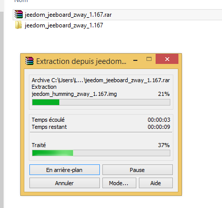

# Jeeodm Installation auf einem Mini +

> **Spitze**
>
> Der Name des Jeedom-Bildes kann sich von dem der in dieser Dokumentation vorgenommenen Aufnahmen unterscheiden

## Etcher Installation

Sie müssen die Etcher-Software herunterladen [hier](https://etcher.io/) Installieren Sie es dann auf Ihrem PC

## Jeedom Bildwiederherstellung

Du musst gehen [hier](https://images.jeedom.com/jeeboard/),Stellen Sie dann im Ordner "Images" das Bild "jeedom-jeeboard - \*. rar" wieder her

## Das Jeedom-Bild dekomprimieren

Entpacken Sie das Jeedom-Image (wenn Sie nichts zum Entpacken haben, können Sie es installieren [Winrar](http://www.clubic.com/telecharger-fiche9632-winrar.html)) müssen Sie erhalten :

## Brennen Sie das Bild auf die SD-Karte

Legen Sie Ihre SD-Karte in Ihren Computer ein, starten Sie die Etcher-Software, geben Sie den Pfad des Bildes und den Pfad der SD-Karte ein und klicken Sie auf "Flash"!". Die Software brennt die SD-Karte und überprüft das Brennen.

Sie müssen nur die SD-Karte in das Jeedomboard (oder Hummingboard) einlegen, das Netzwerk und die Stromversorgung verbinden, Ihr Jeedom startet (5 Minuten) und Sie sollten es im Netzwerk sehen.

> **Spitze**
>
> SSH-IDs sind jeedom / Mjeedom96

Im Übrigen können Sie der Dokumentation folgen [Erster Schritt mit Jeedom](https://doc.jeedom.com/de_DE/premiers-pas/index.html)
