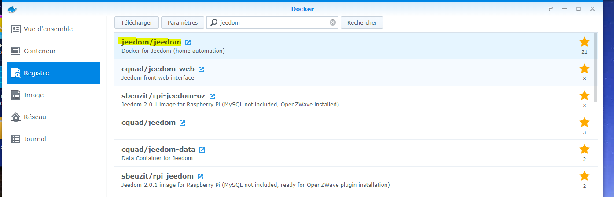
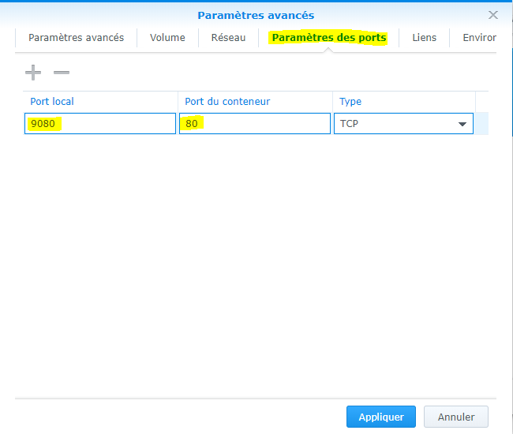

# Installation auf Synology

Hier finden Sie Schritt für Schritt die Dokumentation zur Installation von Jeedom auf einer Synology (DSM 5).2 Minimum).

## Docker-Installation

Gehen Sie zum Paketcenter :


Klicken Sie auf alle und installieren Sie das Docker-Paket


Warten Sie, bis die Installation abgeschlossen ist :


> **Wichtig**
>
> Um auf das Docker-Paket zugreifen zu können, benötigen Sie DSM 5.2 und ein kompatibles NAS

## Jeedom Bildwiederherstellung

Starten Sie die Docker-Anwendung :


Klicken Sie auf "Registrieren"" :


Geben Sie im Suchfeld „jeedom“ ein, wählen Sie jeedom/jeedom aus und klicken Sie auf „Herunterladen“ :



Bestätigen Sie dann die Versionsanforderung, am besten nehmen Sie die neueste (nehmen Sie die neueste Version).
 _Aber für einige Sybology-Modelle kann es notwendig sein, die Version *-buster_ zu wählen

Klicken Sie dann auf das Bild. Hier können Sie den Fortschritt des Downloads verfolgen (kann einige zehn Minuten dauern) :


## Containerkonfiguration

Wenn Sie fertig sind, klicken Sie auf das Bild und starten Sie es :


Geben Sie Ihrem Jeedom einen Namen, aktivieren Sie das Kontrollkästchen "Container mit erhöhten Berechtigungen ausführen", klicken Sie auf "Erweiterte Parameter" und dann auf "Portparameter umgeleitet", Port 80 (hier um 9080)) :



Fügen Sie dann auf "Volume" die folgenden 2 Volumes hinzu :


Aktivieren Sie "Container mit erhöhten Berechtigungen ausführen" und überprüfen Sie alles.

> **Wichtig**
>
> Für bestimmte Plugins ist eine Netzwerksendung erforderlich (Xioami-Plugin-Typ). Dazu müssen Sie ABSOLUT im Host-Modus zum Netzwerk wechseln (nur während der Erstellung möglich) und den Standard-Listening-Port des Webservers ändern ( Geben Sie 9080 für den Webserver ein)

> **Wichtig**
>
> Bei Fehler, wenn der Apache-Dienst nicht mit diesem Fehler in den Protokollen gestartet wird: ```function not implemented: AH00141: Could not initialize random number generator``` in diesem Fall müssen Sie das Image `jeedom/jeedom4.3-buster` verwenden.

Nach einer ersten oder längeren Startphase müssen Sie nur noch zu IP_NAS gehen:9080

Dann können Sie der Dokumentation folgen [Erster Schritt mit Jeedom](https://doc.jeedom.com/de_DE/premiers-pas/index)
