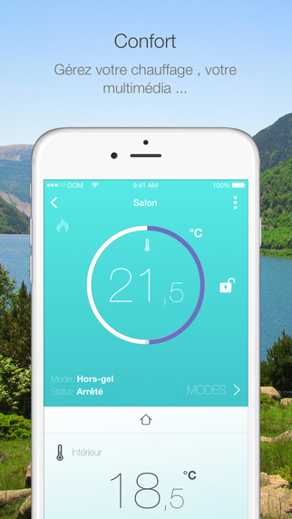
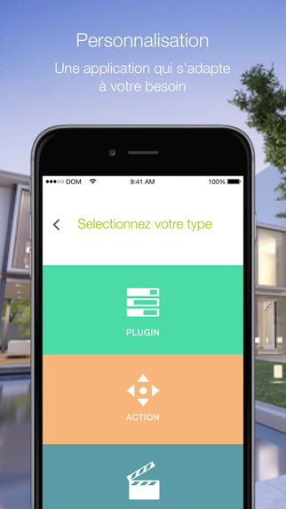

# Mobil Version

Jeedom kann auf zwei Arten auf Mobilgeräten verwendet werden.

## WebApp

Jeedom verwendet eine bestimmte Version für Handys und Tablets. Sie greifen über dieselbe Adresse in einem Browser auf Mobilgeräten (Firefox, Chrome, Safari usw.) darauf zu..

Diese angepasste Version wird aus Anzeige- und Leistungsgründen ebenfalls vereinfacht.

- Geräte : Greifen Sie nach Objekt auf das Dashboard zu. Sie können auch die Zusammenfassung anzeigen.
- Nachricht : Nachrichtenzentrum anzeigen.
- Ansichten : Greifen Sie auf Ihre Ansichten zu.
- Design : Greifen Sie auf Ihr Design oder 3D-Design zu. (Die Anzeige eines Designs erfolgt im Vollbildmodus. Klicken Sie mit drei Fingern, um zur Startseite zurückzukehren.).
- Szenario : Anzeige der Kacheln Ihrer Szenarien nach Gruppen mit der Möglichkeit zum Aktivieren / Deaktivieren, Stoppen / Starten. Durch Klicken auf den Titel des Skripts greifen Sie auf dessen Protokoll zu.
- Analyse : Greifen Sie auf die Zeitleiste, Protokolle, Geräteanalyse, Cron, Dämonen und Gesundheit zu.
- Andere : Wechseln Sie zwischen dem Haupt- und dem alternativen Thema, greifen Sie auf die Desktop-Version zu, erzwingen Sie das Update, greifen Sie auf die Dokumentation zu, über oder melden Sie sich ab.
- Plugins : Einige Plugins verfügen möglicherweise über eine dedizierte WebApp-Anzeige. Sie werden hier verfügbar sein.

> Tips
>
> Die Homepage der WebApp kann in Ihrem Jeedom unter Einstellungen → Einstellungen konfiguriert werden.

Die WebApp hat hauptsächlich eine beratende Funktion. Sie können natürlich wie in Desktop mit Ihren Geräten interagieren, aber Sie können beispielsweise kein Szenario bearbeiten, keine Geräte ändern oder auf die Konfiguration von Jeedom zugreifen.

## Jeedom App

Mit der mobilen Jeedom-Anwendung (IOS / Android-kompatibel) können Sie Ihr Jeedom-Hausautomationssystem steuern, sei es über lokales WLAN oder über das 3G / 4G-Netzwerk Ihres Betreibers. Die Anwendung stellt über einen QR-Code automatisch eine Verbindung zu Ihrem Jeedom her. Eine Konfiguration ist nicht erforderlich. Sie finden auf Ihrem Handy die Funktionalität Ihres Jeedom. (Szenarien, verbundene und Hausautomationsobjekte, Plugins). Sie können Ihre Anwendung auch mit Verknüpfungen und mehr anpassen...

	

    

