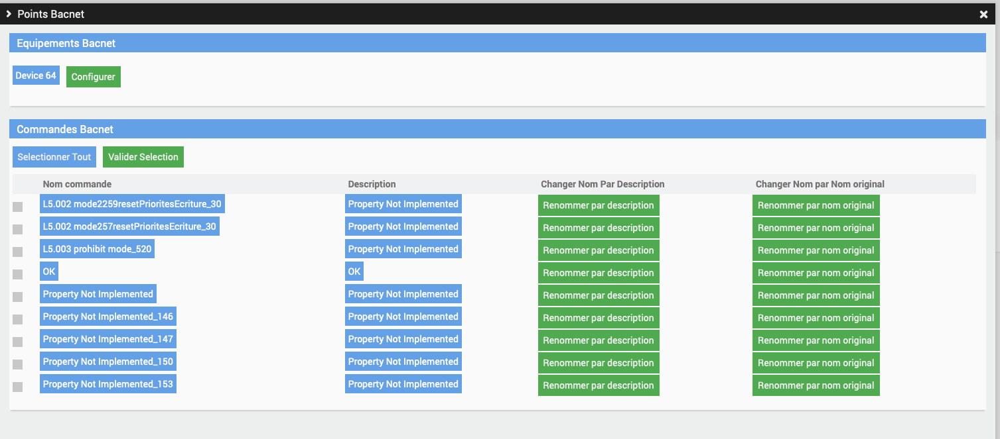

# Bacnet

#Description

Mit dem Bacnet-Plugin können Sie Informationen von Ihrem Bacnet / IP-Gerät abrufen und von Ihrem Jeedom aus damit interagieren.

# Plugin-Konfiguration

Nachdem Sie das Plugin heruntergeladen haben, müssen Sie es zuerst aktivieren, wie jedes Jeedom-Plugin :

Dann müssen Sie die Installation der Abhängigkeiten starten (auch wenn sie OK erscheinen) :

Schließlich müssen wir den Dämon starten :

Rien n'est à modifier dans le champ « Port socket interne » de la section « Configuration ».

Auf derselben Registerkarte müssen Sie den Cron-Wert zum Aktualisieren Ihrer Ausrüstung auswählen.

# So deklarieren Sie ein neues Bacnet-Gerät in Jeedom

>**WICHTIG**
>
>Ihr BACNET-Gerät muss sich im selben Netzwerk wie Ihr Jeedom befinden, um von diesem erkannt zu werden.

Rendez-vous dans le menu « Plugins → Energie → Bacnet » :

Sie gelangen auf die nächste Seite:

Vous devez donc cliquer sur l'option « Nouvel équipement / Création commandes » :

Ein automatischer Scan Ihres Netzwerks wird gestartet, um die darin vorhandenen Bacnet-Geräte zu erkennen.
Es kann ungefähr zwanzig Sekunden dauern.

Nach dem Scan wird eine Tabelle mit allen Ein-/Ausgängen Ihrer Geräte angezeigt.

Das Tabellenmenü, in dem Sie nach Spalten suchen können :

Ein Beispiel für die Erkennung von Bacnet-Geräten :

Je nach Gerätehersteller sind einige Werte nicht verfügbar;

Sie müssen lediglich die zu erstellenden Aufträge auswählen, indem Sie eine der Optionen nach Ihrer Wahl aktivieren (Befehlstyp Info oder Typ Aktion):

Bestätigen Sie, aktualisieren Sie die Seite und die entsprechende Ausrüstung wurde in Ihrem Jeedom erstellt. Standardmäßig wird es mit der vom Hersteller bereitgestellten DeviceID Ihres Bacnet-Geräts benannt (Sie können es umbenennen )

 Cliquez ensuite sur votre équipement créé, puis cocher « Activer » et « Visible » pour le voir apparaitre sur votre dashboard.

Um später Befehle zu einem vorhandenen Gerät hinzuzufügen, müssen Sie den vorherigen Vorgang wiederholen : « Nouvel équipement / Création commandes » , et sélectionnez les commandes que vous désirez.

# Die Bestellungen

Rendez-vous dans l'onglet « Commandes » de la page de configuration du nouvel équipement Bacnet.

Ici vous pouvez masquer et rendre visibles les différentes commandes de type « action » et « info » disponibles (les commandes de type « info » peuvent également être historisées) :

Alle erstellten Geräte haben standardmäßig 2 Befehle commands : une commande info « Connexion Bacnet » et une commande action « Refresh » , qui serviront à voir l'état de la connexion Bacnet sur votre dashboard, et à rafraichir les valeurs de vos commandes.

>**WICHTIG**
>
>Zum Schreiben: Aus Sicherheitsgründen bietet das Bacnet-Protokoll standardmäßig ein Schreibsystem mit Prioritätsstufen für die Ein-/Ausgänge seiner Geräte.
Es gibt 16 Prioritätsstufen (die niedrigste hat Vorrang vor allen anderen)). Ihr Gerät kann so programmiert werden, dass die in diesem Plugin entwickelte Schreibfunktion standardmäßig keinen Vorrang vor der logischen Programmierung des Geräts / Systems hat.
Für Ausgabetyp I / O ist das Plugin mit Schreibpriorität 8 konfiguriert (Manual Operator).
Mehr Infos zum Thema :

https://store.chipkin.com/articles/bacnet-why-doesnt-the-present-value-change

Für einen Schreibvorgang auf einem Bacnet-Gerät erweitern wir auf den PresentValue des entsprechenden Ein-/Ausgangs.
Sie sollten wissen, dass die PresentValues der Ein-/Ausgänge Typ: Analogausgang, Binärausgang und Multistate-Ausgang sind immer steuerbar.
Die Ein-/Ausgänge von AnalogValue, BinaryValue oder MultistateValue können bestellt werden, wenn der Hersteller diese Funktion implementiert hat. Es liegt im alleinigen Ermessen des Herstellers. Bitte schauen Sie in Ihrer Gerätedokumentation nach, um mehr darüber zu erfahren.

Beim Erstellen der ausgewählten Schreibaufträge wird auch ein zugehöriger Aktionsauftrag erstellt, der standardmäßig nicht auf dem Dashboard sichtbar ist.
Durch Anklicken wird die Schreibprioritätstabelle eines Ein-/Ausgangs auf den Standard zurückgesetzt.
Es hat einen Namen mit << resetPrioritesEcriture >>
Um diesen Befehl auf Ihrem Dashboard sichtbar zu machen, gehen Sie zu den Befehlen Ihres Geräts und aktivieren Sie das "Zeigen""

# Liste der Befehlsaktionen (für MultiStateValue)

Wenn Sie wie gewohnt aus den Scan-Ergebnissen einen Schreibbefehl erstellt haben, ist dieser je nach Art des zurückgegebenen Bacnet-Punkts (analog, binär) einfach in Slider oder On Off) : Wenn Sie nun einen MultiState auswählen, ist der Befehl standardmäßig vom Typ Slider, Sie können ihn jedoch in der Liste der Gerätebefehle auflisten; Es erscheint ein neues Feld „Werteliste“
Sie können die gewünschten Werte, getrennt durch ein -, ohne Leerzeichen eingeben : zum Beispiel 1-4-5-8
Beim Speichern der Ausrüstung werden diese Werte in die Liste der Bestellung im Dashboard übernommen
Wenn dieser Wert geändert wird, wird der Wert auf den parametrierten Punkt geschrieben.

# Schreibpriorität

    A Vorsichtig behandeln

    Für jede erstellte Bestellung ist ein Feld „Schreibpriorität“ verfügbar

    Gemäß der Dokumentation :

    In BACnet stellen Objekte, auf die wir schreiben können, häufig das sogenannte PriorityArray bereit. Dieses Array enthält 16 Ebenen, auf die wir schreiben können (1 ist die höchste Priorität)).

    Typische Verwendung von Priorität ist :

    1 Manuell – Lebenssicherheit 2 Automatisch – Lebenssicherheit 3 Verfügbar 4 Verfügbar 5 Kontrolle kritischer Geräte 6 Mindest-Ein/Aus 7 Verfügbar 8 Manueller Bediener (Override) 9 Verfügbar 10 Verfügbar (typische Steuerung durch einen Vorgesetzten) 11 Verfügbar 12 Verfügbar 13 Verfügbar 14 Verfügbar 15 Verfügbar (Zeitplan) 16 Verfügbar

    Sie können eine Schreibpriorität für die gewünschten Befehle festlegen, indem Sie eine Zahl zwischen 1 und 16 wählen

    Wenn bei einem Schreibbefehl kein Wert eingegeben wird, wird der Wert standardmäßig auf 8 gesetzt.

# Ändern Sie Befehlsnamen anhand der Beschreibung

Bei einigen Bacnet-Geräten sind Fehlercodes in der Punktbeschreibung enthalten.
In diesem Fall kann es sinnvoll sein, die Befehle zur besseren Lesbarkeit nach ihrer Beschreibung umzubenennen

Um den Standardnamen der erstellten Bestellungen zu ändern, können Sie dann zum Punkteverwaltungs-Modal gehen und die umzubenennenden Bestellungen anhand ihrer Beschreibung auswählen

Wir öffnen den Bacnet-Punkteverwaltungsmodus :

Wir sehen die Liste der bereits erstellten Eqlogics :

Wir klicken auf „Gewünschte Ausrüstung konfigurieren“ und sehen die Liste der bereits erstellten Bestellungen
Sie können die gewünschten Namen über das zugehörige Kontrollkästchen auswählen und auf „Auswahl bestätigen“ klicken, um auszuwählen, ob Sie anhand der Beschreibung umbenennen oder zum ursprünglichen Namen zurückkehren möchten

