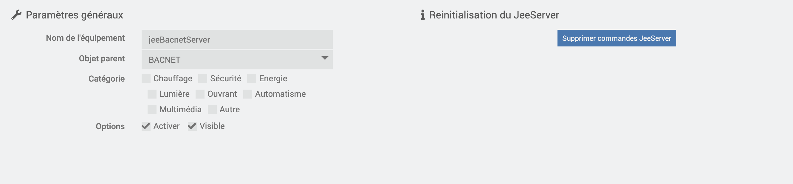

# BacnetManager

# Description

Mit dem BacnetManager-Plugin können Sie Bacnet-Geräte für Ihren Jeedom sowie dessen Jeedom-Befehle erstellen, damit sie von einem Bacnet-Supervisor im Netzwerk gesehen werden können

# Plugin-Setup

Nachdem Sie das Plugin heruntergeladen haben, müssen Sie es wie jedes Jeedom-Plugin zuerst aktivieren :

Dann müssen Sie die Installation der Abhängigkeiten starten (auch wenn sie OK erscheinen) :

Starten Sie abschließend den Daemon :

Rien n'est à modifier dans le champ « Port socket interne » de la section « Configuration ».

Auf derselben Registerkarte müssen Sie den Cron-Wert zum Aktualisieren Ihrer Ausrüstung auswählen.

# Wie das Plugin funktioniert ?

>**WICHTIG**
>
>Ihr BACNET-Gerät muss sich im selben Netzwerk wie Ihr Jeedom befinden, um von ihm erkannt zu werden.

Standardmäßig wird ein jeeBacnetManager-Gerät erstellt. Es ist dieses „Bacnet“-Gerät, das Ihr Bacnet-Supervisor im Netzwerk sehen kann

Sie können seine Geräte-ID in der Plugin-Konfiguration konfigurieren

Um Jeedom-Befehle zu Ihrem jeeBacnetManager hinzuzufügen, klicken Sie auf Befehle zum Server hinzufügen :

Es öffnet sich ein Modal, in dem alle Info-Typ-Befehle erscheinen, die in den verschiedenen Plugins Ihres Jeedoms vorhanden sind.

>**WICHTIG**
>
>Ihre Ausrüstung muss aktiv sein, damit Befehle auf diesem Modal erkannt werden.

Außerdem müssen Sie die Bestellung benennen, indem Sie das dafür vorgesehene Feld ausfüllen. 
Fügen Sie keine Leerzeichen in den Befehlsnamen ein

Alles, was Sie tun müssen, ist, nach den gewünschten zu suchen und zu validieren.

Das Bacnet-Gerät mit der von Ihnen gewählten Instanz-ID wird erstellt und in Ihrem Netzwerk angezeigt.

Um die Werte zu aktualisieren, müssen Sie den Cron in der Plugin-Konfiguration konfigurieren.

Um Befehle vom Server zu löschen, müssen Sie zu den Befehlen des Geräts gehen und einfach die gewünschten löschen und dann speichern.

Sie können das Gerät sowie seine Bacnet-Punkte auch aus dem Netzwerk löschen, indem Sie auf Delete the jeeBacnetManager klicken.

# Bestellungen einrichten :

Um die Einheit der Bacnet-Punkte zu ändern und sie im Netzwerk anzuzeigen, müssen Sie die Einheit im dafür vorgesehenen Auswahlmenü der Bedienelemente auswählen.
Jeedom-Befehle vom Typ „String“ müssen keine Einheiten auswählen.

Im Bacnet-Netzwerk verwenden die Instanzen der Punkte die Namen der Befehle, die im Feld im Modal „Zusätze von Befehlen“ angegeben sind.

Eine Nachkalkulationsfunktion ist ebenfalls vorhanden : 
Wenn Sie sich dafür entscheiden, diesen PostCalcul auszufüllen, hat der in das DeviceBacnet eingegebene Wert den Anfangswert angenommen, der mit der angegebenen Berechnung hochgeladen werden soll

Sie können zum Beispiel :

#value# * 10

Dies nimmt den Anfangswert des hochgeladenen Befehls und multipliziert ihn dann mit 10, bevor er in der jeeServer-Instanz aktualisiert wird

Beispiel :

>**WICHTIG**
>
>Sie finden alle vorhandenen Befehle auf dem jeeServer auf dem Plugin-Bildschirm, indem Sie auf Cmds JeeServer klicken

# Import/Export des jeeBacnetManagers (in Kürze erhältlich)):

Um Bedarf zu vermeiden, stehen 2 Optionen zur Verfügung : 

- Gerät exportieren :

Durch Klicken auf diese Schaltfläche wird eine JSON-Datei heruntergeladen, die die Konfiguration des Geräts sowie seine Befehle enthält.

- Gerät importieren :

Durch Klicken auf diese Schaltfläche können Sie die jeeBacnetManager-Konfigurations-json-Datei importieren, die Sie heruntergeladen hätten, um die darin konfigurierten Befehle zu verwenden

# ANNEXE:

# Liste der BACnet-Engineering-Einheiten)

| Technische Einheiten               |
|---------------------------------|
| Amperesekunden                   |
| AmpereQuadratstunden               |
| AmpereQuadratmeter              |
| Ampere                         |
| AmpereProMeter                 |
| AmpereProQuadratmeter           |
| Barren                            |
| Becquerel                      |
| BTUS                            |
| btusPerHour                     |
| btusPerPound                    |
| tusPerPoundDryAir               |
| Candela                        |
| CandelaPerQuadratmeter          |
| Zentimeter                     |
| ZentimeterMerkur            |
| ZentimeterWasser              |
| Kubikfuß                       |
| Kubikfuß pro Tag                 |
| Kubikfuß pro Stunde                |
| Kubikfuß pro Minute              |
| KubikfußPerSekunde              |
| Kubikmeter                     |
| Kubikmeter pro Tag               |
| Kubikmeter pro Stunde              |
| Kubikmeter pro Minute            |
| Kubikmeter pro Sekunde            |
| Währung1                       |
| Währung10                      |
| Währung2                       |
| Währung3                       |
| Währung4                       |
| Währung5                       |
| Währung6                       |
| Währung7                       |
| Währung8                       |
| Währung9                       |
| Zyklen pro Stunde                   |
| Zyklen pro Minute                 |
| Tage                            |
| Dezibel                        |
| DezibelA                       |
| DezibelMillivolt               |
| DezibelVolt                    |
| GradTageCelsius               |
| GradTageFahrenheit            |
| GradWinkel                  |
| Grad Celsius                  |
| Grad Celsius pro Stunde           |
| Grad Celsius pro Minute         |
| GradFahrenheit               |
| Grad Fahrenheit pro Stunde        |
| GradFahrenheitPerMinute      |
| GradKelvin                   |
| Grad Kelvin pro Stunde            |
| GradKelvinPerMinute          |
| GradPhase                    |
| deltaGradFahrenheit          |
| deltaGradKelvin              |
| Farad                          |
| Füße                            |
| Fuß pro Minute                   |
| Füße pro Sekunde                   |
| Fußkerzen                     |
| Gramm                           |
| Gramm Wasser pro Kilogramm Trockenluft   |
| Gramm pro Kubikzentimeter         |
| Gramm pro Kubikmeter              |
| GrammPerGram                    |
| Gramm pro Kilogramm                |
| Gramm pro Liter                   |
| GrammProMilliliter              |
| Gramm pro Minute                  |
| Gramm pro Sekunde                  |
| GrammProQuadratmeter             |
| grau                            |
| Hektopascal                    |
| Henrys                          |
| Hertz                           |
| PS                      |
| Std.                           |
| HundertstelSekunden               |
| imperialGallonen                 |
| imperialGallonsPerMinute        |
| Zoll                          |
| ZollOfMercury                 |
| ZollWasser                   |
| JouleSekunden                    |
| Joule                          |
| Joule pro Kubikmeter             |
| Joule pro Grad Kelvin           |
| Joule pro Stunde                  |
| JouleProKilogrammGradKelvin   |
| Joule pro Kilogramm Trockenluft         |
| KiloBtus                        |
| KiloBtusPerHour                 |
| Kilobecquerel                  |
| Kilogramm                       |
| Kilogramm pro Kubikmeter          |
| Kilogramm pro Stunde                |
| KilogrammProKilogramm            |
| Kilogramm pro Minute              |
| Kilogramm pro Sekunde              |
| Kilohertz                       |
| Kiloohm                         |
| Kilojoule                      |
| Kilojoule pro Grad Kelvin       |
| Kilojoule pro Kilogramm           |
| Kilojoule pro Kilogramm Trockenluft     |
| Kilometer                      |
| Kilometer pro Stunde               |
| Kilopascal                     |
| KilovoltAmpereStunden             |
| KilovoltAmpereStundenReaktiv     |
| KilovoltAmpere                 |
| KilovoltAmpereReaktiv         |
| Kilovolt                       |
| Kilowattstunden                   |
| Kilowattstunden pro Quadratfuß      |
| Kilowattstunden pro Quadratmeter     |
| KilowattstundenReaktiv           |
| Kilowatt                       |
| Liter                          |
| Liter pro Stunde                   |
| LiterPerMinute                 |
| LiterPerSecond                 |
| Lumen                          |
| Luxus                           |
| megaBtus                        |
| Megabecquerel                  |
| Megahertz                       |
| Megajoule                      |
| Megajoule pro Grad Kelvin       |
| Megajoule pro Kilogramm Trockenluft     |
| Megajoule pro Quadratfuß         |
| Megajoule pro Quadratmeter        |
| megaAVoltAmpereStunden             |
| megaAVoltAmpereHoursReactive     |
| MegaAVoltAmpere                 |
| MegaVoltAmperesReactive         |
| MegaAVolts                       |
| Megawattstunden                   |
| MegawattstundenReaktiv           |
| Megawatt                       |
| Megaohm                         |
| Meter                          |
| Meter pro Stunde                   |
| MeterPerMinute                 |
| MeterPerSekunde                 |
| MeterPerSecondPerSecond        |
| microSiemens                    |
| Mikrogramm pro Kubikmeter         |
| Mikrogramm pro Liter              |
| mikrograu                       |
| Mikrometer                     |
| Mikrosievert                   |
| Mikrosievert pro Stunde            |
| Meilen pro Stunde                    |
| Milliampere                    |
| Millibar                       |
| Milligramm                      |
| Milligramm pro Kubikmeter         |
| Milligramm pro Gramm               |
| Milligramm pro Kilogramm           |
| Milligramm pro Liter              |
| Milligray                       |
| Milliliter                     |
| Milliliter pro Sekunde            |
| Millimeter                     |
| MillimeterMerkur            |
| MillimeterWasser              |
| MillimeterProMinute            |
| Millimeter pro Sekunde            |
| Milliohm                       |
| Millisekunden                    |
| Millisiemens                    |
| Millisievert                   |
| Millivolt                      |
| Milliwatt                      |
| Minuten                         |
| Minuten pro Grad Kelvin          |
| Monate                          |
| Nanogramm pro Kubikmeter          |
| nephelometrische Trübungseinheit      |
| Newton                          |
| NewtonMeter                    |
| NewtonSekunden                   |
| Newton pro Meter                 |
| neinUnitsohmMeterPerSquareMeter   |
| Ohmmeter                       |
| Ohm                            |
| pH-Wert                              |
| partsPerBillion                 |
| Anteile pro Million                 |
| pascalSekunden                   |
| Pascal                         |
| pro Stunde                         |
| Promille                        |
| proMinute                       |
| proSekunde                       |
| Prozent                         |
| ProzentObscurationPerFoot       |
| ProzentObscurationPerMeter      |
| ProzentPerSekunde                |
| ProzentRelativeLuftfeuchtigkeit         |
| PfundKraftPerQuadratZoll        |
| PfundMasse                      |
| PfundMassePerStunde               |
| PfundMassePerMinute             |
| PfundMassePerSekunde             |
| Leistungsfaktor                     |
| psiPerDegreeFahrenheit          |
| Bogenmaß                         |
| BogenmaßPerSekunde                |
| Umdrehungen pro Minute            |
| Sekunden                         |
| Siemens                         |
| SiemensPerMeter                 |
| Sieverts                        |
| Quadratzentimeter               |
| Quadratfuß                      |
| Quadratzoll                    |
| Quadratmeter                    |
| Quadratmeter pro Newton           |
| Tesla                          |
| Thermal-                          |
| Ihre Stunden                        |
| Töne                            |
| Töne pro Stunde                     |
| TöneKühlung               |
| usGallonen                       |
| usGallonen pro Stunde                |
| usGallonsPerMinute              |
| VoltAmpereStunden                 |
| VoltAmpereStundenReaktiv         |
| VoltAmpere                     |
| VoltAmpereReaktiv             |
| Volt                           |
| VoltProGradKelvin            |
| Volt pro Meter                   |
| VoltQuadratStunden                |
| Wattstunden                       |
| Wattstunden pro Kubikmeter          |
| wattHoursReactive               |
| Watt                           |
| Watt pro Meter pro Grad Kelvin    |
| Watt pro Quadratfuß              |
| Watt pro Quadratmeter             |
| Watt pro Quadratmeter Grad Kelvin |
| webers                          |
| Wochen                           |
| Jahre                           |

### Plugin-Setup

#### Erweiterter Modus

Durch die Aktivierung des **Erweiterter Modus**, Der konfigurierte Cron ruft die Werte von Jeedom-Befehlen nicht mehr ab, um sie auf dem Server zu aktualisieren. Stattdessen prüft es, ob ein Schreibvorgang auf dem Server stattgefunden hat, und führt die Aktionsbefehle der verschiedenen Plugins aus, die mit dem auf dem Bacnet-Punkt geschriebenen Wert oder dem bereitgestellten Wert konfiguriert sind (siehe das CmdsJeeServer-Modal)).

#### Bestelleinstellungen

Wie üblich ist es nach der Konfiguration der Befehle vom Typ Info erforderlich, zum Modal zu wechseln **CmdsJeeServer** zum Konfigurieren und Senden von Befehlen an den Server.

1. **Auswahl der Befehlsaktion** : Wählen Sie einen Aktionsbefehl basierend auf dem ausgewählten Plugin aus.
2. **Anfangswert** : Legen Sie einen Anfangswert fest, um den Bacnet-Punkt zum ersten Mal zu initialisieren.
3. **Verwenden Sie den Bacnet-Wert** : Aktivieren Sie diese Option, um den Bacnet-Wert zu verwenden. Wenn diese Option nicht aktiviert ist, müssen Sie das Feld „An die Aktion zu sendender Wert“ ausfüllen".

Beim Ausführen des Crons prüft das System, ob am Bacnet-Punkt eine Wertänderung stattgefunden hat (Schreiben)). An diesem Punkt sendet es entweder diesen Bacnet-Wert oder den unter „An Aktion senden“ eingegebenen Wert an den Parameterized Action-Befehl.