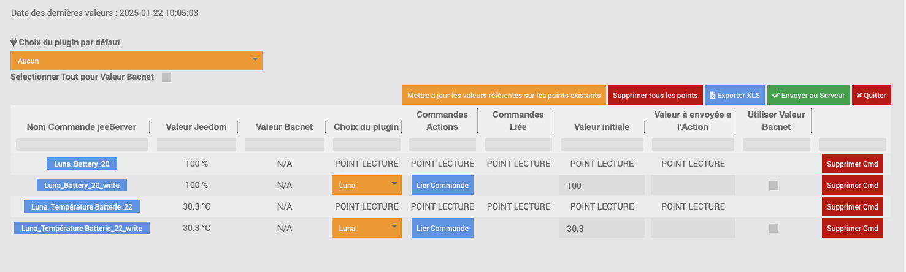

# Documentation du Plugin BacnetManager

>**WICHTIG**
>
>Le plugin BacnetManager n'est pas compatible avec le plugin officiel Jeedom Bacnet. Une seule instance Bacnet peut être créée sur une box Jeedom.

# Description

Le plugin BacnetManager permet de créer un équipement Bacnet sur votre Jeedom, ainsi que ses commandes d'information (« Infos Jeedom »), afin qu'il soit visible sur le réseau par un superviseur Bacnet. Il permet également d'associer des commandes d'action (« Actions Jeedom ») provenant d'autres plugins, pour piloter Jeedom via Bacnet lorsque des écritures sont détectées sur ces points Bacnet.

# Configuration du plugin

Après avoir téléchargé le plugin, commencez par l'activer depuis la gestion des plugins Jeedom.

Ensuite, lancez l'installation des dépendances, même si elles apparaissent comme « OK ».

Enfin, démarrez le démon depuis la page de configuration.

Port socket interne : Ne modifiez pas ce champ dans la section « Configuration ».

Cron : Configurez la fréquence du cron, qui permettra de lire les valeurs des points Bacnet pour détecter d'éventuelles écritures externes.

# Fonctionnement du plugin

>**Pré-requis**
>
>Réseau : Vos équipements Bacnet doivent être sur le même réseau que votre Jeedom pour être détectés.

#### <u>Création de l'équipement jeeBacnetManager</u>

Par défaut, un équipement nommé jeeBacnetManager est créé. Cet équipement représente le « serveur Bacnet » qui sera visible par votre superviseur Bacnet.

Sie können seine Geräte-ID in der Plugin-Konfiguration konfigurieren

#### <u>Ajout de commandes Jeedom au jeeBacnetManager</u>

Cliquez sur Ajouter Commandes au Serveur.

Une fenêtre modale s'ouvre, listant toutes les commandes de type « Infos » présentes dans les différents plugins de votre Jeedom.

>**WICHTIG**
>
>Les équipements doivent être actifs pour que leurs commandes soient détectées.
>Évitez d'utiliser des espaces dans les noms des commandes.

>**FACULTATIF**
>
>Remplissez le champ « Nom de point Bacnet » (facultatif). Si ce champ est vide, le nom de la commande Jeedom sera utilisé comme nom du point Bacnet.

Sélectionnez les commandes souhaitées, puis validez.

Après validation, quittez la fenêtre et cliquez sur Cmds Jeed Server pour afficher la liste des commandes ajoutées.

#### <u>Points Bacnet créés</u>
Cette modale va s'afficher :

Pour chaque commande ajoutée, deux points Bacnet sont créés :

- Commande « info » : Mise à jour via le cron pour le monitoring.

- Commande « Write » : Utilisée pour détecter les écritures depuis un équipement Bacnet. Si une écriture est détectée, la commande d'action associée est exécutée.

#### <u>Paramétrage des Commandes</u>
 

1. **Auswahl der Befehlsaktion** : Wählen Sie einen Aktionsbefehl basierend auf dem ausgewählten Plugin aus.
2. **Anfangswert** : Legen Sie einen Anfangswert fest, um den Bacnet-Punkt zum ersten Mal zu initialisieren.
3. **Verwenden Sie den Bacnet-Wert** : Aktivieren Sie diese Option, um den Bacnet-Wert zu verwenden. Wenn diese Option nicht aktiviert ist, müssen Sie das Feld „An die Aktion zu sendender Wert“ ausfüllen".

#### <u>Mise à jour des valeurs</u>

Configurez la fréquence du cron dans la configuration du plugin pour actualiser les valeurs.

Beim Ausführen des Crons prüft das System, ob am Bacnet-Punkt eine Wertänderung stattgefunden hat (Schreiben)). An diesem Punkt sendet es entweder diesen Bacnet-Wert oder den unter „An Aktion senden“ eingegebenen Wert an den Parameterized Action-Befehl.

Une fois toutes les commandes configurées, on envoie toutes ces commandes sur le device Bacnet, en cliquant sur Envoyer au Serveur

# Import/Export des jeeBacnetManagers (in Kürze erhältlich)):

Um Bedarf zu vermeiden, stehen 2 Optionen zur Verfügung : 

- Gerät exportieren :

Durch Klicken auf diese Schaltfläche wird eine JSON-Datei heruntergeladen, die die Konfiguration des Geräts sowie seine Befehle enthält.

- Gerät importieren :

Durch Klicken auf diese Schaltfläche können Sie die jeeBacnetManager-Konfigurations-json-Datei importieren, die Sie heruntergeladen hätten, um die darin konfigurierten Befehle zu verwenden

# ANNEXE:

# Liste der BACnet-Engineering-Einheiten)

| Technische Einheiten               |
|---------------------------------|
| Amperesekunden                   |
| AmpereQuadratstunden               |
| AmpereQuadratmeter              |
| Ampere                         |
| AmpereProMeter                 |
| AmpereProQuadratmeter           |
| Barren                            |
| Becquerel                      |
| BTUS                            |
| btusPerHour                     |
| btusPerPound                    |
| tusPerPoundDryAir               |
| Candela                        |
| CandelaPerQuadratmeter          |
| Zentimeter                     |
| ZentimeterMerkur            |
| ZentimeterWasser              |
| Kubikfuß                       |
| Kubikfuß pro Tag                 |
| Kubikfuß pro Stunde                |
| Kubikfuß pro Minute              |
| KubikfußPerSekunde              |
| Kubikmeter                     |
| Kubikmeter pro Tag               |
| Kubikmeter pro Stunde              |
| Kubikmeter pro Minute            |
| Kubikmeter pro Sekunde            |
| Währung1                       |
| Währung10                      |
| Währung2                       |
| Währung3                       |
| Währung4                       |
| Währung5                       |
| Währung6                       |
| Währung7                       |
| Währung8                       |
| Währung9                       |
| Zyklen pro Stunde                   |
| Zyklen pro Minute                 |
| Tage                            |
| Dezibel                        |
| DezibelA                       |
| DezibelMillivolt               |
| DezibelVolt                    |
| GradTageCelsius               |
| GradTageFahrenheit            |
| GradWinkel                  |
| Grad Celsius                  |
| Grad Celsius pro Stunde           |
| Grad Celsius pro Minute         |
| GradFahrenheit               |
| Grad Fahrenheit pro Stunde        |
| GradFahrenheitPerMinute      |
| GradKelvin                   |
| Grad Kelvin pro Stunde            |
| GradKelvinPerMinute          |
| GradPhase                    |
| deltaGradFahrenheit          |
| deltaGradKelvin              |
| Farad                          |
| Füße                            |
| Fuß pro Minute                   |
| Füße pro Sekunde                   |
| Fußkerzen                     |
| Gramm                           |
| Gramm Wasser pro Kilogramm Trockenluft   |
| Gramm pro Kubikzentimeter         |
| Gramm pro Kubikmeter              |
| GrammPerGram                    |
| Gramm pro Kilogramm                |
| Gramm pro Liter                   |
| GrammProMilliliter              |
| Gramm pro Minute                  |
| Gramm pro Sekunde                  |
| GrammProQuadratmeter             |
| grau                            |
| Hektopascal                    |
| Henrys                          |
| Hertz                           |
| PS                      |
| Std.                           |
| HundertstelSekunden               |
| imperialGallonen                 |
| imperialGallonsPerMinute        |
| Zoll                          |
| ZollOfMercury                 |
| ZollWasser                   |
| JouleSekunden                    |
| Joule                          |
| Joule pro Kubikmeter             |
| Joule pro Grad Kelvin           |
| Joule pro Stunde                  |
| JouleProKilogrammGradKelvin   |
| Joule pro Kilogramm Trockenluft         |
| KiloBtus                        |
| KiloBtusPerHour                 |
| Kilobecquerel                  |
| Kilogramm                       |
| Kilogramm pro Kubikmeter          |
| Kilogramm pro Stunde                |
| KilogrammProKilogramm            |
| Kilogramm pro Minute              |
| Kilogramm pro Sekunde              |
| Kilohertz                       |
| Kiloohm                         |
| Kilojoule                      |
| Kilojoule pro Grad Kelvin       |
| Kilojoule pro Kilogramm           |
| Kilojoule pro Kilogramm Trockenluft     |
| Kilometer                      |
| Kilometer pro Stunde               |
| Kilopascal                     |
| KilovoltAmpereStunden             |
| KilovoltAmpereStundenReaktiv     |
| KilovoltAmpere                 |
| KilovoltAmpereReaktiv         |
| Kilovolt                       |
| Kilowattstunden                   |
| Kilowattstunden pro Quadratfuß      |
| Kilowattstunden pro Quadratmeter     |
| KilowattstundenReaktiv           |
| Kilowatt                       |
| Liter                          |
| Liter pro Stunde                   |
| LiterPerMinute                 |
| LiterPerSecond                 |
| Lumen                          |
| Luxus                           |
| megaBtus                        |
| Megabecquerel                  |
| Megahertz                       |
| Megajoule                      |
| Megajoule pro Grad Kelvin       |
| Megajoule pro Kilogramm Trockenluft     |
| Megajoule pro Quadratfuß         |
| Megajoule pro Quadratmeter        |
| megaAVoltAmpereStunden             |
| megaAVoltAmpereHoursReactive     |
| MegaAVoltAmpere                 |
| MegaVoltAmperesReactive         |
| MegaAVolts                       |
| Megawattstunden                   |
| MegawattstundenReaktiv           |
| Megawatt                       |
| Megaohm                         |
| Meter                          |
| Meter pro Stunde                   |
| MeterPerMinute                 |
| MeterPerSekunde                 |
| MeterPerSecondPerSecond        |
| microSiemens                    |
| Mikrogramm pro Kubikmeter         |
| Mikrogramm pro Liter              |
| mikrograu                       |
| Mikrometer                     |
| Mikrosievert                   |
| Mikrosievert pro Stunde            |
| Meilen pro Stunde                    |
| Milliampere                    |
| Millibar                       |
| Milligramm                      |
| Milligramm pro Kubikmeter         |
| Milligramm pro Gramm               |
| Milligramm pro Kilogramm           |
| Milligramm pro Liter              |
| Milligray                       |
| Milliliter                     |
| Milliliter pro Sekunde            |
| Millimeter                     |
| MillimeterMerkur            |
| MillimeterWasser              |
| MillimeterProMinute            |
| Millimeter pro Sekunde            |
| Milliohm                       |
| Millisekunden                    |
| Millisiemens                    |
| Millisievert                   |
| Millivolt                      |
| Milliwatt                      |
| Minuten                         |
| Minuten pro Grad Kelvin          |
| Monate                          |
| Nanogramm pro Kubikmeter          |
| nephelometrische Trübungseinheit      |
| Newton                          |
| NewtonMeter                    |
| NewtonSekunden                   |
| Newton pro Meter                 |
| neinUnitsohmMeterPerSquareMeter   |
| Ohmmeter                       |
| Ohm                            |
| pH-Wert                              |
| partsPerBillion                 |
| Anteile pro Million                 |
| pascalSekunden                   |
| Pascal                         |
| pro Stunde                         |
| Promille                        |
| proMinute                       |
| proSekunde                       |
| Prozent                         |
| ProzentObscurationPerFoot       |
| ProzentObscurationPerMeter      |
| ProzentPerSekunde                |
| ProzentRelativeLuftfeuchtigkeit         |
| PfundKraftPerQuadratZoll        |
| PfundMasse                      |
| PfundMassePerStunde               |
| PfundMassePerMinute             |
| PfundMassePerSekunde             |
| Leistungsfaktor                     |
| psiPerDegreeFahrenheit          |
| Bogenmaß                         |
| BogenmaßPerSekunde                |
| Umdrehungen pro Minute            |
| Sekunden                         |
| Siemens                         |
| SiemensPerMeter                 |
| Sieverts                        |
| Quadratzentimeter               |
| Quadratfuß                      |
| Quadratzoll                    |
| Quadratmeter                    |
| Quadratmeter pro Newton           |
| Tesla                          |
| Thermal-                          |
| Ihre Stunden                        |
| Töne                            |
| Töne pro Stunde                     |
| TöneKühlung               |
| usGallonen                       |
| usGallonen pro Stunde                |
| usGallonsPerMinute              |
| VoltAmpereStunden                 |
| VoltAmpereStundenReaktiv         |
| VoltAmpere                     |
| VoltAmpereReaktiv             |
| Volt                           |
| VoltProGradKelvin            |
| Volt pro Meter                   |
| VoltQuadratStunden                |
| Wattstunden                       |
| Wattstunden pro Kubikmeter          |
| wattHoursReactive               |
| Watt                           |
| Watt pro Meter pro Grad Kelvin    |
| Watt pro Quadratfuß              |
| Watt pro Quadratmeter             |
| Watt pro Quadratmeter Grad Kelvin |
| webers                          |
| Wochen                           |
| Jahre                           |

