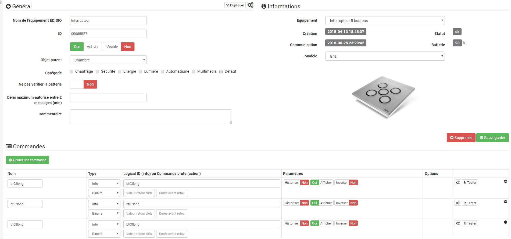

# Edisio

Plugin zur Verwendung des Edisio-Protokolls mit Jeedom

# Configuration

Mit dem edisio-Plugin können Sie mit allen Peripheriegeräten kommunizieren, die mit dem edisio USB-Modul kompatibel sind.

## Plugin Konfiguration

Nachdem Sie das Plugin heruntergeladen haben, müssen Sie es nur aktivieren und den Port auf Auto setzen. Nach dem Speichern sollte der Dämon starten. Das Plugin ist bereits standardmäßig konfiguriert. du musst nichts mehr tun. Sie können diese Konfiguration jedoch ändern. Hier ist das Detail (einige Parameter sind möglicherweise nur im Expertenmodus sichtbar) :

-   **Nebengebäude** : In diesem Teil erhalten Sie den Status der Abhängigkeiten. Wenn diese nicht in Ordnung sind, können Sie sie entweder von Hand starten oder 5 Minuten warten. Jeedom startet sie von selbst.
-   **Dämon** : Dieser Teil gibt Ihnen den Status des Dämons (sowohl lokal als auch remote). Wenn dies nicht in Ordnung ist, können Sie ihn entweder von Hand starten oder 5 Minuten warten. Jeedom startet ihn von selbst.
-   **Konfiguration** : In diesem Teil können Sie die allgemeinen Parameter des Plugins konfigurieren.
    -   *Verbieten Sie die folgenden IDs* : ermöglicht es, Jeedom eine Liste von edisio-Kennungen zu geben, damit nicht die entsprechende Ausrüstung erstellt wird. Bezeichner müssen durch Leerzeichen getrennt werden. Beispiel : "1356AD87 DB54AF".
-   **Lokaler Dämon** : lokale Konfigurationsparameter (oder Remote, je nach Titel) des Dämons.
    -   *EDISIO Port* : Der USB-Anschluss, an den Ihre edisio-Schnittstelle angeschlossen ist.
        > **Spitze**
        >
        > Wenn Sie nicht wissen, welcher USB-Anschluss verwendet wird, können Sie einfach "Auto" angeben".
    -   *Interner Socket-Port (gefährliche Änderung, muss bei allen von Jeedom deportierten Edisio den gleichen Wert haben)* : Ermöglicht das Ändern des internen Kommunikationsports des Dämons.

> **Wichtig**
>
> Ändern Sie nur, wenn Sie wissen, was Sie tun.

Um den Daemon beim Debuggen zu starten, reicht es auf der Ebene der Konfiguration der Protokolle des Plugins aus, das Debugging durchzuführen, den Daemon zu speichern und neu zu starten.

> **Wichtig**
>
> In diesem Modus ist der Dämon sehr gesprächig. Vergessen Sie nach Abschluss des Debugs nicht, auf "Neustart" zu klicken, um den Debug-Modus zu verlassen !!

## Gerätekonfiguration

Die Konfiguration der edisio-Geräte kann über das Plugin-Menü aufgerufen werden :

So sieht die Seite des edisio Plugins aus (hier mit bereits 4 Geräten) :

> **Spitze**
>
> Wie an vielen Orten in Jeedom wird durch einfaches Setzen der Maus ganz links ein Schnellzugriffsmenü angezeigt (Sie können es jederzeit in Ihrem Profil sichtbar lassen)

Sie finden hier :

-   eine Schaltfläche zum manuellen Erstellen von Geräten
-   eine Schaltfläche zum Umschalten auf Inklusion
-   eine Schaltfläche zum Anzeigen der Konfiguration des Plugins
-   Eine Schaltfläche, die Ihnen den Gesundheitszustand aller Ihrer Edisio-Geräte anzeigt
-   Schließlich finden Sie unten die Liste Ihrer Ausrüstung

Sobald Sie auf eine davon klicken, erhalten Sie :

Hier finden Sie die gesamte Konfiguration Ihrer Geräte :

-   EDISIO Gerätename : Name Ihrer Edisio-Ausrüstung
-   Identifikation : die ID Ihrer Sonde (darf nur bei vollständiger Kenntnis der Fakten geändert werden)
-   Aktivieren : macht Ihre Ausrüstung aktiv
-   Sichtbar : macht es auf dem Dashboard sichtbar
-   Übergeordnetes Objekt : Gibt das übergeordnete Objekt an, zu dem das Gerät gehört
-   Kategorie : Gerätekategorien (es kann zu mehreren Kategorien gehören)
-   Die Batterie nicht überprüfen : weist Jeedom an, Sie nicht zu warnen, wenn das Gerät einen Rahmen mit schwacher Batterie sendet (einige Module verarbeiten diese Informationen nicht korrekt und generieren falsche Warnungen)
-   Maximale Zeit zwischen 2 Nachrichten (min) : Die maximal zulässige Zeit zwischen zwei Nachrichten, bevor Jeedom das Gerät als Zeitüberschreitung deklariert". Beachten Sie, dass für diesen Parameter die Option "Wiederholung von Nachrichten alle (min) erzwingen" konfiguriert werden muss und dieser Wert größer sein muss
-   Kommentar : ermöglicht es Ihnen, Kommentare zum Gerät abzugeben (z : Batterie gewechselt am XX / XX / XXXX)
-   Gerät : ermöglicht es Ihnen, das Modell Ihrer Ausrüstung zu definieren (nur für die manuelle Erstellung von Ausrüstung zu konfigurieren, in der automatischen Jeedom konfiguriert nur dieses Feld)
-   Schaffung : gibt Ihnen das Erstellungsdatum der Ausrüstung an
-   Kommunikation : gibt Ihnen das Datum der letzten Kommunikation mit dem Gerät an (kann beispielsweise bei einer Steckdose leer sein)
-   Batterie : Batteriestand des Geräts
-   Status : Gerätestatus (kann zum Beispiel eine Zeitüberschreitung sein)

Nachfolgend finden Sie die Liste der Bestellungen :

-   Der im Dashboard angezeigte Name
-   Typ und Subtyp
-   Der Informationsschlüssel, wenn es sich um eine Information handelt, oder der Hexadezimalcode, der gesendet werden soll, wenn es sich um eine Aktion handelt. In den Konfigurationen können diese Felder automatisch ausgefüllt werden (Sie müssen das Gerät erstellen, die Konfiguration auswählen und dann speichern)
-   "Statusrückmeldungswert "und" Dauer vor Statusrückmeldung" : ermöglicht es Jeedom anzuzeigen, dass nach einer Änderung der Informationen der Wert auf Y, X min nach der Änderung zurückkehren muss. Beispiel : Im Fall eines Anwesenheitsdetektors, der nur während einer Anwesenheitserkennung emittiert, ist es nützlich, beispielsweise 0 in Wert und 4 in Dauer einzustellen, so dass 4 min nach einer Bewegungserkennung (und s ') Seitdem gab es keine Neuigkeiten.) Jeedom setzt den Wert der Informationen auf 0 zurück (keine Bewegung mehr erkannt)
-   Chronik : ermöglicht das Historisieren der Daten
-   Anzeige : ermöglicht die Anzeige der Daten im Dashboard
-   Ereignis : Bei edisio muss dieses Kontrollkästchen immer aktiviert sein, da Sie kein edisio-Modul abfragen können
-   Unit : Dateneinheit (kann leer sein)
-   min / max : Datengrenzen (können leer sein)
-   erweiterte Konfiguration (kleine gekerbte Räder) : Zeigt die erweiterte Konfiguration des Befehls an (Protokollierungsmethode, Widget usw.)
-   Test : Wird zum Testen des Befehls verwendet
-   löschen (unterschreiben -) : ermöglicht das Löschen des Befehls

## Betrieb an edisio Geräten

Oben auf Ihrer Gerätekonfigurationsseite befinden sich 3 Schaltflächen, mit denen Sie bestimmte Optionen ausführen können :

-   Duplikat : Geräte dupliziert
-   konfigurieren (kleine gekerbte Räder) : Das gleiche Prinzip wie bei den Befehlen ermöglicht eine erweiterte Konfiguration der Geräte

## Aufnahme von Edisio-Geräten

Das Hinzufügen von Edisio-Geräten ist sehr einfach. Sie müssen nur in den Einschlussmodus wechseln und warten, bis das Gerät eine Nachricht sendet. In diesem Fall teilt Jeedom Ihnen mit, dass neue Geräte enthalten sind, und erstellt diese automatisch.

# Liste kompatibler Module

Sie finden die Liste der kompatiblen Module [hier](https://doc.jeedom.com/de_DE/edisio/equipement.compatible)
