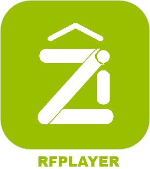

# Hausautomationsprotokoll

>**IMPORTANT**

>Nur offizielle Plugins haben hier ihre Dokumentation. Sie können die Dokumentation der anderen Plugins direkt vom Jeedom-Markt abrufen und dann einmal auf das betreffende Plugin klicken, indem Sie auf Dokumentation klicken

Sie können sehen [hier](https://market.jeedom.com/index.php?v=d&p=market&type=plugin&categorie=automation+protocol) Alle Plugins (offiziell oder nicht) in dieser Kategorie

| | | | |
|--- | --- | --- | ---|
||Odace SFSP|Plugin zur Unterstützung der Odace SFSP-Reihe (drahtlos ohne Akku) Schneider to Jeedom. Es ermöglicht die Information der Schalter (Fensterläden / Szenen / Einzel / Doppel). Es ermöglicht die Steuerung der Aktuatoren (Verschluss / dcl). Außerdem können Sie Szenen und Gruppen verwenden.|[Dokumentation](beagle/index.md) - [Markt](https://market.jeedom.com/index.php?v=d&p=market_display&id=3917)|
||Bluetooth-Werbung|Sicherheitsmanagement-Plugin|[Dokumentation](blea/index.md) - [Markt](https://market.jeedom.com/index.php?v=d&p=market_display&id=2554)|
||Broadlink|Plugin, das Unterstützung für bestimmte Broadlink?-Produkte wie (RM, A1 usw.) hinzufügt|[Dokumentation](broadlink/index.md) - [Markt](https://market.jeedom.com/index.php?v=d&p=market_display&id=2699)|
||Deconz|Plugin für Deconz? (conBee)|[Dokumentation](deconz/index.md) - [Markt](https://market.jeedom.com/index.php?v=d&p=market_display&id=3610)|
||Eco-device||[Dokumentation](ecodevice/index.md) - [Markt](https://market.jeedom.com/index.php?v=d&p=market_display&id=342)|
||Edimax Plug||[Dokumentation](edimaxplug/index.md) - [Markt](https://market.jeedom.com/index.php?v=d&p=market_display&id=2455)|
||Edisio|Plugin, das Jeedom Unterstützung für das Edisio?-Protokoll hinzufügt|[Dokumentation](edisio/index.md) - [Markt](https://market.jeedom.com/index.php?v=d&p=market_display&id=1541)|
||ipx800 V3||[Dokumentation](ipx800/index.md) - [Markt](https://market.jeedom.com/index.php?v=d&p=market_display&id=344)|
||ipx800 V2||[Dokumentation](ipx800v2/index.md) - [Markt](https://market.jeedom.com/index.php?v=d&p=market_display&id=1194)|
||IPX 800 v4|Plugin zur Steuerung des IPX 800|[Dokumentation](ipx800v4/index.md) - [Markt](https://market.jeedom.com/index.php?v=d&p=market_display&id=2046)|
||MyhomeSCS|Plugin zur Verwendung des Legrand F454-Moduls|[Dokumentation](myhomescs/index.md) - [Markt](https://market.jeedom.com/index.php?v=d&p=market_display&id=3107)|
||EnOcean|Plugin, das Jeedom EnOcean?-Unterstützung hinzufügt|[Dokumentation](openenocean/index.md) - [Markt](https://market.jeedom.com/index.php?v=d&p=market_display&id=2622)|
||Z-Wave|Plugin zur Verwaltung des Z-WAVE?-Protokolls|[Dokumentation](openzwave/index.md) - [Markt](https://market.jeedom.com/index.php?v=d&p=market_display&id=185)|
||RfPlayer|Plugin, das Unterstützung für RfPlayer?-Schlüssel von Ziblue zu Jeedom hinzufügt|[Dokumentation](rfplayer/index.md) - [Markt](https://market.jeedom.com/index.php?v=d&p=market_display&id=2781)|
||RfPlayer2|Plugin, das Unterstützung für RfPlayer?-Schlüssel von Ziblue zu Jeedom hinzufügt. Dieses Plugin wird eventuell das erste Plugin ersetzen. Es wird allen Besitzern des ersten Plugins zur Verfügung gestellt. Dadurch kann jeder ruhig migrieren. Da sich die Philosophie des Plugins geändert hat und auch die IDs, müssen Sie Ihre Geräte in dieses neue Plugin aufnehmen.|[Dokumentation](rfplayer2/index.md) - [Markt](https://market.jeedom.com/index.php?v=d&p=market_display&id=3349)|
||RFXcom|Plugin zur Verwendung des RFXcom? USB. Ermöglicht die Steuerung von Hausautomationsgeräten vom Typ 433 MHz (Chacon, Oregon, La Crosse, X10, DI-O, Blyss).|[Dokumentation](rfxcom/index.md) - [Markt](https://market.jeedom.com/index.php?v=d&p=market_display&id=52)|
||Wattlet|Mit diesem Plugin können Sie die Wattcubes-Module von Wattlet? über das Wattcube Web steuern.|[Dokumentation](wattlet/index.md) - [Markt](https://market.jeedom.com/index.php?v=d&p=market_display&id=2600)|
||Wes||[Dokumentation](wes/index.md) - [Markt](https://market.jeedom.com/index.php?v=d&p=market_display&id=1336)|
