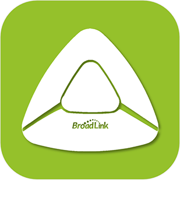

# 

>**IMPORTANT**
>Nur offizielle Plugins haben hier ihre Dokumentation. Sie können die Dokumentation der anderen Plugins direkt im Jeedom Market einsehen. Klicken Sie im betreffenden Plugin auf Dokumentation.
>Sie können sehen [hier](https://market.jeedom.com/index.php?v=d&p=market&type=plugin&categorie=automation+protocol) Alle offiziellen Plugins in dieser Kategorie

| | | | |
|--- | --- | --- | ---|
|||. . . .|[Dokumentation](beagle/index.md) - [Markt](https://market.jeedom.com/index.php?v=d&p=market_display&id=3917)|
|||Sicherheitsmanagement-Plugin|[Dokumentation](blea/index.md) - [Markt](https://market.jeedom.com/index.php?v=d&p=market_display&id=2554)|
||Broadlink||[Dokumentation](broadlink/index.md) - [Markt](https://market.jeedom.com/index.php?v=d&p=market_display&id=2699)|
||Deconz||[Dokumentation](deconz/index.md) - [Markt](https://market.jeedom.com/index.php?v=d&p=market_display&id=3610)|
||Eco-device||[Dokumentation](ecodevice/index.md) - [Markt](https://market.jeedom.com/index.php?v=d&p=market_display&id=342)|
||||[Dokumentation](edimaxplug/index.md) - [Markt](https://market.jeedom.com/index.php?v=d&p=market_display&id=2455)|
||Edisio||[Dokumentation](edisio/index.md) - [Markt](https://market.jeedom.com/index.php?v=d&p=market_display&id=1541)|
||||[Dokumentation](ipx800/index.md) - [Markt](https://market.jeedom.com/index.php?v=d&p=market_display&id=344)|
||||[Dokumentation](ipx800v2/index.md) - [Markt](https://market.jeedom.com/index.php?v=d&p=market_display&id=1194)|
||||[Dokumentation](ipx800v4/index.md) - [Markt](https://market.jeedom.com/index.php?v=d&p=market_display&id=2046)|
||MyhomeSCS||[Dokumentation](myhomescs/index.md) - [Markt](https://market.jeedom.com/index.php?v=d&p=market_display&id=3107)|
||EnOcean||[Dokumentation](openenocean/index.md) - [Markt](https://market.jeedom.com/index.php?v=d&p=market_display&id=2622)|
||Z-Wave||[Dokumentation](openzwave/index.md) - [Markt](https://market.jeedom.com/index.php?v=d&p=market_display&id=185)|
||RfPlayer||[Dokumentation](rfplayer/index.md) - [Markt](https://market.jeedom.com/index.php?v=d&p=market_display&id=2781)|
||RfPlayer2|. . . . .|[Dokumentation](rfplayer2/index.md) - [Markt](https://market.jeedom.com/index.php?v=d&p=market_display&id=3349)|
||RFXcom|. |[Dokumentation](rfxcom/index.md) - [Markt](https://market.jeedom.com/index.php?v=d&p=market_display&id=52)|
||Wattlet|.|[Dokumentation](wattlet/index.md) - [Markt](https://market.jeedom.com/index.php?v=d&p=market_display&id=2600)|
||Wes||[Dokumentation](wes/index.md) - [Markt](https://market.jeedom.com/index.php?v=d&p=market_display&id=1336)|
