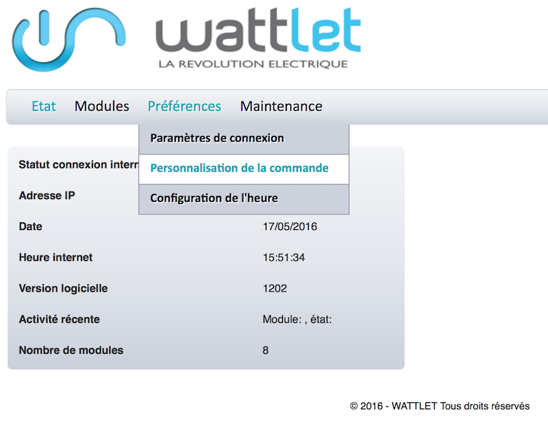

# Wattcube Plugin

Mit diesem Plugin können Sie die Wattcubes-Module von Wattlet über das Wattcube Web steuern.

# Plugin Konfiguration 

Nachdem Sie das Plugin heruntergeladen haben, müssen Sie es nur aktivieren und dann die IP-Adresse des Wattcube Web konfigurieren.

# Gerätekonfiguration 

Auf die Synchronisation von Wattlets-Geräten kann über das Plugins-Menü zugegriffen werden :

Sobald Sie auf eine davon klicken, erhalten Sie :

Hier finden Sie die gesamte Konfiguration Ihrer Geräte :

-   **Name der Wattlet-Ausrüstung** : Name Ihrer Wattlet-Ausrüstung auf dem Armaturenbrett,
-   **Übergeordnetes Objekt** : Gibt das übergeordnete Objekt an, zu dem das Gerät gehört,
-   **Aktivieren** : macht Ihre Ausrüstung aktiv,
-   **Sichtbar** : macht Ihre Ausrüstung auf dem Armaturenbrett sichtbar,
-   **Kategorie** : Kategorie Ihrer Wattlet-Ausrüstung

Sowie die folgenden Informationen :

-   **Adresse** : Moduladresse,
-   **Typ** : Wattlet-Modultyp,
-   **Softwareversion** : Interne Softwareversion des Wattlet-Moduls,
-   **Hardwareversion** : Hardwareversion

> **Notiz**
>
> Bestellungen werden automatisch erstellt und müssen nicht manuell hinzugefügt werden.

# Wattcube Web Konfiguration 

Um Statusrückgaben abzurufen, müssen Push-Benachrichtigungen im Wattcube Web konfiguriert werden.

Gehen Sie in der Wattcube-Weboberfläche zur Registerkarte "Einstellungen" und dann zum Menü "Anpassung der Bestellung""

Geben Sie im Bereich "PUSH Notification" die Jeedom-Adresse in das Formular ein :

**IP\_JEEDOM / plugins / wattlet / core / php / jeeWattlet.php?id = ~ id ~ & cmd = ~ cmd ~ & state = ~ state ~**

dann speichern.

