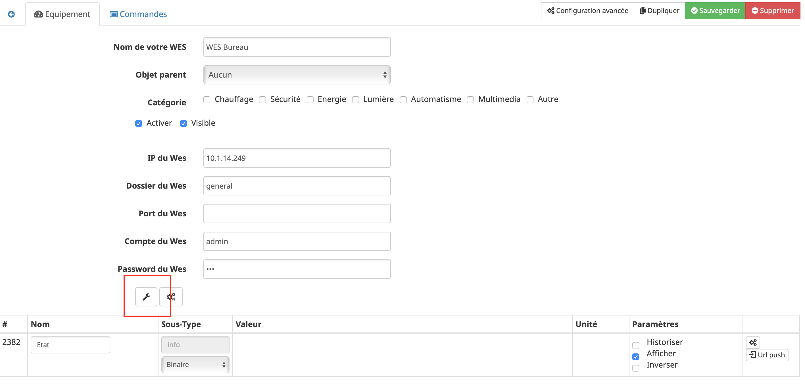

# Wes Plugin

Plugin zur Nutzung des WES-Servers von CartElectronics, um insbesondere dessen Energieverbrauch zu verfolgen.

# Konfiguration der Wes

Nach der Installation des Plugins müssen Sie es nur noch aktivieren :

**Konfiguration**

Um das Plugin zu konfigurieren, müssen Sie zuerst das WES hinzufügen.

Wes hinzufügen : **Plugins** → **Hausautomationsprotokoll** → **Wes** → **Hinzufügen**

Hier sind die einzugebenden Parameter :

-   **Name Ihres WES** : Name der Wes, die angezeigt wird
-   **Aktivieren** : Aktivierung der Wes
-   **Wes IP** : Informieren Sie die WES-Zugangs-IP
-   **Wes-Datei** : Sie müssen "allgemein" setzen, wenn es sich um eine Wes-Konfiguration handelt.
-   **Hafen von Wes** : Lassen Sie das Feld leer, wenn Sie dies in der WES-Konfiguration nicht geändert haben.
-   **Wes Konto** : Geben Sie den Login des Wes-Kontos ein (ursprünglich ist es "Admin").
-   **Wes Passwort** : Geben Sie das Passwort des Wes-Kontos ein (ursprünglich ist es "wes"").

> **Spitze**
>
> Wenn Sie diese Informationen ändern möchten, müssen Sie zuerst die WES-Schnittstelle aufrufen, um sie zu ändern.

Nach dem Speichern erhalten Sie eine Vielzahl von Modulen: Sie müssen nur die gewünschten aktivieren.

> **Spitze**
>
> Die grau hinterlegten Module werden vom Plugin nicht überwacht, sondern müssen dafür aktiviert werden.

# WES-Relaiskonfiguration

Nach der Initialisierung des WES-Plugins können Sie auf den Schlüssel klicken (siehe unten)).

Durch Klicken auf diese Taste wird ein modales Fenster angezeigt: Wählen Sie die gewünschten Relais und Tasten aus und validieren Sie sie. Auf dem WES werden automatisch Szenarien erstellt, um Echtzeit-Feedback von Schaltflächen und Relais zu erhalten (weitere Rückmeldungen finden Sie in den allgemeinen Plugin-Einstellungen.)

