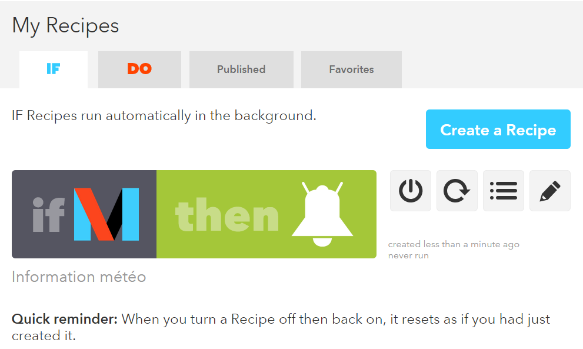

# IFTTT Plugin

Dieses Plugin ermöglicht das Senden eines Ereignisses an IFTTT.

# Plugin Konfiguration

Nach dem Herunterladen des Plugins müssen Sie es nur noch aktivieren, es ist keine weitere Konfiguration erforderlich.

# Gerätekonfiguration

Auf die Konfiguration der IFTTT-Geräte kann über das Plugins-Menü zugegriffen werden :

So sieht die IFTTT-Plugin-Seite aus (*schon mit 1 ausrüstung*) :

Sobald Sie auf eine davon klicken, erhalten Sie :

Hier finden Sie die gesamte Konfiguration Ihrer Geräte :

-   **Name der Ausrüstung** : Name Ihrer IFTTT-Ausrüstung.
-   **Aktivieren** : macht Ihre Ausrüstung aktiv.
-   **Sichtbar** : macht es auf dem Dashboard sichtbar.
-   **Schlüssel** : IFTTT-Schlüssel, den Sie in der Konfiguration des Webhooks-Dienstes finden (der den Channel Maker ersetzt)).

Nachfolgend finden Sie die Konfiguration der Befehle :

-   **Name** : Name der Bestellung.
-   **Typ** : Art der Bestellung.
-   **Ereignis** : Ereignisname in IFTTT konfiguriert.
-   **Wert** : Wert, der an IFTTT gesendet werden soll. 3 mögliche Unterscheidungen nach Subtyp, können Sie die Tags verwenden : ``#color#, #slider#, #message#, #title#``.
-   **Erweiterte Konfiguration** *(kleine gekerbte Räder)* : Dient zum Anzeigen der erweiterten Konfiguration des Befehls (Protokollierungsmethode, Widget usw.)).
-   **Test** : Wird zum Testen des Befehls verwendet.
-   **Löschen** *(Schild -)* : ermöglicht das Löschen des Befehls.

# Erstellung eines IFTTT-Kontos

Erstellen Sie ein IFTTT-Konto, falls Sie dies noch nicht getan haben [IFTTT](https://ifttt.com) :

Geben Sie Ihre E-Mail-Adresse und dann Ihren Benutzernamen ein und lassen Sie ihn erstellen :

Eine kurze Anleitung erklärt die Möglichkeiten. Wenn Sie fertig sind, klicken Sie oben rechts auf **Suche** :

Geben Sie dann im Suchfeld Webhooks ein und klicken Sie auf Webhooks :

Dann weiter **Verbinden** :

Auf dieser Kacke müssen Sie Ihren Schlüssel bekommen :

Dieser Schlüssel ist in das Feld zu kopieren **Schlüssel** Ihrer Ausrüstung unter Jeedom :

# Erstellung Ihres ersten "Applets"

Nichts könnte einfacher sein, klicken Sie in IFTTT auf **Meine Applets** Dann weiter **Neues Applet** :

Dann klicken Sie auf **Erstellen Sie ein Rezept** :

Klicken Sie auf **+ das**  :

Suchen Sie dann nach "Webhooks" und klicken Sie darauf :

Klicken Sie auf **Stellen Sie eine Webanfrage** :

Geben Sie Ihrem "Event" einen Namen". Bitte beachten Sie, dass dies dem Namen des Ereignisses im Befehl Jeedom entsprechen muss, damit es gespeichert werden kann.    
Bestätigen Sie mit **Trigger erstellen** :

Dann klicken Sie auf **+ das** :

Dann liegt es an Ihnen, zum Beispiel werde ich eine Benachrichtigung an mein Telefon senden (Sie müssen zuerst die IFTTT-Anwendung darauf installiert haben), also klicke ich auf **Benachrichtigungen** :

Bestätigen Sie mit **Senden Sie eine Benachrichtigung** (kann je nach Kanal unterschiedlich sein) :

Dann müssen Sie die Nachricht der Benachrichtigung schreiben, es gibt mögliche Tags (Zutaten) :

-   **EventName** : Name der Veranstaltung, hier Wetter.
-   **Wert1** : Der im Kanal gesendete Wert 1 wird über den Befehl in Jeedom konfiguriert.
-   **Wert2** : Der im Kanal gesendete Wert 2 wird über den Befehl in Jeedom konfiguriert.
-   **Wert3** : Der im Kanal gesendete Wert 3 wird über den Befehl in Jeedom konfiguriert.
-   **Aufgetreten** : Datum des Auftretens.

Hier ist, was es hier gibt (ich möchte die Benachrichtigung über das aktuelle Wetter zu Hause erhalten), validieren Sie durch Klicken auf **Aktion erstellen** :

Geben Sie Ihrem Applet (Rezept) einen Namen und bestätigen Sie mit einem Klick auf **Rezept erstellen** :

Hier haben Sie Ihr "Applet" auf der IFTTT-Seite erstellt :

Es bleibt mehr als die Bestellung auf der Jeedom-Seite zu erstellen, es ist ganz einfach :

Nichts Besonderes, Sie müssen den Namen des IFTTT-Ereignisses wieder in Jeedom eingeben und dann die Werte an IFTTT übergeben. In unserem Beispiel die Wetterbedingungen in der Zutat ``value1``.

> **TIPP**
>
> Auf der Jeedom-Seite können Sie, wenn Sie beispielsweise einen Befehl für den Nachrichtensubtyp eingeben, das Tag einfügen ``#message#`` in einem oder mehreren "Wert" -Feldern". In Ihrem Szenario wird der Wert der Nachricht an IFTTT übergeben. Das gleiche ist möglich mit ``#title#``, ``#color#`` oder ``#slider#``.

# Senden von Informationen von IFTTT an Jeedom

Es ist auch möglich, dies in die andere Richtung zu tun, d. H. Informationen von IFTTT an Jeedom zu senden.      
So senden Sie beispielsweise Informationen, wenn das Telefon einen bestimmten Bereich betritt. Erstellen Sie als Erstes ein neues Applet :

Dann klicken Sie auf **+ das** :

Auswählen **Vermietung** :

Wählen Sie Ihren Auslöser (hier nehme ich beim Betreten einer Zone) :

Markieren Sie dann Ihre Zone **Trigger erstellen** :

Klicken Sie auf **+ das** :

Suchen Sie nach "Webhooks" und klicken Sie darauf :

Klicken Sie auf **Stellen Sie eine Webanfrage** :

Jeedom-Seite erstellen Sie auf Ihrer IFTTT-Ausrüstung einen Befehl info / other type (oder binär, wenn Sie nur wissen möchten, ob Sie sich in der Nähe befinden) :

Sehr wichtig : Rufen Sie die Bestellnummer ab (hier ``5369``).

Wir kehren dann zu IFTTT zurück und geben ihm in unseren Webhooks die URL zum Aufrufen. Dies ist der komplizierteste Schritt, um Ihre externe Zugriffs-URL zu finden :

-   Sie verwenden jeedom DNS, also ist dies : ``https://XXXXX.dns.jeedom.com/core/api/jeeApi.php?apikey=\#APIKEY\#&type=ifttt&id=\#IDCMD\#&value=\#VALEUR\#``.   
Achtung, wenn Sie eine Adresse in / jeedom haben, müssen Sie daran denken, diese vor dem / core hinzuzufügen.
-   Sie haben Ihr eigenes DNS, dann hat die URL die Form ``http://\#VOTRE\_DNS\#/core/api/jeeApi.php?apikey=\#APIKEY\#&type=ifttt&id=\#IDCMD\#&value=\#VALEUR\#``.   
Achtung, wenn Sie eine Adresse in / jeedom haben, müssen Sie daran denken, diese vor dem / core hinzuzufügen

Denken Sie daran, zu ersetzen :

-   ``#APIKEY#`` : über Ihren JEEDOM-API-Schlüssel (diesen finden Sie unter Einstellungen → System → Konfiguration → API).
-   ``#IDCMD#`` : anhand der ID Ihrer zuvor erstellten Bestellung.
-   ``#VALEUR#`` : durch den Wert, den Sie Ihrer Bestellung geben möchten. Seien Sie hier vorsichtig, Leerzeichen müssen durch% 20 ersetzt werden (und es ist besser, Sonderzeichen zu vermeiden - Beispiel : ``Hors%20zone``).

Das gibt es :

Denken Sie daran, die Methode auf Get zu setzen und dann auf zu klicken **Aktion erstellen**.

Geben Sie Ihrem Applet einen Titel und klicken Sie auf **Aktion erstellen**. Und los geht's, sobald Sie das Gebiet betreten, wird Jeedom gewarnt.

> **Wichtig**
>
> Sie müssen auch ein Rezept erstellen, um das Gebiet zu verlassen, sonst tut Jeedom dies nicht
> wird beim Verlassen des Bereichs nicht gewarnt.

> **Notiz**
>
> Um die Webhook-URL auf ifttt abzurufen, müssen Sie gehen [hier](https://ifttt.com/maker_webhooks) Klicken Sie dann auf Dokumentation
