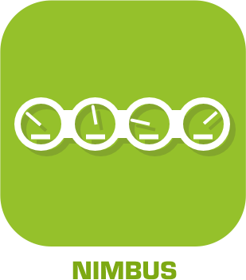
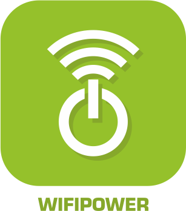

>**Wichtig**
>Nur offizielle Plugins haben hier ihre Dokumentation. Sie können die Dokumentation der anderen Plugins direkt im Jeedom Market einsehen. Klicken Sie im betreffenden Plugin auf Dokumentation.
>Sie können sehen [hier](https://market.jeedom.com/index.php?v=d&p=market&type=plugin&categorie=communication) Alle offiziellen Plugins in dieser Kategorie

| | | | |
|--- | --- | --- | ---|
||Aruba|ACHTUNG Plugin nur in der Beta verfügbar | [Markt](https://market.jeedom.com/index.php?v=d&p=market_display&id=4108)|
||Alexa|Plugin zur Verwendung von Amazon Alexa (Echo, Punkt ...) zur Steuerung Ihres Jeedom. Wichtig : Das Plugin erfordert ein Abonnement für Sprachdienste . Pour gérer cet abonnement : https://www.jeedom.com/market/index.php?v=d&p=profils#services|[Dokumentation Stall](ash/index.md) - [Beta-Dokumentation](ash/beta/index.md) [Markt](https://market.jeedom.com/index.php?v=d&p=market_display&id=3409) [Änderungsprotokoll stabil](ash/changelog.md) - [Changelog-Beta](ash/beta/changelog.md)|
||Bestway|Plugin zur Steuerung von mit Bestway verbundenen Geräten. Im Moment wurde nur das SPA in Mailand getestet (das einzige angeschlossene Spa im Sortiment)).|[Dokumentation Stall](bestway/index.md) - [Beta-Dokumentation](bestway/beta/index.md) [Markt](https://market.jeedom.com/index.php?v=d&p=market_display&id=4014) [Änderungsprotokoll stabil](bestway/changelog.md) - [Changelog-Beta](bestway/beta/changelog.md)|
||Tenda W301A Poller|Plugin Autor : Thomas Guenneguez BITTE BEACHTEN SIE, dass dies kein offizielles Jeedom-Plugin ist, sondern ein Plugin, das von einer dritten Person entwickelt wurde und dessen Entwicklung aufgegeben wurde. Das technische Team von Jeedom wird dieses Plugin ohne Ergebnisverpflichtung unterstützen. Plugin zur Verwaltung von Tenda W301A Terminals.|[Dokumentation Stall](bornetenda/index.md) [Markt](https://market.jeedom.com/index.php?v=d&p=market_display&id=1299) [Änderungsprotokoll stabil](bornetenda/changelog.md)|
||Dialogfluss|Das Plugin ermöglicht die Kommunikation mit Google Home / Assistant über Jeedom-Interaktionen|[Dokumentation Stall](dialogflow/index.md) [Markt](https://market.jeedom.com/index.php?v=d&p=market_display&id=3215) [Änderungsprotokoll stabil](dialogflow/changelog.md)|
||Dyson|Plugin zur Steuerung von Dyson Link-Geräten (Pure Link, heiß + cool, befeuchten + cool...). Momentan wird der Staubsauger nicht unterstützt.|[Dokumentation Stall](dyson/index.md) [Markt](https://market.jeedom.com/index.php?v=d&p=market_display&id=4002) [Änderungsprotokoll stabil](dyson/changelog.md)|
||Gcast|Plugin, mit dem ein CAST-Gerät sprechen kann. Sie können damit auch die Lautstärke einstellen. In Kombination mit einer Google-Startseite können Sie Interaktionen überbrücken und Sprachfeedback erhalten. Außerdem können Sie die Ask-Funktion verwenden.|[Dokumentation Stall](gcast/index.md) - [Beta-Dokumentation](gcast/beta/index.md) [Markt](https://market.jeedom.com/index.php?v=d&p=market_display&id=3057) [Änderungsprotokoll stabil](gcast/changelog.md) - [Changelog-Beta](gcast/beta/changelog.md)|
||GL-iNet|GliNet-Management-Plugin (SMS, Connection)|[Dokumentation Stall](glinet/index.md) - [Beta-Dokumentation](glinet/beta/index.md) [Markt](https://market.jeedom.com/index.php?v=d&p=market_display&id=4181) [Änderungsprotokoll stabil](glinet/changelog.md) - [Changelog-Beta](glinet/beta/changelog.md)|
||Google Smarthome|Plugin zum Fahren von Jeedom mit einem Google Home. Wichtig : Für das Plugin ist ein Abonnement für Sprachdienste erforderlich (3 Monate kostenlos beim Kauf des Plugins), um die Konfiguration zu vereinfachen. Pour gérer cet abonnement : https://www.jeedom.com/market/index.php?v=d&p=profils#services Vous pouvez utiliser aussi le mode standalone mais sa configuration est plus complexe, nous vous conseillons vivement de lire la documentation avant tout achat si vous souhaitez utiliser ce mode.|[Dokumentation Stall](gsh/index.md) - [Beta-Dokumentation](gsh/beta/index.md) [Markt](https://market.jeedom.com/index.php?v=d&p=market_display&id=3412) [Änderungsprotokoll stabil](gsh/changelog.md) - [Changelog-Beta](gsh/beta/changelog.md)|
||Helium-Hotspot|Plugin zum Abrufen von Informationen von Helium-Hotspots|[Dokumentation Stall](heliumhotspot/index.md) - [Beta-Dokumentation](heliumhotspot/beta/index.md) [Markt](https://market.jeedom.com/index.php?v=d&p=market_display&id=4315) [Änderungsprotokoll stabil](heliumhotspot/changelog.md) - [Changelog-Beta](heliumhotspot/beta/changelog.md)|
||IFTTT|Dank dieses Plugins können Sie von den unzähligen Rezepten profitieren, die auf IFTT verfügbar sind. Somit kann ein Jeedom-Ereignis ein Einstiegspunkt für ein IFTT-Rezept werden und Ereignisse aller Art auslösen.|[Dokumentation Stall](ifttt/index.md) - [Beta-Dokumentation](ifttt/beta/index.md) [Markt](https://market.jeedom.com/index.php?v=d&p=market_display&id=1705) [Änderungsprotokoll stabil](ifttt/changelog.md) - [Changelog-Beta](ifttt/beta/changelog.md)|
||inter2N|ACHTUNG Plugin nur in der Beta verfügbar Plugin zur Verwaltung von Inter2N-Gegensprechanlagen|[Beta-Dokumentation](inter2N/beta/index.md) [Markt](https://market.jeedom.com/index.php?v=d&p=market_display&id=4166) [Changelog-Beta](inter2N/beta/changelog.md)|
||Jarvis|Plugin zum Verwalten eines oder mehrerer Jarvis|[Dokumentation Stall](jarvis/index.md) - [Beta-Dokumentation](jarvis/beta/index.md) [Markt](https://market.jeedom.com/index.php?v=d&p=market_display&id=2577) [Änderungsprotokoll stabil](jarvis/changelog.md) - [Changelog-Beta](jarvis/beta/changelog.md)|
||Jeedom Link|Mit diesem Plugin können Sie mehrere Jeedom-Installationen verknüpfen, um die Ausrüstung von einem oder mehreren "Quell-Jeedoms" auf einen oder mehrere "Ziel-Jeedoms" zu übertragen".|[Dokumentation Stall](jeelink/index.md) - [Beta-Dokumentation](jeelink/beta/index.md) [Markt](https://market.jeedom.com/index.php?v=d&p=market_display&id=2530) [Änderungsprotokoll stabil](jeelink/changelog.md) - [Changelog-Beta](jeelink/beta/changelog.md)|
||LaMetric|Plugin zum Anzeigen von Benachrichtigungen zur LaMetric Time.|[Dokumentation Stall](lametric/index.md) [Markt](https://market.jeedom.com/index.php?v=d&p=market_display&id=2818) [Änderungsprotokoll stabil](lametric/changelog.md)|
||Mail|Mit diesem Plugin können Sie E-Mails von Jeedom senden. Auf diese Weise können Sie Sie während einer Benachrichtigung oder einfach für einen täglichen Bericht direkt per E-Mail benachrichtigen. Sie können so viele Empfänger definieren, wie Sie möchten. Dies ist nützlich, um personalisierte Berichte zu senden oder Warnungen für diesen oder jenen Empfänger auszurichten.|[Dokumentation Stall](mail/index.md) - [Beta-Dokumentation](mail/beta/index.md) [Markt](https://market.jeedom.com/index.php?v=d&p=market_display&id=22) [Änderungsprotokoll stabil](mail/changelog.md) - [Changelog-Beta](mail/beta/changelog.md)|
||Mobile App|Achtung, die v1-App ist nicht mit dem neuesten Android kompatibel. Mit der offiziellen Jeedom-Anwendung können Sie Ihr Jeedom-Hausautomationssystem steuern, sei es über lokales WLAN oder über das 3G / 4G-Netzwerk Ihres Betreibers.  Die App stellt automatisch eine Verbindung zu Ihrem Jeedom mit automatischer Initialisierung per QRcode her. Eine Konfiguration ist nicht erforderlich. (Möglichkeit, es manuell zu tun) Sie finden alle Funktionen Ihres Jeedom auf Ihrem Handy. Sie können Ihre Anwendung mit Verknüpfungen und mehr anpassen...  Aktuelle Funktionen: - Verwalten Ihrer Szenarien. - Management Ihrer Hausautomation nach Ihren Teilen und Geräten. - Shift und automatische Statusrückgabe - Kompatibilität mit Plugins wie Thermostat, Alarm, Kamera etc... - Anpassbare Oberfläche mit Verknüpfungen. - Allgemeine Zusammenfassung der Hausautomation und nach Raum - Benachrichtigungen (mit ASK-Unterstützung) - Anzeigen von Designs   Weitere Funktionen und Kompatibilitäten werden in den nächsten Updates verfügbar sein !  Respekt für das Privatleben. Auf unseren Servern werden keine Daten (Heimautomation oder persönliche Daten) gespeichert oder gespeichert.|[Dokumentation Stall](mobile/index.md) - [Beta-Dokumentation](mobile/beta/index.md) [Markt](https://market.jeedom.com/index.php?v=d&p=market_display&id=2030) [Änderungsprotokoll stabil](mobile/changelog.md) - [Changelog-Beta](mobile/beta/changelog.md)|
||Netatmo|Plugin zur Wiederherstellung von Netatmo-Geräten (Wetter, Energie, Sicherheit .)). Durch die Jeedom-Wolke. Achtung, im Moment ist es nicht möglich, den Fluss der Kameras zu überwachen.|[Dokumentation Stall](netatmo/index.md) - [Beta-Dokumentation](netatmo/beta/index.md) [Markt](https://market.jeedom.com/index.php?v=d&p=market_display&id=4062) [Änderungsprotokoll stabil](netatmo/changelog.md) - [Changelog-Beta](netatmo/beta/changelog.md)|
||Network|Plugin zur Netzwerkverwaltung von Geräten : ping (ip, arp, port) und wache auf lan auf|[Dokumentation Stall](networks/index.md) - [Beta-Dokumentation](networks/beta/index.md) [Markt](https://market.jeedom.com/index.php?v=d&p=market_display&id=1950) [Änderungsprotokoll stabil](networks/changelog.md) - [Changelog-Beta](networks/beta/changelog.md)|
||Nimbus|Plugin zur Steuerung Ihres Nimbus.  Sie können den angezeigten Text und die Position der Hände steuern. Alles über das Szenario oder über das Dashboard.  Eine anpassbare Darstellung des Nimbus auf Ihrem Armaturenbrett verbessert das Ganze  Das Dashboard ist vollständig anpassbar  Sie können die Position jeder Nadel und den Text jedes Bildschirms unabhängig voneinander ändern (entweder über das Dashboard oder über das Szenario))  Es gibt auch einen Demo-Befehl und einen All-Befehl (um auf allen Bildschirmen gleichzeitig zu agieren) sowie einen Phrasenbefehl, um eine Phrase auf den 4 Bildschirmen zu teilen.   Lesen Sie die Dokumentation|[Dokumentation Stall](nimbus/index.md) [Markt](https://market.jeedom.com/index.php?v=d&p=market_display&id=1506) [Änderungsprotokoll stabil](nimbus/changelog.md)|
||Benachrichtigungsmanager|Dieses Plugin wird zum Verwalten von Benachrichtigungen verwendet (Wiederherstellung im Fehlerfall, Generierung von Text usw.)...).|[Dokumentation Stall](notificationmanager/index.md) - [Beta-Dokumentation](notificationmanager/beta/index.md) [Markt](https://market.jeedom.com/index.php?v=d&p=market_display&id=3315) [Änderungsprotokoll stabil](notificationmanager/changelog.md) - [Changelog-Beta](notificationmanager/beta/changelog.md)|
||Openvpn|Plugin zum Verwalten der Verbindung zu einem OpenVPN-Server.|[Dokumentation Stall](openvpn/index.md) - [Beta-Dokumentation](openvpn/beta/index.md) [Markt](https://market.jeedom.com/index.php?v=d&p=market_display&id=1965) [Änderungsprotokoll stabil](openvpn/changelog.md) - [Changelog-Beta](openvpn/beta/changelog.md)|
||Philips Hue|Plugin zur Integration eines Philips Hue-Ökosystems in Jeedom. Das Plugin kann bis zu 2 Bridges gleichzeitig verwalten.|[Dokumentation Stall](philipsHue/index.md) - [Beta-Dokumentation](philipsHue/beta/index.md) [Markt](https://market.jeedom.com/index.php?v=d&p=market_display&id=190) [Änderungsprotokoll stabil](philipsHue/changelog.md) - [Changelog-Beta](philipsHue/beta/changelog.md)|
||Telefonmarkt|Plugin, um den Markt als SMS-Gateway zu nutzen und Anrufe zu tätigen|[Dokumentation Stall](phonemarket/index.md) - [Beta-Dokumentation](phonemarket/beta/index.md) [Markt](https://market.jeedom.com/index.php?v=d&p=market_display&id=1694) [Änderungsprotokoll stabil](phonemarket/changelog.md) - [Changelog-Beta](phonemarket/beta/changelog.md)|
||Sarah|Plugin pour utiliser Sarah (http://encausse.wordpress.com/s-a-r-a-h/)|[Dokumentation Stall](sarah/index.md) [Markt](https://market.jeedom.com/index.php?v=d&p=market_display&id=17) [Änderungsprotokoll stabil](sarah/changelog.md)|
||Slack|Plugin, um Jeedom mit Slack zu verbinden|[Dokumentation Stall](slack/index.md) [Markt](https://market.jeedom.com/index.php?v=d&p=market_display&id=1689) [Änderungsprotokoll stabil](slack/changelog.md)|
||SMS|Plugin, das die Verwaltung (Senden / Empfangen) von SMS zu Jeedom hinzufügt. Mit diesem Plugin können Sie dank der Interaktions-Engine per SMS benachrichtigt, sogar eine Frage gestellt oder eine Aktion per SMS ausgelöst werden. (Benötigt einen 3G-Schlüssel und eine SIM-Karte ).|[Dokumentation Stall](sms/index.md) - [Beta-Dokumentation](sms/beta/index.md) [Markt](https://market.jeedom.com/index.php?v=d&p=market_display&id=16) [Änderungsprotokoll stabil](sms/changelog.md) - [Changelog-Beta](sms/beta/changelog.md)|
||Wifip|Plugin zum Verwalten des WLANs Ihrer Box sowie zum Korrigieren der IP.|[Dokumentation Stall](wifip/index.md) [Markt](https://market.jeedom.com/index.php?v=d&p=market_display&id=2286) [Änderungsprotokoll stabil](wifip/changelog.md)|
||Wifipower|Wifipower Equipment Management Plugin|[Dokumentation Stall](wifipower/index.md) [Markt](https://market.jeedom.com/index.php?v=d&p=market_display&id=1046) [Änderungsprotokoll stabil](wifipower/changelog.md)|
||Wireguard|Plugin zur Verwaltung der Verbindung zu einem Wireguard-Server. Derzeit nur mit Jeedom DNS kompatibel|[Dokumentation Stall](wireguard/index.md) - [Beta-Dokumentation](wireguard/beta/index.md) [Markt](https://market.jeedom.com/index.php?v=d&p=market_display&id=4222) [Änderungsprotokoll stabil](wireguard/changelog.md) - [Changelog-Beta](wireguard/beta/changelog.md)|
