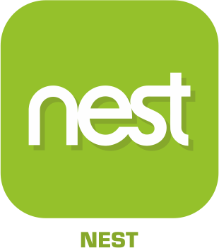

# Communication

>**IMPORTANT**
>Nur offizielle Plugins haben hier ihre Dokumentation. Sie können die Dokumentation der anderen Plugins direkt im Jeedom Market einsehen. Klicken Sie im betreffenden Plugin auf Dokumentation.
>Sie können sehen [hier](https://market.jeedom.com/index.php?v=d&p=market&type=plugin&categorie=communication) Alle offiziellen Plugins in dieser Kategorie

| | | | |
|--- | --- | --- | ---|
||Alexa|Alexa|[Dokumentation](ash/index.md) - [Markt](https://market.jeedom.com/index.php?v=d&p=market_display&id=3409)|
|||Plugin Autor :  BITTE BEACHTEN SIE, dass dies kein offizielles Jeedom-Plugin ist, sondern ein Plugin, das von einer dritten Person entwickelt wurde und dessen Entwicklung aufgegeben wurde. Das technische Team von Jeedom wird dieses Plugin ohne Ergebnisverpflichtung unterstützen. .|[Dokumentation](bornetenda/index.md) - [Markt](https://market.jeedom.com/index.php?v=d&p=market_display&id=1299)|
||||[Dokumentation](dialogflow/index.md) - [Markt](https://market.jeedom.com/index.php?v=d&p=market_display&id=3215)|
||Gcast||[Dokumentation](gcast/index.md) - [Markt](https://market.jeedom.com/index.php?v=d&p=market_display&id=3057)|
|||. WICHTIG :  !!!!!|[Dokumentation](gsh/index.md) - [Markt](https://market.jeedom.com/index.php?v=d&p=market_display&id=3412)|
||IFTTT|. |[Dokumentation](ifttt/index.md) - [Markt](https://market.jeedom.com/index.php?v=d&p=market_display&id=1705)|
||Jarvis||[Dokumentation](jarvis/index.md) - [Markt](https://market.jeedom.com/index.php?v=d&p=market_display&id=2577)|
||||[Dokumentation](jeelink/index.md) - [Markt](https://market.jeedom.com/index.php?v=d&p=market_display&id=2530)|
||LaMetric||[Dokumentation](lametric/index.md) - [Markt](https://market.jeedom.com/index.php?v=d&p=market_display&id=2818)|
||Mail||[Dokumentation](mail/index.md) - [Markt](https://market.jeedom.com/index.php?v=d&p=market_display&id=22)|
|||.  .  . ...  : - . - . -  - ... - . -  -  -     !  . .|[Dokumentation](mobile/index.md) - [Markt](https://market.jeedom.com/index.php?v=d&p=market_display&id=2030)|
||Nest|. WICHTIG : . .|[Dokumentation](nest/index.md) - [Markt](https://market.jeedom.com/index.php?v=d&p=market_display&id=407)|
||Network| : |[Dokumentation](networks/index.md) - [Markt](https://market.jeedom.com/index.php?v=d&p=market_display&id=1950)|
||Nimbus|.  . .        .   |[Dokumentation](nimbus/index.md) - [Markt](https://market.jeedom.com/index.php?v=d&p=market_display&id=1506)|
||||[Dokumentation](notificationmanager/index.md) - [Markt](https://market.jeedom.com/index.php?v=d&p=market_display&id=3315)|
||Openvpn||[Dokumentation](openvpn/index.md) - [Markt](https://market.jeedom.com/index.php?v=d&p=market_display&id=1965)|
|||. : -  - Luminosité - Transition - Groupe - Couleur -  -   Seien Sie vorsichtig : . |[Dokumentation](philipsHue/index.md) - [Markt](https://market.jeedom.com/index.php?v=d&p=market_display&id=190)|
||||[Dokumentation](phonemarket/index.md) - [Markt](https://market.jeedom.com/index.php?v=d&p=market_display&id=1694)|
||Sarah|Plugin pour utiliser Sarah (http://encausse.wordpress.com/s-a-r-a-h/)|[Dokumentation](sarah/index.md) - [Markt](https://market.jeedom.com/index.php?v=d&p=market_display&id=17)|
||Slack||[Dokumentation](slack/index.md) - [Markt](https://market.jeedom.com/index.php?v=d&p=market_display&id=1689)|
||SMS|...|[Dokumentation](sms/index.md) - [Markt](https://market.jeedom.com/index.php?v=d&p=market_display&id=16)|
||Wifip||[Dokumentation](wifip/index.md) - [Markt](https://market.jeedom.com/index.php?v=d&p=market_display&id=2286)|
||Wifipower||[Dokumentation](wifipower/index.md) - [Markt](https://market.jeedom.com/index.php?v=d&p=market_display&id=1046)|
