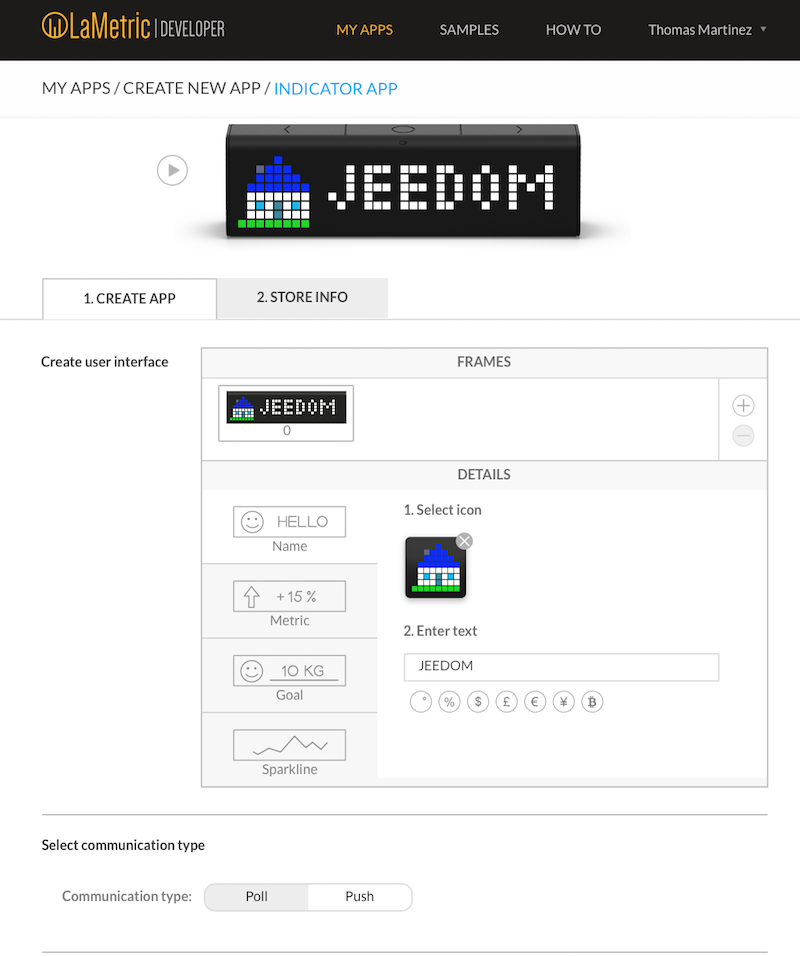

# LaMetric Plugin

Plugin zur Anzeige von Benachrichtigungen / Informationen zu LaMetric.

# Plugin Konfiguration

Sobald das Plugin installiert ist, muss auf der LaMetric-Site eine "Indikator-App" erstellt werden :

-   1 \. Se rendre à l'adresse : <https://developer.lametric.com>
-   2 \. Erstellen Sie eine "INDICATOR APP" :

-   3 \. Konfigurieren Sie ein Symbol, einen Namen und wählen Sie **Drücken** in "Typische Kommunikation" :

-   4 \. Geben Sie Ihrer App einen Namen und eine Beschreibung, aktivieren Sie "Private App" und klicken Sie auf "Speichern"" :

-   5 \. Veröffentlichen Sie die Anwendung und installieren Sie sie mit der mobilen Anwendung auf Ihrem LaMetric.

Sobald die Anwendung veröffentlicht ist, verfügen Sie über wichtige Informationen zum Konfigurieren des Plugins.

Sie können dann in Jeedom neue Ausrüstung erstellen und die gewünschten Felder ausfüllen :

# Mit dem Plugin

Beim Hinzufügen von Geräten werden automatisch 2 Bestellungen erstellt :

-   **Nachricht** : Ermöglicht das Senden von Nachrichten. Der Befehl Nachrichtentyp enthält 2 Felder :
    - **Symbol ID** : Entspricht der Nummer des gewünschten Symbols (Geben Sie keinen Hash ein ``#``). La liste des icônes disponibles est consultable à cette adresse : <https://developer.lametric.com/icons>).
    - **Text** : Entspricht dem Text, den Sie anzeigen möchten.
-   **Leeren** : Wird verwendet, um die Anzeige auf leer zurückzusetzen ("JEEDOM" wird dann registriert).

Es ist möglich, mehrere Nachrichten auf einmal zu senden, indem die Symbole und die Texte durch das Zeichen getrennt werden : ``|``.

Hier ist zum Beispiel ein Szenario, in dem 4 verschiedene Informationen gleichzeitig gesendet werden :

