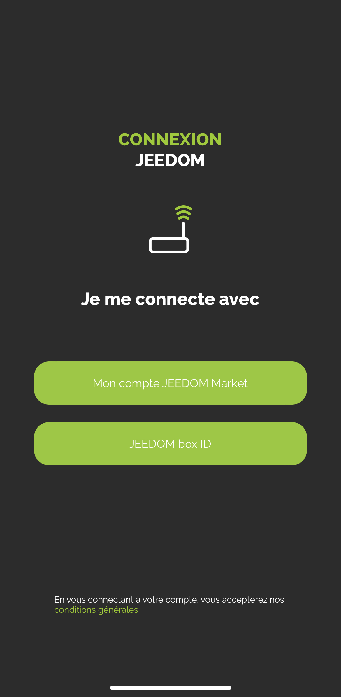
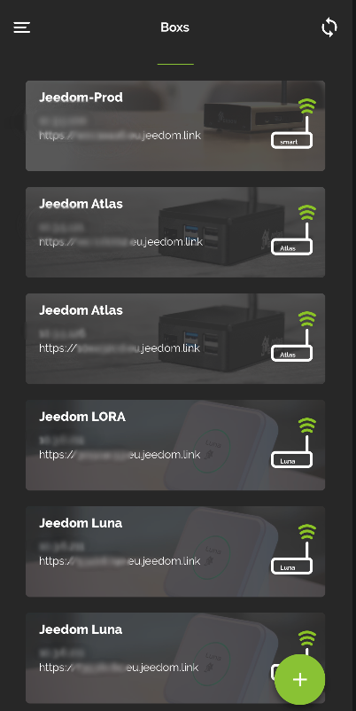

    # Mobiles Plugin

    Plugin zur Verwendung der Jeedom Mobile-Anwendung.

    Die mobile Jeedom-Anwendung erfordert die Installation dieses Plugins, damit die Box mit der mobilen Anwendung kommunizieren kann.

    # Konfiguration des Mobile-Plugins für Application V2

    Nach der Installation des Plugins müssen Sie es nur noch aktivieren :

    

    # Erste Verbindung mit der V2-Anwendung

    Um Ihr Telefon zu verbinden : es gibt 2 mögliche Methoden;
    Auf dem ersten Bildschirm der Anwendung wird Ihnen angeboten, Ihr Marktkonto zu verbinden und so alle mit diesem Konto verknüpften Boxen zu finden oder einfach eine Box hinzuzufügen.

    

    > **WICHTIG**
    >
    > Um von den Funktionalitäten der Anwendung profitieren zu können, muss sich der Kern Ihres Jeedom in 4.4 befinden.Mindestens 0

    #### **LOGIN ÜBER MARKET-KONTO** :

    

    Sie müssen lediglich Ihre Markt-ID und Ihr Passwort eingeben.

    #### **VERBINDUNG ÜBER BOX-ID** :

    

    Mehrere Auswahlmöglichkeiten auf diesem Bildschirm :

    - Sie geben die URL Ihres Jeedoms (intern oder extern) sowie die Zugangskennungen dazu ein und bestätigen mit dem LOGIN-Button

    - Sie klicken auf QR-Code : ein neuer Bildschirm erscheint; Sie können einen QR-Code vom Mobile-Plugin der Box, die Sie hinzufügen möchten, über die Registerkarte „QR-Code“ des Plugins scannen.

    

    > Registerkarte „Qr-Code“ des Mobile-Plugins

    > > 

    Nach diesem ersten Schritt sind Sie in der Anwendung registriert: Wenn Sie das Mobile-Plugin haben, haben Sie über das Menü Zugriff auf Benachrichtigungen, QR-Codes und Menüanpassung ....

    Im Menü haben Sie eine Registerkarte Boxen, die alle auf diesem Marktkonto vorhandenen Boxen zusammenfasst

    

    

    Klicken Sie einfach auf die Box, in der das Mobile-Plugin installiert ist, und identifizieren Sie sich dann, um auf die Box zuzugreifen.

    Das Feld wird an den Anfang der Liste gestellt, nachdem es seine Authentifizierung validiert hat.
    Sie können dies für mehrere Boxen tun.

    Sie können auch unten rechts auf die Schaltfläche + klicken, um auf verschiedene Optionen zuzugreifen

    - QR-Code zum Hinzufügen einer Box zur Liste über das Mobile-Plugin,
    - Manuell, um eine Box manuell hinzuzufügen
    - Erkennung Atlas und Luna (wenn Sie mit WLAN verbunden sind, erkennen die Boxen im Netzwerk)
    - Market-Synchronisierung, um konfigurierte Market-Kontoinformationen zu aktualisieren

    

    Um auf Funktionen wie Benachrichtigungen, Menüpersonalisierung oder Geolokalisierung zugreifen zu können, müssen Sie zunächst mindestens ein aktuelles Feld ausgewählt haben'

    

    # So funktioniert Geolokalisierung

    Wir fügen eine Geolocation-Zone hinzu, indem wir auf das +-Symbol klicken

    

    Wir geben die gesuchte Adresse ein und bestätigen mit der Eingabetaste auf seinem Telefon. Der Cursor positioniert sich dann auf der gewünschten Adresse.
    Anschließend können wir einen Namen hinzufügen und die Zone speichern.

    Dadurch wird auf Ihrem mobilen Gerät ein neuer Befehl vom Binärtyp erstellt, der den Ein- und Ausgängen der Zone entspricht, wenn die Geolokalisierung auf Ihrem Mobiltelefon aktiviert ist.

    Wir können auch den Radius der Zone ändern, um die Erkennung der Zone zu erweitern.

    

    . .

    # :

     : :  :

    

    # FAQ

    > **)**
    >
    > . 

    > **Ich habe Probleme mit Benachrichtigungen**
    >
    > Dieser Teil wird derzeit in der Beta-Anwendung verbessert und optimiert.

    > **Ich habe Probleme bei der Anzeige meiner Webansicht**
    >
    > Überprüfen Sie auf Ihrem Jeedom in den Einstellungen, ob die mobile Startseite HOME ist.

