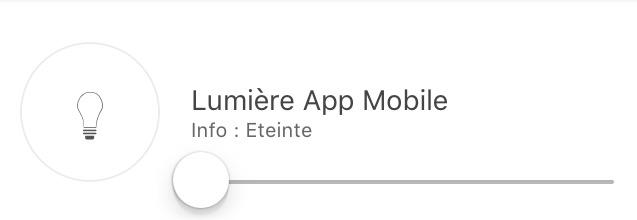
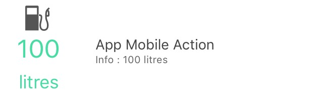

# Mobiles Plugin

Plugin zur Verwendung der Jeedom Mobile-Anwendung.

Die mobile Jeedom-Anwendung erfordert die Installation dieses Plugins, damit die Box mit der mobilen Anwendung kommunizieren kann.

# Konfiguration des Mobile-Plugins für Application V2

Nach der Installation des Plugins müssen Sie es nur noch aktivieren :

# Erste Verbindung mit der V2-Anwendung

Um Ihr Telefon zu verbinden : es gibt 2 mögliche Methoden;
Auf dem ersten Bildschirm der Anwendung wird Ihnen angeboten, Ihr Marktkonto zu verbinden und so alle mit diesem Konto verknüpften Boxen zu finden oder einfach eine Box hinzuzufügen.

#### __LOGIN ÜBER DAS MARKET ACCOUNT__ :

Sie müssen lediglich Ihre Markt-ID und Ihr Passwort eingeben.

#### __LOGIN ÜBER BOX-ID__ :

Mehrere Auswahlmöglichkeiten auf diesem Bildschirm :

  - Sie geben die URL Ihres Jeedoms (intern oder extern) sowie die Zugangskennungen dazu ein und bestätigen mit dem LOGIN-Button

  - Sie klicken auf QR-Code : ein neuer Bildschirm erscheint; Sie können einen QRCode aus dem Mobile-Plugin der Box, die Sie hinzufügen möchten, über die Registerkarte QRCODE des Plugins scannen.

> Registerkarte „Qr-Code“ des Mobile-Plugins

>> 

Nach diesem ersten Schritt sind Sie in der Anwendung registriert: Wenn Sie das Mobile-Plugin haben, haben Sie über das Menü Zugriff auf Benachrichtigungen, QrCodes, Menüanpassung ....

Im Menü haben Sie eine Registerkarte Boxen, die alle auf diesem Marktkonto vorhandenen Boxen zusammenfasst

Klicken Sie einfach auf das Kästchen, in dem das Mobile-Plugin installiert ist, und identifizieren Sie sich dann, um auf das Kästchen zuzugreifen.

Das Feld wird an den Anfang der Liste gestellt, nachdem es seine Authentifizierung validiert hat.
Sie können dies für mehrere Boxen tun.

Sie können auch unten rechts auf die Schaltfläche + klicken, um auf verschiedene Optionen zuzugreifen
  - QRCode zum Hinzufügen einer Box zur Liste über das Mobile-Plugin,
  - Manuell, um eine Box manuell hinzuzufügen
  - Erkennung Atlas und Luna (wenn Sie mit WLAN verbunden sind, erkennen die Boxen im Netzwerk)
  - Market-Synchronisierung, um konfigurierte Market-Kontoinformationen zu aktualisieren

# Konfiguration des mobilen Plugins

Nach der Installation des Plugins müssen Sie es nur noch aktivieren :

**Konfiguration**

Um das Plugin zu konfigurieren, müssen Sie die Telefone hinzufügen, die auf Jeedom zugreifen können.

So fügen Sie ein Telefon hinzu : **Plugins** → **Kommunikation** → **App
Mobile** → **Hinzufügen**

Hier sind die einzugebenden Parameter :

-   **Name der mobilen Ausrüstung** : Telefonname
-   **Aktivieren** : Aktivieren des Zugriffs für dieses Mobiltelefon
-   **Mobiler Typ** : Auswahl des Telefonbetriebssystems (iOS, Android)
-   **Benutzer** : Benutzer, der diesem Zugriff zugeordnet ist

> **Spitze**
>
> Die Wahl des Benutzers ist wichtig, da sie die Ausrüstung bestimmt, auf die er gemäß seinen Rechten zugreifen kann.

Nach dem Speichern erhalten Sie einen QRCode, mit dem sich die Anwendung selbst konfigurieren kann.

# Konfiguration der von der App empfangenen Plugins und Befehle

Nach der Initialisierung des Mobile Plugins haben Sie die Möglichkeit, die generischen Arten von Bestellungen, Plugins und Teilen zu ändern.

Durch Klicken auf ein Plugin können Sie es autorisieren oder nicht, mit der mobilen Anwendung zu chatten, und jeden der generischen Typen konfigurieren, die seinen Befehlen zugeordnet sind.

Durch Klicken auf ein Teil können Sie es autorisieren oder nicht, in der mobilen Anwendung vorhanden zu sein, und jeden der generischen Typen konfigurieren, die seinen Bestellungen zugeordnet sind.

# Konfiguration der mobilen App

Sie finden die Anwendungen auf den mobilen Jalousien :

**Android Google Play**

**Apple App Store**

## Erster Start der App

Wenn Sie die Mobile-Anwendung zum ersten Mal starten, wird Ihnen ein Lernprogramm angeboten, das Sie bei der Konfiguration unterstützt.

Nachdem Sie Ihre Jeedom-Mobilanwendung heruntergeladen und installiert haben, starten Sie die Anwendung auf Ihrem Smartphone.

Sie gelangen dann zu einem Konfigurations-Tutorial, dem Sie folgen sollten. Einige Schritte wurden zuvor ausgeführt.

Sie haben dann die Wahl zwischen einer manuellen oder automatischen Konfiguration per QRcode. Wenn Sie sich für die Konfiguration per QR-Code entscheiden, flashen Sie einfach den QR-Code, der im Mobile App-Plugin des zuvor erstellten Smartphone-Geräts vorhanden ist. In diesem Fall stellt die Anwendung automatisch die gesamte Konfiguration Ihres Jeedom wieder her und stellt automatisch eine Verbindung her. Wenn die Verbindung über WLAN mit Ihrem Zuhause verbunden ist, verwendet die Anwendung automatisch die in Ihrem Netzwerk interne Jeedom-Ethernet-Adresse. Wenn Sie mit 4G oder 3G verbunden sind, wird Ihre externe Adresse verwendet, um eine Verbindung zu Ihrem Jeedom herzustellen (z. B. über den Jeedom-DNS-Dienst, wenn Sie diesen verwenden). Wenn Sie sich für eine manuelle Konfiguration entscheiden, müssen Sie in diesem Fall die internen und externen IP-Adressen Ihres Jeedom manuell eingeben. Diese Option ist einer informierten Öffentlichkeit vorbehalten.

Die Anwendung wird synchronisiert und Sie gelangen auf die Startseite (vorangestellt von einem Mini-Präsentationshandbuch)).

Die mobile Jeedom-App ist jetzt betriebsbereit.

## Favoriten

In der Anwendung können Sie Favoriten haben (Verknüpfungen von Befehlen, Plugins, Szenarien).

Hier ist das Verfahren zum Erstellen :

Klicken Sie auf einem der + auf dem Startbildschirm der Anwendung :

Sie gelangen auf die Auswahlseite für den Verknüpfungstyp :

Zum Beispiel werden wir Maßnahmen ergreifen, damit wir Teile / Objekte erhalten :

Wählen Sie dann einfach die gewünschte Aktion als Verknüpfung aus :

Es ist dann möglich, die Farbe dieser zu personalisieren (im Moment werden drei Farben vorgeschlagen) :

Sowie die beiden dazugehörigen Texte :

Hier haben Sie jetzt eine Verknüpfung Ihrer Bestellung (in Version 1.1 Es wird erwartet, dass Ein / Aus-Befehle auf derselben Taste angezeigt werden).

# So konfigurieren Sie generische Typen richtig

## Generische Typen im Mobile Plugin

Besser als Worte, hier ist ein Beispiel für die generischen Credits für ein Licht mit all seinen Steuerelementen (siehe auch die Lichttabelle unten) :

## Anwendungsvorlagentabellen

### Die Lichter

Bild                           | Typ Gattung               | Dev Plugin Teil            | Beschreibung          |
:-----------------------------: | :--------------------------- | :--------------------------- | :------------------: |
 | `Lumière Bouton On` `Button Off Light` | `LIGHT_ON` `LIGHT_OFF`| Vorhandensein von zwei Tasten "EIN" und "Aus" keine Statusrückmeldung. |
 | `Lumière Bouton On` `Button Off Light` `State Light` | `LIGHT_ON` `LIGHT_OFF` `LIGHT_STATE` | Bei vorhandener Statusrückmeldung wechselt die linke Taste zwischen Ein und Aus |
 | `Lumière Bouton Toggle` `State Light` | `LIGHT_TOGGLE` `LIGHT_STATE` | Bei vorhandener Statusrückmeldung wechselt die linke Taste zwischen Ein und Aus |
 | `Lumière Bouton On` `Button Off Light` `State Light` `Light Slider` | `LIGHT_ON` `LIGHT_OFF` `LIGHT_STATE` `LIGHT_SLIDER` | Bei vorhandener Statusrückmeldung können Sie mit der linken Taste zwischen Ein und Aus wechseln und mit dem Schieberegler die Intensität steuern |
 | `Lumière Bouton On` `Button Off Light` `State Light` `Light Slider` `Lichtfarbe (info)` `Lichtfarbe (Aktion)` `Lichtmodus` (optional, wird verwendet, um Lichtmodi zu haben, zum Beispiel Regenbogen auf Hue philips) | `LIGHT_ON` `LIGHT_OFF` `LIGHT_STATE` `LIGHT_SLIDER` `LIGHT_COLOR` `LIGHT_SET_COLOR` `LIGHT_MODE` | Bei vorhandener Statusrückmeldung können Sie mit der linken Taste zwischen Ein und Aus wechseln und mit dem Schieberegler die Intensität steuern. Im Kreis ist die Farbe der Lampe vorhanden. Wenn Sie darauf klicken, können Sie die Farbe ändern und einen Modus aktivieren |

### Die Steckdosen

Bild                           | Typ Gattung               | Dev Plugin Teil            | Beschreibung          |
:-----------------------------: | :--------------------------- | :--------------------------- | :------------------: |
 | `Prise Bouton On` `Button Off Socket`| `ENERGY_ON` `ENERGY_OFF`| Vorhandensein von zwei Tasten "EIN" und "Aus" keine Statusrückmeldung. |
 | `Prise Bouton On` `Button Off Socket` `State Taking` | `ENERGY_ON` `ENERGY_OFF` `ENERGY_STATE` | Bei vorhandener Statusrückmeldung wechselt die linke Taste zwischen Ein und Aus |
 | `Prise Bouton On` `Button Off Socket` `State Taking` `Slider Socket` | `ENERGY_ON` `ENERGY_OFF` `ENERGY_STATE` `ENERGY_SLIDER` | Bei vorhandener Statusrückmeldung können Sie mit der linken Taste zwischen Ein und Aus wechseln und mit dem Schieberegler die Intensität steuern |

### Die Fensterläden

Bild                           | Typ Gattung               | Dev Plugin Teil            | Beschreibung          |
:-----------------------------: | :--------------------------- | :--------------------------- | :------------------: |
   | `Volet Bouton Monter` `Down-Button-Bereich` `Stop Button Pane` `State pane` (optional)) | `FLAP_UP` `FLAP_DOWN` `FLAP_STOP` `FLAP_STATE` (optional) | Vorhandensein von drei Tasten "Auf", "Ab", "Stopp", optionale Statusrückmeldung. |
   | `Volet Bouton Monter` `Down-Button-Bereich` `Stop Button Pane` `State pane` `Slider Button Pane` | `FLAP_UP` `FLAP_DOWN` `FLAP_STOP` `FLAP_STATE` `FLAP_SLIDER` | Vorhandensein eines Schiebereglers mit einer Auf / Ab-Taste in Umschalten (mit Statussymbol) |

### Inondation

Bild                           | Typ Gattung               | Dev Plugin Teil            | Beschreibung          |
:-----------------------------: | :--------------------------- | :--------------------------- | :------------------: |
   | `Innondation` `TEMPERATUR` (optional) `Luftfeuchtigkeit` (optional) `SABOTAGE` (optional)|`FLOOD` `TEMPERATUR` (optional) `FEUCHTIGKEIT` (optional) `FEUCHTIGKEIT` (optional) | Ermöglicht es Ihnen, Ihren gesamten Hochwassersensor in einer einzigen Leitung zu haben.

### Serrure

Bild                         | Typ Gattung               | Dev Plugin Teil            | Beschreibung          |
:---------------------------: | :--------------------------- | :--------------------------- | :------------------: |
   | `Sperren Etat` `Open Button Lock` `Lock Button Close` | `LOCK_STATE` `LOCK_OPEN` `LOCK_CLOSE` | Bei vorhandener Statusrückmeldung wechselt die linke Taste zwischen Ein und Aus |

### Meerjungfrau

Bild                         | Typ Gattung               | Dev Plugin Teil            | Beschreibung          |
:---------------------------: | :--------------------------- | :--------------------------- | :------------------: |
   | `Meerjungfrau Etat` `Siren Button On` `Siren Button Off` | `SIREN_STATE` `SIREN_ON` `SIREN_OFF` | Bei vorhandener Statusrückmeldung wechselt die linke Taste zwischen Ein und Aus |

### Rauch

Bild                           | Typ Gattung               | Dev Plugin Teil            | Beschreibung          |
:-----------------------------: | :--------------------------- | :--------------------------- | :------------------: |
   | `Rauch` `TEMPERATUR` (optional)|`SMOKE` `TEMPERATUR` (optional) | Ermöglicht es Ihnen, Ihren kompletten Rauchsensor in einer einzigen Leitung zu haben.

### Temperatur

Bild                                       | Typ Gattung               | Dev Plugin Teil            | Beschreibung          |
:-----------------------------------------: | :--------------------------- | :--------------------------- | :------------------: |
   | `Temperatur` `Luftfeuchtigkeit` (optional)|`TEMPERATURE` `FEUCHTIGKEIT` (optional) | Siehe Bild.

### Präsenz

Bild                                 | Typ Gattung               | Dev Plugin Teil            | Beschreibung          |
:-----------------------------------: | :--------------------------- | :--------------------------- | :------------------: |
   | `Präsenz` `TEMPERATUR` (optional) `Helligkeit` (optional) `Luftfeuchtigkeit` (optional) `UV` (optional) `SABOTAGE` (optional)|`PRESENCE` `TEMPERATUR` (optional) `BRIGHTNESS` (optional) `FEUCHTIGKEIT` (optional) `UV` (optional) `SABOTAGE` (optional) | Siehe Bild.

### Ouvrant

Bild                                       | Typ Gattung               | Dev Plugin Teil            | Beschreibung          |
:-----------------------------------------: | :--------------------------- | :--------------------------- | :------------------: |
   | `Porte / Fenêtre` `TEMPERATUR` (optional)|`OPENING / OPENING_WINDOW` `TEMPERATUR` (optional) | Siehe Bild (d. H. Sie können zwischen Fenster und Tür wählen).

### Pilotdraht

Bild                               | Typ Gattung               | Dev Plugin Teil            | Beschreibung          |
:---------------------------------: | :--------------------------- | :--------------------------- | :------------------: |
   | `Chauffage fil pilote Bouton ON` `Taste zum Ausheizen des Pilotkabels AUS` `Heizungs-Pilotdrahtzustand` `Button Pilot Wire Heizung` (optional) | `HEATING_ON` `HEATING_OFF` `HEATING_STATE` `HEATING_OTHER`|Mit den Schaltflächen EIN / AUS und Status können Sie die Schaltfläche ganz links in der Vorlage erstellen, und mit der Taste "Pilotdrahtheizung" können Sie Schaltflächen hinzufügen (max. 5))

## DIE JOKERS

### Allgemeine Aktion

Bild                             | Typ Gattung               | Dev Plugin Teil            | Beschreibung          |
:-------------------------------: | :--------------------------- | :--------------------------- | :------------------: |
   | `Action Générique`           | `GENERIC_ACTION`             | Le bouton prend la forme du type de l'action. Par défaut c'est un toggle, si c'est un message alors vous avez une enveloppe, si slider vous avez un slider etc...

### Allgemeine Informationen

Bild                         | Typ Gattung               | Dev Plugin Teil            | Beschreibung          |
:---------------------------: | :--------------------------- | :--------------------------- | :------------------: |
   | `Information Générique`           | `GENERIC_INFO`             | Le bouton prend la forme du type de l'info.

# Troubleshooting

**Ich bin auf Android-Version der App (1.0.1 oder 1,0.0) Ich kann nicht auf meine Teile oder sogar die Konfiguration der App zugreifen.**

Sie hatten ein Popup-Fenster, das Sie vor Bedenken hinsichtlich der Eingabehilfeneinstellungen warnte. Sie müssen daher nur zu den Eingabehilfeneinstellungen Ihres Mobiltelefons gehen und die Anwendungen mit dieser Option deaktivieren. (Ein Fix wird in Kürze in der App veröffentlicht)

**Ich habe eine Nachricht in einer der Zeilen meiner Module, die mir sagt, dass es so ist
Fehlen eines generischen Typs !**

Wenn Sie diese Nachricht lesen, erfahren Sie, welcher generische Typ fehlt, um eine kompatible Vorlage zu erstellen. Wenden Sie es einfach an.Siehe die [doc Kapitel Generischer Typ](https://www.jeedom.com/doc/documentation/plugins/mobile/de_DE/mobile#_configuration_des_plugins_et_commandes_que_reçoit_l_app).

**Ich habe ein Problem mit einem der Plugins namens voll integriert (Wetter,
Thermostat, Alarm, Kamera) !**

Zögern Sie nicht, auf Ihr Modul zuzugreifen, und klicken Sie erneut auf Speichern. Dadurch werden die mit dem Modul verknüpften generischen Typen wieder aufgenommen.

**Informationen zur Begrüßung der App können nicht angegeben werden !**

Dies ist normal und wird in Version 1.1 verfügbar sein.

**Ich habe die Anwendung, die viel Speicher in meinem beansprucht
Telefon !**

In Version 1.0 ist ein Fehler aufgetreten.0 und 1,0.1 im Kamerateil. Das Problem wird mit 1.0 nicht wieder auftreten.2 Um den Cache zu löschen, ohne die App zu teuer zu machen, gehen Sie einfach zur Konfiguration Ihrer mobilen App und klicken Sie auf "Cache löschen"".

**Ich habe Bedenken hinsichtlich der ersten Synchronisierung in der App oder von SQL im mobilen Plugin !**

Sie müssen generische Typen eingeben und das Plugin zum Senden von Generika autorisieren. Sehen Sie sich das Dokument etwas höher an.
