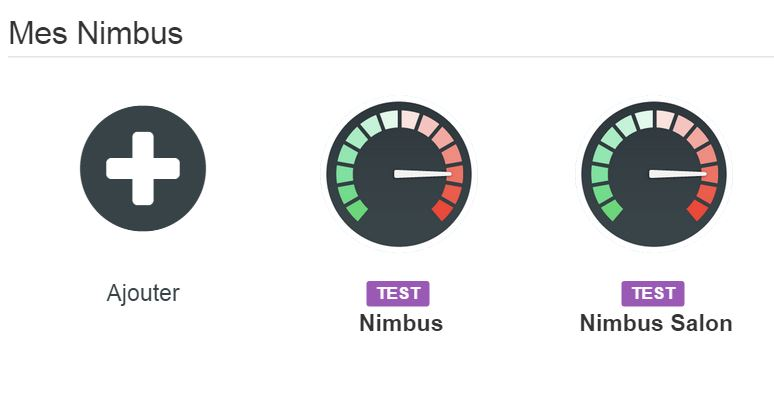

# Nimbus Plugin 

Mit diesem Plugin können Sie alle Informationen für Ihren Nimbus steuern und haben.

 
 

# Konfiguration 

## Jeedom Plugin Konfiguration : 

Um das Plugin verwenden zu können, müssen Sie es wie jedes Jeedom-Plugin herunterladen, installieren und aktivieren.

Anschließend müssen Sie Ihre Anmeldeinformationen eingeben (Wink-Konto + API):

Gehen Sie zum Menü Plugins / Kommunikation, **Dort finden Sie das Nimbus-Plugin :**

Sie gelangen auf die Seite, auf der Ihre Ausrüstung aufgelistet ist (Sie können mehrere Nimbusse haben) und auf der Sie einige erstellen können

**Klicken Sie auf die Schaltfläche Hinzufügen :**

Sie gelangen dann auf die Konfigurationsseite Ihres Nimbus :

Auf dieser Seite finden Sie mehrere Abschnitte :

**Allgemein**

In diesem Abschnitt finden Sie alle Jeedom-Konfigurationen. Nämlich den Namen Ihres Geräts, das Objekt, dem Sie es zuordnen möchten, die Kategorie (vorzugsweise Multimedia), ob das Gerät aktiv sein soll oder nicht, und schließlich, ob es auf dem Gerät sichtbar sein soll Dashboard.

-   **Konfiguration**

Dieser Abschnitt ist genau dann nützlich, wenn Sie mehrere Nimbusse haben. Sie müssen die Gerätenummer eingeben (z. B. 1, 2 oder 3). Sie können dieses Feld leer lassen, wenn Sie nur einen Nimbus haben, was sicherlich Ihr Fall sein wird.

-   **Design**

In diesem Abschnitt können Sie die Anzeige Ihres Nimbus im Dashboard anpassen. Sie können zwischen mehreren Fonds wählen. Sie können auch die Nadelfarbe und die Textfarbe auswählen.

-   **Information**

Dieser Abschnitt wird beim Speichern Ihrer Ausrüstung von selbst ausgefüllt. Dort finden Sie wichtige Informationen zu Ihrem Nimbus (Seriennummer, Mac-Adresse, Name, ID)

-   **Befehle**

In diesem Abschnitt haben Sie nichts zu tun. Bestellungen werden automatisch erstellt.

-   Rafraichir: Schaltfläche, um das Widget bei Bedarf zu aktualisieren
-   Bildschirm 1 : Auf Bildschirm 1 angezeigte Informationen
-   Bildschirm 2 : Auf Bildschirm 2 angezeigte Informationen
-   Bildschirm 3 : Auf dem Bildschirm angezeigte Informationen 3
-   Bildschirm 4 : Auf dem Bildschirm angezeigte Informationen 4
-   Position 1 : Informationen zur Position der Nadel von Bildschirm 1
-   Position 2 : Informationen zur Nadelposition von Bildschirm 2
-   Position 3 : Informationen zur Position der Nadel auf Bildschirm 3
-   Position 4 : Angaben zur Position der Bildschirmnadel 4
-   Bildschirmaktion 1 : Aktionsbefehl, mit dem in einem Szenario die Position und / oder der Text des Bildschirms ausgewählt werden können 1
-   Bildschirmaktion 2 : Befehlsaktion, mit der in einem Szenario die Position und / oder der Text des Bildschirms ausgewählt werden können 2
-   Bildschirmaktion 3 : Aktionsbefehl, mit dem in einem Szenario die Position und / oder der Text des Bildschirms ausgewählt werden können 3
-   Bildschirmaktion 4 : Aktionsbefehl, mit dem in einem Szenario die Position und / oder der Text des Bildschirms ausgewählt werden können 1
-   Bildschirmaktion Alle : Aktionsbefehl, mit dem in einem Szenario die Position und / oder der Text aller Bildschirme ausgewählt werden können
-   Phrase Screen Action : Befehlsaktion, mit der in einem Szenario die Position und / oder der Text aller Bildschirme ausgewählt werden kann (ein Satz von maximal 4 Wörtern, der auf den 4 Bildschirmen aufgeteilt ist)
-   Demo : Aktion zum Starten einer technischen Demo auf Ihrem Nimbus

# Informationen 

## Informationen auf dem Dashboard : 

Das Widget ist in 4 Wählscheiben unterteilt, die die 4 Wählscheiben Ihres Nimbus darstellen.

-   Die Nadel zeigt die Position der Nadel auf dem entsprechenden Bildschirm Ihres Nimbus an
-   Der Text ist der Text, der auf Ihrem Nimbus angezeigt wird. Dieser Text kann angeklickt werden, um diesen Bildschirm zu erreichen :

In diesem Bildschirm können Sie den Text, die Nadelposition oder beides manuell ändern. Hier können Sie sehen, wann Sie den bereits angezeigten Wert ändern.

# Aktionen 

## Aktionen, auf die über das Szenario zugegriffen werden kann : 

Über das Szenario sind mehrere Aktionen zugänglich :

Die Demo-Aktion ist unabhängig und startet die technische Demo.

Alle anderen Aktionen funktionieren nach dem Prinzip auf die gleiche Weise.

**Dies ist ein Nachrichtenbefehl, mit dem Sie zwei Parameter übergeben können:**

-   Titel : eine Zahl zwischen 0 und 360, die der Position der Nadel entspricht
-   Nachricht : die anzuzeigende Nachricht

**Die beiden sind trennbar, das heißt, Sie können :**

-   Senden Sie eine Position, indem Sie das Nachrichtenfeld leer lassen oder verlassen *Nachricht*
-   Senden Sie eine Nachricht, indem Sie das Titelfeld leer lassen oder verlassen *Titel*
-   Senden Sie eine Position und eine Nachricht, indem Sie beide ausfüllen

**Es gibt eine Bestellung pro Bildschirm, eine Bestellung für alle, eine Bestellung
Satz :**

-   Bildschirm : ermöglicht es, auf dem entsprechenden Bildschirm zu handeln
-   Alle : Machen wir dasselbe auf allen Bildschirmen
-   Satz : Spezialbefehl, der die Nachricht in 4 Wörter schneidet, die auf jedem Bildschirm angezeigt werden (wenn ein Wort 8 Zeichen überschreitet, wird es geschnitten, wenn der Satz mehr als 4 Wörter enthält, wird es geschnitten)

**WIE KANN ICH DAUERHAFT INFORMATIONEN ÜBER MEINE HAUSAUTOMATION ANZEIGEN?**

Wenn Sie kontinuierlich Informationen aus Ihrer Hausautomation anzeigen möchten.
Erstellen Sie alle 5 Minuten ein geplantes Szenario (zum Beispiel).

In diesem Beispiel müssen Sie nur das, was sich im Hook befindet, durch Ihre Befehle ersetzen. Und alle 5 Minuten werden Ihre Bildschirme mit den richtigen Werten aktualisiert

# Faq 

Das System ruft stündlich Informationen ab. Sie können auf den Befehl Aktualisieren klicken, um manuell zu aktualisieren.

Stellen Sie sicher, dass Sie die Konfigurationsdatei erstellt haben, indem Sie Ihre Daten in der allgemeinen Konfiguration des Plugins speichern.
