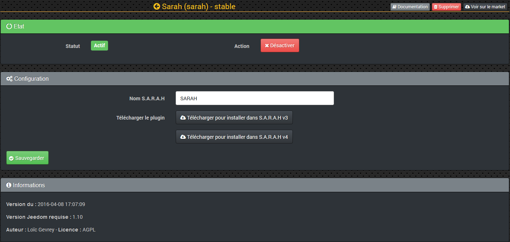

# Sarah Plugin

Plugin, mit dem Jeedom mit der SARAH-Anwendung kommunizieren kann (Spracherkennung). Machen Sie Sprachansagen und spielen Sie Sounds von Jeedom ab.

# Konfiguration 

Das SARAH-Plugin fügt eine Spracherkennung hinzu, um mit Jeedom zu sprechen, eine Ansage zu machen oder einen Sound von Jeedom abzuspielen.

## Plugin Konfiguration 

Sobald das SARAH-Plugin auf Jeedom from the Market installiert ist, klicken Sie auf **Aktivieren**.

Konfigurieren Sie Sarahs Namen (Standard **Sarah**, aber Sie können zum Beispiel Jarvis oder Jeedom setzen).

Klicken Sie dann auf eine der Schaltflächen, um das Plugin herunterzuladen **Jeedom** Für die Version von SARAH, die Sie verwenden, v3 oder v4.

Stoppen Sie nach dem Herunterladen den SARAH-Server und den Client. Entpacken Sie das Archiv im Ordner **Plugins** SARAH auf dem Client-Computer (nur Windows-kompatibel) :
<http://encausse.wordpress.com/s-a-r-a-h/>

Wenn Sie fertig sind, können Sie den SARAH-Client und -Server neu starten..

## Gerätekonfiguration 

Auf die Konfiguration der SARAH-Geräte kann über das Plugins-Menü zugegriffen werden :

So sieht die SARAH-Plugin-Seite aus (hier mit bereits 1 Gerät) :

Sobald Sie auf eine davon klicken, erhalten Sie :

Sie finden hier :

-   **Name der SARAH-Ausrüstung** : Name Ihrer SARAH-Ausrüstung.,
-   **Übergeordnetes Objekt** : Gibt das übergeordnete Objekt an, zu dem das Gerät gehört.
-   **Aktivieren** : macht Ihre Ausrüstung aktiv,
-   **NodeJS-Adresse** : SARAH IP + JS-Knotenport (standardmäßig ist der Port 8080)
-   **TTS-Adresse** : SARAH IP + TTS-Serverport (Standardport ist 8888)
-   **Melden Sie keinen Fehler, wenn SARAH nicht vorhanden ist** : Überprüfen Sie, ob SARAH nicht kontinuierlich gestartet wird

Jedes Gerät vom Typ SARAH erstellt auch eine Bestellung :

-   **Sagte** : Was in den Szenarien erlaubt, einen Text an Jeedom zu sagen. Es ist möglich, einen Satz zufällig anzukündigen, indem Sie Ihre Sätze durch eine Pipe trennen : | Beispiel : Die Haustür ist offen.|Eine Person öffnete die Haustür.|Eingangstür offen. Während der Ansage wird daher einer der drei Sätze zufällig ausgewählt.
-   **Spielen** : Damit kann eine Audiodatei vom Typ ausgeführt werden .mp3 oder .wav. Diese Audiodateien sollten für die platziert werden **v3** : im Ordner **"medias"** an der Wurzel oder **v4** : im Ordner **"Kunde / Medien"** Ihrer SARAH-Anwendung In Ihrem Szenario reicht es aus, den Namen Ihrer auszuführenden Audiodatei anzugeben.

-   **Grammatik aktualisieren** : Dies ermöglicht über ein Szenario, die XML-Grammatik aus Jeedom-Interaktionen neu zu generieren.

Die Schaltfläche "Synchronisieren" ermöglicht das Senden der Liste aller Interaktionen an SARAH. Dies muss jedes Mal erfolgen, wenn die Interaktionen aktualisiert werden.

Wenn Sie die Funktion verwenden möchten **Fragen Sie** Von SARAH aus ist es möglich, dies mithilfe einer Aktion aus einem Jeedom-Szenario heraus zu tun "**Stellen Sie eine Anfrage**".

Hier ist ein einfaches Anwendungsbeispiel :

Wenn Sie den Aktionsbefehl hinzugefügt haben "**Stellen Sie eine Anfrage**", Sie sehen, dass 5 Felder ausgefüllt zu sein scheinen :

-   **Frage** : Die Frage, die Jeedom Ihnen stellen soll.
-   **Antwort** : Die Auswahl der Antworten, mit denen Sie nach der Frage interagieren möchten. Jede Antwort muss durch ein Semikolon getrennt werden.
-   **Variable** : Dies ist der Name der Variablen, in der Ihre Antwort aufgezeichnet werden soll, damit Sie eine Bewertung für den Rest des Szenarios vornehmen können.
-   **Verzögerung (Sek.)** : Es ist die Zeit in Sekunden, bevor das Szenario die Auswertung fortsetzt, wenn keine Antwort gegeben wird (Timeout).
-   **Befehle** : Wird bestellt "**Sagte**" Ihrer SARAH-Ausrüstung.

# Konfiguration in SARAH. 

Auf der SARAH-Oberfläche sollten Sie ein Portlet mit dem Logo haben **Jeedom**.

**SARAH v3** :

Klicken Sie auf die Doppelpfeile oben im Portlet, um das Bild für den Rest zu drehen. Klicken Sie auf den Schlüssel unten links im Portlet, um auf das Plugin-Konfigurationsfenster zuzugreifen.

**SARAH v4** :

Klicken Sie auf das Sternrad unten im Portlet und dann auf **Konfigurieren Sie die Erweiterung** um auf das Plugin-Konfigurationsfenster zuzugreifen.

IN **Adresse**, ersetzen **\ [IP\_JEEDOM \]** durch die IP Ihres Jeedom und ersetzen **\ [PORT\_JEEDOM \]**, indem du dein Jeedom trägst. Wenn Ihr Jeedom die Erweiterung verwendet **/ jeedom**, Vergessen Sie nicht, es nach dem Tragen anzugeben.

IN **apikeyJeedom**, ersetzen **\ [CLE\_API\_JEEDOM \]** über den API-Schlüssel Ihres Jeedom, den Sie auf der Konfigurationsseite Ihres Jeedom finden.

Klicken Sie zum Abschluss auf Speichern.

# Anwendungsfall 

Beispiele :

-   Cela peut vous permettre de connaître toutes les remontées d'informations des différents capteurs (type “Sarah combien fait-il dehors?” ou “Sarah qu'elle est la température de la chambre”).
-   Vous pouvez également piloter les lumières (“Sarah allume la lumière du salon”), pour cela il faut bien sur avoir configuré les interactions.
-   Eine Person drückt den Knopf an der drahtlosen Türklingel (RF433, Z-Welle usw.), Jeedom gibt einen Ton über SARAH aus, meldet die Anwesenheit eines Besuchers und stellt Ihnen die Frage: "Dann- Ich öffne die Tür ?".
-   Ihre Waschmaschine befindet sich im Keller, das Programm ist beendet, SARAH spielt einen "Ding, Dong" -Ton und gibt bekannt, dass das Programm beendet wurde. Dann stellt sie dir die Frage: "Soll ich die Waschmaschine ausschalten? ?".

Die einzige Grenze wird Ihre Vorstellungskraft sein.
