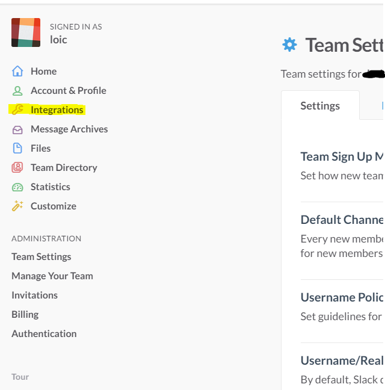
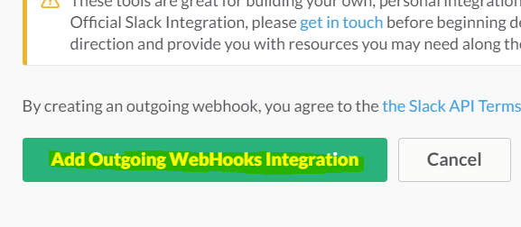

# Slack Plugin

Dieses Plugin ermöglicht es, eine Verbindung zwischen Slack und Jeedom herzustellen, um Benachrichtigungen von Jeedom zu senden oder mit Jeedom zu chatten (mithilfe von Interaktionen).

# Plugin Konfiguration 

Nach dem Herunterladen des Plugins müssen Sie es aktivieren, es erfordert keine andere Konfiguration.

# Gerätekonfiguration 

Auf die Konfiguration der Slack-Geräte kann über das Plugins-Menü zugegriffen werden :

So sieht die Slack-Plugin-Seite aus (hier mit bereits 1 Gerät) :

Sobald Sie auf eine davon klicken, erhalten Sie :

Hier finden Sie die gesamte Konfiguration Ihrer Geräte :

-   **Name de l'équipement** : Name Ihrer Slack-Ausrüstung
-   **Aktivieren** : macht Ihre Ausrüstung aktiv
-   **Sichtbar** : macht es auf dem Dashboard sichtbar
-   **Domain** : Domainname Ihres Slack (erlaubt insbesondere, wenn Sie mehrere Slack haben, um diese zu unterscheiden)
-   **Token-Authentifizierung** : Slack-API-Token, das nur zum Senden von Dateien (z. B. zum Erfassen einer Kamera) nützlich ist (siehe unten)
-   **URL zurückgeben** : Dies ist die URL, die im Slack-Webhook angegeben werden muss (bitte beachten Sie, dass Ihr Jeedom von außen zugänglich sein muss)

Nachfolgend finden Sie die Konfiguration der Befehle :

-   **Name** : Name der Bestellung
-   **Webhook** : URL zum Anrufen, um eine Nachricht auf Slack zu senden
-   **Ziel** : Nicht obligatorisch, ermöglicht das Erzwingen des Sendens einer Nachricht an einen Kanal oder einen Benutzer
-   Erweiterte Konfiguration (kleine gekerbte Räder) : Zeigt die erweiterte Konfiguration des Befehls an (Protokollierungsmethode, Widget usw.)
-   Test : Wird zum Testen des Befehls verwendet
-   Löschen (unterschreiben -) : ermöglicht das Löschen des Befehls

> **Spitze**
>
> Standardmäßig gibt es 2 Befehle : Absender, der Ihnen den Namen des letzten Absenders der Nachricht gibt, und Nachricht, der Ihnen die Nachricht gibt. Dies kann nützlich sein, wenn Sie etwas tun möchten, das mit Interaktionen nicht möglich ist, um ein Szenario beim Eintreffen eines neuen auszulösen Nachricht zum Beispiel und stellen Sie den Wert wieder her (wir können uns zum Beispiel vorstellen, die Nachricht auf Sonos oder Karotz lesen zu lassen)

Lockere Kontoerstellung 

Nichts mehr einfach gehen [hier](:https://slack.com/), und geben Sie beispielsweise eine E-Mail-Adresse und einen Domainnamen / eine Firma ein :

Sie müssen nur validieren, Sie erhalten eine E-Mail, Sie müssen auf den Link klicken, um Ihr Konto zu aktivieren, und es ist gut

Dann kommen Sie auf Ihrem Slack an :

Von dort finden Sie links die Kanäle und die Benutzer, in der Mitte können Sie die Slack-App für iOS, Android, Mac oder Windows herunterladen

# Hinausgehenden Webhook hinzufügen 

Mit den Webshooks kann Slack Jeedom über das Eintreffen einer Nachricht informieren und auf die Antwort von Jeedom warten, um sie erneut zu übertragen. Dazu müssen Sie zu den Einstellungen gehen :

Klicken Sie dann auf Integration :

Unten finden Sie "Ausgehende WebHooks"" :

Klicken Sie auf "Hinzufügen" :

Dann "Outgoing WebHooks Integration hinzufügen" :

Die verschiedenen Parameter finden Sie unten auf der Seite :

-   **Kanal** : nicht erforderlich, lassen Sie uns Slack anweisen, alles in diesem Kanal an Jeedom zu senden. Wir können zum Beispiel einen Kanal nur für Jeedom erstellen (praktischer als ein Triggerwort zu setzen)
-   **Wortauslöser** : nicht obligatorisch, wenn Sie einen Kanal gesetzt haben, sonst ist es absolut notwendig. In diesem Feld können Sie ein Auslösewort für das Senden an Jeedom definieren. Wenn Sie beispielsweise Jeedom eingeben, müssen alle Ihre Anforderungen mit Jeedom beginnen (z : Jeedom wie viel ist er im Raum)
-   **URL (s)** : Die anzurufende URL finden Sie auf Ihrer Ausrüstungsseite unter Jeedom unter dem Namen "Return URL""

Die anderen Felder sind nicht nützlich, außer vielleicht dem "Namen anpassen", mit dem der Name des Jeedom-Bots definiert werden kann (Name, mit dem Jeedom antwortet). Sie können auch mit "Symbol anpassen" das Symbol von Jeedom ändern.

Klicken Sie dann auf "Einstellungen speichern" und es ist gut

Dort kannst du über Slack mit Jeedom sprechen

> **Wichtig**
>
> Vergessen Sie in Jeedom nicht, Ihren Domainnamen (Firmennamen) einzugeben, da sich Jeedom sonst weigert, Ihnen zu antworten (beachten Sie, dass dieses Feld für das Feld empfindlich ist).

> **Spitze**
>
> Da Jeedom die Geräte nach Domänen trennt, ist es möglich, dass Sie mehrere Geräte haben, um die Geräte und damit die dahinter stehenden Szenarien zu trennen.

# Hinzufügen eines eingehenden Webhooks 

Eingehende Webhooks ermöglichen es Jeedom, eine Nachricht auf einem Kanal oder direkt an eine Person zu übermitteln. Ohne diese Webhooks kann Jeedom nicht die Initiative ergreifen, um Ihnen eine Nachricht zu senden.

Dazu müssen Sie zu den Einstellungen gehen :

Klicken Sie dann auf Integration :

Ganz unten finden Sie "Incoming WebHooks" :

Dann müssen Sie einen Kanal oder einen Standardzielbenutzer auswählen (Sie können dann in Jeedom einen pro Befehl angeben) :

Klicken Sie dann auf "Eingehende WebHooks-Integration hinzufügen"".

Am Ende der Seite finden Sie die Informationen zum Webhook. Sie müssen lediglich den Wert des Felds "Webhook-URL" abrufen und in das Webhook-Feld Ihrer Bestellung kopieren.

> **Spitze**
>
> Im Zielfeld des Befehls in Jeedom können Sie einen Kanal (ex \#monchannel) oder einen Benutzer (ex @toto) angeben.

Hier unter Jeedom müssen Sie nur speichern und dort können Sie von Jeedom aus Nachrichten auf Slack senden

# Token-Wiederherstellung 

Hier erfahren Sie, wie Sie Ihr Token wiederherstellen, damit Jeedom Dateien an Slack senden kann, insbesondere beispielsweise Aufnahmen von Kameras. Zuerst musst du gehen [hier](https://api.slack.com/custom-integrations/legacy-tokens), dann ganz unten weiter :

Bitten Sie Slack hier vor Ihrem Team, das Token zu generieren. Es fragt Sie nach Ihrem Passwort und sendet Sie dann zurück zur gleichen Seite. Unten fragen Sie erneut nach dem Token. Nach einigen Sekunden wird es angezeigt. Kopieren Sie es einfach in das Token-Feld von Jeedom

> **Spitze**
>
> Dieser Schritt ist optional. Es ist nur nützlich, beispielsweise Aufnahmen Ihrer Kamera von Slack zu senden.

# Was ist das Ergebnis? ? 

Hier ist ein Beispiel dafür, was möglich ist, wenn das Plugin korrekt konfiguriert und die Interaktionen erstellt wurden :

> **Wichtig**
>
> Wenn Sie die "Fragen" -Funktion der Szenarien verwenden, müssen Sie die Anfrage auf einem Kanal senden, auf dem Jeedom die Antworten abhört. Andernfalls fällt Ihre "Fragen" -Anforderung in eine "Zeitüberschreitung""
