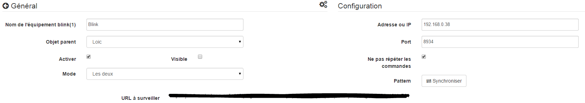

# Blink Plugin (1)

Plugin zur Steuerung eines Blinkschlüssels (1).

# Konfiguration 

Das Plugin benötigt keine Konfiguration, Sie müssen es nur aktivieren :

# Gerätekonfiguration 

Die Konfiguration der Blinkgeräte (1) kann über das Plugins-Menü aufgerufen werden :

So sieht die Plugin-Seite blink (1) aus (hier bereits mit Ausrüstung) :

So sieht die Konfigurationsseite für ein Blinkgerät aus (1) :

Hier finden Sie die gesamte Konfiguration Ihrer Geräte :

-   **Name der Blinkausrüstung (1)** : Name Ihrer Blinkausrüstung (1)
-   **Übergeordnetes Objekt** : Gibt das übergeordnete Objekt an, zu dem das Gerät gehört
-   **Aktivieren** : macht Ihre Ausrüstung aktiv
-   **Sichtbar** : macht es auf dem Dashboard sichtbar
-   **Modus** : den Modus, in dem Sie Ihr Blinken betreiben möchten (1) (Beschreibung siehe unten)

Nachfolgend finden Sie die Liste der Bestellungen :

-   Der im Dashboard angezeigte Name
-   Typ und Subtyp
-   der Wert : ermöglicht es, den Wert des Befehls gemäß einem anderen Befehl, einem Schlüssel (bei einem virtuellen Switch), einer Berechnung… anzugeben.
-   Einstellungen : Name des zu startenden Musters oder des zu startenden Befehls
-   Anzeige : ermöglicht die Anzeige der Daten im Dashboard
-   erweiterte Konfiguration (kleine gekerbte Räder) : Zeigt die erweiterte Konfiguration des Befehls an (Protokollierungsmethode, Widget usw.)

-   Test : Wird zum Testen des Befehls verwendet
-   löschen (unterschreiben -) : ermöglicht das Löschen des Befehls

# "Lokaler" Modus" 

Zu verwendender Modus, wenn das Blinken (1) an einen der USB-Anschlüsse von Jeedom angeschlossen ist. Der einzige Parameter in diesem Modus ist nicht obligatorisch und ermöglicht die Auswahl eines Blinkens (1), insbesondere wenn mehrere verbunden sind.

# Blink-API-Aufrufmodus (1)" 

In diesem Modus ruft Jeedom die API blink1control direkt auf, sodass Jeedom in der Lage sein muss, sich direkt dem System anzuschließen, auf dem der Blinkschlüssel (1) installiert ist.

In diesem Modus sind die Konfigurationsparameter :

-   **Adresse oder IP** : Adresse oder IP, an der der Blinkschlüssel (1) installiert ist
-   **Hafen** : Port, an dem die Anwendung blink1control empfangsbereit ist
-   **Muster** : Ermöglicht das Synchronisieren der Muster mit denen der Anwendung blink1control

## Installation der Anwendung blink1control 

Die blink1control App ist zu finden [hier](http://blink1.thingm.com/blink1control/), Im Download-Teil ist es für Windows und Mac verfügbar. Starten Sie nach dem Herunterladen die Installation der Anwendung.

## Konfiguration der Anwendung blink1control 

Einmal installiert und gestartet müssen Sie haben :

Diese Anwendung bietet viele Möglichkeiten. Schnell finden wir oben links den Status der Taste (hier nicht verbunden), unten links die Ereignisse, oben in der Mitte der Schnellaktionen zur Steuerung der Taste, direkt unterhalb eines erweiterten Systems zur Auswahl von Modi und Farben und rechts die Muster.

Dort müssen Sie auf das kleine gekerbte Rad im Gerät klicken, um das erweiterte Konfigurationsmenü aufzurufen, die Server-API zu aktivieren und serverHost auf eine beliebige zu setzen. Beachten Sie auch den Port, um ihn in der Jeedom-Konfiguration zu melden.

Überprüfen Sie blink1control und starten Sie es neu, damit es berücksichtigt wird.

# "URL-Überwachungsmodus" 

In diesem Modus ruft die Anwendung blink1control diese URL alle X Sekunden auf und gibt ihr ihre Anweisungen.

Um es zu konfigurieren, gehen Sie in der Anwendung blink1control zu tools und klicken Sie auf das kleine Pluszeichen (+), um eines hinzuzufügen. Erstellen Sie dann eine URL und kopieren Sie die von Jeedom angegebene URL (zu beobachtende URL-Felder) in den Pfad. Sie können auch die Aktualisierungshäufigkeit konfigurieren.

> **Wichtig**
>
> Damit dies funktioniert, muss der PC, auf dem blink1control installiert ist, auf Jeedom zugreifen können. Wenn Sie einen Laptop außerhalb Ihres Netzwerks mit dem Schlüssel verwenden, muss Jeedom daher von außen zugänglich sein. Wenn Sie nicht wissen wie, ist es am besten, Jeedom DNS zu verwenden.

In diesem Modus haben Sie auch die Option "Befehle nicht wiederholen", mit der Sie den letzten Befehl nicht mehr wiederholen können, sobald blink1control die Anforderung berücksichtigt hat. Es ist ratsam, es überprüft zu lassen.

# "Beide" -Modus" 

Dieser Modus ist eine Kombination der beiden vorherigen Modi. Der Vorteil besteht darin, dass die Reaktionsgeschwindigkeit des ersten und die Möglichkeit, ihn auch außerhalb des zweiten Hauses zu betreiben, kombiniert werden. Für die Konfiguration müssen daher die Verfahren für den Modus "Aufrufe der Blink-API (1)" und den Modus "Überwachung nach URL" befolgt werden".

# SSH-Modus" 

Dieser Modus muss verwendet werden, wenn Sie das Blinken (1) auf einem anderen Linux-Computer als dem installiert haben, auf dem Jeedom installiert ist (Jeedom Master, da das Plugin im Remote-Modus nicht kompatibel ist). Die Konfiguration ist recht einfach :

-   **Gerätenummer** : Geräte-ID, die nur verwendet werden darf, wenn Sie mehrere Blinkschlüssel (1) auf Ihrem Computer haben
-   **Adresse oder IP** : IP-Adresse des Geräts, an dem der Schlüssel angeschlossen ist
-   **Benutzername** : Der Benutzername, der an dem Computer angemeldet werden soll, an dem der Schlüssel angeschlossen ist
-   **Relativer Pfad der ausführbaren Datei des blink1-Tools** : relativer Pfad zur ausführbaren Datei des blink1-Tools

> **Spitze**
>
> Die ausführbare Datei ist verfügbar [hier](https://github.com/todbot/blink1/releases), Vorsicht Jeedom funktioniert nur mit der Linux-Version, die natürlich nur mit einer Linux-Maschine kompatibel ist (RPI, RPI2, Jeedomboard, Cubieboard, Bananapi…). Übertragen Sie die ausführbare Datei einfach auf den Computer, auf dem der Schlüssel eingesteckt ist, und machen Sie sie ausführbar (chmod + x blink1-tool)

> **Wichtig**
>
> Damit dies funktioniert, müssen Sie auf SSH-Ebene den Austausch des RSA-Schlüssels eingerichtet haben, damit Jeedom ohne Angabe eines Kennworts eine Verbindung zu dem Computer herstellen kann, auf dem der Schlüssel angeschlossen ist.
