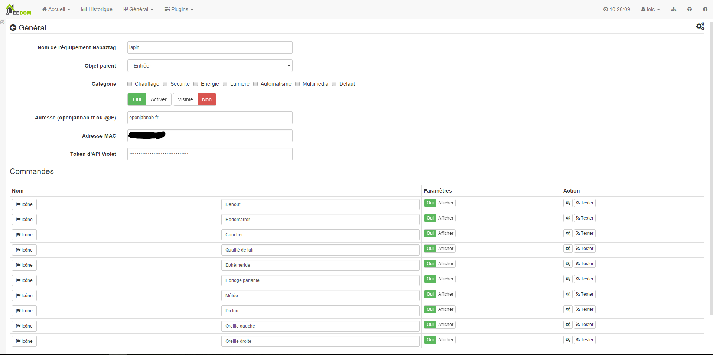
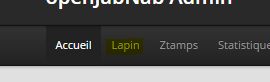

# Nabaztag Plugin

Plugin um den Nabaztag zu bestellen.

# Gerätekonfiguration 

Sobald das Plugin über den Markt installiert und aktiviert ist, können Sie über auf die Nabaztag-Plugin-Seite zugreifen :

Hier finden Sie alle Ihre Nabaztag-Geräte :

Sobald ein Gerät ausgewählt ist, erhalten Sie :

Hier finden Sie die gesamte Konfiguration Ihrer Geräte :

-   **Name der Nabaztag-Ausrüstung** : Name Ihrer Nabaztag-Ausrüstung
-   **Übergeordnetes Objekt** : Gibt das übergeordnete Objekt an, zu dem das Gerät gehört
-   **Kategorie** : Gerätekategorien (es kann zu mehreren Kategorien gehören)
-   **Aktivieren** : macht Ihre Ausrüstung aktiv
-   **Sichtbar** : macht es auf dem Dashboard sichtbar
-   **Adresse (openjabnab.fr oder @IP)** : openjabnab oder IP (DNS) -Adresse Ihres openjabnab, wenn Sie es selbst hosten
-   **MAC-Adresse** : Mac-Adresse Ihres Kaninchens (siehe unten)
-   **API-Token Lila** : API-Token (siehe unten)

Nachfolgend finden Sie die Liste der Bestellungen :

-   Der im Dashboard angezeigte Name
-   Anzeige : ermöglicht die Anzeige der Daten im Dashboard
-   erweiterte Konfiguration (kleine gekerbte Räder) : Zeigt die erweiterte Konfiguration des Befehls an (Protokollierungsmethode, Widget usw.)
-   Test : Wird zum Testen des Befehls verwendet

Die Liste der Befehle lautet wie folgt :

-   **Stehend** : Weckt das Kaninchen auf
-   **Neu starten** : Starten Sie das Kaninchen neu
-   **Schlafenszeit** : Sagen wir dem Kaninchen, er soll ins Bett gehen
-   **Luftqualität** : Gibt Luftqualität (erfordert die Aktivierung des entsprechenden Plugins in openjabnab)
-   **Ephemeride** : Geben Sie Ephemeride (erfordert die Aktivierung des entsprechenden Plugins in Openjabnab)
-   **Sprechende Uhr** : Geben Sie die Zeit an (erfordert die Aktivierung des entsprechenden Plugins in openjabnab)
-   **Wetter** : Gibt das Wetter an (erfordert die Aktivierung des entsprechenden Plugins in openjabnab)
-   **Sagen** : Geben Sie ein Sprichwort (erfordert die Aktivierung des entsprechenden Plugins in openjabnab)
-   **Linkes Ohr** : Ermöglicht die Auswahl der Position des linken Ohrs (16 Positionen möglich)
-   **Rechtes Ohr** : Ermöglicht die Auswahl der Position des rechten Ohrs (16 mögliche Positionen)
-   **Sprich** : Sagen wir dem Kaninchen einen Satz

# Maximale Adresse und Token abrufen 

Gehen Sie zur Website [openjabnab](http://openjabnab.fr/ojn_admin/index.php) Melden Sie sich dann in Ihrem Konto an :

Klicken Sie auf Kaninchen :

Klicken Sie dann auf API :

Aktivieren Sie hier die lila und öffentliche API und erhalten Sie die Mac-Adresse sowie den lila API-Schlüssel, um sie in die Konfiguration Ihres Kaninchens auf Jeedom zu integrieren
