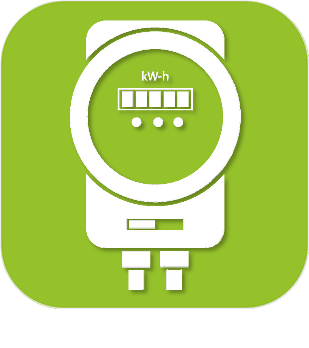

>**Wichtig**
>Nur offizielle Plugins haben hier ihre Dokumentation. Sie können die Dokumentation der anderen Plugins direkt im Jeedom Market einsehen. Klicken Sie im betreffenden Plugin auf Dokumentation.
>Sie können sehen [Hier](https://market.jeedom.com/index.php?v=d&p=market&type=plugin&categorie=energy) Alle offiziellen Plugins in dieser Kategorie

| | | | |
|--- | --- | --- | ---|
||Lastabwurf|Plugin zur Verwaltung des Lastabwurfs. 3 mögliche Betriebsarten :  - Intelligent  - Hierarchisch  - Cascadocyclique|[Dokumentation Stall](delestage/index.md) - [Beta-Dokumentation](delestage/beta/index.md) [Markt](https://market.jeedom.com/index.php?v=d&p=market_display&id=2616) [Änderungsprotokoll stabil](delestage/changelog.md) - [Änderungsprotokoll Beta](delestage/beta/changelog.md)|
||Enedis|Rufen Sie die Verbrauchsinformationen Ihrer intelligenten Stromzähler von Ihrem Enedis-Kundenkonto ab. Sie müssen lediglich die Datenfreigabe mit Jeedom autorisieren und die Identifikationsnummer des betreffenden Lieferpunkts (Delivery Point, PDL) angeben.   Das Plugin meldet stündliche, tägliche, monatliche, jährliche Messungen sowie die maximale Leistung sowohl im Verbrauch als auch in der Produktion.  NB: Die neuesten bei Enedis eingegangenen Daten beziehen sich auf den Tag vor dem aktuellen Tag|[Dokumentation Stall](enedis/index.md) - [Beta-Dokumentation](enedis/beta/index.md) [Markt](https://market.jeedom.com/index.php?v=d&p=market_display&id=4036) [Änderungsprotokoll stabil](enedis/changelog.md) - [Änderungsprotokoll Beta](enedis/beta/changelog.md)|
||Energie|Plugin zur Verwaltung Ihres Energieverbrauchs|[Dokumentation Stall](energy/index.md) - [Beta-Dokumentation](energy/beta/index.md) [Markt](https://market.jeedom.com/index.php?v=d&p=market_display&id=54) [Änderungsprotokoll stabil](energy/changelog.md) - [Änderungsprotokoll Beta](energy/beta/changelog.md)|
||Comptage|Plugin zur Energiemessung (Gas, Strom und Wasser). Ermöglicht eine geschätzte Berechnung der DPE.|[Dokumentation Stall](energy2/index.md) - [Beta-Dokumentation](energy2/beta/index.md) [Markt](https://market.jeedom.com/index.php?v=d&p=market_display&id=3591) [Änderungsprotokoll stabil](energy2/changelog.md) - [Änderungsprotokoll Beta](energy2/beta/changelog.md)|
||Energie-Dashboard|Plugin zur Anzeige eines Energie-Dashboards des Hauses (Wasser-, Gas-, Strom- und Solarproduktion)). Bitte beachten Sie, dass dieses Plugin keine Batterien unterstützt|[Dokumentation Stall](energy3/index.md) - [Beta-Dokumentation](energy3/beta/index.md) [Markt](https://market.jeedom.com/index.php?v=d&p=market_display&id=4376) [Änderungsprotokoll stabil](energy3/changelog.md) - [Änderungsprotokoll Beta](energy3/beta/changelog.md)|
||Enphase Gesandter|Plugin zum Sammeln von Photovoltaik-Informationen von Envoy-Gateways|[Dokumentation Stall](envoy/index.md) - [Beta-Dokumentation](envoy/beta/index.md) [Markt](https://market.jeedom.com/index.php?v=d&p=market_display&id=3992) [Änderungsprotokoll stabil](envoy/changelog.md) - [Änderungsprotokoll Beta](envoy/beta/changelog.md)|
||Ewattch|Plugin für den ewattch Supervisor|[Dokumentation Stall](ewattch/index.md) [Markt](https://market.jeedom.com/index.php?v=d&p=market_display&id=1668) [Änderungsprotokoll stabil](ewattch/changelog.md)|
||Extel|Plugin zur Steuerung der Extel-Steckdosenleiste|[Dokumentation Stall](extel/index.md) [Markt](https://market.jeedom.com/index.php?v=d&p=market_display&id=2979) [Änderungsprotokoll stabil](extel/changelog.md)|
||GRDF|ACHTUNG Plugin nur in der Beta verfügbar Rufen Sie Daten Ihrer kommunizierenden Gaszähler aus Ihrem GRDF-Kundenbereich ab. Autorisieren Sie einfach den Datenaustausch mit Jeedom und geben Sie die PCE-Identifikationsnummer des betreffenden Zählers an.|[Beta-Dokumentation](grdf/beta/index.md) [Markt](https://market.jeedom.com/index.php?v=d&p=market_display&id=4488) [Änderungsprotokoll Beta](grdf/beta/changelog.md)|
||Virtueller Schalter|ACHTUNG Plugin nur in der Beta verfügbar Erstellen Sie maßgeschneiderte Energiezähler (Einzeltarif oder Spitzen-/Nebenzeiten) aus Rohindizes (Wh/kWh) und/oder Leistungen (W/kW)). Ermöglicht Ihnen auch das Erstellen von Zählern pro Benutzer (Benutzerdefiniert/OCPP)).|[Beta-Dokumentation](jeeMeter/beta/index.md) [Markt](https://market.jeedom.com/index.php?v=d&p=market_display&id=4533) [Änderungsprotokoll Beta](jeeMeter/beta/changelog.md)|
||Mpower|Mit diesem Plugin können Sie Ihre Mpower-Mehrfachbuchsen steuern. Mit dem Widget können Sie alle Informationen anzeigen : Status, Leistung, Verbrauch, Strom, Spannung und Leistungsfaktor. Die Daten werden jede Minute und nach einer Aktion von jeedom aktualisiert. Nur mit dem 6-Sockel-Modell getestet.|[Dokumentation Stall](mpower/index.md) [Markt](https://market.jeedom.com/index.php?v=d&p=market_display&id=2181) [Änderungsprotokoll stabil](mpower/changelog.md)|
||Eco RT2|Plugin zur Steuerung von Eco-Devices RT2.|[Dokumentation Stall](rt2/index.md) - [Beta-Dokumentation](rt2/beta/index.md) [Markt](https://market.jeedom.com/index.php?v=d&p=market_display&id=2918) [Änderungsprotokoll stabil](rt2/changelog.md) - [Änderungsprotokoll Beta](rt2/beta/changelog.md)|
||Teleinfo KMU-SMI|Plugin zum Auslesen von Teleinformationen von SME-PMI-Zählern|[Dokumentation Stall](teleinfoPMEPMI/index.md) - [Beta-Dokumentation](teleinfoPMEPMI/beta/index.md) [Markt](https://market.jeedom.com/index.php?v=d&p=market_display&id=4448) [Änderungsprotokoll stabil](teleinfoPMEPMI/changelog.md) - [Änderungsprotokoll Beta](teleinfoPMEPMI/beta/changelog.md)|
||Wes-Kontrolle|Übernehmen Sie die Kontrolle über Ihren Cartelectronic Wes Energieserver von Jeedom und Sie können seine Funktionalität verzehnfachen. Das Plugin bietet die Möglichkeit, eine speziell für Jeedom entwickelte CGX-Datei zu verwenden und mehr Daten als die standardmäßig verfügbaren zu lesen (erfordert Zugriff auf den Wes-Server in FTP). Das Plugin in stabiler Version bietet volle Kompatibilität mit Wes-Servern mit Firmware niedriger als V0.84A10 und der Beta-Version mit Firmware höher oder gleich V0.84A10.|[Dokumentation Stall](wescontrol/index.md) - [Beta-Dokumentation](wescontrol/beta/index.md) [Markt](https://market.jeedom.com/index.php?v=d&p=market_display&id=4151) [Änderungsprotokoll stabil](wescontrol/changelog.md) - [Änderungsprotokoll Beta](wescontrol/beta/changelog.md)|
||WiserLink|Plugin zur Anzeige von Daten aus dem Wiser IP-Modul. Es werden alle 5 Kanäle / TV-Info / 2 Pulsmodule hochgefahren. In jedem Fall sind die Symbole sowie die Namen anpassbar und wir haben die Kraft und die Energie.|[Dokumentation Stall](wiserlink/index.md) [Markt](https://market.jeedom.com/index.php?v=d&p=market_display&id=2938) [Änderungsprotokoll stabil](wiserlink/changelog.md)|
