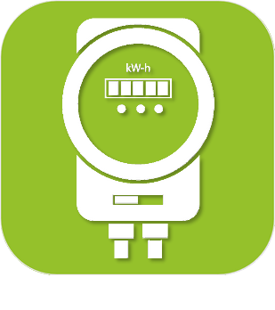
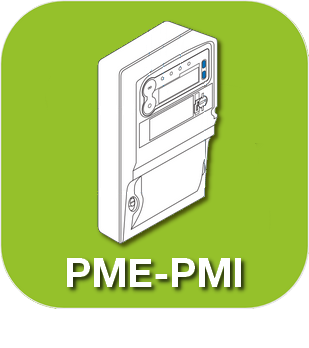

>****
>. . .
>  

| | | | |
|--- | --- | --- | ---|
|||.  :  -   -   - Cascadocyclique| -    - |
||Enedis|. .   .  NB: | -    - |
||Energie|| -    - |
||Comptage|). .| -    - |
|||). | -    - |
|||| -    - |
||Ewattch||  |
||Extel||  |
||GRDF| . .|  |
|||.| -    - |
||| .|  |
|||). ).| -    - |
||Mpower|.  : . . .|  |
||Ocea||  |
|||.| -    - |
|||| -    - |
|||. ). ()| -    - |
||WiserLink|. . .|  |
