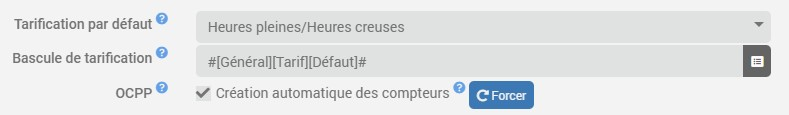
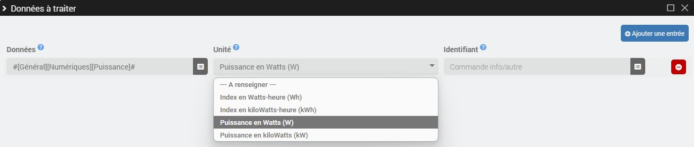

# Virtuelles Zähler-Plugin

Das Plugin **Virtueller Schalter** ermöglicht Ihnen die Erstellung von Energiezählern in Kilowattstunden aus Rohindizes *(Wh/kWh)* und/oder Befugnisse *(W/kW)*, sei es zum Einzeltarif oder zu Haupt-/Nebenverkehrszeiten. Mit diesem Plugin können Sie auch Zähler pro Benutzer erstellen *(Angepasst/OCPP)*.

>**INFORMATION**
>
>Protokollinformationen **OCPP** wird nur sichtbar, wenn das Plugin auf dem Computer erkannt wird.

# Configuration

## Plugin-Setup

- **Standardpreise**: Wählen Sie Standardpreise für virtuelle Zähler aus *(Einzeltarif oder Haupt-/Nebenverkehrszeiten)*.
- **Preisumschaltung**: Bei Standardpreisen in Haupt-/Nebenverkehrszeiten wählen Sie den Befehl „Standardpreis zum Umschalten von Informationen/Binärdaten“ aus *(1=Hauptverkehrszeiten/0=Nebenverkehrszeiten)*.
- **OCPP**:
  - **Automatische Erstellung von Zählern**: Aktivieren Sie das Kontrollkästchen, um automatisch Zähler pro Benutzer für jede neue OCPP-Transaktion zu erstellen.

## Gerätekonfiguration

Um einen neuen virtuellen Zähler hinzuzufügen, klicken Sie auf die Schaltfläche **+Hinzufügen**.

- **Zählertyp**: Wählen Sie den Zählertyp aus *(Standard/Benutzerdefiniert (WIP)/OCPP)*.
- **Preise**: Passen Sie ggf. die Preise an.
- **Preisumschaltung**: Passen Sie bei Spitzen-/Nebenzeitenpreisen ggf. den Befehl zum Umschalten zwischen Info- und binärer Preisgestaltung an.

---

- **Kennung**: Geben Sie bei benutzerdefinierten oder OCPP-Zählern die Benutzerkennung an.

### Zu verarbeitende Daten

Virtuelle Zähler vom Typ **OCPP** Transaktionsdaten für jeden Benutzer automatisch abrufen.

Für andere müssen Sie auf die Schaltfläche klicken **Bestellungen verwalten** des Abschnitts **Zu verarbeitende Daten** Dann **Fügen Sie einen Eintrag hinzu**.

- **Standardzähler**:

  

	- **Daten**: Info/digitale Kontrolle der zu verarbeitenden Rohdaten.
	- **Einheit**: Wählen Sie das Gerät aus, wenn es nicht automatisch erkannt wird *(Wh/kWh/W/kW)*.

- **Benutzerdefinierte Zähler** *(WIP)*:

  

	- **Daten**: Info/digitale Kontrolle der zu verarbeitenden Rohdaten.
	- **Einheit**: Wählen Sie das Gerät aus, wenn es nicht automatisch erkannt wird *(Wh/kWh/W/kW)*.
	- **Kennung**: Schließen Sie den Befehl info/other ab und geben Sie dabei die Kennung des aktuellen Benutzers an *(Damit die Transaktion erfasst werden kann, muss der Wert mit der auf Geräteebene definierten Kennung übereinstimmen)*.

## Commandes

Die folgenden Bestellungen werden auf Basis der Preisgestaltung erstellt:

- **Einzelpreis**:
  - **Index** *(Info/numerisch in kWh)*.

- **Haupt-/Nebenverkehrszeiten**:
  - **Spitzenstundenindex** *(Info/numerisch in kWh)*.
  - **Index der Stunden außerhalb der Hauptverkehrszeiten** *(Info/numerisch in kWh)*.
