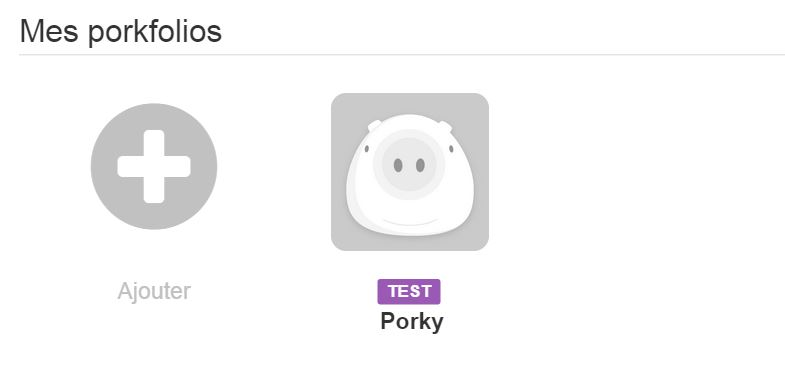

# Porkfolio Plugin 

Mit diesem Plugin können Sie alle Informationen von Ihrem Porkfolio-Sparschwein steuern und abrufen.

# Konfiguration 

## Jeedom Plugin Konfiguration : 

**Installation / Erstellung**

Um das Plugin verwenden zu können, müssen Sie es wie jedes Jeedom-Plugin herunterladen, installieren und aktivieren.

Anschließend müssen Sie Ihre Anmeldeinformationen eingeben (Wink-Konto + API):

Gehen Sie zum Menü Plugins / Finanzen, dort finden Sie das Plugin für Schweinefleischportfolios :

Sie gelangen auf die Seite, auf der Ihre Ausrüstung aufgelistet ist (Sie können mehrere Porkfolios haben) und auf der Sie einige erstellen können

Klicken Sie auf die Schaltfläche Hinzufügen :

Sie gelangen dann auf die Konfigurationsseite Ihres Schweinefleischportfolios:

Auf dieser Seite finden Sie mehrere Abschnitte :

**G.énéral**

In diesem Abschnitt finden Sie alle Jeedom-Konfigurationen. Nämlich den Namen Ihres Geräts, das Objekt, dem Sie es zuordnen möchten, die Kategorie (vorzugsweise Multimedia), ob das Gerät aktiv sein soll oder nicht, und schließlich, ob es auf dem Gerät sichtbar sein soll Dashboard.

**Konfiguration**

Dieser Abschnitt ist genau dann nützlich, wenn Sie mehrere Schweinefleischportfolios haben. Sie müssen die Gerätenummer eingeben (z. B. 1, 2 oder 3). Sie können dieses Feld leer lassen, wenn Sie nur ein Schweinefleischportfolio haben, was sicherlich Ihr Fall sein wird.

**Befehle**

In diesem Abschnitt haben Sie nichts zu tun. Bestellungen werden automatisch erstellt.

-   Aktualisieren: Schaltfläche, um das Widget bei Bedarf zu aktualisieren
-   Anmeldedatum : Datum der letzten Operation
-   Bewegungsdatum : Datum des letzten Erkennens einer Bewegung
-   Datum umdrehen : Datum der letzten Rückgabe des Schweinefleischportfolios
-   Letzte Operation : Betrag der letzten Transaktion
-   Nase : Nasenfarbe
-   Ziel : Betrag Ihres Ziels
-   Summe : Summe derzeit im Schweinefleischportfolio

# Informationen 

## Informationen auf dem Dashboard : 

-   Bis : Schweinekopf, der die Stimmung verändern kann. Wenn er die Maus auf dem Kopf lässt, sagt er Ihnen, wann er sich zuletzt bewegt hat und wann er das letzte Mal umgedreht wurde
-   B. : Schaltfläche "Aktualisieren", um Werte vom Server anzufordern
-   C. : Betrag der letzten Transaktion. Wenn Sie die Maus darauf lassen, erhalten Sie das Datum der letzten Operation
-   D. : Betrag Ihres Ziels
-   E. : Nasenfarbe Ihres Schweinefleischportfolios
-   F. : Fortschrittsbalken beim Erreichen Ihres Ziels
-   G. : Summe aktuell in Ihrem Schweinefleischportfolio

# Aktionen 

## Aktionen, auf die im Dashboard zugegriffen werden kann : 

Im Dashboard stehen mehrere Aktionen zur Verfügung :

-   Bis : Durch Klicken auf das Ticket können Sie einen Geldbetrag einzahlen oder abheben

-   B. : Durch Klicken auf die Flagge können Sie Ihr Ziel ändern

-   C. : Durch Klicken auf den Pinsel können Sie die Farbe der Nase Ihres Schweinefleischportfolios ändern

# Faq 

Das System ruft stündlich Informationen ab. Sie können auf den Befehl Aktualisieren klicken, um manuell zu aktualisieren.

Stellen Sie sicher, dass Sie die Konfigurationsdatei erstellt haben, indem Sie Ihre Daten in der allgemeinen Konfiguration des Plugins speichern.
