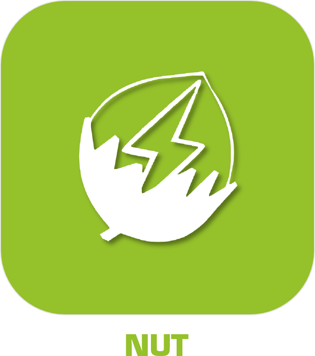

>****
>. . .
>  

| | | | |
|--- | --- | --- | ---|
||JeeDashboard-Agbox|| -    - |
||JeeDashboard-Monitoring|.| -    - |
||JeeDashboard-Publish|| -    - |
||JeeDashboard-SunPulse|| -    - |
||JeeDashboard-Voe|| -    - |
||Monitoring|| -    - |
||)|| -    - |
||Octoprint||  |
|||| -    - |
||Ventilairsec|| -  |
