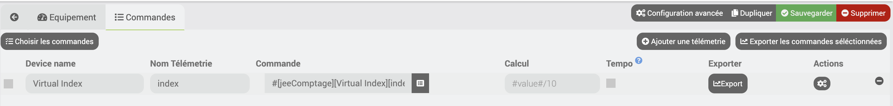

# JeeDashboardPublish-Plugin

## Introduction

Mit dem JeeDashboardPublish-Plugin können Sie Werte aus Jeedom mithilfe des jMQTT-Plugins veröffentlichen.

## Plugin-Setup

Es ist notwendig, die MQTT-Broker-Parameter einzugeben.

## Gerätekonfiguration

Es ist möglich, so viele Geräte zu erstellen, wie Sie möchten : 

Es wird empfohlen, ein Präfix einzugeben, um mit zwei Methoden eindeutige Namen zu erhalten :

1. Ein hartes Präfix.

2. Verwendung einer Jeedom-Variable. Es ist notwendig, das Kontrollkästchen „Ist eine Jeedom-Variable“ zu aktivieren und den Namen der Variablen einzugeben : Variable(xxx)

## Utilisation

Es ist möglich, die Namen der zu veröffentlichenden Befehle einzugeben, indem Sie mit der Schaltfläche „Befehle auswählen“ eine Liste von Befehlen auswählen oder manuell mit der Schaltfläche „Telemetrie hinzufügen“ hinzufügen".

Es ist möglich, die Historien einer oder mehrerer Bestellungen durch Angabe eines Startdatums zu exportieren.

