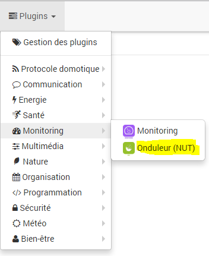

# Nut Plugin

Mit diesem Plugin können Sie Informationen von einem NUT-Server abrufen (Network UPS Tools))

## Plugin Konfiguration

Nach dem Download des Plugins müssen Sie es nur noch aktivieren und die Abhängigkeiten installieren, indem Sie auf „Relaunch"

## Gerätekonfiguration

Auf die Konfiguration der NUT-Geräte kann über das Plugin-Menü zugegriffen werden :

So sieht die NUT-Plugin-Seite aus (hier mit bereits 1 Gerät) :

Sobald Sie auf eine davon klicken, erhalten Sie :

Hier finden Sie die gesamte Konfiguration Ihrer Geräte :

- **Ausrüstungsname** : Name Ihrer NUT-Ausrüstung,
- **Übergeordnetes Objekt** : Gibt das übergeordnete Objekt an, zu dem das Gerät gehört,
- **Kategorie** : Kategorie Ihrer NUT-Ausrüstung
- **Aktivieren** : macht Ihre Ausrüstung aktiv,
- **Sichtbar** : macht Ihre Ausrüstung auf dem Armaturenbrett sichtbar,
- **NUT IP-Adresse** : Die IP-Adresse des NUT-Servers
- **Benutzername** : Benutzername des NUT-Servers (leer lassen, wenn keiner vorhanden ist)
- **Passwort** : NUT-Serverkennwort (leer lassen, wenn keines vorhanden ist)
- **Ups id** : Ups id

> **Bewertungen**
>
> Ein NUT-Server kann mehrere USVs verwalten. Es ist dann die USV-ID, die Jeedom darüber informiert, auf welche USV sich das Gerät bezieht
>
> Wenn Sie die ID Ihrer USV (s) nicht kennen, lassen Sie das Feld leer und registrieren Sie das Gerät. Jeedom füllt automatisch das ID-Feld der USV aus und erstellt so viele Geräte, wie Sie über eine USV auf Ihrem NUT-Server verfügen.
>
> Wenn sich Ihr NUT-Server auf einem Synology NAS befindet, lautet der Benutzername "monuser", das Kennwort "secret" und die ID "ups"'. Obwohl der Bereich leer bleibt, füllt das Plugin ihn in den meisten Fällen.

## Befehle konfigurieren

Auf der zweiten Registerkarte finden Sie die Liste der Bestellungen. Das Plugin erstellt die meisten Bestellungen automatisch gemäß den vom NUT-Server erhaltenen Informationen.

> **Wichtig**
>
> Die erstellten Befehle können je nach Installation unterschiedlich sein. Dies hängt davon ab, was der NUT-Server zurücksendet

Wenn Ihre USV Informationen zurücksendet, die (noch) nicht vom Plugin unterstützt werden, können Sie manuell eine Bestellung zu Ihren Geräten hinzufügen.

- Klicken Sie auf die Schaltfläche *Bestellung hinzufügen*
- Geben Sie einen Namen ein
- Wählen Sie den Untertyp (Numerisch, Binär oder andere)
- Im Feld *Installieren* Sie müssen den Namen des Werts eingeben, wie er vom NUT-Server zurückgegeben wird, die Informationen sind im Protokoll im DEBUG-Modus sichtbar.

> **Wichtig**
>
> Ändern Sie nicht die Konfiguration der vom Plug-in automatisch erstellten Befehle.
