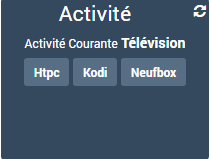

# Harmony Hub Plugin

Mit diesem Plugin können Sie alle Geräte steuern und wiederherstellen, die einem oder mehreren Harmony Hub zugeordnet sind.

Nachdem alle Informationen zu diesen Geräten abgerufen wurden, kann das Plugin automatisch alle zugehörigen Befehle für die vollständige Kontrolle von Jeedom erstellen.

# Configuration

Wie jedes Jeedom-Plugin auch das Plugin **Harmony Hub** muss nach der Installation aktiviert werden.

## Plugin Konfiguration

Das Plugin verwendet Abhängigkeiten, die zuerst durch Klicken auf die Schaltfläche installiert werden müssen **Beleben**.

Sobald die Abhängigkeiten installiert sind, können Sie die IP-Adresse eingeben, unter der der Harmony Hub erreichbar ist.

>**TRICK**
>
>Das Plugin kann gleichzeitig mit mehreren Hubs interagieren. Dazu müssen Sie die IP-Adresse jedes Hubs durch das Symbol `getrennt angeben|``.

Klicken Sie dann auf die Schaltfläche **Konfigurationsdateien** generieren *(oder aktualisieren)* Die Datei (en) mit allen Informationen zu den Geräten, die jedem Harmony-Hub zugeordnet sind.

## Gerätekonfiguration

Um auf die verschiedenen Geräte zuzugreifen, gehen Sie zum Menü **Plugins → Multimedia → Harmony Hub**.

>**INFORMATION**
>
>Mit der Schaltfläche + Hinzufügen können Sie ein neues Harmony Hub-Gerät hinzufügen.

Für jedes Gerät finden wir die üblichen allgemeinen Parameter sowie 2 Dropdown-Menüs, in denen zum einen der vom Gerät betroffene Hub und zum anderen der Gerätetyp ausgewählt werden kann :

- **Aktivitäten** : Ausrüstung, die alle Ihre Aktivitäten zusammenbringt sowie
    Allgemeines Ausschalten und Informationen zur aktuellen Aktivität.

- **Eines Ihrer Geräte** : Ausrüstung, die alle zusammenbringt
    Befehle für ein bestimmtes Gerät.

Einmal ausgewählt, klicken Sie einfach auf die Schaltfläche **Speichern** um automatisch die Liste der entsprechenden Befehle zu generieren :    

# Commandes

Die Befehle sind standardmäßig nicht sichtbar
jedoch alle über Szenario, virtuell, etc

Wenn Sie sie in Ihrem Dashboard anzeigen möchten, organisieren Sie sie einfach neu
Ziehen Sie das Kontrollkästchen per Drag & Drop und aktivieren Sie es **Anzeige**. Sie können dann mit Zeilenumbrüchen, bestimmten Widgets oder Symbolen spielen
vorgeschlagen, erstellen Sie eine Fernbedienung pseduo :

# Wichtige Informationen

Seit dem 19-02-2019 ist es notwendig **Aktivieren Sie eine Entwickleroption** in der Harmony App.

Siehe diesen Logitech-Link :
<https://community.logitech.com/s/question/0D55A00008OsX3CSAV/update-to-accessing-harmony-hubs-local-api-via-xmpp>
