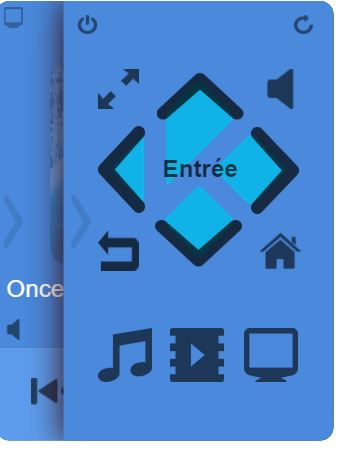

Description 
===

Ce plugin permet de commander et recevoir des informations depuis Kodi.

Configuration 
===

Configuration du plugin Jeedom
---

a.  Installation/Création

Afin d’utiliser le plugin, vous devez le télécharger, l’installer et
l’activer comme tout plugin Jeedom.

Suite à cela il vous faudra créer votre équipement Kodi :

Rendez vous dans le menu plugins/multimédia, vous y trouverez le plugin
Kodi :

Ensuite vous arriverez sur la page qui listera vos équipements (vous
pouvez avoir plusieurs Kodi) et qui vous permettra également d’en créer

Cliquez sur le bouton Ajouter un Kodi ou sur le bouton + :

Vous arriverez ensuite sur la page de configuration de votre Kodi:

Sur cette page vous trouverez plusieurs sections :

i.  Général

Vous trouverez dans cette section toutes les configurations jeedom. A
savoir le nom de votre équipement, l’objet auquel vous voulez
l’associer, la catégorie (de préférence multimédia), si vous voulez que
l’équipement soit actif ou non et enfin si vous voulez qu’il soit
visible sur le dashboard.

i.  Configuration

Cette section est une des plus importantes elle contient

-   IP : adresse ip de votre kodi (il est important de renseigner l’ip
    et non pas un hostname). Si Kodi est sur la même machine que jeedom
    mettez 127.0.0.1. Ce champ est obligatoire

-   Port : le port de communication du serveur web dans kodi (il faut
    activer le serveur web dans kodi). Ce champ est obligatoire

-   Nom d’utilisateur : le nom d’utilisateur pour vous connecter à Kodi
    si vous en avez un

-   Mot de passe : le mot de passe pour se connecter à Kodi si vous en
    avez un. (cela va de paire avec le nom d’utilisateur)

-   MAC Address : l’adresse MAC de la machine pour faire du wake on lan

-   Volume +/- : le pas d’incrementation ou de décrémentation du volume
    (1 à 100)

    i.  Commandes

Cette partie liste l’ensemble des commandes disponibles :

-   Accueil

-   Année

-   Avance rapide

-   Bas

-   Chanson Suivantes

-   Droite

-   Eteindre

-   Gauche

-   Genre

-   Haut

-   Heure de fin

-   Lecture

-   Liste Films

-   Liste Musique

-   Liste Séries

-   Longueur Playlist

-   Mix de soirée

-   Muet

-   Notifications

-   OK

-   OSD

-   Pause

-   Plein ecran

-   Position PLaylist

-   Précédent

-   Rédémarrer

-   Résumé

-   Retour

-   Retour Rapide

-   Scan audio

-   Scan video

-   Status

-   Status Média

-   Status nb

-   Stop

-   Suivant

-   Thumbnail

-   Titre

-   Type média

-   Volume

-   Volume status

-   Volume -

-   Volume\

Configuration du plugin Kodi
---

Pour pouvoir bénéficier de la remontée des différents status, il est
nécessaire d’installer un addon sur Kodi. Vous pouvez télécharger cet
addon dans la page général du plugin dans Jeedom

Une fois le zip récupéré, il vous suffit de l’installer
dans Kodi. Pour cela rendez vous dans Kodi, paramètres/addons/installer depuis un zip.

Après l'installation vous devriez retrouver l’addon dans les addons activés
dans la partie service.

Pour configurer l’addon cliquez sur configurer, vous arriverez sur cette
page :

Ici vous trouverez 3 paramètres important à configurer :

-   Adresse ip : l’adresse ip de votre jeedom

-   Type de box : mini/ mini+ , ou préciser si vous avez un /jeedom ou
    non dans votre adresse Jeedom

-   Clé api : votre clé api Jeedom que vous retrouverez dans les
    paramètres de configuration de jeedom

Informations de statut 
===

Kodi remonte de nombreux statut :

-   Genre : remonte la liste complète des genres (uniquement utilisable
    via scénario ou virtuel)

-   Heure de fin : heure de fin prévue , mis à jour au démarrage d’un
    média et à la reprise de pause

-   Status et statusnb : Remonte le statut (l’un en texte l’autre
    en nombre)

Voilà les différentes valeurs :

    Démarré   0
    Vidéo en cours  1
    Audio en cours  2
    Video terminée  3
    Audio terminée  4
    Vidéo arrêtée   5
    Audio arrêtée   6
    Vidéo en pause  7
    Audio en pause  8
    Reprise vidéo   9
    Reprise audio   10
    Arrêt   18

-   Status média : remontera un statut plus général (Lecture ,Pause
    ,Stop, Arret) indifférement du type de média

-   Thumbnail : remontera la cover (plus particulièrement le lien
    permettant de l’avoir)

-   Titre : remontera le titre du média en cours et des détails sur
    l’épisode et la saison dans le cas d’une série

-   Type de média : remontera le type de media (Série , Audio, Films )

Détails Widget 
===

Voici quelques détails concernant le widget :

-   A : indique un icone du type de média en cours

-   B : indique l’heure de fin

-   C : permet de déplier la partie télécommande

-   D : Partie 1 du titre en cours

-   E : Partie 2 du titre en cours

-   F : Commandes playbacks (lecture suivant stop etc…​)

-   G : Permet d’activer le mode controle volume ou de revenir au mode
    playback

-   H : permet de déplier la partie infos

En mode série/film, vous trouverez année, résumé, genre

En mode audio vous trouverez playlist, année, genre et infos playlist

Dans les deux cas vous trouverez en bas les boutons permettant de lancer
un scan audio/ vidéo ou de lancer un mix de soirée audio

