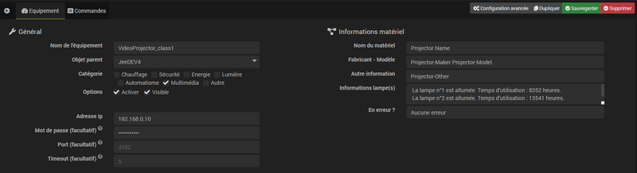
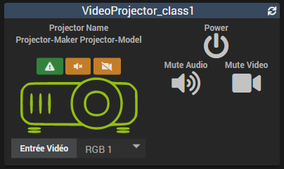

# PJLink Plugin

Das Plugin **PJLink** ermöglicht die Steuerung von Videoprojektoren, die mit dem Protokoll kompatibel sind *PJLink* im lokalen Netzwerk zu kommunizieren.

Die nicht vollständige Liste der mit dem Protokoll kompatiblen Marken *PJLink* ist : **BenQ, Canon, Casio, Epson, Fujifilm, Hitachi, InFocus, Maxell, Mitsubishi, Nec, Panasconic, Ricoh, Sharp, Sky, Sony...**

Weitere Informationen zu Modellen, die das Protokoll unterstützen *PJLink*, bitte beziehen Sie sich auf [Diese Liste ist nach Vermarktungsjahr geordnet](https://pjlink.jbmia.or.jp/english/list.html){:target = "\_ blank"} oder zu Ihrer Hardwaredokumentation.

> **Wichtige Informationen**    
> Kompatible Geräte werden in zwei Klassen unterteilt. Abhängig von Ihren Geräten haben Sie keinen Zugriff auf dieselben Informationen :
> * **Klasse 1** : kompatibel mit Grundfunktionen.
> * **Klasse 2** : kompatibel mit grundlegenden und erweiterten Funktionen.

# Configuration

## Plugin Konfiguration

Das Plugin **PJLink** erfordert keine spezielle Konfiguration und sollte erst nach der Installation aktiviert werden.

Das Plugin verwendet a *Cron5* um die Daten alle 5 Minuten zu aktualisieren.

## Gerätekonfiguration

Zugriff auf die verschiedenen Geräte **PJLink**, Gehe zum Menü **Plugins → Multimedia → PJLink**.

> **Wissen**    
> Die Schaltfläche **+ Hinzufügen** ermöglicht es Ihnen, neue Geräte hinzuzufügen **PJLink**.

Füllen Sie auf der Ausrüstungsseite das Feld aus'**IP-Adresse** Ausrüstung *(obligatoire)* ebenso wie **Passwort** wenn auf der Hardware ein Passwort festgelegt wurde *(facultatif)*.    
Die **Hafen** Standardmäßig wird vom Protokoll die verwendet **4352**. Nur bei vollständiger Kenntnis der Fakten zu ändern.    
Die **Zeitüberschreitung** ist standardmäßig auf eingestellt **5** Sekunden. Sie können diese Verzögerung erhöhen, wenn die Reaktion Ihrer Hardware länger dauert.

Aktivieren Sie das Kontrollkästchen **Aktivieren** und klicken Sie auf die Schaltfläche **Speichern**. Das Plugin erstellt dann die Befehle, die Ihrem Material entsprechen, und ruft die verfügbaren Informationen ab.

**Klasse 1 :**

**Klasse 2 :**

# Widget-Vorlage

Das Bild der Ausrüstung **PJLink** ist verfeinert und relevant. Beim Bewegen des Mauszeigers über jedes Symbol werden unterschiedliche Informationen angezeigt.

Abhängig von den Möglichkeiten, die Ihr Gerät bietet, haben Sie keinen Zugriff auf dieselben Befehle.

## Klasse 1

*  : Grün, dieses Symbol zeigt an, dass kein Fehler vorliegt. Wenn ein Fehler erkannt wird, ist das Symbol orange und der Inhalt des Fehlers wird beim Hover oder bei den letzten Informationen direkt im Gerät angezeigt.
*  : Wird angezeigt, wenn der Ton stummgeschaltet ist *(Audio stumm schalten)*.
*  : Wird angezeigt, wenn das Video geschnitten ist *(Video stumm schalten)*.
* Das Videoprojektorsymbol ändert je nach Zustand des Geräts seine Farbe :
  * **Grün** : Der Videoprojektor ist eingeschaltet.
  * **Rot** : Der Videoprojektor ist ausgeschaltet.
  * **Blau** : Der Videoprojektor kühlt ab.
  * **Orange** : Der Videoprojektor heizt auf.
* **Video Eingang** : Wählt den Videoeingang aus *(input)*.
* **Macht** : Gerät ein- / ausschalten.
* **Audio stumm schalten** : Beenden oder Fortsetzen der Tonübertragung.
* **Video stumm schalten** : Zum Stoppen oder Fortsetzen des Video-Streamings.

## Klasse 2

Alle Steuerelemente der Klasse 1 sind zugänglich und auch :

*  : Erscheint, wenn Audio und Video eingefroren sind *(Freeze)*.
* **Einfrieren** : Video und Audio einfrieren / freigeben.
* **Lautstärke des Lautsprechers** : Die Schaltfläche "**-**" reduziert die Lautstärke und "**+**" um es zu erhöhen.
* **Mikrofonlautstärke** : Die Schaltfläche "**-**" verringert die Mikrofonlautstärke und "**+**" um es zu erhöhen.
